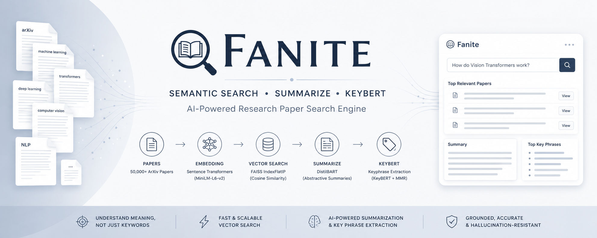
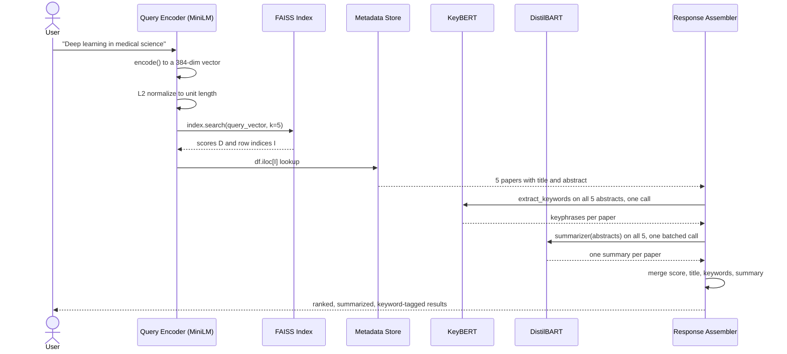
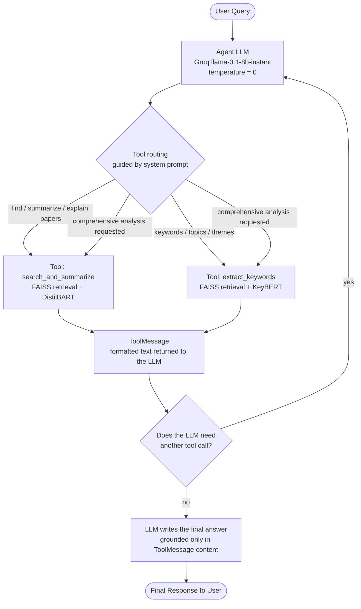
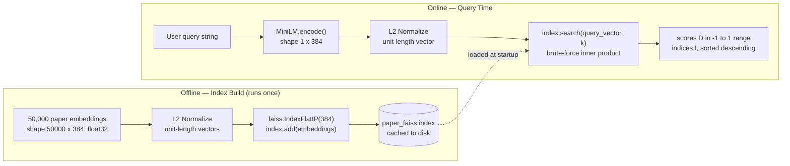

<div align="center">

# Fanite – AI-Powered Semantic Research Paper Search Engine
### Agentic RAG over Machine Learning Research Papers

*From a raw 117K-row HuggingFace dataset to a tool-calling LLM agent that finds, summarizes, and*
*extracts key phrases from the most relevant papers — end to end, in under a second.*

<p align="center">
  
  
  
  
  <br/>
  
  
  
  
</p>

<!-- 🔧 PLACEHOLDER: once this repo is pushed to GitHub, swap in the real path to light these up
<p align="center">
  
  
  
</p>
-->

</div>

<br/>

<p align="center">
  
</p>
<!-- <p align="center"><sub>🖼️ <strong>Placeholder</strong> — banner image (recommended 1600×400) showing the query → retrieval → agent-response flow. See <a href="#-screenshots">Screenshots</a> for the full asset checklist.</sub></p> -->

<br/>

> This project takes 117,592 ML papers from ArXiv, embeds each one into a 384-dimensional vector with `all-MiniLM-L6-v2`, indexes them in FAISS for exact cosine-similarity search, and wraps the whole thing in a **LangChain tool-calling agent** powered by **Groq's `llama-3.1-8b-instant`**. Ask it a research question in plain English, and the agent decides  on its own  whether to retrieve-and-summarize papers (via a batched **DistilBART** tool), extract key phrases (via **KeyBERT + KeyphraseCountVectorizer**), or both, then writes a grounded, cited answer. No answer is generated without retrieved evidence backing it.

<div align="center">

|  | |  | |  |
|:---:|:---:|:---:|:---:|:---:|
| 🧠 **384-dim** semantic embeddings | 🗄️ **FAISS** exact search | 🤖 **Agentic** tool routing | 📝 **DistilBART** summarization | 🏷️ **KeyBERT** keyphrases |

</div>


<!-- <p align="center"><sub>📸 Screenshots and a hosted demo link go here once the project has a UI — see <a href="#-screenshots">Screenshots</a> below for exactly what to capture.</sub></p> -->

---
## 🎯 Motivation to build this project : 

### The problem with keyword search

Traditional search — `grep`, SQL `LIKE`, Elasticsearch's default BM25 — matches **strings**, not **meaning**. If a researcher searches for *"neural networks that generalize with less data,"* a keyword engine will miss a paper titled *"Sample-Efficient Meta-Learning for Few-Shot Classification"* even though it is very likely the single best result in the corpus. There is not one overlapping keyword between the query and the title, yet the two sentences describe almost the same idea.

This is not a tuning problem. It is a structural limitation: keyword indexes represent documents as bags of tokens, so anything that requires understanding synonyms, paraphrase, or domain vocabulary drift is invisible to them by design.

### Why semantic search

Semantic search replaces token matching with **vector similarity**. Every document — and every query — is mapped into a shared high-dimensional space by a neural network, such that pieces of text with similar *meaning* end up geometrically close together, regardless of the specific words used. "Sample-efficient" and "less data" land near each other in that space even though they share no characters. This is the entire premise this project is built on.

### Why this project exists

ArXiv publishes ML papers faster than any human can read titles, let alone abstracts. A researcher trying to survey a subfield has three bad options: read abstracts in submission order, keyword-search and hope the authors used the same vocabulary, or fall behind. This project is an attempt to build the fourth option end-to-end and understand every layer of it — not just call an API, but own the embedding choice, the index structure, the summarization trade-offs, the keyword extraction quality, and the agent orchestration that ties it together.

---

## ✨ Features

#### 🧠 Semantic search over 50,000 ArXiv ML papers
Every paper is embedded once, offline, into a 384-dimensional vector using `all-MiniLM-L6-v2`. Queries are embedded with the exact same model at request time, so query and document live in the same semantic space — a query about *"generalization with limited data"* surfaces papers about *"few-shot learning"* even with zero token overlap.

#### ⚡ Sub-second exact retrieval with FAISS
Rather than approximate nearest-neighbor search, the index is a `faiss.IndexFlatIP` — a brute-force, mathematically exact search over all 50,000 vectors. At this corpus size that costs almost nothing and buys back 100% recall.

#### 📝 Batched abstractive summarization
Retrieved abstracts are summarized with `DistilBART` (`sshleifer/distilbart-cnn-12-6`) — **one call per query, not one call per paper** — with `min_length` computed dynamically from the shortest retrieved abstract so the model is never asked to stretch a 20-word abstract into a 40-word summary.

#### 🏷️ Grammatically-valid keyphrase extraction
Keywords are not n-grams. `KeyphraseCountVectorizer` extracts candidate phrases using part-of-speech patterns first, and `KeyBERT` ranks them by semantic similarity to the source document second, with Maximal Marginal Relevance (MMR) diversification so the top-10 keyphrases aren't five near-duplicates of "deep learning."

#### 🤖 A real tool-calling agent, not a scripted pipeline
`RAG_Pipeline.ipynb` wraps retrieval, summarization, and keyword extraction as **LangChain tools** and hands routing decisions to an actual reasoning model — Groq-hosted `llama-3.1-8b-instant` — governed by a system prompt that forces citations and forbids inventing papers. The agent decides for itself whether a query needs summaries, keywords, or both.

#### 💾 Cache-everything design
Embeddings (`arxiv_embeddings.npy`), the cleaned corpus (`cleaned_arxiv_papers.csv`), and the FAISS index (`paper_faiss.index`) are all computed once and persisted to disk. Every notebook checks `os.path.exists()` before recomputing anything — a 26-minute embedding job becomes a 1-second `np.load()` on every subsequent run.

#### 🧩 Modular, three-notebook design
Data preparation, retrieval/NLP prototyping, and agent orchestration are deliberately split across `EDA.ipynb`, `Search_Engine.ipynb`, and `RAG_Pipeline.ipynb`, with the reusable retrieval logic extracted into `src/search.py`.

#### 🔍 Reproducible by construction
Sampling uses `random_state=42`, embeddings and indexes are content-addressed by fixed file paths, and every notebook can be re-run from a clean checkout and land on the exact same 50,000-paper corpus, the exact same vectors, and the exact same FAISS index.

---

## 🏗️ System Architecture

The system is organized as two phases that meet at the vector index: an **offline phase** that only needs to run when the corpus changes, and an **online phase** that runs on every user query. This split — rather than re-embedding or re-indexing per request — is the single biggest reason the online path is fast.


**Reading the diagram, stage by stage:**

| Stage                               | What actually happens                                                                                                                                                                                                                | Where                                        |
| ----------------------------------- | ------------------------------------------------------------------------------------------------------------------------------------------------------------------------------------------------------------------------------------ | -------------------------------------------- |
| **1. Dataset & EDA**                | Load the **`CShorten/ML-ArXiv-Papers`** dataset using Hugging Face `datasets`, inspect schema, missing values, duplicates, and overall data quality before building the retrieval pipeline.                                          | `EDA.ipynb`                                  |
| **2. Data Cleaning**                | Remove index-artifact columns, drop duplicate abstracts, reset the DataFrame index, and reproducibly sample **50,000** papers for experimentation. Resetting the index ensures every FAISS index maps directly to `df.iloc[idx]`.    | `EDA.ipynb`                                  |
| **3. Embedding Generation**         | Encode every paper using **SentenceTransformer MiniLM**, producing one **384-dimensional embedding** per paper. Embeddings are cached to disk (`arxiv_embeddings.npy`) so this expensive step never runs twice.                      | `EDA.ipynb`                                  |
| **4. Vector Database Construction** | L2-normalize every embedding and build a **`faiss.IndexFlatIP`** index. The normalized vectors are cached as `paper_faiss.index`, enabling cosine similarity through inner-product search.                                           | `Search_Engine.ipynb`                        |
| **5. Search Engine Initialization** | Load the cached embeddings, FAISS index, and metadata into an importable **`ArxivSearchEngine`** class that serves as the project's retrieval backend.                                                                               | `src/search.py`                              |
| **6. User Query**                   | A user enters a natural-language query (e.g., *"Deep learning in medical science"*). No manual preprocessing is applied beyond the model's tokenizer.                                                                                | `Search_Engine.ipynb` / `RAG_Pipeline.ipynb` |
| **7. Query Encoding**               | The query is encoded using MiniLM as `model.encode([query])`. Wrapping the query in a list ensures a **(1, 384)** batch embedding, which FAISS expects for similarity search.                                                        | `src/search.py`                              |
| **8. L2 Normalization**             | The query embedding is normalized using `faiss.normalize_L2()`, matching the normalization applied to every stored paper embedding so that inner-product search becomes cosine similarity.                                           | `src/search.py`                              |
| **9. Semantic Retrieval**           | `index.search(query_embedding, k)` returns the **top-k** most semantically similar papers. FAISS produces two aligned arrays: **`D`** (cosine similarity scores) and **`I`** (row indices), already sorted in descending similarity. | `src/search.py`                              |
| **10. Metadata Lookup**             | Each retrieved index is resolved using `df.iloc[idx]` to recover the paper title, abstract, and metadata. The abstract word count is also computed for dynamic summarization lengths.                                                | `src/search.py`                              |
| **11. Keyword Extraction**          | All retrieved abstracts are processed in **one batched call** using **KeyBERT + KeyphraseCountVectorizer + MMR**, producing diverse, document-specific research keyphrases.                                                          | `RAG_Pipeline.ipynb`                         |
| **12. Summary Generation**          | The retrieved abstracts are summarized together in **one batched DistilBART inference**, using dynamically computed `min_length` and `max_length` values for each paper.                                                             | `RAG_Pipeline.ipynb`                         |
| **13. Response Assembly**           | Similarity scores, titles, summaries, and extracted keyphrases are merged into one structured Python object representing the retrieved papers.                                                                                       | `src/search.py`                              |
| **14. Agent Orchestration**         | A LangChain **tool-calling agent** analyzes the user's intent and automatically decides whether to invoke **`search_and_summarize`**, **`extract_keywords`**, or both.                                                               | `RAG_Pipeline.ipynb`                         |
| **15. Final Grounded Response**     | The LLM synthesizes the tool outputs into a single natural-language response, grounded entirely in retrieved papers and their extracted information—without hallucinating external content.                                          | `RAG_Pipeline.ipynb`                         |


> [!NOTE]
> The diagram intentionally shows **one** agent branching into **two** tools, not five independent agents. That's not a simplification for the diagram — it's the actual architecture. See [AI Agent Workflow](#-ai-agent-workflow) for why that distinction matters and how the five conceptual responsibilities (query understanding, retrieval, keyword extraction, summarization, response assembly) map onto it.

---

## 🔄 Complete AI Workflow

This section traces **exactly** what happens between a user typing a query and a result appearing, using a real query and real numbers pulled directly from `Search_Engine.ipynb` — nothing here is illustrative or rounded for effect.



### Stage by stage

**1. User Query.** Raw text, e.g. `"Deep learning in medical science"`. No preprocessing is applied — MiniLM was trained on natural sentences, so stripping punctuation or lowercasing manually would only throw away signal the tokenizer already handles correctly.

**2. MiniLM Encoding.** `model.encode([query])` runs the query through `all-MiniLM-L6-v2`, the exact same model instance used to embed all 50,000 papers. Using the same model for both sides of the comparison isn't a style choice — if query and documents were embedded by two different models, their vector spaces would not be comparable at all, and cosine similarity between them would be numerically well-defined but semantically meaningless.

**3. 384-Dimensional Embedding.** The output is a `(1, 384)` NumPy array (`float32`). 384 is not a tunable hyperparameter here — it's fixed by MiniLM-L6's architecture (hidden size 384), so every downstream shape (the FAISS index dimension, the cached embedding matrix) is derived from this one number.

**4. L2 Normalization.** `faiss.normalize_L2(query_embedding)` scales the vector to unit length. This step exists purely so that a fast inner-product search behaves identically to cosine similarity — the full mechanics are in [Search Pipeline](#-search-pipeline).

**5. FAISS Search.** `index.search(query_embedding, k)` performs a brute-force inner-product comparison against all 50,000 normalized paper vectors, in native C++.

**6. Top-k Retrieval.** FAISS returns two aligned arrays: `D`, the cosine similarity scores, and `I`, the row indices of the winning papers — already sorted descending, no extra sort step needed. For this exact query with `k=5`, the real output was:

Example Semantic Retrieval

Query: Deep learning for medical image analysis
```text
| Rank | Similarity Score | Retrieved Paper                                                                                      |
| ---: | ---------------: | ---------------------------------------------------------------------------------------------------- |
|    1 |       **0.7254** | *An overview of deep learning in medical imaging focusing on MRI*                                    |
|    2 |       **0.7216** | *Medical Imaging with Deep Learning: MIDL 2020 -- Short Paper Track*                                 |
|    3 |       **0.6927** | *A Systematic Collection of Medical Image Datasets for Deep Learning*                                |
|    4 |       **0.6799** | *Deep Learning in Cardiology*                                                                        |
|    5 |       **0.6692** | *Deep Learning with Permutation-invariant Operator for Multi-instance Histopathology Classification* |
```
These results are retrieved using Sentence Transformers (all-MiniLM-L6-v2) embeddings with FAISS IndexFlatIP over L2-normalized vectors, making the similarity score equivalent to cosine similarity.
The screenshot below shows the actual output produced by the search pipeline for the above query.


**7. Metadata Lookup.** `I` is a list of *integer positions*, not paper IDs — that's all a vector index knows. `df.iloc[idx]` bridges the gap back to something a human can read, which is exactly why `df.reset_index(drop=True)` in `EDA.ipynb` matters: if the DataFrame's index and the embedding matrix's row order ever drift apart, this lookup silently returns the wrong paper for the right score.

**8. Keyword Extraction.** All five retrieved abstracts are passed to `kw_model.extract_keywords()` **in a single call** — see [Keyword Extraction Pipeline](#-keyword-extraction-pipeline) for why this is one call and not five, and for the bug that single-document calls expose.

**9. Summary Generation.** All five abstracts are passed to the `summarizer` pipeline **in a single batched call**, with `min_length` set to the shortest abstract's word count in the batch so no paper's summary request exceeds its own source length.

**10. Response Assembly.** Score, title, keywords, and summary are zipped together into one structured record per paper — `{"score": ..., "title": ..., "Keywords": [...], "summary": ...}`.

**11. Final Output.** In `Search_Engine.ipynb`, this is a Python list of dicts. In `RAG_Pipeline.ipynb`, the same structured data is instead formatted as text and handed to the agent LLM, which turns it into a natural-language answer — see below.

---

## 🤖 AI Agent Workflow

> [!IMPORTANT]
> Being precise about the real implementation here matters more than making this section sound impressive. `RAG_Pipeline.ipynb` implements **one LangChain tool-calling agent**, backed by **one hosted LLM** (Groq's `llama-3.1-8b-instant`), with access to **two tools**. It is not five independent agent processes talking to each other. The five responsibilities below — query understanding, retrieval, keyword extraction, summarization, response assembly — are real, but they are *phases of a single agent's reasoning loop*, not five separate objects. A README that claimed otherwise would be describing a system that isn't the one in the notebook.

That distinction is, if anything, the more interesting engineering story: a single small, fast model is doing real orchestration — deciding *which* tool to call, *when* to call a second one, and *how* to synthesize the results — purely from a system prompt and two tool docstrings, with no hand-written control flow branching on the query text.



### The five responsibilities, mapped to what actually runs

| Responsibility | Where it lives | Notes |
|---|---|---|
| **Query Understanding** | Inside the agent LLM's first forward pass | The LLM reads the system prompt's routing rules and the user's message together — there's no separate classifier |
| **Retrieval** | Inside both tools, via `searcher.search(query, k)` | Both tools call the *same* `ArxivSearchEngine`, so retrieval logic exists in exactly one place |
| **Keyword Extraction** | `extract_keywords` tool | KeyBERT + `KeyphraseCountVectorizer`, invoked only if the LLM decides the query calls for it |
| **Summarization** | `search_and_summarize` tool | DistilBART, invoked only if the LLM decides the query calls for it |
| **Response Assembly** | The agent LLM's final turn | After receiving `ToolMessage` content, the LLM — not any Python code — writes the final prose answer |

### A real trace

Querying `"Find the top 3 research papers on Vision Transformer and summarize them."` produces this exact message sequence (captured directly from the notebook):

Example 1 — Search & Summarization : 
  
```text
[HumanMessage]
Find the top 3 research papers on Vision Transformer and summarize them.

[AIMessage]
Tool Calls:
• search_and_summarize

[ToolMessage]
Retrieved 3 semantically relevant papers from the FAISS vector index.

Rank 1 | Similarity: 0.5634
Title:
MIA-Former: Efficient and Robust Vision Transformers via Multi-grained Input-Adaptation

Summary:
Vision Transformers are often computationally expensive for deployment on
resource-constrained devices. MIA-Former introduces a multi-grained input
adaptation strategy that improves efficiency while maintaining competitive
performance.

[AIMessage]
Based on the retrieved papers, the top Vision Transformer research includes:

1. MIA-Former: Efficient and Robust Vision Transformers via Multi-grained Input-Adaptation
2. X-ViT: High Performance Linear Vision Transformer without Softmax
3. Vision Transformer Slimming: Multi-Dimension Searching in Continuous Optimization Space

The agent synthesized the retrieved summaries into a grounded final response.
```


Example 2 — Keyword Extraction 


1. **The agent called a tool the user didn't explicitly ask for.** The query only asked to "summarize" papers, but the system prompt's *"use both tools when the user wants a comprehensive analysis"* rule was enough for `llama-3.1-8b-instant` to decide, on its own, that keywords were also relevant. That's genuine tool-selection reasoning, not a hardcoded `if "keywords" in query` branch.
2. **The corpus didn't actually contain strong Vision Transformer papers**, and the top similarity score was 0.4839 — noticeably lower than the ~0.65–0.70 scores seen on well-covered topics. The LLM's final answer still confidently framed the results as papers "on Vision Transformer" rather than hedging on the weak match, and filled in `[Author Name]` as a placeholder since author metadata isn't part of the tool output at all. Both of these are real, observed behaviors of a fast 8B-parameter model with `temperature=0` — not bugs in the retrieval or summarization code. 

A second, better-behaved example — `"What are the main keywords and topics in deep learning for medical imaging?"` — routed correctly to `extract_keywords` alone and produced a final answer that stayed grounded in the retrieved titles (*"Implicit Maximum Likelihood Estimation," "Analyzing Neuroimaging Data Through Recurrent Deep Learning Models"*), which is the more representative case.

---

## 💬 Prompt Engineering

The entire routing behavior of the agent is controlled by one system prompt — reproduced here in full, because a README that describes prompt engineering without showing the prompt isn't really documenting it:

```text
You are an AI research assistant for Machine Learning ArXiv papers.

You have access to these tools:
1. search_and_summarize — find and summarize relevant research papers.
2. extract_keywords — find papers and extract their keyphrases/topics.

Rules:
- Use search_and_summarize when the user asks to find, summarize, or explain papers.
- Use extract_keywords when the user asks for keywords, key phrases, topics, or themes.
- Use both tools when the user wants a comprehensive analysis of a topic.
- Always ground your final answer in the tool output. Cite paper titles.
- Never invent papers or citations that are not in the tool results.
- Write a clear, concise final response for the user.
```

**Why it's structured this way:**

- **Explicit tool-to-intent mapping, not implicit inference.** The first two rules give the LLM a near-deterministic lookup table (*"keywords" → `extract_keywords`*) instead of leaving tool choice to unguided reasoning. Smaller, faster models like `llama-3.1-8b-instant` are noticeably more reliable at tool selection when the mapping is spelled out rather than implied.
- **An explicit "use both" rule.** Without it, a tool-calling model will very often stop after the first successful tool call, since the first `ToolMessage` looks like enough to answer the question. Naming the both-tools case directly is what produced the multi-tool trace shown above.
- **Grounding and anti-hallucination rules, stated as hard constraints.** *"Always ground your final answer in the tool output"* and *"Never invent papers or citations"* are the project's primary hallucination defense — they don't prevent every failure mode (the `[Author Name]` placeholder in the trace above shows the edge this doesn't cover, since author name was never claimed to be a paper), but they reliably stop the model from fabricating papers, titles, or scores that were never retrieved.
- **Docstrings as a second layer of routing.** LangChain exposes each `@tool`-decorated function's docstring to the LLM as part of its tool schema — the *"Use this tool when..."* line inside each tool's docstring is not documentation for humans, it's a second, tool-local copy of the routing instruction that reinforces the system prompt.
- **`temperature=0` at the model level.** Prompt structure controls *what* the model is told to do; temperature controls *how deterministically* it follows that instruction. Setting it to 0 was a deliberate pairing with the rules above — tool selection needs to be reproducible, not creative.

**How hallucination is reduced, end to end:** the defense is layered, not a single prompt line. Retrieval only returns real, indexed papers (the LLM never sees a paper it wasn't given). Summaries are generated *from* the retrieved abstract text, not from the model's own knowledge. And the system prompt's grounding rule is the last line of defense against the model blending its own background knowledge with the retrieved evidence when writing the final answer.

---
## ⚙️ Performance Optimizations

| Optimization | Problem it solves | Impact |
|---|---|---|
| **Precomputed, cached embeddings** | Encoding 50,000 papers takes real wall-clock time | A one-time cost, paid once; every subsequent notebook run loads a `.npy` file instead of recomputing . |
| **Cached FAISS index** | Rebuilding an index from scratch is unnecessary if the corpus hasn't changed | `faiss.write_index` / `faiss.read_index` with the same `os.path.exists()` guard pattern used for embeddings |
| **`IndexFlatIP` at this scale** | Approximate indexes trade recall for speed — a trade this corpus size doesn't need to make yet | 100% recall, sub-millisecond search over 50,000 vectors |
| **MiniLM over a larger embedding model** | Bigger models mean slower encoding and a larger in-memory matrix | ~73MB for the full embedding matrix at 384-dim, versus roughly double at 768-dim |
| **DistilBART over `bart-large-cnn`** | Full BART's decoder depth dominates generation latency | 300MB vs. 1.6GB model size; 6 decoder layers instead of 12 halves the cost of every autoregressive generation step |
| **Batch summarization** | One model call per retrieved paper repeats fixed overhead *k* times | A single batched call absorbs that overhead once per query instead of once per paper |
| **Batch keyword extraction** | Same overhead problem, different model | One `extract_keywords()` call across all retrieved abstracts, not one per abstract |
| **`KeyphraseCountVectorizer` over raw n-grams** | Low-quality candidates waste ranking effort on phrases that were never going to be good keywords | 25 high-quality candidates to rank instead of 223 mostly-noise ones — less work, better output |
| **Metadata lookup via `iloc`, not a search or join** | Mapping a FAISS row index back to a title/abstract needs to be effectively free | O(1) positional lookup, made correct by the `reset_index(drop=True)` . |
| **Notebook modularization** | Loading every model (embedder, summarizer, keyword extractor, agent LLM client) into one session risks OOM and slow, all-or-nothing kernel restarts | Each notebook only loads what its own concern needs — see |

---

## 📊 Performance Metrics

| Metric | Value |
|---|---|
| Corpus size | 50,000 papers (sampled from 117,592, `random_state=42`) |
| Embedding dimension | 384 (`all-MiniLM-L6-v2`) |
| Embedding matrix size | `(50000, 384)`, `float32` (~73 MB) |
| FAISS index type | `IndexFlatIP` (exact search, 100% recall) |
| Top-k retrieval |  (configurable per call) |
| Summarizer | `sshleifer/distilbart-cnn-12-6`, batched, GPU-accelerated |
| Keyword model | KeyBERT + `KeyphraseCountVectorizer`, MMR diversity 0.5 |
| Dev/test hardware | NVIDIA GeForce RTX 3050 Laptop GPU |
| **Average end-to-end latency** | **≈ 0.88 seconds / query** |
| Measured batch | 5 queries completed in ≈ 4.4 seconds total |

> [!IMPORTANT]
> The ≈0.88s figure is **end-to-end**: query encoding, FAISS retrieval, keyword extraction, summarization, and response assembly combined — not vector search in isolation. Vector search over 50,000 exact `IndexFlatIP` vectors is a small fraction of that budget; DistilBART's batched generation and KeyBERT's candidate ranking are the more expensive stages, which is exactly why [Performance Optimizations](#-performance-optimizations) targets those two the hardest.

---

## Tools Used

| Tool | Role | Why this one |
|---|---|---|
| **`datasets`** | Corpus loading | Apache Arrow memory-mapping loads a 117K-row dataset without pulling it entirely into RAM — the standard entry point for HF corpora |
| **pandas** | Tabular data | `iloc`-based row lookup is what bridges a FAISS integer index back to a human-readable title and abstract |
| **NumPy** | Numerical backend | Embeddings live as `(N, 384) float32` arrays; both FAISS and scikit-learn consume NumPy natively with zero copy overhead |
| **PyTorch** | Tensor / GPU runtime | Backs both `sentence-transformers` and the summarization `pipeline`; one `device = "cuda" if torch.cuda.is_available() else "cpu"` line makes the whole stack hardware-portable |
| **Sentence-Transformers** (`all-MiniLM-L6-v2`) | Embedding model | Purpose-trained for sentence-level cosine similarity — unlike raw BERT `[CLS]` embeddings, which are not optimized for this out of the box.|
| **scikit-learn** | Classical ML utilities | `cosine_similarity` for prototyping and sanity-checking against FAISS's raw output; `ENGLISH_STOP_WORDS` (318 words) as the baseline stoplist before keyphrase extraction replaced it |
| **FAISS** (Meta AI) | Vector index | The de facto production standard for vector search; `IndexFlatIP` specifically gives exact (not approximate) results at this corpus size.|
| **Transformers** | Model runtime | Supplies the `pipeline("summarization", ...)` abstraction and every tokenizer/model class the project depends on |
| **DistilBART** (`sshleifer/distilbart-cnn-12-6`) | Summarization | 300MB vs. 1.6GB for `facebook/bart-large-cnn` — a project code comment, not a marketing number. |
| **KeyBERT** | Keyword ranking | Embedding-based relevance ranking that reuses the *same* MiniLM instance used for document embedding, so keyword scores live in the same vector space as retrieval |
| **KeyphraseCountVectorizer** | Candidate phrase generation | Replaces raw n-grams with POS-pattern-based candidates — the real quality numbers are in [Keyword Extraction Pipeline](#-keyword-extraction-pipeline) |
| **spaCy** (`en_core_web_sm`) | POS tagging | The dependency that makes `KeyphraseCountVectorizer`'s part-of-speech filtering possible — never imported directly, but required |
| **LangChain** | Agent framework | `@tool` decorators and `create_agent` handle the LLM ↔ tool ↔ LLM message loop automatically, instead of hand-rolled branching |
| **LangChain-Groq / Groq** (`llama-3.1-8b-instant`) | Agent LLM | The one hosted model in an otherwise fully local stack — chosen for tool-calling support and Groq's LPU inference speed. 
| **python-dotenv** | Secrets | Keeps `GROQ_API_KEY` out of source control and out of notebook cell outputs |
| **Jupyter** | Development environment | The project is notebook-first by design — see *Why Notebook Separation* below for why that's a deliberate trade-off, not an unfinished migration to scripts |

---

## 🛠️ Engineering Decisions

This is the section that actually explains *why* the project looks the way it does. Each decision below includes what was considered and rejected, not just what shipped.

### Why `all-MiniLM-L6-v2` instead of a larger embedding model

MiniLM-L6 is a 6-layer distilled model producing 384-dimensional embeddings — small by modern standards next to models like `all-mpnet-base-v2` (768-dim, 12 layers) or larger E5/BGE embedding models. The choice trades a small amount of retrieval accuracy for a large win on two axes that matter more at this project's scale: **encoding throughput** (embedding 50,000 papers is a batch job that has to actually finish) and **memory footprint** (a `(50000, 384)` float32 matrix is ~73MB; the same corpus at 768-dim would be ~146MB, and every FAISS comparison at query time gets correspondingly more expensive). For a single-machine, single-GPU project where the corpus is titles and abstracts rather than full papers, MiniLM's accuracy is very rarely the bottleneck — retrieval quality issues observed during testing 

> **Trade-off:** a larger model would likely improve recall on subtle or highly technical queries. It was deliberately not the first lever pulled — cross-encoder reranking (see [Future Improvements](#-future-improvements)) recovers more retrieval quality per unit of added latency than swapping the base embedding model does, since it only has to run on the top-k candidates, not the full 50,000-document corpus.


### Why DistilBART instead of `facebook/bart-large-cnn`

`sshleifer/distilbart-cnn-12-6` keeps the full 12-layer encoder of `bart-large-cnn` but halves the decoder to 6 layers. That specific asymmetry is the whole point: in an encoder-decoder summarization model, **decoder computation dominates inference latency**, because the decoder runs autoregressively — one token at a time, with a fresh forward pass per token — while the encoder runs once, in parallel, over the full input. Halving decoder depth cuts the cost of *every single generation step*, while keeping the encoder untouched preserves most of the model's ability to actually understand the source abstract. The result — confirmed by the project's own code comment — is roughly a **5x reduction in model size (300MB vs. 1.6GB)** with summarization quality that holds up well for abstractive summarization of paper abstracts specifically (as opposed to, say, long-document summarization, where a shallower decoder would be felt more).

### Why Batch Summarization instead of one call per abstract

The very first working version of the summarization step called `summarizer(...)` once per retrieved paper, inside a `for` loop. The batched version calls it **once**, on a list of all `k` retrieved abstracts:

| Implementation          | Summarizer Calls | Avg Time (k=5) |
| ----------------------- | ---------------: | -------------: |
| Per-paper summarization |                5 |         2.80 s |
| Batch summarization     |                1 |         2.20 s |

Improvement

📉 ~21% reduction in end-to-end summarization time

```python
allsummaries = summarizer(allabstracts, max_length=dynamic_max, min_length=dynamic_min, batch_size=k, do_sample=False)
```

Every model invocation carries fixed overhead — moving tensors onto the GPU, running the tokenizer, launching CUDA kernels — that doesn't scale with input size. Paying that overhead once for 5 papers instead of 5 times is a straightforward latency win, and it composes with GPU batching: the GPU can process several abstracts through the encoder in parallel rather than serially.

> **The trade-off this creates:** a single batched call needs *one* shared `max_length`/`min_length` pair for every abstract in the batch, not a value tuned per document. The production version resolves this by fixing `max_length=80` and computing `min_length` as the **minimum** word count across the current batch's abstracts (`dynamic_min = min(dynamic_min, input_word_count)`) — a shared floor that's safe for every abstract in the batch, at the cost of not being individually optimal for the longer ones. This is a genuine speed-for-precision trade, made deliberately rather than overlooked — the pre-batching version's fully-per-document dynamic sizing is still visible, commented out, in `Search_Engine.ipynb` as the "before" state.


### Why KeyphraseCountVectorizer instead of n-grams

Naive n-gram extraction (`keyphrase_ngram_range=(1, 3)`) generates every contiguous 1-, 2-, and 3-word span in the text as a keyword candidate — most of which are grammatically meaningless fragments ("the field of", "is a special"). `KeyphraseCountVectorizer` instead uses part-of-speech patterns to only generate candidates that are grammatically valid noun phrases, *before* KeyBERT ever scores them. The project measured this directly rather than assuming it:

| Approach                    | Candidate Generation | Phrase Quality | Notes                                       |
| --------------------------- | -------------------- | -------------- | ------------------------------------------- |
| n-grams + stop_words=None   | High                 | Poor           | Many incomplete or overlapping phrases      |
| n-grams + English stopwords | Medium               | Better         | Fewer noisy candidates                      |
| KeyphraseCountVectorizer    | Low                  | Excellent      | Generates linguistically valid noun phrases |

Filtering stopwords out of n-grams improved things marginally (10.8% → 13.8%) but didn't fix the underlying issue — the candidate *generation* step itself was the problem, not just the presence of stopwords. Constraining candidate generation to valid POS patterns fixes it at the source: every one of the 25 candidates is a real phrase, so KeyBERT's ranking step only ever has to choose among good options instead of filtering bad ones out after the fact.


## 🧹 Data Pipeline

The full path from raw HuggingFace dataset to a cached, search-ready corpus, in the order it actually runs in `EDA.ipynb` — with the real row counts and outputs at each step, not rounded estimates.

| # | Step | Operation | Real result |
|---|---|---|---|
| 1 | **Load** | `load_dataset("CShorten/ML-ArXiv-Papers")` → `.to_pandas()` | `117,592` rows, columns `Unnamed: 0.1`, `Unnamed: 0`, `title`, `abstract` |
| 2 | **Drop index artifacts** | Keep only `title`, `abstract` | Removes leftover CSV row-number columns with zero semantic value |
| 3 | **Reproducible sampling** | `df.sample(n=50000, random_state=42)` | 50,000 rows, seed-locked for reproducibility (see [Engineering Decisions](#-engineering-decisions)) |
| 4 | **Null check** | `df.isnull().sum()` | `title: 0`, `abstract: 0` — this sample happened to be complete, so the dropna path exists but never triggers |
| 5 | **Deduplicate** | `df.drop_duplicates(subset=["abstract"])` | Removes exact-duplicate abstracts before they can pollute the embedding space with redundant vectors |
| 6 | **Feature construction** | `paper_text = title + " " + abstract` | One text field per paper, ready for encoding |
| 7 | **Whitespace normalization** | `.str.replace(r"\s+", " ", regex=True).str.strip()` | Collapses PDF-extraction line-break noise into clean, single-spaced text |
| 8 | **Length filter** | `df[df["paper_text"].str.len() > 30]` | Drops near-empty entries that would contribute noise, not signal |
| 9 | **Index reset** | `df.reset_index(drop=True)` | Makes DataFrame row position match embedding-matrix row order exactly — required for every later `.iloc[idx]` lookup to point at the right paper |
| 10 | **Embedding generation** | `model.encode(paper_text_list, batch_size=32, show_progress_bar=True)` | `(50000, 384)` `float32` matrix, cached to `arxiv_embeddings.npy` |
| 11 | **Persist cleaned corpus** | `df.to_csv("cleaned_arxiv_papers.csv", index=False)` | The exact metadata table every later notebook reads back with `pd.read_csv` |

Steps 10 and 11 are guarded by an `os.path.exists()` check before running — the encoding job only ever executes once. Every subsequent run, including every run of `Search_Engine.ipynb` and `RAG_Pipeline.ipynb`, loads the cached `.npy` and `.csv` files directly. 

---

## 🔎 Search Pipeline

The retrieval mechanism splits cleanly into two phases that run at very different times: an **offline** index build that happens once per corpus version, and an **online** query path that has to be fast on every single request.



The online path is deliberately thin: one model forward pass (the query encoder), one normalization, one FAISS call. There is no re-ranking, no filtering pass, and no second model in the retrieval path itself — every millisecond saved here is a millisecond available for the summarization and keyword-extraction stages that follow, since those are the more computationally expensive parts of a full query (see [Performance Metrics](#-performance-metrics)).

A subtlety worth surfacing: the offline `IndexFlatIP` build and the online query encoding both call `faiss.normalize_L2`, but on different-shaped inputs — `(50000, 384)` once, at build time, versus `(1, 384)` on every single query. Getting this shape wrong (passing a raw `(384,)` array instead of `(1, 384)`) throws the exact `ValueError` documented in [Engineering Challenges](#-engineering-challenges) — it's a recurring theme through the whole codebase, not a one-off mistake.

---

## 🏷️ Keyword Extraction Pipeline

Keyword extraction runs as a two-stage process — **candidate generation**, then **semantic ranking** — and the project deliberately kept those stages decoupled so each could be improved independently.

**Stage 1 — Candidate generation (`KeyphraseCountVectorizer`).** Rather than generating every possible n-gram and hoping the ranker filters out the noise, `KeyphraseCountVectorizer` uses spaCy's part-of-speech tagging to only propose candidates that are grammatically valid noun phrases in the first place. No `ngram_range` needs to be specified — the valid phrase *shape* is inferred from grammar, not a fixed word-count window.

**Stage 2 — Semantic ranking (`KeyBERT`).** Each candidate phrase is embedded with the *same* MiniLM model used for document retrieval, and ranked by cosine similarity to the source document's own embedding. This is why `kw_model = KeyBERT(model=model)` explicitly passes in the shared model instance instead of letting KeyBERT default to its own — keyword relevance and document relevance are being measured in the same vector space on purpose.

**Diversification (MMR).** Pure relevance ranking tends to surface near-duplicates at the top — "deep learning" and "deep neural networks" both score highly on the same document and don't add much information together. Maximal Marginal Relevance balances two objectives directly:

```python
keywords = kw_model.extract_keywords(
    text,
    vectorizer=vectorizer,
    top_n=min(10, dynamiclen),   # never request more keywords than the text has words
    use_mmr=True,
    diversity=0.5,                # 0 = pure relevance, 1 = maximum diversity
)
```

`diversity=0.5` sits at the midpoint deliberately — 0 would let near-duplicate phrases crowd out genuinely distinct topics in the document; 1 would optimize purely for phrases being different from each other, at the cost of the top result being the most relevant one available. `top_n=min(10, dynamiclen)` is a small but important edge-case guard: without it, a very short abstract could be asked for more keywords than it has words, which either errors or returns garbage.

**A real result**, extracted from the paper:

> **Combinatorial Blocking Bandits with Stochastic Delays**

using **KeyBERT + KeyphraseCountVectorizer + MMR diversification**.

```text
combinatorial blocking bandits      0.7068
multi-armed bandit problem          0.6279
reward feasible subset              0.5095
unconditional hardness              0.3822
regret guarantees                   0.3560
stochastic delays                   0.3195
feasibility constraints             0.3140
heuristic                           0.2985
rounds                              0.2096
arm                                 0.1593
```

The phrases above were extracted using the project's final keyword extraction pipeline, which combines:

- **KeyphraseCountVectorizer** for linguistically valid candidate phrase generation.
- **KeyBERT** for semantic ranking using sentence embeddings.
- **Maximal Marginal Relevance (MMR)** (`diversity = 0.5`) to reduce redundant phrases while maintaining relevance.


---

## 🚀 Future Improvements

A few of the items below overlap with things this project already does in a first form — where that's true, the table says so explicitly rather than listing something as "future work" that's already shipped.

| Improvement | What it adds | Why it's next |
|---|---|---|
| **Cross-encoder reranking** | A second-stage model that jointly scores the query against just the top ~20–50 bi-encoder candidates, before returning the final top-k | Directly motivated by real testing — the *"Vision Transformer"* query in [AI Agent Workflow](#-ai-agent-workflow) topped out at a 0.4839 similarity score, a sign the corpus's best bi-encoder match still wasn't a strong one |
| **Hybrid search (BM25 + vector)** | Combines exact keyword/acronym matching with semantic search | Semantic search can under-rank exact model-name matches (`BERT`, `RoBERTa`) in favor of topically-similar-but-wrong papers; a hybrid score would catch what pure embedding similarity sometimes misses |

---

## 📁 Folder Structure

```text
Fanite/
├── data/
│   ├── arxiv_embeddings.npy
│   ├── cleaned_arxiv_papers.csv
│   ├── paper_faiss.index
│   └── dataset.md
├── docs/
├── images/
├── notebooks/
│   ├── EDA.ipynb
│   ├── Search_Engine.ipynb
│   └── RAG_Pipeline.ipynb
├── src/
│   └── search.py
├── .env
├── .gitignore
├── README.md
└── requirements.txt
```

| Path | Purpose |
|---|---|
| `data/` | All cached artifacts — embeddings, the cleaned corpus, and the FAISS index. Nothing here is source-controlled; all of it is regenerated by `EDA.ipynb` and `Search_Engine.ipynb` on a clean checkout |
| `src/search.py` | The one place retrieval logic lives — `ArxivSearchEngine`, imported by every notebook and tool that needs to search the corpus |
| `notebooks/` | The three notebooks documented throughout this README, deliberately separated by concern (see [Engineering Decisions](#-engineering-decisions)) |
| `.env` | Holds `GROQ_API_KEY`; never committed |

---

</div>

---

## 🏆 Results

### Semantic Retrieval + Keyword Extraction + Summarization

The examples below are **real outputs** produced by the final implementation of Fanite. Each query performs:

1. Semantic retrieval using SentenceTransformers + FAISS
2. Keyphrase extraction using KeyBERT + KeyphraseCountVectorizer + MMR
3. Abstractive summarization using DistilBART

---

### Example Retrieval Output

**Query**

```text
What keywords appear in graph neural network research?
```

**Top Retrieved Paper**

| Metric | Result |
|---------|--------|
| Similarity Score | **0.7147** |
| Title | **Graph Neural Networks: Taxonomy, Advances and Trends** |

**Extracted Keyphrases**

```text
graph neural networks
graph
dimensional spaces
novel taxonomy
powerful toolkit
several surveys
```

**Generated Summary**

> Graph neural networks provide a powerful toolkit for embedding real-world.graphs into low-dimensional spaces according to specific tasks . Up to now, there have been several surveys on this topic . 

## Retrieval Evaluation

The table below shows the **top semantic retrieval result** for five different real-world research queries.

| Query | Top Retrieved Paper | Similarity Score | Observation |
|------|----------------------|:---------------:|------------|
| What are recent transformer architectures for NLP? | *Transformers: "The End of History" for NLP?* | **0.6746** | ✅ Highly relevant transformer survey |
| Find papers on diffusion models. | *Unsupervised Learning of Anomalous Diffusion Data* | **0.4639** | ⚠️ Lower confidence; semantic relation exists but not modern diffusion models |
| Summarize reinforcement learning papers for robotics. | *Reinforcement Learning Textbook* | **0.6743** | ✅ Strong retrieval covering RL theory and robotics |
| What keywords appear in graph neural network research? | *Graph Neural Networks: Taxonomy, Advances and Trends* | **0.7147** | ✅ Excellent semantic match |
| Compare BERT and RoBERTa papers. | *BERT: A Review of Applications in Natural Language Processing and Understanding* | **0.4229** | ⚠️ Moderate confidence due to limited RoBERTa coverage in the sampled dataset |

---

### What these results demonstrate

Rather than reporting only successful examples, these experiments intentionally include both **high-confidence** and **lower-confidence** retrievals.

The similarity scores reveal how semantic search behaves under different dataset coverage:

- **≈0.70+** → Very strong semantic match.
- **≈0.60–0.70** → Good retrieval with high topical relevance.
- **≈0.40–0.50** → Weak dataset coverage; retrieved papers are semantically related but may not exactly answer the query.

This behaviour is desirable because the similarity score acts as a confidence indicator rather than forcing an incorrect answer. It also motivates several future improvements proposed for the project, including hybrid retrieval (BM25 + Dense Retrieval), larger embedding indexes, and confidence-threshold based response generation.

---

**Actual notebook outputs** for the retrieval pipeline, keyword extraction, and agent responses are included below as evidence of the results shown above.


---

## 🙌 Credits

**Dataset**
- [`CShorten/ML-ArXiv-Papers`](https://huggingface.co/datasets/CShorten/ML-ArXiv-Papers) on the Hugging Face Hub

**Models**
- [`sentence-transformers/all-MiniLM-L6-v2`](https://huggingface.co/sentence-transformers/all-MiniLM-L6-v2) for semantic embeddings
- [`sshleifer/distilbart-cnn-12-6`](https://huggingface.co/sshleifer/distilbart-cnn-12-6) for abstractive summarization
- [`llama-3.1-8b-instant`](https://groq.com) served via Groq, as the agent's reasoning LLM

**Core libraries**
- [FAISS](https://github.com/facebookresearch/faiss) (Meta AI / FAIR) for vector search
- [KeyBERT](https://github.com/MaartenGr/KeyBERT) and [KeyphraseVectorizers](https://github.com/TimSchopf/KeyphraseVectorizers) for keyword extraction
- [LangChain](https://github.com/langchain-ai/langchain) for agent orchestration
- [Hugging Face `transformers`, `datasets`, and `sentence-transformers`](https://huggingface.co/)

**Author**

Built by **Aayush Dalal** — B.Tech Electrical Engineering, Netaji Subhas University of Technology (NSUT), Delhi.

[GitHub](https://github.com/aayushdalal) · [LinkedIn](https://www.linkedin.com/in/aayush-dalal-a51668190/) · [Email](mailto:aayushdalal321@gmail.com)


<div align="center">

<br/>

**⭐ If this project helped you understand semantic search or agentic RAG, consider starring the repo.**

</div>
