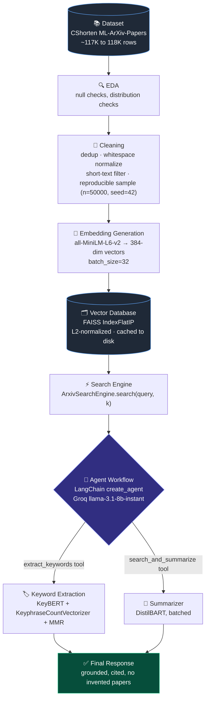
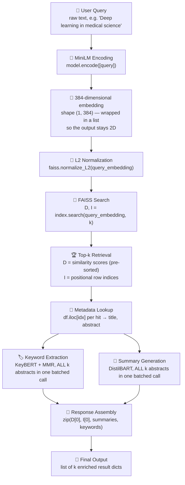
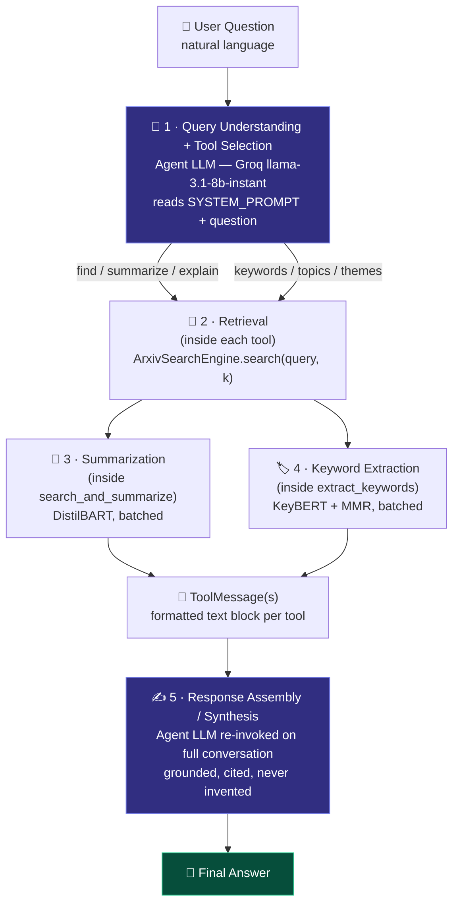
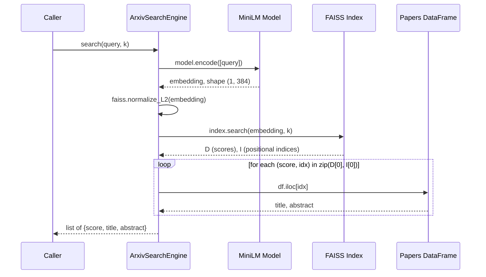
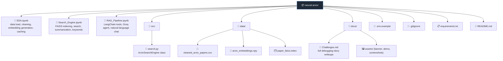

<div align="center">

# 🔭 Neural ArXiv

### A Semantic Vector Search & Agentic Enrichment Engine for Machine Learning Research Papers

*Ask a question in plain English. Get back the right papers — retrieved by meaning, summarized, and tagged with their key ideas — not a wall of raw abstracts.*

<!-- 🖼️ BANNER PLACEHOLDER — replace with a real banner image, e.g. docs/assets/banner.png (recommended 1280×640) -->


[](https://www.python.org/)
[](https://pytorch.org/)
[](https://www.sbert.net/)
[](https://github.com/facebookresearch/faiss)
[](https://huggingface.co/docs/transformers)
[](https://www.langchain.com/)
[](https://groq.com/)
[](LICENSE)
[](https://github.com/your-username/neural-arxiv/pulls)

<!-- 🎬 DEMO PLACEHOLDER — replace with a real terminal/UI capture, GIF, or asciinema link -->


**[Quick Start](#installation)** · **[Architecture](#system-architecture)** · **[Engineering Decisions](#engineering-decisions)** · **[Debugging Stories](#engineering-challenges)** · **[Benchmarks](#performance-metrics)**

</div>

---

## What is Neural ArXiv?

Neural ArXiv is a semantic search and research-assistant system built on top of a **50,000-paper sample** of the `CShorten/ML-ArXiv-Papers` dataset. It is built in three layers, each sitting on top of the last:

1. **A semantic search backend** — every paper's title + abstract is embedded with `all-MiniLM-L6-v2` and indexed in a FAISS `IndexFlatIP` vector index, enabling sub-second cosine-similarity search over the whole corpus instead of brittle keyword matching.
2. **An enrichment layer** — every retrieved paper is automatically **summarized** (batched DistilBART) and has its **keyphrases extracted** (KeyBERT + `KeyphraseCountVectorizer` + Maximal Marginal Relevance), so a query returns a digestible answer instead of ten raw abstracts to read yourself.
3. **An agentic orchestration layer** — a LangChain **tool-calling agent**, powered by a hosted Groq LLM (`llama-3.1-8b-instant`), sits in front of the retrieval/enrichment tools. It reads a natural-language question, decides which tool(s) the question actually needs, executes them, and synthesizes a final answer that is grounded in — and only in — what was actually retrieved.

> **The problem it solves:** keyword search over academic abstracts fails the moment a query and a paper describe the same idea in different words — a search for *"medical image analysis with deep learning"* should surface a paper about *"CNN-based MRI diagnosis"* even though not one word overlaps. And even once the right papers are found, reading ten full abstracts to extract the gist is slow. Neural ArXiv closes both gaps: it retrieves by **meaning**, then does the reading for you.

**Who it's for:** this is a portfolio / technical-interview project first, and a usable research tool second — it is deliberately documented (see [Engineering Decisions](#engineering-decisions) and [Engineering Challenges](#engineering-challenges) below) to be defensible in a systems-design interview. Nearly every implementation choice has a recorded reason, a rejected alternative, and — where it happened — a debugging story.

<br/>

## Table of Contents

- [Motivation](#motivation)
- [Features](#features)
- [System Architecture](#system-architecture)
- [Complete AI Workflow](#complete-ai-workflow)
- [AI Agent Workflow](#ai-agent-workflow)
- [Prompt Engineering](#prompt-engineering)
- [Tools Used](#tools-used)
- [Engineering Decisions](#engineering-decisions)
- [Data Pipeline](#data-pipeline)
- [Search Pipeline](#search-pipeline)
- [Keyword Extraction Pipeline](#keyword-extraction-pipeline)
- [Summarization Pipeline](#summarization-pipeline)
- [Performance Optimizations](#performance-optimizations)
- [Engineering Challenges](#engineering-challenges)
- [Performance Metrics](#performance-metrics)
- [Future Improvements](#future-improvements)
- [Folder Structure](#folder-structure)
- [Screenshots](#screenshots)
- [Installation](#installation)
- [Running the Project](#running-the-project)
- [Results](#results)
- [Lessons Learned](#lessons-learned)
- [Credits](#credits)
- [License](#license)

---

## Motivation

### Why semantic search instead of keyword search?

Lexical search — SQL `LIKE`, TF-IDF, BM25 — matches on literal token overlap. Research abstracts describe the same idea in wildly different vocabularies: *"deep learning for medical image analysis,"* *"CNN-based MRI diagnosis,"* and *"neural approaches to radiological image segmentation"* are, semantically, the same topic — but a keyword search for any one phrasing misses the other two entirely. Embedding-based semantic search fixes this by representing text as a point in a continuous vector space where **meaning determines proximity**, not surface wording. Cosine similarity between two paper vectors captures whether they're "about the same thing," independent of the words either author happened to choose.

| | Keyword Search (TF-IDF / BM25 / `LIKE`) | Semantic Search (this project) |
|---|---|---|
| **Matching unit** | Literal tokens / n-grams | Dense meaning vectors |
| **Synonym robustness** | ✗ misses paraphrases | ✅ "CNN" ≈ "convolutional neural network" |
| **Query "deep learning medicine" vs. paper "CNN MRI diagnosis"** | No match | Matched (high cosine similarity) |
| **Scales to 50K+ docs at low latency** | ✅ (inverted index) | ✅ (FAISS `IndexFlatIP`) |
| **Needs exact vocabulary overlap** | ✅ required | ❌ not required |

### Why research papers / ArXiv specifically?

ArXiv abstracts are a large, freely available, information-dense text corpus that is realistic and genuinely non-trivial — long-form academic English, dense domain jargon, and widely varying abstract lengths make it a good stress test for an embedding + retrieval + summarization pipeline. It's also a real pain point: finding related work quickly is something every ML researcher, grad student, or coursework-doer actually needs.

### Why embeddings — the technical case

`all-MiniLM-L6-v2` compresses arbitrary-length text into a fixed **384-dimensional** dense vector, where semantic similarity corresponds to vector *direction* rather than literal token overlap. That lets a query like *"deep learning for medical image analysis"* retrieve papers that never use those exact words, as long as they're conceptually related — something no inverted index can do without a thesaurus bolted on top.

### Why AI agents on top of retrieval?

A raw FAISS search only returns row indices and similarity scores. It doesn't summarize, doesn't extract themes, and can't decide *what the user actually wants* — a full explanation? Just the key topics? Both? A LangChain tool-calling agent adds a reasoning layer on top: given a natural-language question, the agent LLM decides which specialized tool(s) to invoke, executes them, and turns raw tool output into a coherent, cited final answer — turning a static search backend into something closer to an interactive research assistant.

---

## Features

Not just a list — here's *why* each capability exists and what it actually buys the user.

#### 🧠 Meaning-based semantic retrieval
Every paper is represented as a 384-dimensional embedding from `all-MiniLM-L6-v2`, and every query is embedded with the exact same model into the exact same vector space. Retrieval is cosine similarity, not token overlap — so a query and a relevant paper can share **zero words** and still rank at the top, as long as they're conceptually aligned.

#### ⚡ Sub-second search over the full corpus
All paper vectors live in a FAISS `IndexFlatIP` index. Combined with L2-normalizing every vector before indexing, the index's native (and very fast) inner-product operation becomes mathematically identical to exact cosine similarity — no approximation, no recall loss, and (per the project's own measurements) only a few milliseconds of the total query time, even across the full 50,000-vector index.

#### 📝 Automatic abstractive summarization
Every retrieved paper is run through a batched DistilBART (`sshleifer/distilbart-cnn-12-6`) summarization pass, with `max_length`/`min_length` bounds calculated *dynamically per query* from the actual word counts of the retrieved abstracts — so the summarizer is never asked for a length combination that's impossible given the shortest abstract in the batch.

#### 🏷️ Automatic, diverse keyphrase extraction
KeyBERT (backed by the same MiniLM model) plus `KeyphraseCountVectorizer` (POS-pattern-based candidate generation via spaCy) plus Maximal Marginal Relevance produces topic keyphrases that are grammatically clean *by construction* — measured at **100% clean candidates**, versus ~11–14% for a naive n-gram approach (see [Engineering Decisions](#engineering-decisions)).

#### 🤖 Natural-language, tool-calling agent access
A LangChain agent (`create_agent`), reasoned over by a hosted Groq `llama-3.1-8b-instant` model, sits in front of two tools — `search_and_summarize` and `extract_keywords`. The agent reads the question, decides autonomously which tool(s) it needs, and answers in natural language. Ask for "papers on X" and it summarizes; ask for "the main themes in Y" and it extracts keywords; ask for a full analysis and it does both.

#### 🛡️ Built-in anti-hallucination grounding
The agent's system prompt explicitly bounds its factual universe to what its tools actually returned: always cite paper titles, never invent a paper or a citation that isn't in the tool output. This is a deliberate architectural constraint, not an afterthought — see [Prompt Engineering](#prompt-engineering).

#### 🔀 Two access patterns, one retrieval core
A **direct function pipeline** (`getrelevant_papers(query, k)`) returns structured Python dicts for programmatic use, and an **agent-mediated pipeline** answers free-form natural-language questions conversationally. Both are built on the same underlying `ArxivSearchEngine` — no duplicated retrieval logic between them.

#### 💾 Caching that turns 26 minutes into ~1 second
Embedding the full corpus is a multi-tens-of-minutes operation (a 15,000-row test batch was measured at ~26 minutes at `batch_size=32`). Both the embeddings matrix and the FAISS index are persisted to disk on first computation and simply reloaded on every subsequent run.

#### 🖥️ Hardware-adaptive, crash-free device placement
A single shared `torch.cuda.is_available()` check drives device selection for *both* the SentenceTransformer (which expects a string device) and the Hugging Face summarization pipeline (which expects an integer device index) — reconciling two different device-argument conventions in one place instead of two, with a tested, graceful CPU fallback.

---

## System Architecture

The diagram below is the 10,000-foot view. There are actually **two ways to query the system** — a direct function pipeline and an agent-mediated pipeline — both of which are detailed precisely in [Complete AI Workflow](#complete-ai-workflow) and [AI Agent Workflow](#ai-agent-workflow). This diagram shows the components common to both.



**Reading this diagram:** everything from *Dataset* through *Vector Database* happens **once**, offline, ahead of time (see [Data Pipeline](#data-pipeline)) — it's the indexing path. Everything from *Search Engine* onward happens **per query**, at request time. The branch at *Agent Workflow* is the important detail the linear picture above simplifies: the agent doesn't always run *both* enrichment steps — it decides, per question, whether it needs summaries, keywords, or both. The [direct pipeline](#complete-ai-workflow) (no agent in the loop) always runs both, unconditionally, in a single function call.

---

## Complete AI Workflow

This section traces **exactly** what happens between a user typing a query and a response coming back, for the direct (non-agent) pipeline — `getrelevant_papers(query, k=5)` in `Search_Engine.ipynb`. No steps are skipped.



| Stage | What actually happens |
|---|---|
| **1. User Query** | A raw text string, e.g. `"Deep learning in medical science"`. No preprocessing is applied to the query beyond what the model does internally. |
| **2. MiniLM Encoding** | `query_embedding = model.encode([query])`. The query is deliberately wrapped in a **list**, not passed as a bare string — `sentence-transformers` would otherwise flatten a single string to a 1D `(384,)` array, and both FAISS's `index.search()` and scikit-learn's `cosine_similarity()` require 2D "batch of vectors" input. |
| **3. 384-dimensional embedding** | The output is a `(1, 384)` `float32` array — one row, 384 dimensions, fixed by the MiniLM architecture. |
| **4. L2 Normalization** | `faiss.normalize_L2(query_embedding)` scales the query vector to unit length **in place**, exactly mirroring the normalization already applied to every stored paper vector at indexing time — this is what makes FAISS's inner-product search behave as true cosine similarity. |
| **5. FAISS Search** | `D, I = index.search(query_embedding, k)` searches the flat index of all normalized paper embeddings via inner product. |
| **6. Top-k Retrieval** | `D` is a `(1, k)` array of similarity scores, **pre-sorted descending by FAISS itself**. `I` is a `(1, k)` array of the **positional** row indices of the best-matching papers. |
| **7. Metadata Lookup** | For each `(score, idx)` pair in `zip(D[0], I[0])`, the matching row is fetched with `df.iloc[idx]` — positional lookup, which is only correct because the DataFrame's index was reset to a clean `0..N-1` range during the data pipeline (see [Challenge 8.11](#engineering-challenges)). Each abstract's word count is also collected here, to feed the next two stages. |
| **8. Keyword Extraction** | All `k` abstracts are passed to `kw_model.extract_keywords(...)` **in one batched call**, not looped per paper. |
| **9. Summary Generation** | All `k` abstracts are passed to the DistilBART summarizer pipeline **in one batched call**, with `max_length`/`min_length` computed dynamically for this batch. |
| **10. Response Assembly** | `zip(D[0], I[0], summaries, keywords)` walks all four parallel sequences together, building one result dict per paper: `{"score": ..., "title": ..., "Keywords": ..., "summary": ...}`. |
| **11. Final Output** | A Python list of `k` fully enriched dictionaries — printed directly in the notebook, or consumed programmatically downstream. |

> ⚠️ **The one edge case worth knowing about:** when `k=1`, step 8's output shape silently changes (KeyBERT flattens its return type for single-document input). This is the project's flagship debugging story — full writeup in [Engineering Challenges → 8.1](#engineering-challenges).

---

## AI Agent Workflow

**A note on how this section is framed, upfront:** it would be easy to describe this system as "five independent agents" — a Query Understanding Agent, a Retrieval Agent, a Keyword Extraction Agent, a Summarization Agent, and a Response Assembly Agent — because that's a familiar multi-agent template. But it would also be **inaccurate**, and this project's own design philosophy (see [Engineering Decision 7.14](#engineering-decisions) and [Challenge 8.14](#engineering-challenges)) explicitly argues *against* that shape. What's actually implemented is **one reasoning agent with two tools**, and the five responsibilities below are *stages inside that single agent's tool-calling loop*, not five separate agent processes. That distinction is itself a deliberate, documented architectural decision — and it's a better interview answer than pretending otherwise.

### The five responsibilities (inside one agent)



| # | Responsibility | Who actually does it | Details |
|---|---|---|---|
| 1 | **Query Understanding & Tool Selection** | The agent LLM (`ChatGroq`, `llama-3.1-8b-instant`), guided by `SYSTEM_PROMPT` | Reads the user's message plus the system prompt's decision rules and decides which tool(s) to call and with what arguments (`query`, `k`). This is real LLM reasoning, not keyword-matching — see [Prompt Engineering](#prompt-engineering). |
| 2 | **Retrieval** | `ArxivSearchEngine.search(query, k)`, called from *inside* whichever tool the agent invoked | Identical embed → normalize → FAISS-search → metadata-lookup logic as the direct pipeline. Not a separate agent — a plain method call the tool makes before doing its own job. |
| 3 | **Summarization** | DistilBART, running *inside* the `search_and_summarize` tool | Only executes if the agent decided this question needs paper summaries. |
| 4 | **Keyword Extraction** | KeyBERT + MMR, running *inside* the `extract_keywords` tool | Only executes if the agent decided this question needs topics/themes. Both 3 and 4 run if the agent judges the question needs "a comprehensive analysis." |
| 5 | **Response Assembly / Synthesis** | The same agent LLM, invoked a second time by LangChain's agent loop | Reads the tool result(s) — now `ToolMessage` objects in the conversation — and produces the final natural-language answer, instructed to ground every claim in tool output and cite paper titles. |

### Why this shape, not five separate agents

Splitting reasoning, retrieval, summarization, keyword extraction, and synthesis into five *independent* agents would mean five separate LLM-driven decision loops coordinating with each other — more orchestration surface area, more latency, more places for one component to misunderstand another's output, for no measurable benefit at this problem's scale. The project's actual design keeps exactly **one** component that reasons about intent (the Groq-backed agent LLM) and treats DistilBART and KeyBERT strictly as **narrow tool backends** — specialized, non-conversational models that execute a well-defined transformation once called, and never decide anything themselves. An earlier design that wrapped the local summarizer as a LangChain `HuggingFacePipeline` **LLM** object (so it could act as a reasoning component) was explicitly built, reconsidered, and removed for exactly this reason — full story in [Challenge 8.14](#engineering-challenges).

### Tool contracts

| Tool | Signature | Responsibility |
|---|---|---|
| `search_and_summarize` | `(query: str, k: int = 5) -> str` | Semantic search **+** batched DistilBART summarization, formatted as a plain-text block (rank, score, title, summary, abstract preview). |
| `extract_keywords` | `(query: str, k: int = 5) -> str` | Semantic search **+** batched KeyBERT/MMR keyphrase extraction, formatted as a plain-text block. |

Each tool's **docstring is its description** — this is standard LangChain `@tool` convention, but worth calling out explicitly: the docstring isn't just documentation, it's functionally part of the prompt the agent LLM reads when deciding whether a given tool fits the user's question. Both tools return **strings**, not Python objects — because a tool's return value becomes a `ToolMessage` that the LLM itself reads as text in the next reasoning step, so the direct pipeline's dict-based output and the agent pipeline's text-block output are deliberately different shapes for the same underlying data.

**Tool calling only activates through `create_agent`.** Calling the raw `llm.invoke(...)` directly — without going through `create_agent` — returns an `AIMessage` with an **empty `tool_calls` list**, because tool calling is a capability exposed through LangChain's binding layer, which only wires up once the model has been given the tool schemas. This was explicitly verified (not assumed) by sanity-testing the raw LLM with a plain, tool-irrelevant question before any tools were bound.

---

## Prompt Engineering

Two entirely different "steering" mechanisms are in play here, deliberately kept distinct:

- **The agent LLM (Groq)** is steered with a **system prompt** — natural-language instructions, because it's a general reasoning model making judgment calls.
- **The local models (DistilBART, KeyBERT)** are steered with **generation parameters** (`max_length`, `min_length`, `diversity`, `top_n`, `do_sample`) — because they're narrow, non-conversational models; there's no "prompt" to write for a summarization pipeline, only knobs to tune.

### The system prompt's rules

The agent's `SYSTEM_PROMPT` encodes explicit, enumerable decision rules rather than leaving tool selection to implicit vibes:

```text
- Use `search_and_summarize` when the user asks to find, summarize, or explain papers.
- Use `extract_keywords` when the user asks for keywords, key phrases, topics, or themes.
- Use BOTH tools when the user wants a comprehensive analysis of a topic.
- Always ground the final answer in tool output; cite paper titles.
- Never invent papers or citations not present in the tool results.
- Write a clear, concise final response.
```

### How hallucination is reduced

The last two rules above are a deliberate **anti-hallucination / grounding constraint**, baked directly into the prompt rather than hoped for implicitly. The agent's factual universe is explicitly bounded to what its own tools actually returned in *this* conversation — it is told, in plain language, that inventing a paper title or a citation that isn't present in a `ToolMessage` is against the rules. This matters because the underlying LLM has no independent access to the ArXiv corpus; the only ArXiv-grounded facts available to it are whatever the retrieval tools handed back.

**Validation, concretely demonstrated:** two test queries were chosen specifically to probe whether the agent's tool-selection reasoning maps question *phrasing* to the *correct* tool rather than defaulting to one tool or guessing:

| Test query | Expected tool | Why |
|---|---|---|
| *"Find the top 3 research papers on Vision Transformer and summarize them."* | `search_and_summarize` | Phrasing ("find… summarize") maps to summarization intent. |
| *"What are the main keywords and topics in deep learning for medical imaging?"* | `extract_keywords` | Phrasing ("keywords and topics") maps to keyword-extraction intent. |

### How summaries are generated

Summaries are **not** prompted into existence — DistilBART is an abstractive summarization model tuned via generation parameters, not natural-language instructions. The key engineering decision here is that `max_length`/`min_length` are computed **dynamically per query batch** from the real word counts of the retrieved abstracts (details in [Summarization Pipeline](#summarization-pipeline)), specifically so the parameters never ask for something the shortest abstract in the batch can't support. `do_sample=False` is set deliberately — greedy/beam-style deterministic decoding, so the same query reliably produces the same summary rather than varying run to run.

---

## Tools Used

Not a dependency list — every tool below was chosen over a real alternative, for a reason.

| Tool | Role in this project | Why this, specifically |
|---|---|---|
| **`sentence-transformers` / `all-MiniLM-L6-v2`** | The embedding backbone for both documents and queries | Strong speed/quality tradeoff for locally-run, consumer-hardware inference; a well-established default in the sentence-transformers ecosystem. Reused as KeyBERT's backend too, so every embedding-based computation in the project shares one vector space. |
| **FAISS (`IndexFlatIP`)** | The vector database / nearest-neighbor engine | Exact, brute-force inner-product search — no approximation, no recall loss — which is still extremely fast at tens of thousands of vectors. Persisted to disk so it's built once. |
| **DistilBART (`sshleifer/distilbart-cnn-12-6`)** | Abstractive summarization of retrieved abstracts | ~5× smaller checkpoint than full `facebook/bart-large-cnn` (~300MB vs. ~1.6GB) — faster to download and run, an appropriate tradeoff for short academic abstracts on consumer hardware. |
| **KeyBERT** | Keyphrase extraction, ranked by embedding similarity | Reuses the *same* MiniLM model already loaded for document/query embedding — no second embedding space to maintain. |
| **`KeyphraseCountVectorizer`** | Candidate-phrase generation for KeyBERT | POS-pattern-based candidates via spaCy instead of raw n-gram windows — measured at 100% grammatically clean candidates vs. ~11–14% for manual n-grams (see [Engineering Decisions](#engineering-decisions)). |
| **Pandas** | Tabular data handling throughout | Loading the HF dataset into a DataFrame, column selection, null-checking, deduplication, regex whitespace cleanup, index management, CSV persistence. |
| **NumPy** | Embedding matrix storage | `.npy` persistence for the `(N, 384)` `float32` embeddings array — the caching layer that turns a ~26-minute job into a ~1-second load. |
| **Torch (PyTorch)** | Device detection | `torch.cuda.is_available()` / `torch.cuda.get_device_name(0)` drive device selection for both the SentenceTransformer and the Hugging Face pipeline, reconciling their different device-argument conventions in one place. |
| **Transformers (Hugging Face)** | Summarization pipeline abstraction | `pipeline("summarization", ...)` handles tokenization, batching, generation, and decoding behind one callable, configured with `max_length`, `min_length`, `batch_size`, `do_sample=False`. |
| **LangChain** | Agent orchestration | `@tool` decoration turns plain Python functions into LLM-callable tools with schemas derived from their signatures/docstrings; `create_agent(...)` builds the full tool-calling reasoning loop internally. |
| **Groq / `ChatGroq`** | The agent's reasoning "brain" | A fast, tool-calling-capable hosted chat model (`llama-3.1-8b-instant`) chosen specifically as a free/low-latency alternative to a commercial LLM API for the orchestration layer. |
| **Jupyter** | Development environment, split across 3 notebooks | Interactive iteration on retrieval, summarization, and keyword extraction — with the tradeoffs and gotchas of that execution model treated as first-class engineering concerns, not incidental (see [Challenge 8.1](#engineering-challenges)). |

---

## Engineering Decisions

For each decision below: **what** was chosen, **why**, and what alternative was rejected (and why).

<details open>
<summary><strong>7.1 — <code>all-MiniLM-L6-v2</code> as the embedding model</strong></summary>

<br/>

- **Chosen:** a small, fast, general-purpose sentence-transformer producing 384-dim embeddings.
- **Why:** strong speed/quality tradeoff for a locally-run, consumer-hardware (RTX 3050-class GPU / CPU fallback) project; a well-established default in the sentence-transformers ecosystem.
- **Rejected alternative:** larger sentence-transformer models — higher embedding quality, but heavier compute/memory for encoding ~50,000 documents plus every query in real time. The lighter model keeps that tractable without dedicated infrastructure.
</details>

<details>
<summary><strong>7.2 — DistilBART over full BART-large-CNN</strong></summary>

<br/>

- **Chosen:** `sshleifer/distilbart-cnn-12-6` (~300MB).
- **Why:** roughly 5× smaller than `facebook/bart-large-cnn` (~1.6GB) — faster to download and run.
- **Rejected alternative:** full BART-large-CNN — the added size/latency wasn't justified by the marginal summary-quality gain for short academic abstracts at this project's scale.
- **The architectural tradeoff, precisely:** DistilBART keeps 12 encoder layers but reduces to 6 decoder layers. Because **decoder computation dominates inference latency** in encoder-decoder summarization models (the decoder runs autoregressively, token by token, while the encoder runs once), halving decoder depth measurably improves response time while preserving strong summarization quality — a deliberately asymmetric distillation, not a uniform shrink.
</details>

<details>
<summary><strong>7.3 — Batch summarization (one batched call vs. a per-item loop)</strong></summary>

<br/>

- **Chosen:** collect all `k` abstracts, call the summarizer pipeline once with a list input and `batch_size=k`.
- **Why:** each single-item pipeline call independently pays tokenization, padding, host→GPU transfer, and kernel-launch overhead. Batching amortizes that fixed cost across all `k` items and lets the GPU actually parallelize the forward pass. This was also the direct fix for Hugging Face's own runtime warning about sequential pipeline calls on GPU (full story in [Challenge 8.3](#engineering-challenges)).
- **Rejected alternative:** the original per-paper loop (`for idx in I[0]: summarizer(abstract)`) — measurably slower at any meaningful `k`, and the literal source of a library-emitted warning.
</details>

<details>
<summary><strong>7.4 — FAISS <code>IndexFlatIP</code> (exact search) over an approximate index</strong></summary>

<br/>

- **Chosen:** `IndexFlatIP` — flat, uncompressed, brute-force inner-product search.
- **Why:** at tens of thousands of vectors, brute-force search is still extremely fast, and it guarantees **exact** nearest neighbors with zero recall loss from approximation.
- **Rejected (for now) alternative:** `IndexIVFFlat` or another clustered/approximate index — explicitly identified as the right choice **if** the corpus scales to millions of papers, where brute-force search would become the bottleneck. Deliberately not adopted prematurely — see [Future Improvements](#future-improvements).
</details>

<details>
<summary><strong>7.5 — L2 normalization + inner product as a cosine-similarity substitute</strong></summary>

<br/>

- **Chosen:** normalize every embedding to unit length (`faiss.normalize_L2`) before indexing/searching, and use `IndexFlatIP` as the index type.
- **Why:** FAISS has no dedicated cosine-similarity index type, but it does have a very fast native inner-product operation. The identity **L2 normalization + inner product = cosine similarity** gets exact cosine-similarity ranking while still using FAISS's fastest native operation.
- **Rejected alternative:** computing cosine similarity manually per query with scikit-learn's `cosine_similarity` — this is in fact what was used in `EDA.ipynb` to validate the concept on a handful of vectors, but it's far too slow at full corpus scale, hence the move to FAISS for production search.
</details>

<details>
<summary><strong>7.6 — Cosine similarity over Euclidean distance</strong></summary>

<br/>

- **Chosen:** cosine similarity (via the FAISS inner-product identity above) as the similarity metric.
- **Why:** cosine similarity measures vector **direction** (semantic content); Euclidean distance is sensitive to vector **magnitude**, which can be affected by document length rather than meaning. A short summary and a long thesis on the same topic should score as similar even if their raw embedding magnitudes differ.
- **Rejected alternative:** raw Euclidean/L2 distance — conceptually wrong here, since it would falsely penalize documents of different lengths that are nonetheless semantically aligned.
</details>

<details>
<summary><strong>7.7 — <code>KeyphraseCountVectorizer</code> over manual n-gram configuration</strong></summary>

<br/>

- **Chosen:** `KeyphraseCountVectorizer` (POS-pattern-based candidate generation via spaCy) as KeyBERT's candidate generator.
- **Why — quantified, not guessed:** raw `ngram_range=(1,3)` with `stop_words=None` produced 223 candidate phrases, only ~10.8% clean/complete. Adding `stop_words='english'` improved this to 174 candidates at ~13.8% clean. Switching to `KeyphraseCountVectorizer` produced only 25 candidates — **100% grammatically clean by construction** (valid noun phrases). This is a directly measured before/after comparison.
- **Rejected alternative:** manually tuned `ngram_range` + stopword lists — superseded once the cleaner, higher-precision, lower-maintenance POS-based alternative was identified; the added spaCy dependency was judged worth it.
</details>

<details>
<summary><strong>7.8 — MMR (Maximal Marginal Relevance) for keyword diversity</strong></summary>

<br/>

- **Chosen:** `use_mmr=True, diversity=0.5` inside `kw_model.extract_keywords(...)`.
- **Why:** without diversification, top-N keyphrase lists tend to be dominated by near-duplicate phrases ("deep learning" *and* "deep neural" both appearing) — wasting slots on redundant information. MMR balances *relevance* (similarity to the document) against *diversity* (dissimilarity to already-selected keywords). `diversity=0` = pure relevance ranking; `diversity=1` = maximum diversity; `0.5` is a deliberate balanced midpoint.
- **Rejected alternative:** plain top-N-by-relevance ranking — used in earlier, simpler attempts, superseded once redundant near-duplicate phrases were observed in practice.
</details>

<details>
<summary><strong>7.9 — One embedding per paper (title + abstract combined)</strong></summary>

<br/>

- **Chosen:** `paper_text = title + " " + abstract`, embedded once per paper.
- **Why:** a title alone can lack depth/context; an abstract alone can miss the punchy, high-signal terms an author deliberately put in the title. Embedding the concatenation captures both, and **halves** storage and per-query comparison cost versus maintaining two separate embeddings per paper.
- **Rejected alternative:** title-only embeddings, abstract-only embeddings, or dual embeddings with score fusion — all rejected in favor of the simpler, cheaper, single combined representation.
</details>

<details>
<summary><strong>7.10 — Reproducible random sampling over a deterministic slice</strong></summary>

<br/>

- **Chosen:** `df.sample(n=50000, random_state=42)`, replacing an earlier `df.head(50000)`.
- **Why:** ArXiv IDs are date-based, so taking the first 50,000 rows in raw dataset order risks skewing the sample toward earlier submissions. A fixed `random_state=42` makes the random sample **exactly reproducible** across re-runs — which matters because the cached embeddings/FAISS index are only valid for that exact sample of rows.
- **Rejected alternative:** the original `.head(50000)` — kept in the notebook as a commented-out "Before" line, specifically to document the change and the reasoning behind it. Full debugging-style writeup in [Challenge 8.8](#engineering-challenges).
</details>

<details>
<summary><strong>7.11 — Notebook modularization: extracting <code>src/search.py</code></strong></summary>

<br/>

- **Chosen:** once the FAISS + SentenceTransformer retrieval logic stabilized in `Search_Engine.ipynb`, it was pulled into a reusable `ArxivSearchEngine` class in `src/search.py`, imported by `RAG_Pipeline.ipynb`.
- **Why:** avoids duplicating (and risking drift between) the same FAISS-loading/searching code across notebooks; the LangChain tools call `searcher.search(query, k)` rather than re-implementing embedding + normalization + search inline.
- **Rejected alternative:** copy-pasting the retrieval cells into the new notebook — rejected in favor of a proper shared module once the logic stopped actively changing.
</details>

<details>
<summary><strong>7.12 — Precomputed / cached embeddings and FAISS index</strong></summary>

<br/>

- **Chosen:** both the embeddings matrix (`.npy`) and the FAISS index are saved to disk on first computation and loaded thereafter, guarded by `os.path.exists(...)` checks.
- **Why:** encoding the full corpus is estimated at tens of minutes (a 15,000-row batch: ~26 minutes at `batch_size=32`); caching turns every subsequent run into a near-instant disk load.
- **Rejected alternative:** recomputing embeddings on every run — wasteful, rejected outright. (This caching decision has its own downstream tradeoff — see [Challenge 8.2](#engineering-challenges).)
</details>

<details>
<summary><strong>7.13 — Tool abstraction (<code>@tool</code>) and a LangChain agent, instead of a hardcoded router</strong></summary>

<br/>

- **Chosen:** wrap `search_and_summarize` and `extract_keywords` as LangChain `@tool` functions, bound to a `create_agent(...)` agent, rather than calling them directly from application code.
- **Why:** lets a general-purpose conversational LLM decide, per question, which capability is relevant — the difference between a fixed pipeline (always search + summarize + extract) and an adaptive assistant that can serve narrower requests or broader ones based on how the question is actually phrased.
- **Rejected alternative:** a hardcoded `if/else` router based on keyword matching in the question (`if 'keyword' in query: ...`) — rejected in favor of letting an LLM handle the fuzzier, more general intent classification.
</details>

<details>
<summary><strong>7.14 — Separating the agent LLM from the tool-backend models</strong></summary>

<br/>

- **Chosen:** the reasoning/orchestration LLM (Groq) is a completely different model from the tool-backend NLP models (DistilBART, KeyBERT). An earlier approach that wrapped the local summarizer as a LangChain `HuggingFacePipeline` **LLM object** was explicitly removed.
- **Why:** DistilBART is a specialized summarization model, not a general instruction-following/tool-calling model — it isn't suited to *reasoning about which tool to call*. Using a proper hosted chat model for orchestration, and keeping local specialized models purely as tool backends, is architecturally cleaner and avoids forcing a summarization-only model into a role it isn't built for.
- **Rejected alternative:** using the `HuggingFacePipeline`-wrapped DistilBART as the agent's own LLM — attempted, then explicitly abandoned once `ChatGroq` was adopted. Full story in [Challenge 8.14](#engineering-challenges).
</details>

<details>
<summary><strong>Bonus — Bi-encoder over cross-encoder for retrieval</strong></summary>

<br/>

Not called out as a separate numbered decision in the project notes, but implicit in every choice above and worth making explicit: `all-MiniLM-L6-v2` is used as a **bi-encoder** — documents and queries are embedded *independently*, so the entire corpus can be embedded once, offline, and searched against a freshly embedded query at request time. A **cross-encoder** (which jointly encodes a query-document *pair* to produce a single relevance score) tends to be more accurate, but it cannot be used for initial retrieval at all — it would require re-running the model against every one of 50,000 documents for every single query, with nothing to cache. Bi-encoder retrieval is what makes FAISS indexing possible in the first place; a cross-encoder's natural role is as a *second-stage re-ranker* over an already-shortlisted candidate set — which is exactly why it appears as a proposed direction in [Future Improvements](#future-improvements) rather than as something used for primary retrieval.
</details>

---

## Data Pipeline

The offline path that turns a raw Hugging Face dataset into a search-ready corpus. Thirteen steps, in order:

1. **Load the dataset** — `datasets.load_dataset(...)` pulls `CShorten/ML-ArXiv-Papers`, returning an Arrow-backed, memory-mapped `DatasetDict` with only `title` and `abstract` fields (already pre-filtered upstream to the `cs.LG` ArXiv category).
2. **Convert to pandas** — `dataset["train"].to_pandas()` materializes the split into an in-memory DataFrame. *(This trades away Arrow's memory-mapping benefit — judged a non-issue at current scale; see [Challenge 8.13](#engineering-challenges) for exactly where that stops being true.)*
3. **Column pruning** — sliced down to `df[['title', 'abstract']]`, dropping leftover `"Unnamed"` index columns (artifacts of the source CSV export) across ~117,000–118,000 raw rows, both for semantic irrelevance and memory efficiency.
4. **Reproducible sampling** — `df.sample(n=50000, random_state=42)`, replacing an earlier order-biased `df.head(50000)` (see [Decision 7.10](#engineering-decisions)).
5. **Missing-value check** — `df.isnull().sum()` confirms no missing values in `title` or `abstract` for the sampled data. Two `dropna` strategies were explicitly reasoned through even though neither was needed here: dropping only if **both** fields are missing (`how="all"`) vs. dropping if **either** is missing (`how="any"`) — favoring the more lenient `how="all"` in principle, since a missing title with a present abstract still carries information.
6. **Duplicate removal** — `df.drop_duplicates(subset=["abstract"])` removes rows with duplicate abstract text.
7. **Combined text field** — `df["paper_text"] = df["title"] + " " + df["abstract"]`, the actual unit that gets embedded (rationale: [Decision 7.9](#engineering-decisions)). A `fillna("")`-based variant was considered for a scenario with partially-missing rows, but the simpler direct concatenation was used since the null-check confirmed no missing values were present.
8. **Whitespace cleanup** — `df["paper_text"].str.replace(r"\s+", " ", regex=True).str.strip()` collapses all runs of whitespace — including embedded newlines, common in text extracted from PDF-formatted papers where line breaks depend on column width — into single spaces, then trims the ends. An earlier, narrower version only targeted literal `\n` characters with `regex=False` for performance on 117,000+ rows, before being generalized.
9. **Short-paper filtering** — `df = df[df["paper_text"].str.len() > 30]`, applied *after* cleanup so it operates on true cleaned length, dropping rows too short to carry meaningful semantic content.
10. **Index reset** — `df = df.reset_index(drop=True)`, re-numbering the DataFrame index to a clean, gap-free `0..N-1` range after all row-dropping — critical so the DataFrame's row order stays perfectly aligned with the embeddings array generated next (root cause and full story: [Challenge 8.11](#engineering-challenges)).
11. **Embedding generation** — `model.encode(df["paper_text"].tolist(), batch_size=32, show_progress_bar=True)` converts the cleaned texts into a `(N, 384)` `float32` matrix. `batch_size=32` exists specifically to bound memory usage — the full corpus can't go through the network in one shot without risking a RAM/VRAM overload.
12. **Caching the embeddings** — `np.save(...)` to `data/arxiv_embeddings.npy`, guarded by `os.path.exists` so this multi-minute computation only ever runs once.
13. **Saving the cleaned DataFrame** — `df.to_csv("data/cleaned_arxiv_papers.csv", index=False)`, so later notebooks can reload it with row order guaranteed to match the cached embeddings, with no recomputation.

---

## Search Pipeline



1. **Startup / loading** — the cleaned CSV, the cached embeddings `.npy`, and the `all-MiniLM-L6-v2` model are all loaded once at session start. Reloading cached embeddings takes about a second versus the tens of minutes it would take to regenerate them.
2. **Document embeddings** — already computed during the [data pipeline](#data-pipeline): one `(N, 384)` `float32` row per paper.
3. **L2 normalization** — `faiss_embeddings = embeddings.copy()` (a copy, made specifically because `faiss.normalize_L2` mutates its input **in place**, and the original un-normalized embeddings should be preserved) followed by `faiss.normalize_L2(faiss_embeddings)`.
4. **FAISS index construction** — `faiss.IndexFlatIP(384)` creates an empty flat inner-product index sized for 384-dim vectors; `index.add(faiss_embeddings)` populates it. Persistence to/from disk is guarded by the same `os.path.exists` pattern as the embeddings cache.
5. **Query encoding** — `model.encode([query])`, wrapped as a one-element list so the output stays a 2D `(1, 384)` array, using the identical model used for documents.
6. **Query normalization** — `faiss.normalize_L2(query_embedding)`, the same unit-length treatment applied to every stored document vector.
7. **Vector search** — `D, I = index.search(query_embedding, k)`; FAISS compares the query against every stored vector via inner product (= cosine similarity here) and returns the top-`k`.
8. **Similarity scores (`D`)** — a `(1, k)` array in the theoretical range `[-1.0, 1.0]` (`1.0` = identical direction, `0.0` = orthogonal, `-1.0` = opposite) — though in practice, real text embeddings almost never produce negative scores; most real results fall between `0.0` and `1.0`. Pre-sorted descending by FAISS.
9. **Top-K retrieval (`I`)** — a `(1, k)` array of the **positional** row indices of the best matches.
10. **Metadata lookup** — `df.iloc[idx]` for each returned index — correct only because the DataFrame index was reset to `0..N-1` during the data pipeline.
11. **Ranking** — no additional re-ranking step beyond FAISS's own similarity-score ordering; results are consumed downstream exactly as FAISS returns them.

---

## Keyword Extraction Pipeline

1. **Model setup** — `kw_model = KeyBERT(model=model)`, explicitly reusing the *same* `all-MiniLM-L6-v2` model already used for document/query embedding, so keyphrase-candidate embeddings live in the same vector space as everything else. `vectorizer = KeyphraseCountVectorizer()` is instantiated once and reused across calls.
2. **Candidate generation** — `KeyphraseCountVectorizer` generates candidate phrases using **part-of-speech (POS) tag patterns** via spaCy's `en_core_web_sm`, rather than a fixed n-gram sliding window — producing grammatically complete noun-phrase-style candidates by construction. *(Superseded earlier approach, kept for comparison: manual `keyphrase_ngram_range=(1,3)` + a stop-word list — noisier, see [Decision 7.7](#engineering-decisions) and [Challenge 8.6](#engineering-challenges).)*
3. **Relevance scoring** — KeyBERT embeds each candidate phrase with the shared MiniLM model and scores it by cosine similarity to the source document's own embedding.
4. **MMR diversification** — `use_mmr=True, diversity=0.5` re-ranks the candidate pool to balance *relevance* against *diversity*, preventing the top-10 list from being dominated by several near-duplicate variants of the same concept.
5. **Top-N selection** — `top_n=10` keyphrases per paper, a fixed value. A dynamic `top_n = min(10, len(text.split()))` was explicitly considered and rejected: for realistic abstract lengths (typically well over 100 words), the dynamic calculation is always a no-op — added complexity with no practical benefit, since KeyBERT already handles the "fewer candidates than requested" case gracefully on its own.
6. **Batch handling** — `kw_model.extract_keywords(list_of_abstracts, vectorizer=vectorizer, top_n=10, use_mmr=True, diversity=0.5)` is called **once per search query**, across all `k` retrieved abstracts together — mirroring the same batching principle applied to summarization.
7. **Single-document shape normalization** — because KeyBERT's return shape depends on whether the input batch has more than one document, a guard (`if len(allabstracts) == 1: keywords = [keywords]`) re-wraps a single-document result to match the nested shape downstream code expects. *(This is the project's flagship bug — full story in [Challenge 8.1](#engineering-challenges).)*
8. **Output formatting** — in the direct pipeline, each result dict stores its keyphrase list under a `"Keywords"` key; in the LangChain tool version, the same list is instead rendered into a formatted text block (`- {phrase} ({score:.4f})` per line), since the tool's return value must be a plain string the agent LLM can read.

---

## Summarization Pipeline

1. **Model setup** — `pipeline("summarization", model="sshleifer/distilbart-cnn-12-6", device=setdevice)`, where `setdevice` is `0` if a CUDA GPU is available, else `-1` — derived from the same shared `torch.cuda.is_available()` check used elsewhere.
2. **Input gathering** — for each of the `k` retrieved papers, the abstract text is collected into a single list (`allabstracts`), and each abstract's word count (`len(abstract_text.split())`, used as an approximation of token count) is computed.
3. **Dynamic length-bound calculation** — since one batched pipeline call accepts only a single scalar `max_length`/`min_length` for the *entire* batch, both bounds are derived from the batch's abstracts collectively: `dynamic_max = 80` (a fixed ceiling in the final implementation) and `dynamic_min` computed as a running minimum across all abstracts in the batch, ensuring the requested minimum length never exceeds what the *shortest* abstract can reasonably support. *(An earlier, more elaborate ratio-based variant computed both bounds as a percentage of the shortest abstract's word count — see [Challenge 8.5](#engineering-challenges) for the reasoning trail.)*
4. **Batched generation** — `summarizer(allabstracts, max_length=dynamic_max, min_length=dynamic_min, batch_size=k, do_sample=False)` — one call, all `k` abstracts together. `do_sample=False` selects deterministic decoding, so the same input reliably produces the same summary.
5. **Output consumption** — the batched call returns a **flat list of dicts** (`[{"summary_text": "..."}, ...]`, one per input item, already unwrapped) — not a list of single-item lists like the old single-string call form. Consumed via `summary["summary_text"]` while iterating in parallel with scores/indices via `zip(...)`. *(This shape change is exactly what broke downstream code the first time — [Challenge 8.4](#engineering-challenges).)*
6. **Integration into results** — each generated summary is attached either as a `"summary"` field in a dict (direct pipeline) or interpolated into a formatted text block (agent pipeline).

---

## Performance Optimizations

Every optimization below came with an explicit, acknowledged tradeoff — none were free wins.

| Optimization | Problem it solved | Impact | Tradeoff |
|---|---|---|---|
| **Batch summarization** | Looping DistilBART once per paper paid tokenization/padding/transfer/kernel-launch overhead `k` separate times; triggered HF's "sequential pipeline calls on GPU" warning | One GPU round-trip instead of `k`; real batch-level parallelism; warning eliminated | `max_length`/`min_length` become shared scalars across the batch — bounds must be derived conservatively from the *shortest* abstract |
| **Notebook modularization** (`src/search.py`) | Iterating on retrieval inline risked tangled, hard-to-reuse code; the agent layer needed identical retrieval logic | Single source of truth for retrieval — the agent's tools call `searcher.search(query, k)` instead of duplicating embed/normalize/search code | An extra layer of indirection (import + instantiation) vs. a fully self-contained notebook — worthwhile once retrieval logic stabilized |
| **Precomputed embeddings + FAISS index caching** | Encoding ~50,000 documents is a multi-tens-of-minutes operation (~26 min for a 15,000-row batch at `batch_size=32`) | Subsequent runs load the same embeddings/index in ~1 second instead of tens of minutes | Cached artifacts are large binary files (112MB CSV, 73MB FAISS index) that don't belong well in Git — this directly caused [Challenge 8.2](#engineering-challenges); the cache also silently invalidates if the sample seed/size or embedding model changes |
| **FAISS `IndexFlatIP` + L2 normalization** | Computing cosine similarity via scikit-learn (fine for a handful of EDA vectors) doesn't scale to tens of thousands of papers per query | FAISS search becomes a tiny fraction (a few ms) of total per-query latency | Exact brute-force search — would need to become an approximate/clustered index (`IVFFlat`) if the corpus grew to millions of vectors, trading some recall for speed |
| **`all-MiniLM-L6-v2` as the embedding model** | Encoding tens of thousands of documents (and every query, live) needs to run fast on consumer hardware | Fast batch encoding (`batch_size=32`) and near-instant query encoding | Lower embedding-quality ceiling than a larger model — an acceptable tradeoff at this project's scale |
| **DistilBART over full BART-large-CNN** | A ~1.6GB summarization model is slower to download, load, and run than necessary for short abstracts | Faster load and inference | Some ceiling on summary quality/nuance vs. the full-size model |
| **`KeyphraseCountVectorizer` + MMR** | Naive n-gram candidates: 223 candidates at only ~10.8% clean (`stop_words=None`), 174 at ~13.8% clean (`stop_words='english'`) | Only 25 candidates generated, **100% grammatically clean by construction** — plus better topical diversity in the final top-10 from MMR | Added spaCy + `en_core_web_sm` dependency and a small per-document POS-tagging cost — judged well worth the quality gain |
| **Column pruning + GPU device selection** | Unused dataset columns carried through the whole pipeline for no reason; hardcoded `device=0` would crash on any non-GPU machine | Lower RAM footprint and faster pandas ops; the notebook runs on GPU when available and falls back to CPU instead of crashing | None noted for either — both are strict robustness/efficiency wins at this project's scale |

---

## Engineering Challenges

> This is the project's most heavily documented section. Every entry below follows the same shape — **Problem → Symptoms → Investigation → Root Cause → Solution → Engineering Lesson** — because that's the shape a technical interviewer actually wants to hear, and because "I fixed a bug" is not an engineering story. Fourteen challenges total; the flagship one is expanded below, the rest are collapsed for scannability — click to expand.

### 8.1 — The flagship bug: KeyBERT's silent dimensionality shift at `k=1`, compounded by `zip()` truncation and a stale Jupyter kernel

**Problem.** A function retrieving the top-`k` papers and extracting 10 keyphrases per paper worked perfectly for `k ≥ 2`, but silently returned only **1** keyword instead of 10 when `k = 1`. No exception was thrown — the failure was silent, which is what made it dangerous.

**Symptoms.** For `k ≥ 2`, each result dict's `"Keywords"` field held a full list of ~10 `(phrase, score)` tuples. For `k = 1`, the same field held a **single bare tuple** — e.g. `('accelerated gradient method', 0.5973)` — instead of a list of ten.

**Investigation.** Systematic type introspection (`print(type(keywords))`, inspecting loop outputs) instead of guessing, which revealed that `kw_model.extract_keywords()`'s return **shape itself changes** depending on how many documents were passed in:
- Batch of `≥ 2` documents → a **list of lists of tuples**: `[[(phrase, score), ...], [(phrase, score), ...]]` (one inner list per document).
- Batch of exactly **1** document → KeyBERT strips the outer list and returns a **flat list of tuples directly**: `[(phrase, score), ...]`.

This is a polymorphic, batch-size-dependent return type from a third-party library — its output structure is not invariant across input sizes.

**Root Cause.** The result-assembly loop used `zip(D[0], I[0], allsummaries, keywords)` to walk four parallel sequences together. Python's `zip()` terminates as soon as **any** input iterable is exhausted. At `k=1`: `D[0]`, `I[0]`, and `allsummaries` all have length 1, but the (flattened) `keywords` list has length 10 — one entry *per keyword tuple*, not per document. On the first (and only) iteration, `zip()` pulled `keywords[0]` — the single best keyword tuple, not the full ten-keyword list — because there was no outer list level to index into. `zip()` then immediately stopped, silently discarding the other nine tuples with no error or warning at all.

**Solution.** An edge-case normalization guard, keyed on the number of documents actually sent in:

```python
if len(allabstracts) == 1:
    keywords = [keywords]
```

This re-wraps the flat list into a one-element list-of-lists, restoring the expected nested shape so `zip()` correctly binds the *entire* ten-keyword list to that single paper. A more robust, shape-driven alternative was also identified — checking the actual returned structure instead of trusting the input count, since a future code path might reduce the effective batch to 1 for reasons unrelated to the requested `k`:

```python
if keywords and isinstance(keywords[0], tuple):
    keywords = [keywords]
```

**Second, compounding bug — stale kernel state.** After editing the function to add the fix, the notebook's output *still* showed the old, broken one-keyword behavior. This wasn't a code bug — it was a Jupyter/IPython execution-model trap. Jupyter notebooks bind function definitions as live Python objects inside the kernel's runtime memory. **Editing a cell's source does not retroactively update a function already defined and bound in kernel memory** until that defining cell is *re-executed*. The stale, pre-fix function object was still what was actually being called. Re-running the definition cell rebound the name to the corrected implementation, and the bug disappeared.

**Engineering Lesson.**
1. Never assume a third-party library's output structure is invariant across different batch/input sizes — verify with `type()`/`print()` rather than assuming.
2. Understand core language mechanics deeply: `zip()` silently truncates to the shortest iterable rather than raising an error on length mismatch.
3. In interactive notebook environments, source-code edits require explicit cell re-execution to take effect in the running kernel.

---

<details>
<summary><strong>8.2 — GitHub rejected pushes: large files (&gt;100MB) already baked into Git history</strong></summary>

<br/>

**Problem.** As the dataset grew, `cleaned_arxiv_papers.csv` reached **112 MB** and `paper_faiss.index` reached **73 MB** — both over GitHub's ~100MB hard limit for a single push. GitHub rejected pushes with `GH001: Large files detected`.

**Symptoms.** Deleting the large files locally and adding them to `.gitignore` did **not** fix it — pushes continued to be rejected.

**Investigation / Root Cause.** A common misconception: "delete file + `.gitignore`" ≠ "problem solved." **Git uploads your entire commit history, not your current working directory.** The large files still existed inside an *older* commit (Commit A added the 112MB CSV; Commit B later deleted it) — GitHub inspects the full pushed history, not just the latest snapshot, so Commit A's large blob still triggers rejection even though the file is gone from the current tree. `.gitignore` only prevents **new**, untracked changes from being staged; it has no effect on objects already committed.

**Solution — scenario-dependent, reasoned through explicitly:**
- **Solo dev, never pushed:** `git fetch origin && git reset --mixed origin/main` — moves the local branch pointer back to match remote, "un-committing" the bad commits while leaving files untouched on disk. Since `.gitignore` now excludes them, a fresh `git add . && git commit && git push` never re-stages them. No history rewrite needed.
- **Solo dev, already pushed:** `git filter-repo --path <file> --invert-paths` then `git push --force` — physically rewrites every commit, scrubbing the file from history. Rewriting changes every subsequent commit's SHA-1, so force-push is required — safe only because no one else has cloned/forked the repo.
- **Multiple contributors on a shared branch:** history rewriting is high-risk — it breaks every other contributor's local clone. Requires freezing all pushes, one person running `filter-repo` + force-push, and everyone else recovering via `git fetch && git reset --hard origin/main` (not a normal `git pull`) — or, better, avoiding a rewrite via Git LFS instead.
- **Forked / open-source repos:** rewriting history is discouraged (invalidates forks/PRs); Git LFS or scrubbing large files going forward is preferred, with any rewrite announced/coordinated first.
- **Large files genuinely needed long-term** (model checkpoints, datasets): **Git LFS** (`git lfs track "*.csv"`) — Git stores lightweight pointer files in normal history while the binary content lives on a separate LFS server.
- **Accidentally committed secrets:** deleting isn't enough (same history-persistence issue) — requires `git filter-repo` or BFG Repo-Cleaner, **and** immediate credential rotation, since the secret was exposed regardless of later scrubbing.

**Root Cause, precisely.** Git's storage model is **snapshots per commit**, not diffs relative to "current state." Every commit that ever referenced a large blob keeps that blob reachable until history itself is rewritten.

**Engineering Lesson.** Deleting a file doesn't delete it from Git history; `.gitignore` only affects untracked files going forward; GitHub validates the entire pushed commit history; and the correct remediation depends entirely on the repo's collaboration state — there's no single universal fix. Prevention: a strict `.gitignore` (`data/`, `venv/`, `.env`) **before** the first commit, and Git LFS from the start for anything expected to grow large.
</details>

<details>
<summary><strong>8.3 — Sequential single-item summarizer calls ("using pipelines sequentially on GPU" warning)</strong></summary>

<br/>

**Problem.** The original code called `summarizer(single_abstract, ...)` once per retrieved paper inside a loop — `k` separate forward passes through DistilBART, each processing a "batch" of exactly 1.

**Symptoms.** Hugging Face's `transformers` library emitted a runtime warning about using pipelines sequentially on GPU, suggesting a dataset-style batched input instead.

**Investigation.** Rather than just silencing the warning, the actual pipeline source was inspected. The base `Pipeline.__call__` keeps a running `call_count` across the pipeline object's entire lifetime and fires the warning once that counter exceeds 10 **and** the device is CUDA:

```python
self.call_count += 1
if self.call_count > 10 and self.device.type == "cuda":
    logger.warning_once("You seem to be using the pipelines sequentially on GPU...")
```

**Root Cause.** The warning is a lifetime counter, not tied to any single call — but the *real* performance cost is independent of whether the warning fires at all: each single-item call independently pays its own tokenization, padding, host→GPU transfer, and CUDA kernel-launch overhead, so `k` calls of batch-size-1 do strictly more total work than 1 call of batch-size-`k`.

**Solution.** Collect every abstract into a list first, then make exactly one summarizer call across the whole batch:

```python
summaries = summarizer(abstracts, max_length=..., min_length=..., do_sample=False, batch_size=k, truncation=True)
```

**Engineering Lesson.** Don't just suppress a library warning — trace it to its source to understand the *actual* underlying inefficiency it's pointing at, which is often more fundamental than the warning message itself suggests.
</details>

<details>
<summary><strong>8.4 — Output-shape change when moving from single-item to batched summarizer calls</strong></summary>

<br/>

**Problem.** After switching to batched summarizer calls (Challenge 8.3's fix), downstream code unpacking results with `zip(..., allsummaries)` started throwing a `KeyError`.

**Symptoms.** Code written for the old single-item pattern (`summarizer("text")` → `[{'summary_text': '...'}]`, requiring `summary[0]["summary_text"]`) broke once the summarizer started receiving a list.

**Root Cause.** The pipeline's return shape changes based on input shape: a single string returns a **list containing one dict**; a list of strings returns a **flat list of dicts directly** — one dict per input item, already unwrapped, not a list of single-item lists. Inside the `zip(...)` loop, each `summary` variable is *already* an individual dict once `allsummaries` is the batched output, so indexing it with `[0]` first (as the old code did) throws `KeyError` because a dict has no integer index `0`.

**Solution.** Remove the erroneous `[0]` indexing — access `summary["summary_text"]` directly when iterating over a batched result list.

**Engineering Lesson.** Switching a library call from single-item to batched mode can silently change its output *shape*, not just its performance — every downstream consumer needs re-auditing, not just the call site.
</details>

<details>
<summary><strong>8.5 — Dynamic <code>max_length</code>/<code>min_length</code> calibration for the summarizer</strong></summary>

<br/>

**Problem.** Fixed values (`max_length=120, min_length=40`) triggered Hugging Face's warning that `max_length` exceeded the actual input length — nonsensical for summarization, where output should always be shorter than input.

**Symptoms.** The warning appeared whenever a retrieved abstract had fewer tokens than the hardcoded `max_length`.

**Investigation.** The true model input unit is **tokens**, but the project used `len(abstract_text.split())` (word count) as a cheap approximation — deliberately reasoning through the distinction: `len(text)` counts raw characters (not a meaningful content proxy); `len(text.split())` counts words, a much better (if still imperfect) proxy, since transformer tokenizers can split one word into multiple sub-word tokens (e.g., "diagnosis" → "diagnos" + "is").

**Root Cause.** Any fixed `max_length`/`min_length` pair is guaranteed to eventually mismatch some input's real length, since abstract lengths vary.

**Solution.** Compute `dynamic_max`/`dynamic_min` per query batch from the actual word counts of the retrieved abstracts, sized off the **shortest** abstract in the batch (a single batched call only accepts one scalar bound for the whole batch). The more precise alternative — using the model's own tokenizer (`AutoTokenizer`, `len(tokenizer.encode(text))`) for exact token counts — was identified but explicitly **not adopted**, judged as unnecessary precision for a portfolio-scale project.

**Engineering Lesson.** Understand the difference between characters, words, and tokens as three distinct "length" units in NLP, know which one a given API parameter actually operates in, and choose an approximation good enough for the problem's real stakes rather than over-engineering precision with no practical benefit.
</details>

<details>
<summary><strong>8.6 — <code>stop_words=None</code> letting prepositions leak into keyphrases</strong></summary>

<br/>

**Problem.** An early KeyBERT configuration set `stop_words=None` — apparently to fix a *different*, earlier problem (multi-word phrases like "deep learning" being split into single words) — but this let low-value prepositional phrases like "how deep learning" and "on deep learning" appear as extracted keyphrases.

**Investigation.** Rather than guessing, the underlying `CountVectorizer` behavior (which KeyBERT uses internally for candidate generation) was tested directly and standalone, comparing `stop_words=None` vs. `stop_words="english"` on a sample sentence.

**Root Cause.** `CountVectorizer` strips stop-word **tokens** from the stream *before* n-grams are constructed — meaning "deep learning" survives stopword filtering regardless of the `stop_words` setting, because neither "deep" nor "learning" is a stop word. Setting `stop_words=None` was never actually necessary to preserve "deep learning" (that effect came entirely from `keyphrase_ngram_range=(1,3)`); its only real effect was letting prepositions back into the candidate pool.

**Solution.** `stop_words="english"` (with `keyphrase_ngram_range=(1,3)` still in place) removes the stray prepositional candidates while leaving genuine multi-word phrases intact. An extended custom stopword list was also tested for additional domain-specific filtering.

**Engineering Lesson.** A fix aimed at one symptom can be based on a misdiagnosis of *why* that symptom occurred — verifying the actual mechanism via a standalone, isolated test revealed the real fix (n-gram range) was unrelated to the parameter that was actually changed, and that the changed parameter had its own unintended side effect.
</details>

<details>
<summary><strong>8.7 — KeyBERT import/instantiation error (<code>TypeError: 'module' object is not callable</code>)</strong></summary>

<br/>

**Problem.** `import keybert` followed by `kw_model = keybert(...)` raised a `TypeError`.

**Root Cause.** `import keybert` imports the entire **module**, not the `KeyBERT` **class** defined inside it. Python's capitalization is significant — `keybert` (module) and `KeyBERT` (class) are different names. Calling the module itself as if it were the class/constructor fails.

**Solution.** `from keybert import KeyBERT`, then `kw_model = KeyBERT(model=model)`.

**Engineering Lesson.** A basic but genuinely common Python trap — always import the specific class/callable you intend to use, not just the top-level package, and pay attention to capitalization conventions.
</details>

<details>
<summary><strong>8.8 — <code>.head(50000)</code>: a deterministic, order-biased sample disguised as a random one</strong></summary>

<br/>

**Problem.** The original sampling approach, `df.head(50000)`, always takes the *first* 50,000 rows in whatever order the source dataset happens to be stored in.

**Root Cause.** ArXiv paper IDs are date-based, so it's plausible that taking the literal first N rows skews the sample toward earlier submission dates rather than representing the corpus evenly. *(This ordering bias was not exhaustively confirmed for this specific dataset — the fix was judged cheap enough to apply regardless of certainty.)*

**Solution.** `df.sample(n=50000, random_state=42)` — genuinely random sampling with a fixed seed for full reproducibility.

**Engineering Lesson.** A deterministic slice of ordered data is not automatically a representative sample; random sampling with a fixed seed gets both statistical soundness and full reproducibility — critical whenever downstream artifacts (like cached embeddings) are keyed to a sample's exact contents.
</details>

<details>
<summary><strong>8.9 — Inconsistent device placement across libraries (<code>device=0</code> crash risk + differing conventions)</strong></summary>

<br/>

**Problem.** The Hugging Face `pipeline(..., device=0)` call hardcoded GPU 0, which would hard-crash with a `RuntimeError` on any machine without a CUDA GPU at index 0. Meanwhile `SentenceTransformer(...)` had no explicit `device` argument, silently auto-detecting and falling back to CPU — an inconsistency where one component fails loudly on non-GPU hardware and the other doesn't.

**Root Cause, compounded by an API convention mismatch.** `sentence-transformers` accepts a device as a **string** (`"cuda"`/`"cpu"`), while `transformers.pipeline` accepts a device as an **integer** (`-1` for CPU, `0`/`1`/... for a GPU index) — two different conventions for the same concept.

**Solution.** Derive both from a single shared check:

```python
cuda_available = torch.cuda.is_available()
hf_device = 0 if cuda_available else -1
st_device = "cuda" if cuda_available else "cpu"
```

`torch.cuda.get_device_name(0)` was also used to explicitly verify which physical GPU (an RTX 3050 in development) inference was actually running on.

**Engineering Lesson.** Different libraries in the same stack can use incompatible conventions for the same underlying concept; the fix is to centralize the decision in one place rather than configuring each library independently and hoping the conventions line up — and to always provide a graceful CPU fallback rather than hardcoding a GPU-only assumption.
</details>

<details>
<summary><strong>8.10 — 1D vs. 2D array shape mismatches in <code>cosine_similarity</code> and FAISS <code>index.search</code></strong></summary>

<br/>

**Problem.** Calling `cosine_similarity(sample_embedding[0], sample_embedding[0])` raised a `ValueError` about expecting 2D array input.

**Root Cause.** `sample_embedding` is a `(5, 384)` matrix; slicing a single row with `sample_embedding[0]` returns a flattened `(384,)` 1D array. Both `sklearn`'s `cosine_similarity` and FAISS's `index.search` are designed to compare **batches** of vectors and strictly require 2D input — a "list of vectors," even a list of exactly one.

**Solution.** Wrap the slice in an extra bracket (`[sample_embedding[0]]`) or use `.reshape(1, -1)`. The same shape requirement is exactly why every single query is later encoded as `model.encode([query])` — a one-element **list** — rather than `model.encode(query)`.

**Engineering Lesson.** Many vectorized ML/scientific-computing APIs assume "batch of N" as their fundamental input unit, even when N=1 — always check whether a function expects a 2D "batch" shape versus a bare 1D vector, and prefer feeding single items as one-element lists from the start rather than special-casing them later.
</details>

<details>
<summary><strong>8.11 — Pandas index misalignment after row-dropping operations</strong></summary>

<br/>

**Problem.** Operations that remove rows (`dropna()`, `drop_duplicates()`, length-based filtering) leave **gaps** in the DataFrame's index (e.g., `0, 2, 4, ...` instead of a clean `0, 1, 2, ...`), because pandas does not automatically renumber the index after a row is dropped.

**Symptoms / Risk.** The NumPy embeddings array is always positionally dense (`embedding[0]`, `embedding[1]`, ... with no gaps), so if the DataFrame's index still has gaps, row-label `18` and embedding-array position `1` can silently refer to *different* underlying rows — a subtle "off-by-index" bug that would return the wrong paper's title/abstract for a given FAISS hit, without ever raising an exception. Worsened by FAISS returning purely **positional** indices, which must be looked up via `.iloc` (position-based), not `.loc` (label-based) — using `.loc[faiss_index]` after rows have been dropped could raise `KeyError` or silently fetch the wrong row.

**Root Cause.** Conflating a DataFrame's **index labels** (which can have gaps or be non-sequential) with **positional order** (which FAISS and the raw embeddings array always use).

**Solution.** `df = df.reset_index(drop=True)` immediately after any row-removing operation and before generating embeddings, so the index becomes a clean `0..N-1` range guaranteed to match the embeddings array's positions one-to-one. `drop=True` discards the old index rather than inserting it as a new `"index"` column. Downstream lookups then consistently use `.iloc[faiss_row_index]`.

**Engineering Lesson.** `loc` (label-based) vs. `iloc` (position-based) access, and resetting the index after any row-dropping operation, are both instances of the same underlying principle: **never assume index labels and row positions are the same thing** unless explicitly guaranteed.
</details>

<details>
<summary><strong>8.12 — Windows symlink cache warning from <code>huggingface_hub</code> (informational, not functional)</strong></summary>

<br/>

**Problem.** Downloading models on Windows triggered a warning that `huggingface_hub`'s cache system normally uses symlinks (to avoid duplicate copies of shared files across models), but Windows blocks symlink creation for standard users by default.

**Root Cause.** This is purely a **storage-efficiency** mechanism, unrelated to correctness or performance of inference. Hugging Face silently falls back to full file copies when it can't create symlinks — the code still works correctly, and (a common misconception, explicitly addressed) the model is **not** re-downloaded or re-copied on every inference call; the download/cache step happens once, and every subsequent call simply reuses the already-loaded in-memory model.

**Solution — two documented options.** (A) enable Windows Developer Mode to allow real symlinks, purely for cleaner disk usage; or (B) suppress the warning via `os.environ["HF_HUB_DISABLE_SYMLINKS_WARNING"] = "1"`, since the underlying fallback behavior is harmless either way.

**Engineering Lesson.** Not every library warning indicates a bug — distinguishing a purely informational/storage-related warning from a functional correctness issue avoids wasted debugging effort.
</details>

<details>
<summary><strong>8.13 — <code>.to_pandas()</code> giving up Hugging Face <code>datasets</code>' Arrow memory-mapping</strong></summary>

<br/>

**Problem / Latent Risk.** `load_dataset(...)` returns an Apache Arrow-backed `Dataset` object that memory-maps its data, allowing datasets larger than available RAM to be processed. Calling `.to_pandas()` immediately materializes the **entire** split into an ordinary in-memory DataFrame, discarding that memory-mapping benefit for the rest of the notebook.

**Assessment.** Explicitly judged **not currently a problem** — at ~117,000–118,000 rows of title+abstract text, the full dataset is only a few hundred MB, trivial for any modern machine, and pandas provides far more convenient tooling (`.iloc`, simple CSV export) than staying inside the `datasets` library's own API.

**Where it would matter, and the documented future fix.** If the corpus grew 50–100×, materializing everything into one DataFrame could exhaust RAM before embedding even starts. The fix would be to stay inside `datasets`' own batched `.map()` API — processing and writing results back to the Arrow file in bounded-size chunks (`batch_size=1000`) — mirroring the same "bounded chunk size" principle already used for the embedding step's `batch_size=32`.

**Engineering Lesson.** Knowing the memory characteristics of your libraries lets you make a *conscious*, scale-appropriate tradeoff rather than an accidental one — documenting a "not a problem yet, but here's the fix when it becomes one" plan is valuable even when no immediate action is taken.
</details>

<details>
<summary><strong>8.14 — Redundant <code>HuggingFacePipeline</code> LLM wrapper (architectural correction)</strong></summary>

<br/>

**Problem.** An intermediate design considered wrapping the local Hugging Face summarizer as a LangChain-compatible `HuggingFacePipeline` **LLM**, so it could be plugged into LangChain constructs (`PromptTemplate`, chains, agents) like any other LLM.

**Root Cause / Reassessment.** DistilBART is a narrow summarization model, not a general instruction-following or tool-calling model — wrapping it as *the agent's own LLM* would mean asking a summarization-only model to also perform reasoning and tool selection, tasks it isn't suited for.

**Solution.** The wrapper was explicitly **removed** once `ChatGroq` — a proper hosted, tool-calling-capable chat model — was adopted as the actual agent LLM. DistilBART and KeyBERT were re-scoped to their correct role: tool **backends**, called only after the agent LLM has already decided a given tool should run — never the model doing the deciding itself. *(This is the same principle documented as [Decision 7.14](#engineering-decisions).)*

**Engineering Lesson.** Just because a component *can* be adapted to fit an interface doesn't mean it *should* be used in that role — matching a model's actual capabilities to the responsibility it's given is a more important design constraint than interface compatibility alone.
</details>

---

## Performance Metrics

| Metric | Value |
|---|---|
| Dataset size | 50,000 research papers (sampled from ~117,000–118,000 raw rows in `CShorten/ML-ArXiv-Papers`) |
| Embedding model | `all-MiniLM-L6-v2` |
| Vector dimension | 384 (`float32`) |
| FAISS index | `IndexFlatIP` (exact, brute-force inner product) |
| Summarizer | DistilBART (`sshleifer/distilbart-cnn-12-6`) |
| Keyword model | KeyBERT + `KeyphraseCountVectorizer` + MMR (`diversity=0.5`) |
| Embedding generation (one-time) | ~26 minutes for a 15,000-row batch at `batch_size=32` |
| Cached reload time | ~1 second (vs. tens of minutes to regenerate) |
| **Average end-to-end query latency** | **~0.88 s/query** (5 example queries: 4.4s total) |
| Retrieval method | Semantic search — cosine similarity via FAISS |

**Where the ~0.88 seconds actually goes.** The FAISS search step itself is a tiny fraction of total latency — typically a few milliseconds, even across the full 50,000-vector index. The great majority of per-query time is attributable to the two neural-inference-heavy enrichment steps, DistilBART summarization and KeyBERT/MMR keyword extraction — **not** to vector search itself. This measurement includes the *entire* pipeline: query encoding, FAISS retrieval, keyword extraction, summarization, and response assembly, not just the vector-search component.

**Current bottleneck, explicitly identified:** the enrichment steps dominate per-query latency, not retrieval — and FAISS's current exact/brute-force strategy, while fast enough at 50,000 vectors, is the component explicitly flagged as needing to change (to an approximate/clustered index) if the corpus scales by orders of magnitude.

---

## Future Improvements

A few capabilities that often show up on a search-engine "roadmap" are already built here — GPU-accelerated inference, disk caching, and LLM-grounded answer synthesis are all live in the current system (see [AI Agent Workflow](#ai-agent-workflow) and [Performance Optimizations](#performance-optimizations)). The genuinely open directions are:

- **Cross-encoder re-ranking** — add a second-stage cross-encoder over the bi-encoder's initial top-k candidates for higher-precision final ranking (see the [bi-encoder vs. cross-encoder note](#engineering-decisions)).
- **Hybrid search** — combine lexical scoring (BM25) with dense retrieval, so exact-term matches (model names, author names, acronyms) aren't solely at the mercy of embedding similarity.
- **Approximate ANN indexing at scale** — swap `IndexFlatIP` for `IndexIVFFlat` (or HNSW) if the corpus grows toward millions of papers, per the scale threshold already identified in [Decision 7.4](#engineering-decisions).
- **Streaming responses** — stream the agent's final-answer tokens back to the caller instead of waiting for full completion, for a more responsive conversational feel.
- **Query-result caching** — cache repeated or near-duplicate queries' *final answers* (distinct from the existing embedding/index cache), to skip redundant summarization/extraction work entirely.
- **Multi-turn conversational memory** — let the agent reference earlier turns in a session ("now show me more like the third one") instead of treating every question independently.
- **Full-corpus scale-up** — extend beyond the current 50,000-paper sample toward the full `cs.LG` category or additional ArXiv categories, which is precisely the scenario that would trigger the approximate-index migration above and the Arrow-batched `.map()` fix noted in [Challenge 8.13](#engineering-challenges).

---

## Folder Structure



> This tree reflects the components named throughout the project's own documentation. Adjust paths to match your actual repository layout.

---

## Screenshots

<!-- 🖼️ SCREENSHOT PLACEHOLDERS — replace each with a real capture -->

<div align="center">

| Direct pipeline output (notebook) | Agent-mediated chat |
|:---:|:---:|
|  |  |

| FAISS index build / caching log | Keyword extraction sample output |
|:---:|:---:|
|  |  |

</div>

---

## Installation

### Prerequisites

- Python **3.10+**
- ~2GB free disk (model weights + cached embeddings/index)
- A [Groq API key](https://console.groq.com/) (free tier) — only required for the agent pipeline (`RAG_Pipeline.ipynb`); the direct pipeline needs no external API
- An NVIDIA GPU is optional — the project detects CUDA automatically and falls back to CPU

### 1. Clone the repository

```bash
git clone https://github.com/your-username/neural-arxiv.git
cd neural-arxiv
```

### 2. Create and activate a virtual environment

```bash
python -m venv venv
source venv/bin/activate      # macOS / Linux
venv\Scripts\activate         # Windows
```

### 3. Install dependencies

```bash
pip install -r requirements.txt
python -m spacy download en_core_web_sm
```

<details>
<summary><strong>What's in <code>requirements.txt</code></strong></summary>

<br/>

```text
sentence-transformers
faiss-cpu          # swap for faiss-gpu if you have a CUDA build available
transformers
torch
datasets
keybert
keyphrase-vectorizers
spacy
scikit-learn
pandas
numpy
langchain
langchain-groq
python-dotenv
jupyterlab
```

Pin exact versions from your working environment before publishing (`pip freeze > requirements.txt`) — versions are intentionally left unpinned above since they depend on your CUDA/PyTorch setup.
</details>

### 4. Configure environment variables

```bash
cp .env.example .env
```

```text
# .env
GROQ_API_KEY=your_groq_api_key_here
```

The agent pipeline reads this via `python-dotenv`; the direct (non-agent) pipeline works without it.

---

## Running the Project

Run the three notebooks **in order** — each depends on artifacts produced by the previous one:


1. **`EDA.ipynb`** — run top to bottom first. This loads the dataset, cleans it, samples it, generates embeddings, and caches both the embeddings (`data/arxiv_embeddings.npy`) and the cleaned CSV (`data/cleaned_arxiv_papers.csv`) to disk. **This step takes the longest** (tens of minutes, uncached) — subsequent runs will find the cache and skip recomputation.
2. **`Search_Engine.ipynb`** — run once step 1's cache exists. Builds (or loads) the FAISS index, and exposes `getrelevant_papers(query, k=5)` for direct, non-agent search + summarization + keyword extraction.
3. **`RAG_Pipeline.ipynb`** — run once your `.env` has a valid `GROQ_API_KEY`. Imports `ArxivSearchEngine` from `src/search.py`, binds the two `@tool`-decorated functions to a `create_agent(...)` agent, and lets you ask natural-language questions:

```python
response = agent.invoke({
    "messages": [{"role": "user", "content": "Find the top 3 papers on Vision Transformers and summarize them."}]
})
print(response["messages"][-1].content)
```

---

## Results

### Validated agent behavior

The two test queries used to validate the agent's tool-selection reasoning (see [Prompt Engineering](#prompt-engineering)) confirm the system routes on *intent*, not on keyword-spotting a single trigger word:

| Query | Tool invoked | What it demonstrates |
|---|---|---|
| *"Find the top 3 research papers on Vision Transformer and summarize them."* | `search_and_summarize` | "find… summarize" phrasing correctly maps to the summarization path |
| *"What are the main keywords and topics in deep learning for medical imaging?"* | `extract_keywords` | "keywords and topics" phrasing correctly maps to the extraction path, with no explicit rule hardcoded on those exact words |

### Result object shape (direct pipeline)

Every call to `getrelevant_papers(query, k)` returns a list of `k` dicts shaped like this:

```python
[
    {
        "score": 0.7423,              # cosine similarity, FAISS-sorted descending
        "title": "<paper title>",
        "summary": "<DistilBART-generated abstractive summary>",
        "Keywords": [
            ("<keyphrase 1>", 0.61),
            ("<keyphrase 2>", 0.57),
            # ... up to 10, MMR-diversified
        ],
    },
    # ... k-1 more results
]
```

### Benchmark summary

Full numbers and latency breakdown are in [Performance Metrics](#performance-metrics) — headline figure: **~0.88 seconds per query**, end to end, across a 50,000-paper index.

> 📸 Swap in real captured output here once you have it — see [Screenshots](#screenshots) for placeholder slots for an actual notebook run and agent chat transcript.

---

## Lessons Learned

**On debugging.** The dominant lesson, repeated across multiple distinct bugs: *never trust that a third-party API's output shape is invariant across different inputs.* KeyBERT changes its return nesting based on batch size ([8.1](#engineering-challenges)); the Hugging Face summarizer pipeline changes its return shape based on single-item vs. batched input ([8.4](#engineering-challenges)) — both were only correctly diagnosed by explicit `type()`/`print()` introspection, never by assumption. A second recurring lesson: *investigate the actual mechanism before applying a fix* — the `stop_words=None` bug ([8.6](#engineering-challenges)) was only correctly resolved by testing `CountVectorizer` behavior directly, which revealed the original fix's premise was wrong to begin with.

**On ML engineering.** Correctness in an embedding/retrieval pipeline depends on **positional alignment** holding end to end — a DataFrame index, a NumPy embeddings array, and a FAISS index must all agree on what "row 17" means, and any row-dropping operation silently breaks that alignment unless explicitly repaired with `reset_index(drop=True)` ([8.11](#engineering-challenges)). Similarly, `cosine_similarity`-family functions and FAISS both treat "batches" as their fundamental unit, even for a single item ([8.10](#engineering-challenges)) — a pattern that shows up across vectorized ML APIs generally, not just here.

**On tooling.** Interactive notebook kernels retain live state across cell executions, independent of the source code visible in the editor — a function object already bound in kernel memory does not automatically pick up a source edit until its defining cell is re-run ([8.1](#engineering-challenges)). Library warnings should be traced to their actual source rather than reflexively suppressed — the "sequential pipeline calls on GPU" warning ([8.3](#engineering-challenges)) led to reading the real `transformers` source and understanding a genuine performance issue, not just quieting a message.

**On notebook execution & reproducibility.** Deterministic-looking operations can hide real bias — `.head(50000)` on date-ordered IDs ([8.8](#engineering-challenges)) — while genuinely random sampling with a fixed seed is both more statistically sound *and* still fully reproducible, which matters whenever downstream artifacts (cached embeddings, a built FAISS index) are keyed to a specific sample's exact contents.

**On production thinking.** The project repeatedly distinguishes "fix this now" from "this is a real but not-yet-triggered concern — document the plan." The Arrow memory-mapping tradeoff of `.to_pandas()` ([8.13](#engineering-challenges)) is explicitly flagged as fine at current scale, with a concrete, already-designed fix for when the corpus grows 50–100×, rather than either ignoring it or over-engineering a fix nobody needs yet.

**On software engineering & architecture.** Keeping the **agent LLM** (general reasoning, tool selection, hosted via Groq) strictly separate from **tool-backend models** (DistilBART, KeyBERT — narrow, specialized, local) is treated as a first-class architectural principle, not an implementation detail — including the explicit removal of an earlier design that blurred this line ([8.14](#engineering-challenges)). Modularizing stable retrieval logic into `src/search.py` only once it stopped changing, while keeping actively-iterated logic inline in notebooks, reflects an "extract once it's stable, not before" philosophy.

**On optimization & tradeoffs.** Almost every optimization here came with an explicit, acknowledged tradeoff rather than being a free win — batching abstracts for summarization means longer abstracts in a batch get capped by the shortest abstract's bounds ([Performance Optimizations](#performance-optimizations)); caching embeddings/index to disk means those artifacts are scoped to a specific sample/model version, and they created their own downstream problem — the GitHub large-file saga ([8.2](#engineering-challenges)). A fix for one problem (compute cost) can create a new one (repo hygiene) if its consequences aren't also considered.

**On Git & version control.** Git tracks history, not current state — deleting a file and adding it to `.gitignore` does nothing to remove it from already-committed history ([8.2](#engineering-challenges)), and the *correct* remediation depends entirely on who else depends on that history: solo/unpushed → simple reset; solo/pushed → history rewrite is safe; shared/forked → history rewrite is dangerous and needs coordination, or should be avoided via Git LFS instead.

---

## Credits

**Dataset:** [`CShorten/ML-ArXiv-Papers`](https://huggingface.co/datasets/CShorten/ML-ArXiv-Papers) on the Hugging Face Hub.

**Core libraries this project stands on:** [sentence-transformers](https://www.sbert.net/) & [`all-MiniLM-L6-v2`](https://huggingface.co/sentence-transformers/all-MiniLM-L6-v2) · [FAISS](https://github.com/facebookresearch/faiss) (Meta AI Research) · [Hugging Face Transformers](https://github.com/huggingface/transformers) & [DistilBART](https://huggingface.co/sshleifer/distilbart-cnn-12-6) · [KeyBERT](https://github.com/MaartenGr/KeyBERT) · [KeyphraseVectorizers](https://github.com/TimSchopf/KeyphraseVectorizers) · [spaCy](https://spacy.io/) · [LangChain](https://github.com/langchain-ai/langchain) · [Groq](https://groq.com/).

**Author**

Built by **Aayush** — B.Tech Electrical Engineering, Netaji Subhas University of Technology (NSUT), Delhi.

[GitHub](https://github.com/your-username) · [LinkedIn](https://linkedin.com/in/your-handle) · [Email](mailto:your.email@example.com)

*Replace the placeholder links above with your real profiles.*

---

## License

This project is licensed under the **MIT License**.

<details>
<summary>Show full license text</summary>

<br/>

```text
MIT License

Copyright (c) 2026 Aayush

Permission is hereby granted, free of charge, to any person obtaining a copy
of this software and associated documentation files (the "Software"), to deal
in the Software without restriction, including without limitation the rights
to use, copy, modify, merge, publish, distribute, sublicense, and/or sell
copies of the Software, and to permit persons to whom the Software is
furnished to do so, subject to the following conditions:

The above copyright notice and this permission notice shall be included in all
copies or substantial portions of the Software.

THE SOFTWARE IS PROVIDED "AS IS", WITHOUT WARRANTY OF ANY KIND, EXPRESS OR
IMPLIED, INCLUDING BUT NOT LIMITED TO THE WARRANTIES OF MERCHANTABILITY,
FITNESS FOR A PARTICULAR PURPOSE AND NONINFRINGEMENT. IN NO EVENT SHALL THE
AUTHORS OR COPYRIGHT HOLDERS BE LIABLE FOR ANY CLAIM, DAMAGES OR OTHER
LIABILITY, WHETHER IN AN ACTION OF CONTRACT, TORT OR OTHERWISE, ARISING FROM,
OUT OF OR IN CONNECTION WITH THE SOFTWARE OR THE USE OR OTHER DEALINGS IN THE
SOFTWARE.
```

</details>

<div align="center">

<br/>

**If this project helped you understand embedding-based search, agentic tool-calling, or just gave you a good debugging story to steal for an interview — a ⭐ is always appreciated.**

</div>
