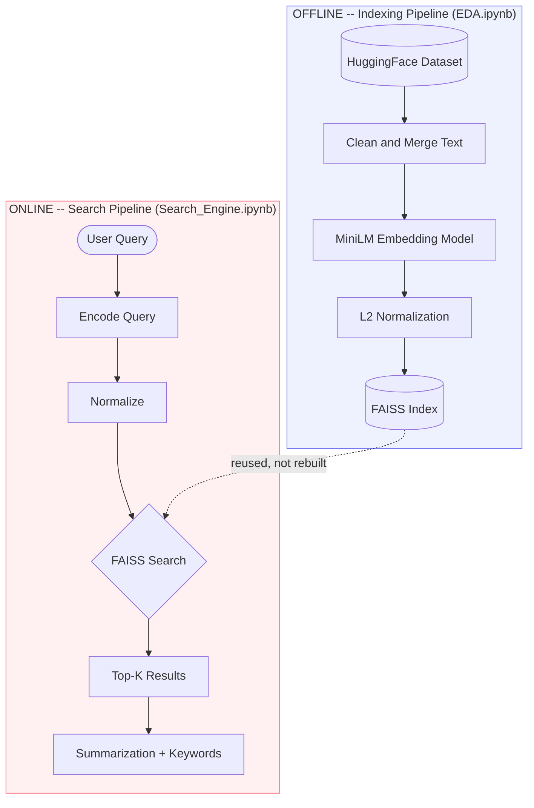
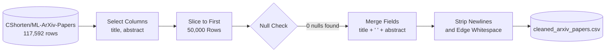
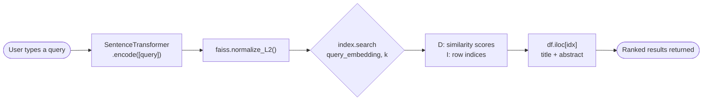
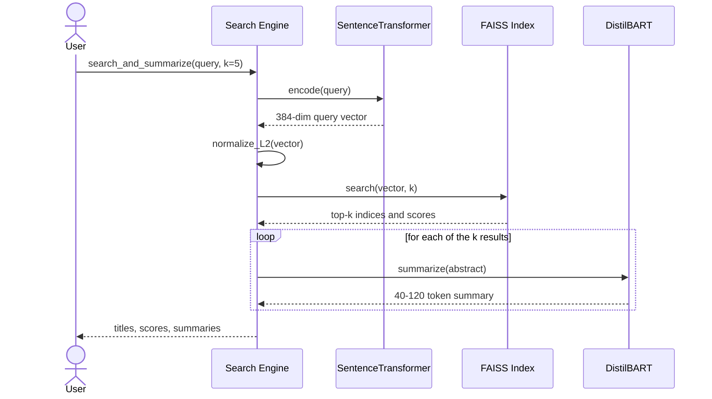
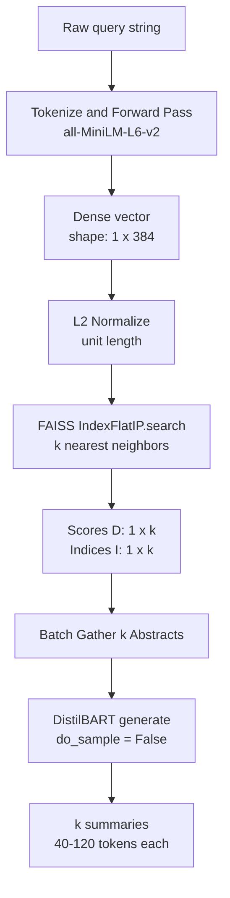
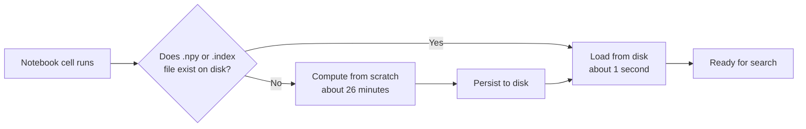

<div align="center">

# 🔎 ArXivVectorSearch

### Semantic Search Engine for Machine Learning Research Papers

*Dense vector retrieval over 50,000 arXiv papers — built on Sentence-Transformers, FAISS, and transformer-based summarization.*

[](https://www.python.org/)
[](https://www.sbert.net/)
[](https://github.com/facebookresearch/faiss)
[](https://huggingface.co/docs/transformers)
[](https://github.com/MaartenGr/KeyBERT)
[](#license)
[]()

**[Features](#key-features) · [Architecture](#system-architecture) · [Pipelines](#data-pipeline) · [Results](#sample-search-results) · [Installation](#installation) · [Usage](#usage)**

</div>

<br/>

## <a name="table-of-contents"></a>📚 Table of Contents

<table>
<tr>
<td valign="top" width="33%">

**Understanding the Project**
- [Overview](#overview)
- [Problem Statement](#problem-statement)
- [Motivation](#motivation)
- [Why Semantic Search Over Keyword Search](#why-semantic-search-over-keyword-search)
- [Key Features](#key-features)
- [Technology Stack](#technology-stack)
- [Engineering Decisions & Trade-offs](#engineering-decisions--trade-offs)

</td>
<td valign="top" width="33%">

**Architecture & Pipelines**
- [System Architecture](#system-architecture)
- [Data Pipeline](#data-pipeline)
- [Embedding Pipeline](#embedding-pipeline)
- [Vector Database & Retrieval](#vector-database--retrieval)
- [Search Pipeline](#search-pipeline)
- [Summarization Pipeline](#summarization-pipeline)
- [Keyword Extraction Pipeline](#keyword-extraction-pipeline)
- [End-to-End Workflow](#end-to-end-workflow)
- [Inference Flow](#inference-flow)
- [Caching Strategy](#caching-strategy)
- [Performance Optimizations](#performance-optimizations)

</td>
<td valign="top" width="33%">

**Reference & Getting Started**
- [Models Used](#models-used)
- [Folder Structure](#folder-structure)
- [Sample Search Results](#sample-search-results)
- [Screenshots & Demo](#screenshots--demo)
- [Installation](#installation)
- [Usage](#usage)
- [Known Limitations & Future Improvements](#known-limitations--future-improvements)
- [Learning Outcomes](#learning-outcomes)
- [Acknowledgments](#acknowledgments)
- [License](#license)

</td>
</tr>
</table>

<br/>

## <a name="overview"></a>🧭 Overview

**ArXivVectorSearch** is a semantic search engine that indexes ~50,000 machine learning papers from arXiv and retrieves results by *meaning*, not by shared keywords. A query like `"how do transformers handle long sequences"` can surface a paper titled `"Efficient Attention for Extended Context Windows"` even though the two strings share almost no vocabulary — because both are encoded into the same 384-dimensional vector space and compared by cosine similarity, not by token overlap.

The system is split into two deliberately separate stages, mirroring how real retrieval systems are structured:

| Stage | Notebook | Runs | Cost |
|---|---|---|---|
| **Offline indexing** | `EDA.ipynb` | Once, whenever the corpus or embedding model changes | ~26 minutes (embedding 50,000 documents) |
| **Online serving** | `Search_Engine.ipynb` | On every query | Milliseconds — reuses cached artifacts |

Everything below explains *why* each piece was built the way it was, not just what library calls were made.

<br/>

## <a name="problem-statement"></a>🎯 Problem Statement

arXiv's `cs.LG` category alone holds over 100,000 papers, with thousands more added every month. Finding relevant prior work is normally reduced to keyword search — a method that implicitly assumes a researcher already knows the exact terminology a paper's authors chose to use.

That assumption breaks down constantly in machine learning research specifically, where the same idea is routinely described in incompatible vocabularies across sub-fields: a paper on **"catastrophic forgetting in continual learning"** and a query for **"why neural networks forget old tasks when learning new ones"** describe the same phenomenon in almost entirely different words. A TF-IDF or BM25-style keyword index sees close to zero token overlap between them and ranks them as unrelated — not because the system is broken, but because keyword matching was never designed to reason about meaning in the first place.

This project addresses that specific failure mode: **retrieving papers by what they mean, not by which tokens they happen to share with the query.**

<br/>

## <a name="motivation"></a>💡 Motivation

Beyond producing a working search tool, this project was an exercise in building an information retrieval system the way production systems are actually structured — not as a single script that "runs a demo," but as a pipeline with a hard boundary between **expensive, infrequent work** (cleaning data, generating embeddings, building an index) and **cheap, frequent work** (serving a single query).

That boundary shapes almost every decision documented below: what gets cached and why, which model gets loaded once and reused across multiple downstream tasks, and where exact search was chosen over approximate search because the corpus size didn't yet justify the trade-off. None of these are default library behaviors — they're decisions made after weighing what a 50,000-document, single-machine deployment actually needs against what a much larger, distributed one would.

<br/>

## <a name="why-semantic-search-over-keyword-search"></a>🔍 Why Semantic Search Over Keyword Search

| Aspect | Keyword Search (TF-IDF / BM25) | Semantic Search (this project) |
|---|---|---|
| **Matching basis** | Exact token / lemma overlap | Cosine similarity between dense embedding vectors |
| **Synonym handling** | None — `"MRI"` ≠ `"magnetic resonance imaging"` unless both literally appear | Strong — semantically close phrasing scores highly with zero shared words |
| **Paraphrased queries** | Fragile — word order and phrasing changes break matches | Robust — captures meaning rather than surface form |
| **Ranking signal** | Term-frequency statistics | Learned semantic representation from a transformer encoder |
| **Concrete example** | Query `"medical image analysis"` only matches papers containing those literal words | Same query retrieves papers on **MRI**, **radiology**, and **cardiology imaging** with no literal word overlap (see [Sample Search Results](#sample-search-results)) |
| **Where it's weaker** | — | Can under-perform exact-match lookups: a specific model name, dataset acronym, or paper ID is sometimes retrieved *more* reliably by exact keyword match than by embedding similarity |

Semantic search isn't a strictly superior replacement for keyword search — it's a different failure mode trade-off. This project optimizes for the failure mode that matters most when searching research literature: **vocabulary mismatch**, not exact-term recall.

<br/>

## <a name="key-features"></a>✨ Key Features

| Feature | Description |
|---|---|
| 🔍 **Semantic search** | Natural-language queries matched against 50,000 ML papers by meaning, not keyword overlap |
| ⚡ **Cached vector index** | Embeddings and FAISS index persist to disk — sub-second startup on every run after the first |
| 📝 **Abstractive summarization** | Retrieved abstracts are condensed into short, model-generated summaries (DistilBART) |
| 🏷️ **Keyphrase extraction** | Multi-word technical phrases pulled from an abstract using the same embedding model that powers search |
| 🧩 **Reusable search API** | `search_paper()` and `search_and_summarize()` — parameterized functions, not copy-pasted notebook cells |
| 🏗️ **Offline / online separation** | Indexing (expensive, infrequent) is fully decoupled from serving (cheap, frequent) |

<br/>

## <a name="technology-stack"></a>🧰 Technology Stack

Every technology below was chosen for a specific reason relative to at least one realistic alternative — not because it's the default or the most popular option.

| Technology | Role | Why This, Not an Alternative |
|---|---|---|
| **Python 3.12** | Core language, isolated in a `venv` | Ecosystem maturity for ML tooling; no dependency conflicts with system Python |
| **🤗 Datasets** | Loads `CShorten/ML-ArXiv-Papers` from the Hub | Arrow-backed, memory-mapped loading — more efficient at ingest than downloading and hand-parsing a raw CSV |
| **pandas** | Cleaning, column selection, CSV persistence | Simpler `.iloc`-based indexing and CSV I/O than staying in raw Arrow tables at this scale (~50K rows) |
| **Sentence-Transformers** (`all-MiniLM-L6-v2`) | Text → 384-dim dense vector | A 6-layer *distilled* model — a fraction of the size/latency of `all-mpnet-base-v2`, with a modest, well-documented quality gap. The right point on the speed/quality curve for a CPU-friendly, 50K-document project |
| **FAISS** (`IndexFlatIP`) | Vector storage + nearest-neighbor search | Purpose-built for vector similarity at a speed no hand-rolled NumPy/sklearn loop matches; `Flat` returns **exact**, not approximate, results — appropriate before the corpus grows past the low millions |
| **scikit-learn** | Validates the similarity math during development | Used to sanity-check FAISS's normalize-then-inner-product trick against a known-correct reference implementation *before* trusting it at scale |
| **🤗 Transformers** (DistilBART) | Abstractive summarization | Distilled variant (~300MB) instead of full `bart-large-cnn` (~1.6GB) — far lighter footprint, acceptable quality trade-off for summarizing already-short abstracts |
| **KeyBERT** | Keyphrase extraction | Embedding-based extraction (reusing the MiniLM backbone) instead of statistical methods like RAKE/YAKE — keyword relevance is judged in the *same semantic space* as search itself |
| **NumPy** | Embedding storage (`.npy`) | Native binary array format — faster to read/write than CSV/JSON, and preserves exact shape and dtype |

<br/>

## <a name="engineering-decisions--trade-offs"></a>⚙️ Engineering Decisions & Trade-offs

### Data & Embedding Decisions

| Problem | Solution | Benefit |
|---|---|---|
| Re-embedding 50,000 papers on every notebook restart costs ~26 minutes | Cache embeddings to `arxiv_embeddings.npy`; check `os.path.exists()` before recomputing | Cold-start time drops from ~26 minutes to under a second |
| Embedding 50,000 texts in one pass risks memory spikes | Encode in batches of 32 via `model.encode(..., batch_size=32)` | Bounded, predictable memory usage regardless of corpus size |
| Two separate vectors (title, abstract) double compute and storage | Concatenate `title + " " + abstract` into one `paper_text` field before embedding | One 384-dim vector captures both the keyword-dense title and the detailed abstract |
| A 26-minute job might fail silently on a subtle bug (wrong shape, bad tokenization) | Validate on 1 sample → 5 samples → `sklearn.cosine_similarity` sanity check, *before* running the full batch | Bugs are caught in seconds, not after a 26-minute job completes |

### Serving & Post-Processing Decisions

| Problem | Solution | Benefit |
|---|---|---|
| Rebuilding a FAISS index from scratch every run is wasted, deterministic work | Persist the index to `paper_faiss.index`, load-if-exists instead of always rebuilding | Search is available almost instantly on every notebook run |
| Brute-force cosine similarity in a Python loop doesn't scale | L2-normalize embeddings, use FAISS `IndexFlatIP` (inner product) | Exact nearest-neighbor search over 50,000 × 384 vectors in milliseconds |
| Full `bart-large-cnn` (~1.6GB) is heavy to load and run for repeated interactive queries | Use DistilBART (`sshleifer/distilbart-cnn-12-6`, ~300MB) | ~5× smaller footprint with a small, well-documented quality trade-off |
| Loading a second embedding model just for keyword extraction wastes memory and load time | Pass the already-loaded MiniLM instance into `KeyBERT(model=model)` | One model in memory serves both search and keyword extraction |

<br/>

## <a name="system-architecture"></a>🏗️ System Architecture

The system has exactly two phases, and the entire design revolves around never letting the expensive one run more often than necessary.



The **offline** phase runs once, whenever the corpus or embedding model changes, and produces three artifacts on disk: a cleaned CSV, an embedding matrix, and a FAISS index. The **online** phase never touches raw data or recomputes embeddings for the corpus — it only ever embeds *one query at a time* and searches an already-built index. This is the same reason production search engines separate crawling/indexing from query serving: the two have completely different cost profiles, and conflating them means paying indexing costs on every single request.

<br/>

## <a name="data-pipeline"></a>🧹 Data Pipeline

The corpus originates from [`CShorten/ML-ArXiv-Papers`](https://huggingface.co/datasets/CShorten/ML-ArXiv-Papers) on the Hugging Face Hub — itself filtered down from the full Cornell arXiv metadata dump (~2 million papers) to just the `cs.LG`-tagged subset. Loading it returns **117,592 rows** with two leftover index columns (`Unnamed: 0`, `Unnamed: 0.1`) baked into the upstream CSV export, alongside `title` and `abstract`.



### Data Cleaning Pipeline — Step by Step

| Step | Operation | Why |
|---|---|---|
| **Column selection** | Keep only `title`, `abstract`; drop `Unnamed: 0`, `Unnamed: 0.1` | Those two columns are leftover pandas index artifacts from the upstream export, not real data |
| **Row selection** | `df.head(50000)` | Bounds embedding cost to a fixed, known corpus size *(see [Known Limitations](#known-limitations--future-improvements) — this is a deterministic slice, not a random sample)* |
| **Null check** | `df.isnull().sum()` | Confirms `title` / `abstract` have zero missing values before any string operation runs on them |
| **Field merge** | `paper_text = title + " " + abstract` | One embedding captures both the keyword-dense title and the detailed abstract, instead of two separate vectors |
| **Whitespace normalization** | `.str.replace("\n", " ", regex=False)` → `.str.strip()` | Removes newline artifacts and trims leading/trailing whitespace; uses a literal (non-regex) replace for speed across 50,000 rows |
| **Persistence** | Save to `cleaned_arxiv_papers.csv` | Cleaning 50,000 rows is cheap, but there's no reason to repeat even a cheap step on every run |

> **Note on scope:** the cleaning pass normalizes whitespace but does not currently run a dedicated HTML/LaTeX-artifact stripper. See [Known Limitations](#known-limitations--future-improvements).

<br/>

## <a name="embedding-pipeline"></a>🧠 Embedding Pipeline

| Aspect | Detail |
|---|---|
| **Model** | `sentence-transformers/all-MiniLM-L6-v2` |
| **Output dimensionality** | 384 |
| **Batch size** | 32 |
| **Full-corpus run time** | ~26 minutes (one-time, then cached) |
| **Persistence** | `arxiv_embeddings.npy`, loaded directly on every subsequent run |
| **Why MiniLM** | 6-layer distilled model — a fraction of the size/latency of larger sentence-transformer models, appropriate for a 50K-document, CPU-friendly project |

Before committing to the full 26-minute run, the embedding step was validated progressively rather than trusted blindly:

1. Encode **1 sample** → confirm output shape is `(384,)`
2. Encode **5 samples** → confirm output shape is `(5, 384)`
3. Manually compute pairwise similarity on those 5 with `sklearn.metrics.pairwise.cosine_similarity` → confirm self-similarity ≈ `1.0` and cross-paper similarity falls in a believable `0.15–0.37` range
4. Only then run `model.encode()` across all 50,000 rows

This matters because a shape or tokenization bug discovered *after* a 26-minute batch job is a far more expensive mistake than one caught in the first few seconds of a 5-row test.

<br/>

## <a name="vector-database--retrieval"></a>🗂️ Vector Database & Retrieval

FAISS's `IndexFlatIP` computes the **inner product** between vectors — not cosine similarity directly. The two become mathematically identical once every vector is scaled to unit length: for unit vectors **a** and **b**,

```
a · b = |a| |b| cos(θ) = cos(θ)      (since |a| = |b| = 1)
```

So calling `faiss.normalize_L2()` on both the corpus embeddings *and* every incoming query embedding — before indexing and before searching — is what makes `IndexFlatIP`'s raw output directly interpretable as a cosine similarity score in `[-1, 1]`. Skip that step, and the same index instead measures raw dot-product magnitude, which conflates vector *length* with semantic *similarity* — two vectors could score highly just because they're both long, regardless of the angle between them.

| Index Type | Search Cost | Result Accuracy | Used Here? |
|---|---|---|---|
| `IndexFlatIP` (brute-force) | O(n) per query | Exact | ✅ Yes — appropriate at 50,000 vectors |
| `IndexIVFFlat` (inverted file) | Sub-linear, approximate | Approximate, tunable via `nprobe` | Natural upgrade path once the corpus reaches the low millions |
| `IndexHNSWFlat` (graph-based) | Sub-linear, approximate | Approximate, typically very high recall | Alternative upgrade path — better recall/speed trade-off than IVF at some scales, at the cost of higher memory use |

At 50,000 vectors, an exact brute-force search over 384-dimensional float32 vectors still completes in milliseconds — there's no accuracy to trade away yet in exchange for speed. `IndexFlatIP` is the correct choice *for this corpus size*, not a default picked without considering the alternatives.

<br/>

## <a name="search-pipeline"></a>🔎 Search Pipeline



The query path deliberately mirrors the indexing path step-for-step — the same model, the same normalization call — because any asymmetry between how the corpus and the query are encoded would silently corrupt every similarity score. Wrapped as a reusable function:

```python
def search_paper(query, k=5):
    query_embedding = model.encode([query])
    faiss.normalize_L2(query_embedding)
    D, I = index.search(query_embedding, k)

    for score, idx in zip(D[0], I[0]):
        print("Similarity score:", score)
        print("Title:", df.iloc[idx]["title"])
        print("Abstract:", df.iloc[idx]["abstract"][:500])
        print("-" * 80)
```

`model.encode([query])` — wrapping the string in a list — is what makes Sentence-Transformers return a `(1, 384)` array instead of a bare `(384,)` vector, which is the shape FAISS's `index.search()` expects. `D` and `I` come back as parallel `(1, k)` arrays: `D` holds the cosine similarity scores, `I` holds the row positions to look up in `df`.

<br/>

## <a name="summarization-pipeline"></a>📝 Summarization Pipeline

Each retrieved abstract can be condensed into a short, model-generated summary rather than requiring the user to read the full text.

| Parameter | Value | Purpose |
|---|---|---|
| Model | `sshleifer/distilbart-cnn-12-6` | Distilled BART fine-tuned for summarization (~300MB vs. ~1.6GB for full `bart-large-cnn`) |
| `device` | `0` (GPU) | Summarization is the heaviest remaining inference step; explicitly placed on GPU |
| `max_length` | `120` | Upper bound on generated summary length |
| `min_length` | `40` | Lower bound, avoiding one-sentence non-answers |
| `do_sample` | `False` | Deterministic (beam/greedy) decoding — appropriate for factual text, where reproducibility matters more than creative variation |

```python
summarizer = pipeline("summarization", model="sshleifer/distilbart-cnn-12-6", device=0)

def search_and_summarize(query, k=5):
    query_embedding = model.encode([query])
    faiss.normalize_L2(query_embedding)
    D, I = index.search(query_embedding, k)

    for score, idx in zip(D[0], I[0]):
        print("Similarity score:", score)
        print("Title:", df.iloc[idx]["title"])
        summary = summarizer(df.iloc[idx]["abstract"], max_length=120, min_length=40, do_sample=False)
        print("AI SUMMARY:", summary[0]["summary_text"])
        print("-" * 80)
```

Choosing the distilled variant over full BART was a deliberate size/latency trade-off, not a default: **~300MB vs. ~1.6GB** for summarizing text that's already short (a paper abstract, not a full document) — a case where the smaller model's quality gap matters far less than it would summarizing long-form text.

<br/>

## <a name="keyword-extraction-pipeline"></a>🏷️ Keyword Extraction Pipeline

Keyword extraction reuses the **same loaded MiniLM instance** that powers search, rather than letting KeyBERT default to loading its own backbone model:

```python
kw_model = KeyBERT(model=model)  # same SentenceTransformer used for search — one model, two jobs
```

This started as single-word extraction, which fragmented multi-word technical terms:

```python
kw_model.extract_keywords(text)
# [('mri', 0.4733), ('neural', 0.3921), ('imaging', 0.3825), ('deep', 0.3559), ('networks', 0.2893)]
```

`"deep"` and `"networks"` scored as unrelated single tokens instead of the phrase `"deep neural networks"` — diagnosed and fixed by extending the candidate phrase length:

```python
kw_model.extract_keywords(text, keyphrase_ngram_range=(1, 3), stop_words=None)
# [('learning in mri', 0.5728), ('how deep learning', 0.5452), ('deep neural', 0.5435),
#  ('deep learning', 0.5202), ('on deep learning', 0.5181)]
```

`"deep learning"` and `"deep neural"` now survive intact as phrases. The current trade-off: with `stop_words=None`, prepositions can also leak into results (`"how deep learning"`, `"on deep learning"`) — see [Known Limitations](#known-limitations--future-improvements) for the fix.

> **Current scope:** keyword extraction is a proven, standalone capability — it is *not yet wired into* `search_paper()` or `search_and_summarize()` as an automatic per-result step.

<br/>

## <a name="end-to-end-workflow"></a>🔄 End-to-End Workflow



A single call to `search_and_summarize()` triggers one query embedding, one FAISS search, and — in the current implementation — one summarization call *per* retrieved result. That last detail is intentional to surface here: it's the exact behavior addressed in [Performance Optimizations](#performance-optimizations) and [Known Limitations](#known-limitations--future-improvements) below.

<br/>

## <a name="inference-flow"></a>⚡ Inference Flow

Zooming into the online phase specifically — every step here is a **frozen-weight forward pass**. Nothing in this flow trains or fine-tunes a model; it's pure inference, which is why it can run in milliseconds instead of minutes.



Every shape in this diagram is exact, not illustrative: a query always produces a `(1, 384)` vector, `IndexFlatIP.search` always returns `(1, k)` score and index arrays, and each summary is bounded to 40–120 tokens by construction, not by chance.

<br/>

## <a name="caching-strategy"></a>💾 Caching Strategy

Every expensive artifact follows the same rule: **check disk before recomputing.**



| Artifact | Cache File | Regenerated When |
|---|---|---|
| Cleaned corpus | `cleaned_arxiv_papers.csv` | Source dataset or cleaning logic changes |
| Embedding matrix | `arxiv_embeddings.npy` | Corpus or embedding model changes |
| FAISS index | `paper_faiss.index` | Embeddings change |

The pattern is identical for both the embeddings and the index: `os.path.exists(path)` gates a cheap load against an expensive rebuild. This is the single highest-leverage optimization in the project — it's the difference between a ~26-minute cold start and a ~1-second one, on every run after the first.

<br/>

## <a name="performance-optimizations"></a>🚀 Performance Optimizations

| Optimization | Where | Measured / Expected Impact |
|---|---|---|
| Batched embedding (`batch_size=32`) | Corpus encoding | Bounded, predictable memory use across all 50,000 texts |
| Disk-cached embeddings | `arxiv_embeddings.npy` | ~26 minutes → ~1 second on every run after the first |
| Disk-cached FAISS index | `paper_faiss.index` | Index build skipped entirely after the first run |
| Exact inner-product search on normalized vectors | FAISS `IndexFlatIP` | Millisecond search latency across 50,000 × 384 vectors, no hand-written similarity loop |
| Distilled models (MiniLM, DistilBART) | Embedding + summarization | Smaller memory footprint and faster inference than non-distilled counterparts |
| Shared model instance for search + keyword extraction | `KeyBERT(model=model)` | One model load instead of two |
| Arrow-backed dataset loading | `datasets.load_dataset()` | Memory-mapped ingest of the raw 117,592-row dataset before it's narrowed to the working 50,000-row set |

<br/>

## <a name="models-used"></a>🤖 Models Used

| Model | Provider | Purpose | Size | Key Parameters |
|---|---|---|---|---|
| `all-MiniLM-L6-v2` | Sentence-Transformers | Text embedding for search **and** the KeyBERT backbone | ~80MB · 384-dim output | `batch_size=32` |
| `sshleifer/distilbart-cnn-12-6` | Hugging Face | Abstractive summarization | ~300MB | `max_length=120`, `min_length=40`, `do_sample=False`, `device=0` |
| KeyBERT (wraps MiniLM) | KeyBERT | Keyphrase extraction | No separate weights — shares MiniLM | `keyphrase_ngram_range=(1, 3)` |

<br/>

## <a name="folder-structure"></a>📁 Folder Structure

```
ArXivVectorSearch/
├── data/
│   ├── cleaned_arxiv_papers.csv     # Cleaned title + abstract text, generated by EDA.ipynb
│   ├── arxiv_embeddings.npy         # Cached 50,000 x 384 embedding matrix
│   └── paper_faiss.index            # Persisted FAISS IndexFlatIP
│
├── notebooks/
│   ├── EDA.ipynb                    # Offline: load, clean, embed, cache
│   └── Search_Engine.ipynb          # Online: load cache, search, summarize, extract keywords
│
├── assets/                          # Screenshots / GIFs referenced in this README
│
├── requirements.txt
└── README.md
```

<br/>

## <a name="sample-search-results"></a>🧪 Sample Search Results

Query: **`"deep learning for medical image analysis"`**

| Rank | Similarity Score | Paper Title |
|---|---|---|
| 1 | `0.7254` | An overview of deep learning in medical imaging focusing on MRI |
| 2 | `0.7171` | Medical Imaging with Deep Learning: MIDL 2019 |
| 3 | `0.7123` | Deep learning in radiology: an overview of the concepts and a survey of the state of the art |
| 4 | `0.6807` | A Perspective on Deep Imaging |
| 5 | `0.6799` | Deep Learning in Cardiology |

Not one of these titles contains the literal phrase `"medical image analysis"` — the closest textual overlap is a shared subject-matter vocabulary (*MRI, radiology, imaging, cardiology*), which is exactly the semantic behavior the system is built to produce. A pure keyword index searching for that exact phrase would return few or none of these.


*Top-5 semantic search results for the query above, as rendered from the notebook.*

<br/>

## <a name="screenshots--demo"></a>🖼️ Screenshots & Demo

> Screenshots and a walkthrough GIF go here once captured from a live run.


*Abstractive summary generated for a retrieved paper's abstract.*


*Keyphrases extracted from a paper's abstract using KeyBERT, before/after the n-gram fix.*


*Full walkthrough: query → semantic search → summarization → keyword extraction.*

<br/>

## <a name="installation"></a>⬇️ Installation

**Requirements:** Python 3.12, a working `pip`, and (optionally) a CUDA-capable GPU — the summarizer runs faster on one but does not strictly require it if `device` is adjusted to CPU.

```bash
# 1. Clone the repository
git clone https://github.com/<your-username>/ArXivVectorSearch.git
cd ArXivVectorSearch

# 2. Create and activate a virtual environment
python -m venv venv
venv\Scripts\activate        # Windows
source venv/bin/activate     # macOS / Linux

# 3. Install dependencies
pip install -r requirements.txt
```

`requirements.txt`:

```
pandas
numpy
datasets
sentence-transformers
faiss-cpu
transformers
keybert
scikit-learn
torch
jupyterlab
```

> `faiss-cpu` is intentional, not an oversight — nothing in this project's FAISS usage requires `faiss-gpu`; `IndexFlatIP` runs on CPU, and only the DistilBART summarizer is explicitly placed on GPU.

<br/>

## <a name="usage"></a>▶️ Usage

**1. Build the index (run once, or whenever the corpus changes):**

```bash
jupyter lab notebooks/EDA.ipynb
# Run all cells top to bottom. Produces:
#   data/cleaned_arxiv_papers.csv
#   data/arxiv_embeddings.npy
```

**2. Search (every subsequent run reuses the cached artifacts):**

```python
# Inside Search_Engine.ipynb

search_paper("transfer learning for low-resource languages", k=5)

search_and_summarize("deep learning for medical image analysis", k=5)

kw_model.extract_keywords(
    df.iloc[26063]["abstract"],
    keyphrase_ngram_range=(1, 3),
    stop_words=None,
    top_n=5,
)
```

<br/>

## <a name="known-limitations--future-improvements"></a>🚧 Known Limitations & Future Improvements

Documented honestly rather than glossed over — these are the gaps a careful reviewer would find, along with the concrete fix planned for each.

| Limitation | Why It Exists Today | Planned Improvement |
|---|---|---|
| **Sequential summarization** | `search_and_summarize()` calls the summarizer once per top-k result inside a loop; Hugging Face's own pipeline warns about this exact pattern on GPU | Batch all k abstracts into a single `summarizer(list_of_texts, batch_size=k)` call |
| **Fixed summary length** | `max_length=120` is a constant, so abstracts shorter than ~120 tokens trigger a length-mismatch warning on every run | Derive `max_length` / `min_length` from each batch's actual token count |
| **Keyphrase preposition leakage** | `stop_words=None` (needed at the time to stop n-grams from fragmenting) also lets phrases like `"on deep learning"` through | Restore `stop_words='english'` — verified to keep `"deep learning"` intact while dropping leading prepositions — optionally combined with `use_mmr=True` for result diversity |
| **Deterministic 50K sampling** | `df.head(50000)` takes the first 50,000 rows in dataset order, not a random subset, from a source likely close to arXiv's chronological ID order | Switch to `df.sample(n=50000, random_state=42)` for a reproducible random subsample |
| **Keyword extraction not integrated** | KeyBERT is a proven, standalone capability, tested on one example paper — it isn't called automatically inside `search_paper()` or `search_and_summarize()` | Add a combined `search_summarize_and_extract_keywords()` entry point |
| **Implicit device handling for embeddings** | The summarizer explicitly sets `device=0`; `SentenceTransformer` relies on auto-detection, which is inconsistent and can crash on GPU-less machines | Resolve device once (`torch.cuda.is_available()`) and pass it explicitly to both models |
| **Exact search only** | `IndexFlatIP` is O(n) per query — the right choice at 50,000 vectors, not at 50 million | Migrate to `IndexIVFFlat` or `IndexHNSWFlat` if the corpus grows past the low millions |
| **No HTML/LaTeX artifact stripping** | Cleaning currently normalizes whitespace but doesn't run a dedicated markup-stripping pass | Add explicit HTML/LaTeX artifact removal for abstracts that retain source markup |

<br/>

## <a name="learning-outcomes"></a>🎓 Learning Outcomes

- Implemented and explained the mathematical identity behind FAISS's cosine-similarity trick (`L2-normalize` + inner product), rather than treating the library as a black box.
- Learned the practical memory/latency trade-offs of model distillation firsthand — MiniLM vs. larger sentence-transformer models, DistilBART vs. full BART — by explicitly choosing the smaller model each time and stating why.
- Designed a two-phase system (offline indexing / online serving) instead of a single linear script, and applied a consistent build-once-cache-forever pattern across two independent artifacts (embeddings, FAISS index).
- Debugged a real KeyBERT output problem (single-word fragmentation) by diagnosing the cause and fixing it with `keyphrase_ngram_range`, rather than accepting the default output.
- Learned to read library-level runtime warnings as real signals rather than noise — both the Hugging Face "sequential pipeline" warning and the `max_length` vs. input-length warning point directly at concrete, fixable inefficiencies.
- Practiced de-risking expensive computation: validating on 1 sample, then 5, then a manual similarity sanity check, *before* committing to a 26-minute full-corpus run.

<br/>

## <a name="acknowledgments"></a>🙏 Acknowledgments

- [`CShorten/ML-ArXiv-Papers`](https://huggingface.co/datasets/CShorten/ML-ArXiv-Papers) — the source dataset, filtered from the Cornell arXiv metadata dump
- [Sentence-Transformers](https://www.sbert.net/) — `all-MiniLM-L6-v2`
- [FAISS](https://github.com/facebookresearch/faiss) — Facebook AI Similarity Search
- [Hugging Face Transformers](https://huggingface.co/docs/transformers) — `sshleifer/distilbart-cnn-12-6`
- [KeyBERT](https://github.com/MaartenGr/KeyBERT) — embedding-based keyphrase extraction

<br/>

## <a name="license"></a>📄 License

Licensed under the [MIT License](LICENSE).

<div align="center">

<sub>Built as a hands-on exploration of dense retrieval, vector search, and transformer-based NLP — end to end, from raw data to a queryable system.</sub>

</div>
