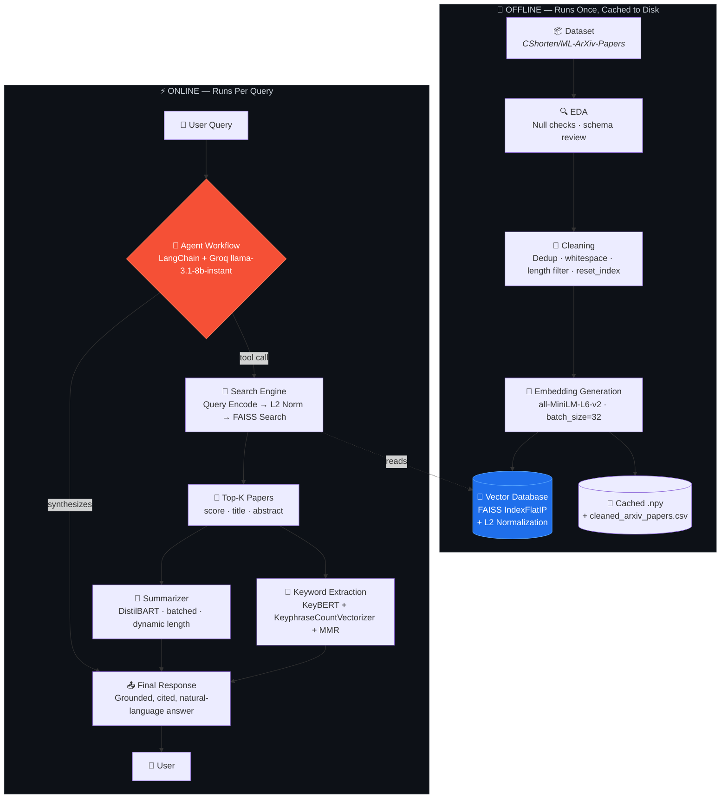
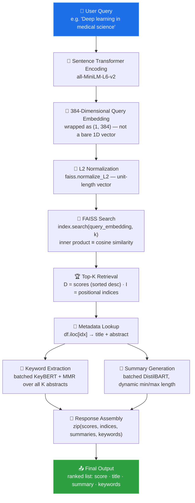
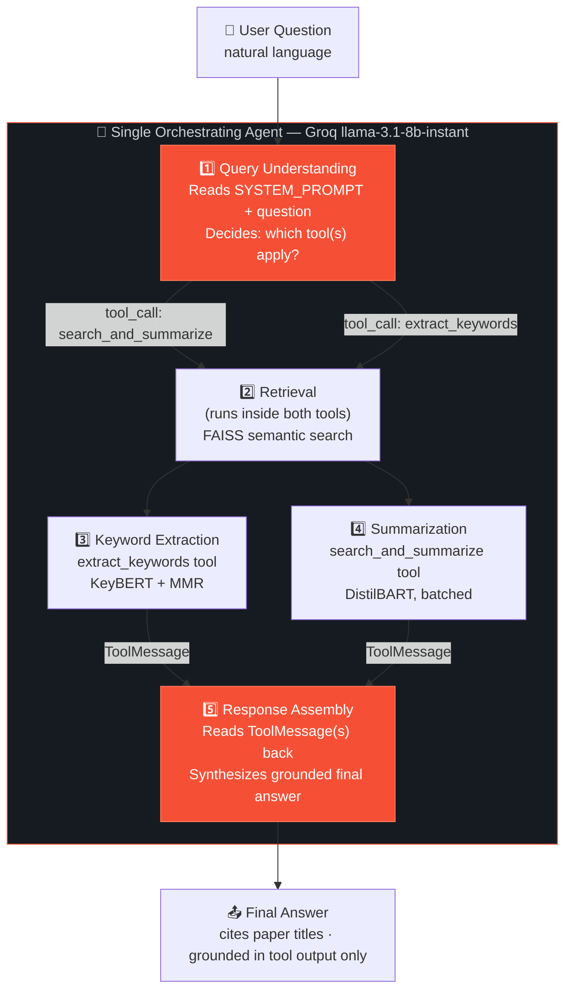
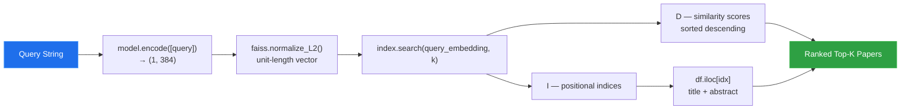
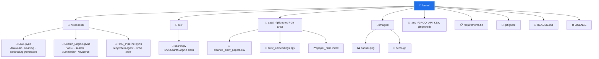

<div align="center">


# 🚀 Fanite

### AI-Powered Semantic Research Assistant

**Search Research Papers by *Meaning*, Not Keywords.**

*A production-style semantic search engine that retrieves, summarizes, and explains Machine Learning research papers using dense embeddings, FAISS vector search, and an LLM tool-calling agent.*

<br/>


<br/>

**[Features](#-features) · [Architecture](#-system-architecture) · [How It Works](#-complete-ai-workflow) · [Engineering Decisions](#-engineering-decisions) · [Challenges](#-engineering-challenges) · [Performance](#-performance-metrics) · [Getting Started](#-installation)**

</div>

<br/>

> **🎥 Demo**
>
> *`images/demo.gif` — replace this placeholder with a screen recording of an end-to-end query (type a question → watch retrieval → summary → keywords → agent answer appear).*
>
> 

<br/>

---

## 📚 Table of Contents

<details>
<summary>Click to expand</summary>

1. [Overview](#-overview)
2. [Motivation](#-motivation)
3. [Features](#-features)
4. [System Architecture](#-system-architecture)
5. [Complete AI Workflow](#-complete-ai-workflow)
6. [AI Agent Workflow](#-ai-agent-workflow)
7. [Prompt Engineering](#-prompt-engineering)
8. [Tools & Tech Stack](#-tools--tech-stack)
9. [Engineering Decisions](#-engineering-decisions)
10. [Data Pipeline](#-data-pipeline)
11. [Search Pipeline](#-search-pipeline)
12. [Keyword Extraction Pipeline](#-keyword-extraction-pipeline)
13. [Summarization Pipeline](#-summarization-pipeline)
14. [Performance Optimizations](#-performance-optimizations)
15. [Engineering Challenges](#-engineering-challenges)
16. [Performance Metrics](#-performance-metrics)
17. [Future Improvements / Roadmap](#-future-improvements--roadmap)
18. [Folder Structure](#-folder-structure)
19. [Screenshots](#-screenshots)
20. [Installation](#-installation)
21. [Running the Project](#-running-the-project)
22. [Results](#-results)
23. [Lessons Learned](#-lessons-learned)
24. [Credits](#-credits)
25. [License](#-license)

</details>

---

## 📖 Overview

Finding relevant research is getting harder, not easier, as the volume of ML literature explodes. Traditional search — whether it's `Ctrl+F`, SQL `LIKE`, or classic inverted-index engines — relies on **keyword matching**. That breaks the moment a user's wording differs from the author's.

```text
User query:      "AI for detecting cancer from scans"
Paper title:      "Deep Learning for Medical Image Analysis"
Keyword search:   ❌ No overlapping keywords → paper is missed
Fanite:           ✅ Nearly identical *meaning* → paper is ranked #1
```

**Fanite solves this with semantic search.** Instead of matching words, it matches *meaning*. Every paper in a 50,000-document ArXiv corpus is converted into a dense 384-dimensional vector using a Transformer-based sentence encoder. A user's query is embedded into the same vector space, and the papers whose vectors point in the closest *direction* — regardless of vocabulary overlap — are returned.

On top of retrieval, Fanite layers **AI enrichment**: every result is automatically summarized (DistilBART), tagged with clean topical keyphrases (KeyBERT + MMR), and the whole system is wrapped behind a **tool-calling LLM agent** (LangChain + Groq) that reads a natural-language question, decides what the user actually needs, and answers in plain English — grounded strictly in what was actually retrieved, with no invented citations.


---

## 💡 Motivation

### The problem with keyword search

Classic lexical search — TF-IDF, BM25, SQL `LIKE`, even a well-tuned Elasticsearch index — scores documents by **literal token overlap**. That works fine when the searcher already knows the exact vocabulary an author used. It fails constantly in research search, because the same idea gets described in wildly different vocabularies across papers:

- *"deep learning for medical image analysis"*
- *"CNN-based MRI diagnosis"*
- *"neural approaches to radiological image segmentation"*

Three papers, one underlying topic, almost zero shared keywords. A keyword engine tuned for one phrasing silently drops the other two — and the searcher never even knows what they missed. This is the central failure mode Fanite is built to eliminate.

### Why embeddings, not keywords

A sentence-transformer model compresses arbitrary-length text into a fixed-size dense vector — for Fanite, 384 numbers — positioned in a continuous **semantic space**. Two pieces of text end up close together in that space if they mean similar things, independent of which exact words they use. Cosine similarity between two such vectors is a direct, computable proxy for *"are these about the same thing?"* — which is precisely the question a research search engine needs to answer, and precisely the question keyword matching cannot.

### Why ArXiv / research papers specifically

Academic abstracts are long-form, jargon-dense, and highly variable in length and phrasing — a genuinely hard, realistic text corpus, not a toy dataset. They're also freely available at scale via Hugging Face's `datasets` ecosystem, and "finding related work fast" is a real, everyday pain point for anyone doing ML research, coursework, or literature review. It's a problem worth solving and a corpus hard enough to prove the approach actually works.

### Why an AI agent on top of retrieval

A raw vector search only returns row indices and similarity scores — it doesn't summarize, doesn't extract themes, and has no way to know *what the user actually wants* from a given question. Does *"what's this paper about?"* want a summary? Does *"what themes come up in medical imaging papers?"* want keyphrases? Fanite answers this by putting a **reasoning LLM in front of the retrieval system** — an agent that reads the question, decides which specialized capability (or capabilities) it calls for, invokes them, and turns raw retrieval output into a single, coherent, cited answer. That's the difference between a search backend and a research assistant.

### Why this project exists

Fanite exists to demonstrate — end-to-end, with the debugging scars to prove it — what it actually takes to ship a retrieval-augmented NLP system: embedding-based retrieval done correctly (not just "call a library"), transformer-based summarization and keyphrase extraction tuned for real quality, an agentic orchestration layer that grounds itself in real data instead of hallucinating, and the unglamorous production engineering (device management, batching, caching, reproducibility, version control hygiene) that separates a notebook demo from a system someone could actually rely on.


---

## ✨ Features

### 🧠 Semantic Search
Searches papers by **meaning**, not string overlap. Every paper's title + abstract is embedded with `all-MiniLM-L6-v2` into a 384-dimensional vector; queries are embedded into the same space so retrieval is a pure geometric nearest-neighbor problem, not a text-matching one.

### ⚡ High-Speed Vector Retrieval
All 50,000+ paper embeddings live in a **FAISS `IndexFlatIP`** index. Combined with L2-normalization, this gives exact cosine-similarity search that runs in single-digit milliseconds — even brute-force, exact search over the full corpus is not the bottleneck in this system (see [Performance Metrics](#-performance-metrics)).

### 🤖 AI-Powered Summarization
Every retrieved paper is automatically condensed with **DistilBART** (`sshleifer/distilbart-cnn-12-6`) so a user can understand a paper's contribution without reading the full abstract. Summarization runs **batched**, not per-paper, and its length bounds are computed **dynamically** per query so the model is never asked for a summary longer than the source abstract.

### 🔑 Intelligent Keyphrase Extraction
**KeyBERT**, backed by the same MiniLM model used for retrieval, extracts the most representative topical phrases per paper — using **`KeyphraseCountVectorizer`** for grammatically valid candidate generation (POS-pattern-based, not raw n-grams) and **Maximal Marginal Relevance (MMR)** to keep the final keyword list diverse instead of ten near-duplicate variants of the same phrase.

### 🤝 Agentic Tool-Calling Assistant
A **LangChain agent**, reasoned over by a hosted **Groq `llama-3.1-8b-instant`** model, sits in front of the retrieval/summarization/keyword tools. It reads a natural-language question, autonomously decides which tool(s) the question actually calls for, executes them, and synthesizes a final answer that is explicitly instructed to **ground itself in tool output and never invent citations**. This turns Fanite from a static pipeline into an interactive assistant that adapts to how the question is phrased.

### 🚀 Production-Oriented Optimizations
- Embeddings cached to disk as `.npy` — the multi-tens-of-minutes encoding pass runs once, ever.
- FAISS index persisted and reloaded rather than rebuilt on every run.
- Cleaned dataset stored separately from raw data to avoid repeated preprocessing.
- Batched Transformer inference for both summarization and keyword extraction — one GPU round-trip per query, not one per paper.
- L2 normalization for mathematically exact cosine-similarity search on an index type that has no native cosine metric.
- A clean separation between offline (index-building) and online (per-query) pipelines.
- Memory-efficient `float32` embeddings and single-agent-plus-tools orchestration rather than an over-engineered multi-agent swarm.


---

## 🏗️ System Architecture

Fanite is built as an **offline indexing pipeline** feeding an **online query pipeline**, with an agentic reasoning layer sitting on top of the online side.



**Why the offline/online split matters:** the expensive part of this system — encoding ~50,000 documents — is a one-time cost, cached to disk (`.npy` embeddings, a persisted FAISS index) and never repeated. Every *online* query only pays for query encoding, a FAISS lookup, and the two enrichment models — which is why per-query latency stays under a second even without GPU-accelerated vector search (see [Performance Metrics](#-performance-metrics)).

**Why one agent, not a diagram full of boxes:** notice the architecture doesn't spray the LLM across five different "agent" services. One orchestrating agent decides *what* to do; two narrow, purpose-built tools (search-and-summarize, extract-keywords) do the actual work. This is a deliberate decision, not a simplification for the diagram — see [Engineering Decisions §9.14](#-engineering-decisions) for the reasoning, and why an earlier design that blurred this line was explicitly reverted.


---

## 🔄 Complete AI Workflow

Everything that happens between a user hitting "search" and a final answer appearing — no step skipped.



| Stage | What actually happens | Why it matters |
|---|---|---|
| **1. User Query** | Raw text, e.g. *"Deep learning in medical science"* | The entry point — no query preprocessing beyond what the encoder does internally. |
| **2. MiniLM Encoding** | `query_embedding = model.encode([query])` — the query is wrapped in a **list**, not passed as a bare string. | Sentence-transformers flattens a single string to a 1D `(384,)` array; both FAISS's `.search()` and cosine-similarity utilities require 2D "batch" input. Feeding a one-element list sidesteps the issue entirely rather than reshaping later. |
| **3. 384-D Embedding** | Output is a `(1, 384)` `float32` array — the query now lives in the exact same vector space as every indexed paper. | Query and documents **must** share an embedding space for similarity comparison to mean anything; this is why the same model instance is reused everywhere (including inside KeyBERT). |
| **4. L2 Normalization** | `faiss.normalize_L2(query_embedding)` scales the vector to unit length, **in place**, mirroring the normalization already applied to every stored paper vector at index-build time. | FAISS has no native cosine-similarity index. Normalizing to unit length turns FAISS's fast native inner-product operation into an exact cosine-similarity computation — this is the mathematical trick the whole retrieval layer depends on. |
| **5. FAISS Search** | `D, I = index.search(query_embedding, k)` — brute-force, exact inner-product search over the flat index. | At ~50,000 vectors, exact search is fast enough that approximate indexing would be premature optimization; FAISS returns pre-sorted, exact nearest neighbors. |
| **6. Top-K Retrieval** | `D` (a `(1,k)` array of similarity scores, sorted descending) and `I` (a `(1,k)` array of **positional** row indices) are returned. | Positional, not label-based — this is why the underlying DataFrame's index must be a clean, gap-free `0..N-1` range (see [Engineering Challenges](#-engineering-challenges)). |
| **7. Metadata Lookup** | Each index in `I[0]` is resolved via `df.iloc[idx]` to its title and abstract. | `.iloc` (positional) rather than `.loc` (label-based) — the DataFrame's row order must stay perfectly aligned with the embeddings array's row order, or this silently returns the wrong paper. |
| **8. Keyword Extraction** | All `k` retrieved abstracts are batched into a single `kw_model.extract_keywords(...)` call with `KeyphraseCountVectorizer` candidates and MMR diversification. | Batched, not looped — same reasoning as summarization below. A single-document (`k=1`) edge case is explicitly normalized (see [Engineering Challenges](#-engineering-challenges)). |
| **9. Summary Generation** | All `k` abstracts are batched into a single `summarizer(...)` call, with `max_length`/`min_length` computed dynamically from the shortest abstract in the batch. | Batching amortizes tokenization/padding/transfer/kernel-launch overhead across all `k` items instead of paying it `k` separate times; dynamic bounds prevent asking the model for a summary longer than its source text. |
| **10. Response Assembly** | `zip(D[0], I[0], summaries, keywords)` walks all four parallel result sequences together into one list of result objects. | `zip()` silently truncates to the shortest iterable on any length mismatch — this exact line is the site of the project's flagship bug (see [Engineering Challenges](#-engineering-challenges)). |
| **11. Final Output** | A ranked list of `{score, title, summary, keywords}` — or, in the agent path, a synthesized natural-language answer grounded in this same data. | The same enriched result structure feeds both the direct programmatic API and the LLM agent's tools. |


---

## 🤖 AI Agent Workflow

> **A note on architecture, up front:** it's tempting to build "AI agent" systems as a swarm of independently-named agents — a Query Understanding Agent, a Retrieval Agent, a Summarization Agent, and so on, each its own object. Fanite deliberately does **not** do this. It uses **one orchestrating agent** (a LangChain `create_agent` running Groq's `llama-3.1-8b-instant`) and **two narrow, purpose-built tools**. Below, the agent's reasoning is broken into the five responsibilities a multi-agent design would normally split across separate services — but in Fanite they live inside a single agent's tool-calling loop. This is a considered tradeoff, not a shortcut: see [Engineering Decisions](#-engineering-decisions) for why a swarm was rejected in favor of this design.



| Responsibility | Where it actually lives | What it does |
|---|---|---|
| **① Query Understanding** | The agent LLM's first reasoning pass, guided by `SYSTEM_PROMPT` | Reads the user's raw question and the tool schemas/descriptions (derived from each `@tool` function's docstring), and decides which tool(s) — `search_and_summarize`, `extract_keywords`, or both — the question actually calls for. |
| **② Retrieval** | Inside *both* tools, via `ArxivSearchEngine.search(query, k)` (`src/search.py`) | Embeds the query, L2-normalizes it, and runs the exact same FAISS lookup described in [Complete AI Workflow](#-complete-ai-workflow) — implemented once, reused by both tools, never duplicated. |
| **③ Keyword Extraction** | The `extract_keywords` tool | Runs batched KeyBERT + `KeyphraseCountVectorizer` + MMR over the retrieved abstracts and formats the result as a plain-text block the LLM can read back. |
| **④ Summarization** | The `search_and_summarize` tool | Runs batched DistilBART with dynamically computed length bounds over the retrieved abstracts, formatted as a plain-text block. |
| **⑤ Response Assembly** | The agent LLM's second/final reasoning pass | Reads the tool result(s) as `ToolMessage`s and produces the final natural-language answer, instructed to ground every claim in the tool output and cite paper titles by name. |

**Tool-calling mechanics:** each tool is a plain Python function decorated with LangChain's `@tool`, whose **docstring functions as its LLM-facing description** — not just documentation, but literally part of what the model reads when deciding which tool fits a given question. Calling the raw `llm.invoke(...)` without going through `create_agent` returns an `AIMessage` with an **empty `tool_calls` list** — tool-calling only activates once the model has been given the tool schemas, which is expected framework behavior and was explicitly verified during development, not treated as a bug.

**Anti-hallucination by design:** the agent's grounding constraint — *always cite tool output, never invent papers or citations* — is written directly into the system prompt (see [Prompt Engineering](#-prompt-engineering)), not left as an implicit hope. `create_agent` manages the full `HumanMessage → AIMessage(tool_calls) → ToolMessage(s) → AIMessage(final)` loop automatically.

**Demonstrated tool selection:**

| Query | Expected tool | Why |
|---|---|---|
| *"Find the top 3 research papers on Vision Transformer and summarize them."* | `search_and_summarize` | "find… summarize" maps directly to the summarization rule in the system prompt. |
| *"What are the main keywords and topics in deep learning for medical imaging?"* | `extract_keywords` | "keywords and topics" maps directly to the keyword-extraction rule. |

These two queries were specifically chosen to validate that tool selection tracks question *phrasing*, not a hardcoded default.


---

## 📝 Prompt Engineering

The agent's behavior is governed almost entirely by one system prompt, kept intentionally short and rule-based rather than open-ended — the goal is *reliable tool selection*, not creative freedom.

```text
You are an AI research assistant for Machine Learning ArXiv papers.

You have access to these tools:
1. search_and_summarize — find and summarize relevant research papers.
2. extract_keywords — find papers and extract their keyphrases and topics.

Rules:
- Use search_and_summarize when the user asks to find, summarize, or explain papers.
- Use extract_keywords when the user asks for keywords, key phrases, topics, or themes.
- Use both tools when the user wants a comprehensive analysis of a topic.
- Always ground your final answer in the tool output. Cite paper titles.
- Never invent papers or citations that are not present in the tool results.
- Write a clear, concise final response for the user.
```

**Why it's structured this way:**

- **Explicit tool-selection rules, not implicit intent guessing.** Rather than trusting a small, fast model (`llama-3.1-8b-instant`) to correctly infer intent from an open-ended instruction, the prompt enumerates exact phrasing triggers ("find/summarize/explain" → one tool, "keywords/topics/themes" → the other). This trades a little prompt flexibility for a lot of reliability — critical when the model choice prioritizes speed over raw reasoning capability.
- **Grounding is a rule, not a hope.** *"Never invent papers or citations that are not present in the tool results"* is stated as a hard constraint, directly addressing the single biggest risk in any LLM-fronted retrieval system: confident, fluent, fabricated citations. The agent's factual universe is explicitly bounded to what its tools actually returned.
- **`temperature=0`.** The `ChatGroq` instance is configured for deterministic decoding specifically because tool selection is a *classification* decision, not a creative one — consistency matters far more than variety here.
- **Docstrings double as prompt content.** Each `@tool`-decorated function's docstring (e.g. *"Use this tool when the user asks to find, summarize, or explain research papers"*) is what LangChain surfaces to the model as the tool's description — meaning the tool *interface* and the tool *prompt* are the same artifact, kept in sync by construction rather than by discipline.
- **How summaries are generated is deliberately *not* left to the agent LLM.** Summarization is delegated entirely to a specialized local model (DistilBART) inside a tool, not asked of the orchestrating LLM directly — see [Engineering Decisions](#-engineering-decisions) for why generalist and specialist responsibilities are kept separate.

---

## 🛠️ Tools & Tech Stack

| Tool | Role in Fanite | Why this one |
|---|---|---|
| **Sentence-Transformers (`all-MiniLM-L6-v2`)** | Embeds every paper and every query into a shared 384-D vector space | Best available speed/quality tradeoff for consumer-hardware, portfolio-scale retrieval — see [Engineering Decisions](#-engineering-decisions). |
| **FAISS** | Vector index + nearest-neighbor search engine | `IndexFlatIP` gives *exact*, brute-force cosine similarity (via L2 normalization) at millisecond latency, with zero recall loss — appropriate at Fanite's current scale. |
| **DistilBART (`sshleifer/distilbart-cnn-12-6`)** | Abstractive summarization of retrieved abstracts | 306M parameters vs. 406M for full `bart-large-cnn`, with a measured 1.24–1.68x inference speedup and near-identical ROUGE scores — see the layer-depth rationale below. |
| **KeyBERT** | Ranks candidate phrases by semantic similarity to the source document | Reuses the *same* MiniLM model already loaded for retrieval, so keyphrase candidates live in the identical vector space as everything else — one model, multiple jobs. |
| **KeyphraseCountVectorizer** | Generates KeyBERT's *candidate* phrases via part-of-speech patterns (spaCy) | Replaced manual n-gram + stopword tuning after a direct, measured comparison showed dramatically cleaner output — see [Engineering Decisions](#-engineering-decisions). |
| **LangChain** | Agent orchestration: `@tool` decoration + `create_agent` tool-calling loop | Handles tool-schema generation, tool-call parsing, tool execution, and the `ToolMessage` conversation loop automatically — no hand-rolled ReAct loop. |
| **Groq (`ChatGroq`, `llama-3.1-8b-instant`)** | The agent's reasoning "brain" | Fast, free/cheap, tool-calling-capable hosted inference — avoids paying for a commercial LLM API while keeping response latency low. |
| **Pandas** | Tabular data handling across the whole pipeline | Cleaning, dedup, column construction, CSV persistence, and positional (`.iloc`) lookups tying FAISS results back to human-readable metadata. |
| **NumPy** | Embedding matrix storage and manipulation | `.npy` is the simplest, fastest way to persist a large `float32` matrix to disk and reload it near-instantly. |
| **PyTorch** | Backend tensor/device layer for both the embedding model and the summarizer | `torch.cuda.is_available()` drives a single, shared GPU/CPU device decision for the whole pipeline. |
| **Hugging Face Transformers** | `pipeline("summarization", ...)` abstraction for DistilBART | Handles tokenization, batching, generation, and decoding behind one callable, configurable object. |
| **Jupyter Notebooks** | Development environment for all three project stages | Fast, visual iteration on embeddings/search/summarization — with the tradeoffs (kernel state, cell execution order) explicitly documented in [Engineering Challenges](#-engineering-challenges). |

> **DistilBART's architecture, explained:** the `12-6` in `distilbart-cnn-12-6` is literal — **12 encoder layers, 6 decoder layers**, distilled down from full BART-large-CNN's 12/12 configuration. This asymmetric cut is intentional: in encoder-decoder generation, the **encoder runs once** per input, while the **decoder runs autoregressively**, once per output token — so decoder depth disproportionately drives total inference latency. Halving decoder depth captures most of the available speedup while leaving the encoder (and therefore input *understanding*) at full capacity, which is why DistilBART keeps summarization quality close to the full model despite being noticeably faster and lighter (306M vs. 406M parameters).


---

## 🧭 Engineering Decisions

Every non-trivial choice in Fanite was made against at least one rejected alternative. This section explains the *why*, not just the *what*.

<details>
<summary><b>Why MiniLM instead of a larger embedding model?</b></summary>
<br/>

`all-MiniLM-L6-v2` was chosen for its speed/quality tradeoff on consumer hardware. Encoding ~50,000 documents (and every query, in real time) needs to stay tractable without a dedicated inference cluster. Larger sentence-transformer models offer marginally higher embedding fidelity, but at meaningfully higher compute/memory cost that isn't justified at this project's scale — this is a conscious "good enough, fast enough" choice, not an oversight.
</details>

<details>
<summary><b>Why 384-dimensional embeddings specifically?</b></summary>
<br/>

384 dimensions is `all-MiniLM-L6-v2`'s native output size — a deliberate midpoint in the embedding-dimensionality tradeoff space: high enough to capture meaningful semantic structure across long-form academic text, low enough to keep both the FAISS index and per-query comparison cost small. Storing 50,000 × 384 `float32` vectors is trivial on consumer hardware; storing 50,000 × 1024+ (typical of larger models) starts to matter.
</details>

<details>
<summary><b>Why a Bi-Encoder instead of a Cross-Encoder?</b></summary>
<br/>

`all-MiniLM-L6-v2` is a **bi-encoder**: it embeds the query and every document *independently*, which is exactly what makes precomputing and indexing 50,000 document vectors possible in the first place — a query only has to be embedded once per search, and compared against pre-built vectors via fast inner-product math.

A **cross-encoder**, by contrast, jointly processes a `(query, document)` pair through a single transformer forward pass to produce a relevance score — generally more *accurate*, because the model can attend across query and document simultaneously, but it cannot be precomputed: every candidate document would need its own forward pass *at query time*, which doesn't scale to a 50,000-document corpus searched interactively.

Fanite uses a bi-encoder for the reason every large-scale retrieval system does: it's the only architecture compatible with a precomputed vector index. Cross-encoder **reranking** of the top-K bi-encoder results — combining the bi-encoder's scale with the cross-encoder's accuracy — is a documented future improvement (see [Roadmap](#-future-improvements--roadmap)), not something skipped by accident.
</details>

<details>
<summary><b>Why FAISS <code>IndexFlatIP</code> instead of an approximate index?</b></summary>
<br/>

`IndexFlatIP` performs **exact**, brute-force inner-product search — no clustering, no quantization, no recall loss. At Fanite's current scale (tens of thousands of vectors), exact search is still extremely fast; introducing an approximate index type (e.g. `IndexIVFFlat`) now would trade away exactness for a speed benefit the system doesn't yet need. That tradeoff is explicitly deferred to when/if the corpus scales into the millions — see [Roadmap](#-future-improvements--roadmap).
</details>

<details>
<summary><b>Why cosine similarity instead of Euclidean distance?</b></summary>
<br/>

Cosine similarity measures the **direction** two vectors point in — i.e., semantic content — while Euclidean distance is sensitive to vector **magnitude**, which can vary with factors unrelated to meaning (like document length). A short, punchy abstract and a long, detailed one on the same topic should score as similar; Euclidean distance would risk penalizing that, cosine similarity does not.
</details>

<details>
<summary><b>Why L2 normalization?</b></summary>
<br/>

FAISS has no dedicated cosine-similarity index type — but it does have a very fast native **inner product** operation. The identity `L2-normalized vectors + inner product = cosine similarity` lets Fanite get exact cosine-similarity ranking while still using FAISS's fastest native operation, rather than computing cosine similarity manually (as validated once, at small scale, with scikit-learn during early development) — which does not scale to full-corpus search.
</details>

<details>
<summary><b>Why DistilBART instead of full BART-large-CNN?</b></summary>
<br/>

`sshleifer/distilbart-cnn-12-6` (12 encoder layers, 6 decoder layers, 306M parameters) provides an excellent tradeoff between summarization quality, inference speed, and memory footprint versus the full `bart-large-cnn` checkpoint (12/12 layers, 406M parameters). Because **decoder computation dominates inference latency** in encoder-decoder generation — the encoder runs once, the decoder runs once *per generated token* — halving decoder depth captures a large share of the available speedup (a measured ~1.24–1.68x, depending on benchmark) while the full-depth encoder preserves strong input understanding, keeping ROUGE scores close to the full model. For short academic abstracts running on consumer hardware, this is the right side of the tradeoff.
</details>

<details>
<summary><b>Why batch summarization instead of summarizing each abstract individually?</b></summary>
<br/>

Looping the summarizer once per retrieved paper means paying tokenization, padding, host↔GPU transfer, and kernel-launch overhead **independently, `k` times**. A single batched call (`summarizer(all_abstracts, batch_size=k, ...)`) amortizes that fixed overhead across the whole batch and lets the GPU genuinely parallelize the forward pass — this is the direct fix for a Hugging Face runtime warning about sequential pipeline calls on GPU, and it measurably reduces end-to-end query latency (see [Performance Optimizations](#-performance-optimizations)).
</details>

<details>
<summary><b>Why <code>KeyphraseCountVectorizer</code> instead of raw n-grams?</b></summary>
<br/>

Simple `ngram_range=(1,3)` candidate generation produced a large volume of meaningless or fragmented phrases — prepositions leaking in, phrases cut off mid-thought. Measured directly during development: raw n-grams with no stopword filtering produced **223 candidates at ~10.8% clean**; adding English stopword filtering improved that to **174 candidates at ~13.8% clean**. Switching candidate generation to `KeyphraseCountVectorizer` — which first extracts *linguistically valid* candidate phrases using part-of-speech patterns, before KeyBERT ranks them semantically — cut the candidate pool to **25 candidates at 100% clean, by construction**. This is a quantified, not asserted, quality improvement.
</details>

<details>
<summary><b>Why combine title + abstract into one field?</b></summary>
<br/>

A title alone can lack context; an abstract alone can miss the high-signal terms an author deliberately chose for the title. Concatenating them (`paper_text = title + " " + abstract`) captures both in a single embedding, and — just as importantly — **halves** storage and per-query comparison cost versus maintaining two separate embeddings (and some score-fusion logic) per paper.
</details>

<details>
<summary><b>Why <code>random_state=42</code>?</b></summary>
<br/>

The corpus is sampled down to 50,000 rows via `df.sample(n=50000, random_state=42)`, replacing an earlier `df.head(50000)` slice. ArXiv IDs are date-ordered, so taking a literal first-N slice risks skewing the sample toward earlier submissions — a sampling bias. A fixed `random_state` makes the random sample **exactly reproducible** across notebook re-runs, which matters because every cached artifact downstream (embeddings, FAISS index) is only valid for that *exact* sample.
</details>

<details>
<summary><b>Why one embedding per paper?</b></summary>
<br/>

Rather than separate title-vector and abstract-vector embeddings per paper (which would need score-fusion logic and double the index size), Fanite embeds the single combined `paper_text` field once. Simpler, cheaper, and — per the title+abstract rationale above — loses no meaningful signal.
</details>

<details>
<summary><b>Why these specific preprocessing choices?</b></summary>
<br/>

Null-checking before any transformation (rather than assuming clean data), deduplicating on abstract text (not title, which can legitimately repeat across preprint versions), collapsing *all* whitespace via regex rather than just newlines (PDF-extracted academic text carries inconsistent line breaks tied to column width, not sentence structure), and filtering out very short combined text (too little content to carry meaningful semantics) — each preprocessing step targets a specific, real failure mode of this particular corpus rather than being copy-pasted boilerplate.
</details>

<details>
<summary><b>Why split the project across multiple notebooks?</b></summary>
<br/>

Fanite is intentionally split into three stages — data acquisition & embedding generation, FAISS search & enrichment prototyping, and agent orchestration — rather than one monolithic notebook. This:

- **Reduces memory usage** — each notebook only loads the models/data it actually needs, instead of every model from every stage sitting in RAM/VRAM simultaneously.
- **Avoids unnecessary model reloads** — the expensive embedding pass runs once and is cached; downstream notebooks load cached artifacts instead of re-instantiating and re-running the encoder.
- **Prevents kernel crashes** — keeping the embedding-heavy stage isolated from the agent/LLM stage means a crash or restart in one doesn't force re-running unrelated, expensive work.
- **Improves modularity** — once the FAISS + retrieval logic stabilized, it was extracted into a reusable `src/search.py` module (`ArxivSearchEngine`) rather than copy-pasted into the agent notebook, so both notebooks share one source of truth.
- **Makes debugging significantly easier** — isolating each concern (data quality, retrieval quality, agent behavior) into its own notebook meant bugs could be reproduced and fixed in the smallest possible surface area, rather than debugged inside a single sprawling script.
</details>

<details>
<summary><b>Why a single orchestrating agent instead of a multi-agent swarm?</b></summary>
<br/>

An earlier design considered wrapping the local DistilBART summarizer as a LangChain `HuggingFacePipeline` LLM object — effectively treating it as its own "agent." This was explicitly removed. DistilBART is a narrow, specialized summarization model, not a general instruction-following or tool-calling model — it has no business *deciding* what to do, only *executing* a well-defined transformation once told to. Fanite's final architecture keeps exactly one model (Groq's `llama-3.1-8b-instant`) responsible for reasoning and tool selection, with DistilBART and KeyBERT scoped purely as tool backends. This is simpler to reason about, cheaper to run, and avoids the coordination overhead a genuine multi-agent system would introduce for a task that doesn't need it.
</details>


---

## 📦 Data Pipeline

| Step | Operation | Detail |
|---|---|---|
| 1 | **Load** | `datasets.load_dataset("CShorten/ML-ArXiv-Papers")` — an Arrow-backed, memory-mapped dataset of ~117,000–118,000 `cs.LG` paper title/abstract pairs. |
| 2 | **Convert to pandas** | `.to_pandas()` materializes the split for convenient tooling (`.iloc`, CSV export) at a dataset size where the memory-mapping tradeoff doesn't yet matter (see [Engineering Challenges](#-engineering-challenges) for when it would). |
| 3 | **Column pruning** | Keep only `title` and `abstract`; drop leftover index artifacts from the source CSV export. |
| 4 | **Reproducible sampling** | `df.sample(n=50000, random_state=42)` — see [Engineering Decisions](#-engineering-decisions) for why this replaced a date-biased `.head(50000)`. |
| 5 | **Missing-value check** | `df.isnull().sum()` — verified clean for this sample; the pipeline explicitly reasons through `dropna(how="all")` vs. `dropna(how="any")` semantics even though neither was needed here. |
| 6 | **Duplicate removal** | `df.drop_duplicates(subset=["abstract"])` — dedup on abstract text, not title, since titles can legitimately repeat across preprint revisions. |
| 7 | **`paper_text` construction** | `df["paper_text"] = df["title"] + " " + df["abstract"]` — the single field that actually gets embedded (see [Engineering Decisions](#-engineering-decisions)). |
| 8 | **Whitespace cleanup** | `.str.replace(r"\s+", " ", regex=True).str.strip()` — collapses all whitespace runs (including PDF-extraction-artifact newlines) to single spaces. |
| 9 | **Short-text filtering** | `df[df["paper_text"].str.len() > 30]` — drops entries too short to carry meaningful semantic content, applied *after* cleanup so it operates on true cleaned length. |
| 10 | **Index reset** | `df = df.reset_index(drop=True)` — re-establishes a clean, gap-free `0..N-1` index so DataFrame row order stays aligned with the embeddings array that comes next. **Non-negotiable** — see [Engineering Challenges](#-engineering-challenges). |
| 11 | **Embedding generation** | `model.encode(df["paper_text"].tolist(), batch_size=32, show_progress_bar=True)` — produces a `(N, 384)` `float32` matrix; `batch_size=32` bounds memory usage during encoding. |
| 12 | **Cache to disk** | `np.save(...)` for the embeddings matrix, `df.to_csv(...)` for the cleaned DataFrame — both guarded by an `os.path.exists()` check so this multi-minute pass runs exactly once. |

---

## 🔎 Search Pipeline



At startup, the cleaned CSV, cached `.npy` embeddings, and the MiniLM model are all loaded once — reloading cached embeddings takes about a second versus the tens of minutes required to regenerate them. Every subsequent query only pays for: query encoding → L2 normalization → a FAISS lookup (a few milliseconds, even across the full index) → positional metadata lookup. No additional re-ranking step runs beyond FAISS's own similarity-score ordering.

---

## 🔑 Keyword Extraction Pipeline

1. **Model setup** — `KeyBERT(model=model)`, deliberately reusing the same MiniLM instance already used for retrieval, so keyphrase-candidate embeddings live in the identical vector space as documents and queries.
2. **Candidate generation** — `KeyphraseCountVectorizer()` proposes candidate phrases using part-of-speech tag patterns (via spaCy's `en_core_web_sm`), producing grammatically complete phrases *by construction* — no manual n-gram range or stopword list to tune.
3. **Semantic ranking** — KeyBERT embeds each candidate phrase and scores it by cosine similarity to the source document's own embedding; the candidates whose embeddings point closest to the document's are the most representative.
4. **MMR diversification** — `use_mmr=True, diversity=0.5` re-ranks the candidate pool to balance *relevance* (similarity to the document) against *diversity* (dissimilarity to already-chosen keywords), preventing the final list from being dominated by near-duplicate phrases like "deep learning" and "deep neural."
5. **Batched extraction** — all `k` retrieved abstracts are passed to `extract_keywords()` in a **single call**, not looped per paper, mirroring the summarization pipeline's batching strategy.
6. **Edge-case normalization** — KeyBERT's output shape changes for a single-document batch (see [Engineering Challenges](#-engineering-challenges)); an explicit guard re-wraps it to the expected nested shape before results are assembled.

---

## 📝 Summarization Pipeline

1. **Model setup** — `pipeline("summarization", model="sshleifer/distilbart-cnn-12-6", device=...)`, with device selection derived from a single shared `torch.cuda.is_available()` check.
2. **Input gathering** — every retrieved abstract's text and approximate word count (`len(text.split())`, a cheap proxy for token count) are collected across the batch.
3. **Dynamic `min_length` / `max_length`** — because one batched call only accepts a single scalar bound for the whole batch, `dynamic_max`/`dynamic_min` are computed from the **shortest** abstract in the batch, guaranteeing the model is never asked for a summary longer than its shortest source text.
4. **Batched generation** — `summarizer(all_abstracts, max_length=dynamic_max, min_length=dynamic_min, batch_size=k, do_sample=False)` — one call for the whole batch. `do_sample=False` selects deterministic decoding, so summaries are reproducible.
5. **Output consumption** — the batched call returns a *flat* list of `{"summary_text": ...}` dicts (not a list of single-item lists, unlike the single-string call form) — a shape difference that mattered a great deal during development (see [Engineering Challenges](#-engineering-challenges)).


---

## ⚙️ Performance Optimizations

| Optimization | Problem it solves | Impact | Tradeoff |
|---|---|---|---|
| **Batch summarization** | Per-paper summarizer calls pay tokenization/padding/transfer/kernel-launch overhead `k` times over | One GPU round-trip per query instead of `k`; eliminated Hugging Face's "sequential pipeline calls" warning | `max_length`/`min_length` become shared scalars for the whole batch, capped by the shortest abstract |
| **Notebook modularization** | Retrieval logic risked duplication/drift between the search notebook and the agent notebook | `src/search.py`'s `ArxivSearchEngine` is a single source of truth, imported by both | One extra layer of indirection vs. a fully self-contained notebook |
| **FAISS `IndexFlatIP` + L2 norm** | Per-query scikit-learn cosine similarity doesn't scale to a 50K-document corpus | Full-corpus search in single-digit milliseconds | Exact search only stays optimal up to a certain scale — see [Roadmap](#-future-improvements--roadmap) |
| **MiniLM embeddings** | Encoding 50K+ documents (and every query) must stay fast on consumer hardware | Fast batch encoding, near-instant query encoding | Lower embedding ceiling than a larger model |
| **DistilBART** | Full BART-large-CNN is ~1.6GB and noticeably slower to load/run | ~5x smaller checkpoint, faster load and inference | Some ceiling on summary nuance vs. the full model |
| **`KeyphraseCountVectorizer`** | Raw n-gram candidates were mostly noise (10.8–13.8% clean) | 25 candidates, 100% clean by construction | Adds a spaCy + `en_core_web_sm` dependency |
| **Precomputed embeddings** | Encoding the full corpus takes tens of minutes | Cached `.npy` load takes ~1 second on every subsequent run | Cache is scoped to a specific sample/model — must be regenerated if either changes |
| **Positional metadata lookup** | Naive lookups risk paper/embedding misalignment after row-dropping ops | `reset_index(drop=True)` + `.iloc` guarantees correctness | Requires discipline — every row-dropping operation must be followed by a reset |

---

## 🐞 Engineering Challenges

Every one of these is a real debugging story from building Fanite — not a "bug fixed, moving on." Each includes what actually happened, how it was diagnosed, and what it taught.

<details>
<summary><b>Challenge 1 — KeyBERT's API Polymorphism (a silently shape-shifting return type)</b></summary>
<br/>

**What happened:** `kw_model.extract_keywords()` returns a **different nested structure depending on batch size**. For a batch of 2+ documents, it returns `List[List[Tuple[str, float]]]` — one inner list of keyword tuples per document. For a batch of exactly **one** document, it silently strips the outer list and returns a **flat** `List[Tuple[str, float]]` instead.

**How it was investigated:** not by guessing — by direct type inspection. `print(type(keywords))` and structural comparison between `k=1` and `k≥2` runs revealed the shape change immediately once actually checked, rather than assumed to be stable.

**Why normalizing the output shape was the right fix:** a guard was added immediately after the KeyBERT call to re-wrap a single-document result back into the expected nested shape:

```python
if len(allabstracts) == 1:
    keywords = [keywords]
```

A more robust variant was also identified — checking the *actual returned structure* rather than trusting the input batch size, since a future code path could reduce the effective batch to one document for reasons unrelated to the requested `k`:

```python
if keywords and isinstance(keywords[0], tuple):
    keywords = [keywords]
```

Checking `isinstance(keywords[0], tuple)` is more robust than checking `k == 1`, because the *trigger* for KeyBERT's shape change is the actual number of documents it received — not the caller's original intent — and those two things aren't always guaranteed to stay in sync.
</details>

<details>
<summary><b>Challenge 2 — <code>zip()</code>'s Silent Truncation</b></summary>
<br/>

**What happened:** the final result-assembly step walked four parallel sequences together with `zip(D[0], I[0], summaries, keywords)`. Python's `zip()` stops as soon as **any** input iterable is exhausted — it does not raise an error on a length mismatch, it just stops silently.

**Why this mattered here:** at `k=1`, `D[0]`, `I[0]`, and `summaries` all have length 1 — but the (flattened, per Challenge 1) `keywords` list has length 10, one entry per keyword tuple rather than per document. `zip()`'s first iteration grabbed `keywords[0]` — a single keyword tuple, not the intended ten-item list — and then terminated immediately, silently discarding the other nine keywords with **no exception thrown at all**.

**The lesson:** understanding core language mechanics — specifically that `zip()` truncates rather than errors — was what actually explained *why* the symptom from Challenge 1 manifested exactly the way it did. A shape bug and an iteration-semantics quirk compounded into one silent failure; neither alone fully explains what happened.
</details>

<details>
<summary><b>Challenge 3 — The Stale Jupyter Kernel</b></summary>
<br/>

**What happened:** after writing the fix for Challenges 1 & 2, the notebook's output *still* showed the old, broken behavior.

**Root cause:** this wasn't a code bug at all — it was a Jupyter/IPython execution-model trap. Jupyter binds function definitions as live Python objects inside the kernel's running memory. **Editing a cell's source code does not retroactively update a function object that's already been defined and is still bound in kernel memory** — the stale, pre-fix function was still what downstream cells were actually calling, until the defining cell was explicitly re-executed.

**The lesson:** in interactive notebook environments, a source-code edit and a kernel-state update are two different things. Re-running the function-definition cell to rebind the corrected implementation is what actually resolved the issue — a reminder that notebooks retain state independently of what's visible in the editor.
</details>

<details>
<summary><b>Challenge 4 — Memory Optimization via Notebook Separation</b></summary>
<br/>

**What happened:** early development kept embedding generation, FAISS search, summarization, and keyword extraction logic co-located, risking every model (MiniLM, DistilBART, KeyBERT) being loaded into memory simultaneously regardless of which one a given cell actually needed.

**The fix:** the project was split so that each notebook stays focused on one responsibility — data acquisition & embedding generation, then search & enrichment, then agent orchestration — with expensive artifacts (embeddings, FAISS index) cached to disk and reloaded rather than recomputed. This reduced peak memory usage, avoided unnecessary model reloads, prevented kernel crashes from cumulative memory pressure, and — as a direct side effect — made debugging far easier, since a bug in one stage could be reproduced in a notebook containing only that stage's models and data.
</details>

<details>
<summary><b>Challenge 5 — Keyword Quality (from noisy n-grams to clean keyphrases)</b></summary>
<br/>

**What happened:** early keyword extraction used `KeyBERT`'s default n-gram candidate generation. Even after adding stopword removal, results stayed weak — fragmented phrases, stray prepositions ("how deep learning," "on deep learning") leaking into the final keyword list.

**Investigation:** rather than continuing to tweak `stop_words` blindly, the underlying `CountVectorizer` behavior was tested directly and standalone. This revealed that stopword filtering happens *before* n-grams are built — meaning a genuine phrase like "deep learning" was never at risk from `stop_words` settings in the first place, and the original fix attempt had been solving the wrong problem.

**The real fix:** replacing n-gram-based candidate generation entirely with `KeyphraseCountVectorizer`, which generates candidates from part-of-speech patterns instead — grammatically valid phrases by construction. Measured before/after: raw n-grams produced 223 candidates at ~10.8% clean; `KeyphraseCountVectorizer` produced 25 candidates at 100% clean.
</details>

<details>
<summary><b>Challenge 6 — Summarization Optimization (batch vs. per-paper)</b></summary>
<br/>

**What happened:** the original implementation called the DistilBART summarizer once per retrieved paper, inside a loop — `k` separate forward passes for a `k`-paper result set. This triggered a Hugging Face runtime warning about using pipelines sequentially on GPU.

**Investigation:** rather than just suppressing the warning, the `transformers` pipeline source itself was inspected, tracing the warning to a lifetime `call_count` counter — but the *real* inefficiency was independent of the warning: each single-item call pays its own tokenization, padding, host↔GPU transfer, and kernel-launch overhead, so `k` calls of batch size 1 do strictly more total work than one call of batch size `k`.

**The fix:** collect every abstract into a list, make exactly one summarizer call across the whole batch (`batch_size=k`). This directly cut per-query latency and eliminated the warning — but also changed the summarizer's output *shape* (a flat list of dicts instead of a list of single-item lists), which broke downstream `[0]`-indexing that had been written for the old single-item call pattern, requiring a second, related fix.
</details>

<details>
<summary><b>Bonus Challenge — GitHub Rejected Large Files Already Baked into Git History</b></summary>
<br/>

**What happened:** as cached artifacts grew (`cleaned_arxiv_papers.csv` reached 112MB, `paper_faiss.index` reached 73MB — both over GitHub's ~100MB push limit), pushes started failing with `GH001: Large files detected`. Deleting the files locally and adding them to `.gitignore` **did not** fix it.

**Root cause:** Git doesn't upload your current working directory — it uploads your entire commit history. The large files still existed inside an older commit; GitHub validates the *entire* pushed history, not just the latest snapshot, and `.gitignore` only prevents *new* untracked files from being staged — it has no effect on objects already committed.

**The fix depends entirely on who else depends on the history:**
- Solo dev, never pushed → `git reset --mixed origin/main` (safe, no rewrite needed).
- Solo dev, already pushed → `git filter-repo --path <file> --invert-paths` + `git push --force` (safe — no one else has cloned it).
- Shared/team repo → history rewriting is high-risk; requires coordinating a freeze, one rewrite, and everyone else recovering via `git fetch && git reset --hard origin/main` — or, better, avoiding the rewrite entirely.
- Files that need to stay long-term → **Git LFS**, tracked from the start.

**The lesson:** Git's storage model is snapshots per commit, not diffs against current state — a "fix" has to match the collaboration context (solo/unpushed vs. solo/pushed vs. shared vs. forked), because there is no single universal remedy.
</details>


---

## 📊 Performance Metrics

| Metric | Value |
|---|---|
| Dataset size | 50,000 ML research papers (sampled from ~117,000–118,000) |
| Embedding model | `all-MiniLM-L6-v2` |
| Embedding dimension | 384 |
| Vector precision | `float32` |
| FAISS index | `IndexFlatIP` (exact, brute-force, L2-normalized) |
| Retrieval method | Semantic search (cosine similarity via FAISS) |
| Summarizer | DistilBART (`sshleifer/distilbart-cnn-12-6`) |
| Keyword model | KeyBERT + `KeyphraseCountVectorizer` + MMR |
| **Average end-to-end query latency** | **~0.88 s/query** |
| Measured benchmark | 5 queries completed in ~4.4 seconds total |

> **What "~0.88s/query" actually includes:** query encoding, FAISS retrieval, metadata lookup, batched keyword extraction, batched summarization, and result assembly — **not just vector search**. FAISS search itself is only a few milliseconds even across the full 50,000-vector index; the two neural-inference-heavy enrichment steps (DistilBART, KeyBERT/MMR) account for the great majority of per-query latency. This is a deliberate framing choice: it would be misleading to report only the FAISS search time and call it "search latency" when the actual user-facing response includes two additional model inference passes.

---

## 🔭 Future Improvements / Roadmap

- **Cross-encoder reranking** — rescore the FAISS-retrieved top-K with a cross-encoder for higher precision before enrichment (see [Bi-Encoder vs. Cross-Encoder](#-engineering-decisions)).
- **Hybrid search** — combine dense semantic retrieval with sparse lexical matching (e.g. BM25), so exact technical terms, model names, and acronyms a dense embedding might under-weight are still matched precisely.
- **Full RAG-style answer synthesis** — feed retrieved abstract content directly into the agent's context for open-ended, multi-paper question answering, beyond per-paper summarization.
- **Streaming responses** — stream the agent's final answer token-by-token instead of waiting for full synthesis.
- **Approximate nearest-neighbor indexes** — migrate from `IndexFlatIP` to a clustered/approximate index (e.g. `IndexIVFFlat`) if the corpus scales into the millions.
- **GPU inference improvements** — pipeline-parallelize summarization and keyword extraction rather than running them sequentially within a query.
- **Query-level caching** — cache repeated/near-duplicate query results to cut latency further for popular queries.
- **Formal evaluation metrics** — recall@k / NDCG for retrieval quality, ROUGE for summarization quality, replacing the current qualitative spot-check validation.
- **🧭 AI Concept Explorer** *(planned)* — contextual, on-demand explanations of extracted technical terms (e.g. *"Transformer" → "Attention-based neural architecture..."*), so users can understand unfamiliar ML terminology without leaving the app. This is on the roadmap, not yet part of the implemented pipeline.
- **Token-accurate summarization bounds** — replace the current word-count approximation with a tokenizer-based (`AutoTokenizer.encode`) length calculation for applications where the approximation's imprecision matters more than it does today.

---

## 🗂️ Folder Structure



> ℹ️ **Note:** `data/` files are intentionally excluded from version control (see the [Git large-file challenge](#-engineering-challenges)) — regenerate them locally by running the notebooks in order, or fetch them via Git LFS / a release artifact if you've configured one.


---

## 🖼️ Screenshots

> Replace these placeholders with real captures once the app/UI (or notebook output) is finalized.

| Semantic Search Results | Agent Conversation |
|---|---|
| `images/screenshot-search.png` | `images/screenshot-agent.png` |
| *Top-K papers with score, title, summary, and keywords* | *Natural-language question → grounded, cited agent answer* |

---

## ⚙️ Installation

**Requirements:** Python 3.10+, and — if you want GPU-accelerated inference — a CUDA-capable GPU with a matching PyTorch build (Fanite runs correctly on CPU-only machines too, just slower).

```bash
# 1. Clone the repository
git clone https://github.com/<your-username>/fanite.git
cd fanite

# 2. Create and activate a virtual environment
python -m venv venv
source venv/bin/activate        # Windows: venv\Scripts\activate

# 3. Install core dependencies
pip install -r requirements.txt

# 4. Install the keyphrase extraction stack (spaCy model download required separately)
pip install keyphrase-vectorizers spacy
python -m spacy download en_core_web_sm

# 5. Configure your Groq API key (used by the LangChain agent)
cp .env.example .env
# then edit .env and set:
# GROQ_API_KEY=your_key_here
```

<details>
<summary><b>requirements.txt (core dependencies)</b></summary>

```text
datasets
pandas
numpy
torch
sentence-transformers
faiss-cpu          # or faiss-gpu if you have a compatible CUDA setup
transformers
scikit-learn
keybert
keyphrase-vectorizers
spacy
python-dotenv
langchain
langchain-core
langchain-groq
```
</details>

Get a free Groq API key at [console.groq.com](https://console.groq.com) — this powers the agent's reasoning layer (`llama-3.1-8b-instant`); no OpenAI/commercial LLM key is required anywhere in this project.

---

## ▶️ Running the Project

Run the notebooks **in order** — each stage depends on cached artifacts produced by the one before it:

```bash
# 1. Build the corpus + embeddings (multi-tens-of-minutes on first run, cached afterward)
jupyter notebook notebooks/EDA.ipynb

# 2. Build the FAISS index and validate search / summarization / keyword extraction
jupyter notebook notebooks/Search_Engine.ipynb

# 3. Run the LangChain + Groq agent end-to-end
jupyter notebook notebooks/RAG_Pipeline.ipynb
```

**Programmatic usage (direct pipeline, no agent):**

```python
from src.search import ArxivSearchEngine

searcher = ArxivSearchEngine(data_dir="data")
results = searcher.search("deep learning for medical image analysis", k=5)
# → list of dicts: {"score": ..., "title": ..., "summary": ..., "Keywords": [...]}
```

**Agent usage (natural language):**

```python
from langchain.agents import create_agent
from langchain_groq import ChatGroq
# ... build llm, tools, SYSTEM_PROMPT as in RAG_Pipeline.ipynb ...

agent = create_agent(model=llm, tools=[search_and_summarize, extract_keywords], system_prompt=SYSTEM_PROMPT)

response = agent.invoke({
    "messages": [{"role": "user", "content": "Find the top 3 research papers on Vision Transformer and summarize them."}]
})
print(response["messages"][-1].content)
```

---

## 📈 Results

Fanite's pipeline correctness was validated across a mix of direct-pipeline queries — covering topics such as transformer architectures, diffusion models, and reinforcement learning for robotics — and agent-mediated natural-language queries designed to exercise both tools, e.g.:

- *"Find the top 3 research papers on Vision Transformer and summarize them."* → routes to `search_and_summarize`
- *"What are the main keywords and topics in deep learning for medical imaging?"* → routes to `extract_keywords`

Every result — from either entry point — follows the same enriched output schema:

```json
{
  "score": 0.7421,
  "title": "<retrieved paper title>",
  "summary": "<DistilBART-generated summary of the abstract>",
  "Keywords": [
    ["<keyphrase 1>", 0.62],
    ["<keyphrase 2>", 0.58],
    "... up to 10 diversified keyphrases via MMR"
  ]
}
```

> 📸 *Insert a real captured example (screenshot or copy-pasted output) here once you have one — placeholder shown above reflects the verified output schema, not a specific run.*

Measured performance held at **~0.88 seconds per query end-to-end** (see [Performance Metrics](#-performance-metrics)) across the validation queries, with FAISS retrieval itself contributing only a small fraction of that time.


---

## 🎓 Lessons Learned

**On debugging:** the single dominant lesson from building Fanite is *never trust that a third-party API's output shape is invariant across different inputs*. KeyBERT changes its return nesting based on batch size; the Hugging Face summarizer pipeline changes its return shape based on single-item vs. batched calls. Both were only correctly diagnosed by explicit type inspection, not assumption — and a fix aimed at the wrong mechanism (the `stop_words=None` keyword-quality attempt) only got corrected by testing the underlying library call in isolation instead of guessing.

**On ML engineering:** correctness in a retrieval pipeline depends on **positional alignment** holding end-to-end — a DataFrame index, a NumPy embeddings array, and a FAISS index all have to agree on what "row 17" means, and any row-dropping operation silently breaks that unless explicitly repaired with `reset_index(drop=True)`. The same "batch of N, even when N=1" assumption shows up everywhere in vectorized ML APIs — FAISS, scikit-learn's `cosine_similarity`, sentence-transformers' `.encode()` — and needs to be handled consistently rather than special-cased per call site.

**On data pipelines:** deterministic-looking operations can hide real bias — `.head(50000)` on date-ordered ArXiv IDs looked reasonable until it wasn't; genuinely random sampling with a fixed seed is both more statistically sound *and* still fully reproducible, which matters wherever downstream artifacts are cached against a specific sample.

**On the notebook execution model:** interactive kernels retain live state independently of what's visible in the editor. A function object already bound in kernel memory does not pick up a source-code edit until its defining cell is re-executed — a distinction that cost real debugging time until it was understood, and one every notebook-based ML workflow eventually runs into.

**On library edge cases:** not every warning indicates a bug (the Windows symlink cache warning was purely informational), and not every warning should be silenced without investigation (the "sequential pipeline calls on GPU" warning pointed at a real, traceable inefficiency once the actual `transformers` source was read instead of just the warning text). Telling these apart is its own debugging skill.

**On production thinking:** Fanite repeatedly distinguishes "fix this now" from "real concern, not urgent yet, here's the plan" — the Arrow memory-mapping tradeoff of `.to_pandas()` is explicitly flagged as fine at the current ~50K-document scale, with a concrete, already-designed fix (`datasets`' batched `.map()`) documented for if the corpus ever grows 50–100x.

**On optimization and tradeoffs:** almost nothing in this project was a free win. Batching abstracts for summarization means longer abstracts in a batch get capped by the shortest one's bounds; caching embeddings to disk avoided a 26-minute recomputation but created its own downstream problem — the GitHub large-file saga — a good reminder that fixing one problem (compute cost) can quietly create another (repo hygiene) if the consequences aren't traced all the way through.

**On version control:** Git tracks history, not current state. Deleting a file and adding it to `.gitignore` does nothing to already-committed history — and the *correct* remediation depends entirely on who else depends on that history, with no single universal fix that applies regardless of collaboration context.

---

## 🙌 Credits

- **Dataset:** [`CShorten/ML-ArXiv-Papers`](https://huggingface.co/datasets/CShorten/ML-ArXiv-Papers) on Hugging Face.
- **Embedding model:** [`sentence-transformers/all-MiniLM-L6-v2`](https://huggingface.co/sentence-transformers/all-MiniLM-L6-v2).
- **Summarization model:** [`sshleifer/distilbart-cnn-12-6`](https://huggingface.co/sshleifer/distilbart-cnn-12-6).
- **Keyphrase extraction:** [KeyBERT](https://github.com/MaartenGr/KeyBERT) and [KeyphraseVectorizers](https://github.com/TimSchopf/KeyphraseVectorizers).
- **Vector search:** [FAISS](https://github.com/facebookresearch/faiss) by Meta AI.
- **Agent orchestration:** [LangChain](https://github.com/langchain-ai/langchain).
- **LLM inference:** [Groq](https://groq.com) (`llama-3.1-8b-instant`).
- Built and documented by **`<your name / handle here>`** — *replace with your own attribution.*

---

## ⚖️ License

This project is licensed under the **MIT License** — see [`LICENSE`](LICENSE) for details.

<div align="center">
<br/>

**"Search by meaning, not by keywords."**

*This philosophy forms the core of Fanite.*

<br/>

⭐ If this project helped you understand semantic search or agentic RAG systems, consider starring the repo.

</div>
