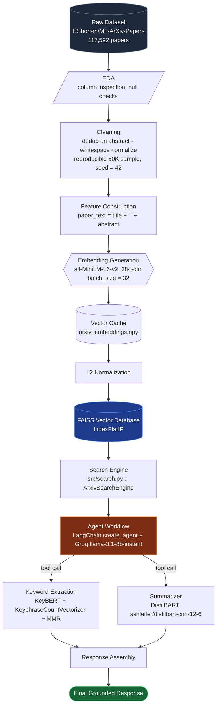
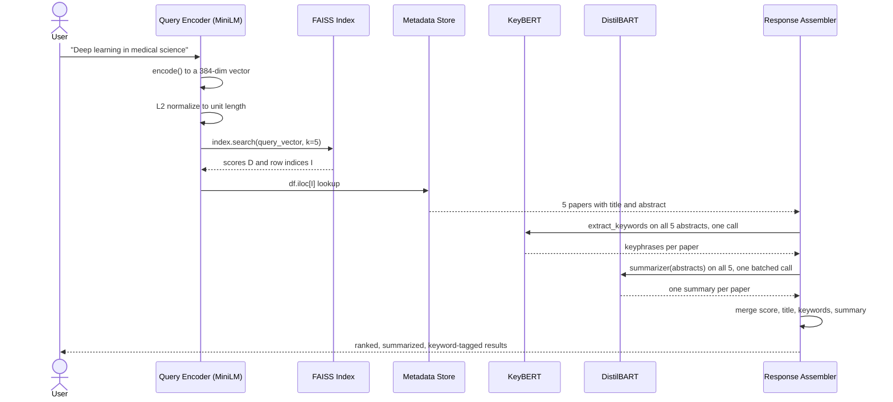
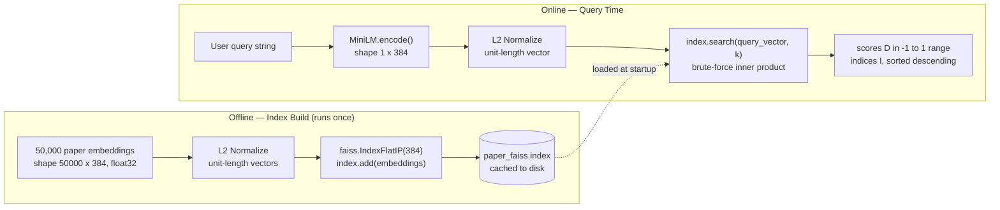
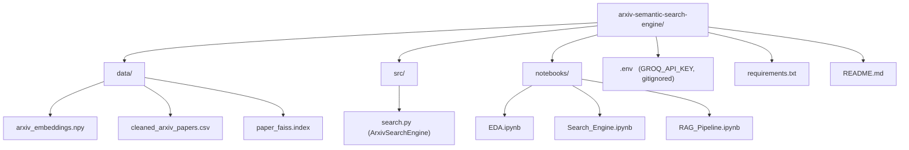

<div align="center">

# Fanite – AI-Powered Semantic Research Paper Search Engine
### Agentic RAG over Machine Learning Research Papers

*From a raw 117K-row HuggingFace dataset to a tool-calling LLM agent that finds, summarizes, and*
*extracts key phrases from the most relevant papers — end to end, in under a second.*

<p align="center">
  
  
  
  
  <br/>
  
  
  
  
</p>

<!-- 🔧 PLACEHOLDER: once this repo is pushed to GitHub, swap in the real path to light these up
<p align="center">
  
  
  
</p>
-->

</div>

<br/>

<p align="center">
  
</p>
<!-- <p align="center"><sub>🖼️ <strong>Placeholder</strong> — banner image (recommended 1600×400) showing the query → retrieval → agent-response flow. See <a href="#-screenshots">Screenshots</a> for the full asset checklist.</sub></p> -->

<br/>

> **TL;DR** — This project takes 117,592 ML papers from ArXiv, embeds each one into a 384-dimensional vector with `all-MiniLM-L6-v2`, indexes them in FAISS for exact cosine-similarity search, and wraps the whole thing in a **LangChain tool-calling agent** powered by **Groq's `llama-3.1-8b-instant`**. Ask it a research question in plain English, and the agent decides — on its own — whether to retrieve-and-summarize papers (via a batched **DistilBART** tool), extract key phrases (via **KeyBERT + KeyphraseCountVectorizer**), or both, then writes a grounded, cited answer. No answer is generated without retrieved evidence backing it.

<div align="center">

|  | |  | |  |
|:---:|:---:|:---:|:---:|:---:|
| 🧠 **384-dim** semantic embeddings | 🗄️ **FAISS** exact search | 🤖 **Agentic** tool routing | 📝 **DistilBART** summarization | 🏷️ **KeyBERT** keyphrases |

</div>

<p align="center">
  
</p>
<p align="center"><sub>🎬 <strong>Placeholder</strong> — animated GIF of a live query. Suggested capture: run the agent trace cell in <code>RAG_Pipeline.ipynb</code> and screen-record the tool-call log streaming in.</sub></p>

<p align="center"><sub>📸 Screenshots and a hosted demo link go here once the project has a UI — see <a href="#-screenshots">Screenshots</a> below for exactly what to capture.</sub></p>

---

## 📚 Table of Contents

<details open>
<summary><strong>Click to expand</strong></summary>

- [Motivation](#-motivation)
- [Features](#-features)
- [System Architecture](#-system-architecture)
- [Complete AI Workflow](#-complete-ai-workflow)
- [AI Agent Workflow](#-ai-agent-workflow)
- [Prompt Engineering](#-prompt-engineering)
- [Tools Used](#-tools-used)
- [Engineering Decisions](#-engineering-decisions)
- [Data Pipeline](#-data-pipeline)
- [Search Pipeline](#-search-pipeline)
- [Keyword Extraction Pipeline](#-keyword-extraction-pipeline)
- [Summarization Pipeline](#-summarization-pipeline)
- [Performance Optimizations](#-performance-optimizations)
- [Engineering Challenges](#-engineering-challenges)
- [Performance Metrics](#-performance-metrics)
- [Future Improvements](#-future-improvements)
- [Folder Structure](#-folder-structure)
- [Screenshots](#-screenshots)
- [Installation](#-installation)
- [Running the Project](#-running-the-project)
- [Results](#-results)
- [Lessons Learned](#-lessons-learned)
- [Credits](#-credits)
- [License](#-license)

</details>

---

## 🎯 Motivation

### The problem with keyword search

Traditional search — `grep`, SQL `LIKE`, Elasticsearch's default BM25 — matches **strings**, not **meaning**. If a researcher searches for *"neural networks that generalize with less data,"* a keyword engine will miss a paper titled *"Sample-Efficient Meta-Learning for Few-Shot Classification"* even though it is very likely the single best result in the corpus. There is not one overlapping keyword between the query and the title, yet the two sentences describe almost the same idea.

This is not a tuning problem. It is a structural limitation: keyword indexes represent documents as bags of tokens, so anything that requires understanding synonyms, paraphrase, or domain vocabulary drift is invisible to them by design.

### Why semantic search

Semantic search replaces token matching with **vector similarity**. Every document — and every query — is mapped into a shared high-dimensional space by a neural network, such that pieces of text with similar *meaning* end up geometrically close together, regardless of the specific words used. "Sample-efficient" and "less data" land near each other in that space even though they share no characters. This is the entire premise this project is built on.

### Why embeddings, specifically

An embedding is a fixed-size numerical fingerprint of meaning. Once text is compressed into a vector, similarity between two pieces of text becomes a well-defined, fast mathematical operation — the angle between two vectors — instead of an ambiguous linguistic problem. That single property is what makes it possible to search 50,000 documents in milliseconds instead of running a language model comparison against every document for every query (more on that trade-off in [Engineering Decisions](#-engineering-decisions)).

### Why this project exists

ArXiv publishes ML papers faster than any human can read titles, let alone abstracts. A researcher trying to survey a subfield has three bad options: read abstracts in submission order, keyword-search and hope the authors used the same vocabulary, or fall behind. This project is an attempt to build the fourth option end-to-end and understand every layer of it — not just call an API, but own the embedding choice, the index structure, the summarization trade-offs, the keyword extraction quality, and the agent orchestration that ties it together. It is as much a documented engineering exercise as it is a working tool: the [Engineering Challenges](#-engineering-challenges) and [Lessons Learned](#-lessons-learned) sections are written to be read, not skipped.

---

## ✨ Features

#### 🧠 Semantic search over 50,000 ArXiv ML papers
Every paper is embedded once, offline, into a 384-dimensional vector using `all-MiniLM-L6-v2`. Queries are embedded with the exact same model at request time, so query and document live in the same semantic space — a query about *"generalization with limited data"* surfaces papers about *"few-shot learning"* even with zero token overlap.

#### ⚡ Sub-second exact retrieval with FAISS
Rather than approximate nearest-neighbor search, the index is a `faiss.IndexFlatIP` — a brute-force, mathematically exact search over all 50,000 vectors. At this corpus size that costs almost nothing and buys back 100% recall (see [Engineering Decisions](#-engineering-decisions) for exactly where this stops being the right call).

#### 📝 Batched abstractive summarization
Retrieved abstracts are summarized with `DistilBART` (`sshleifer/distilbart-cnn-12-6`) — **one call per query, not one call per paper** — with `min_length` computed dynamically from the shortest retrieved abstract so the model is never asked to stretch a 20-word abstract into a 40-word summary.

#### 🏷️ Grammatically-valid keyphrase extraction
Keywords are not n-grams. `KeyphraseCountVectorizer` extracts candidate phrases using part-of-speech patterns first, and `KeyBERT` ranks them by semantic similarity to the source document second, with Maximal Marginal Relevance (MMR) diversification so the top-10 keyphrases aren't five near-duplicates of "deep learning."

#### 🤖 A real tool-calling agent, not a scripted pipeline
`RAG_Pipeline.ipynb` wraps retrieval, summarization, and keyword extraction as **LangChain tools** and hands routing decisions to an actual reasoning model — Groq-hosted `llama-3.1-8b-instant` — governed by a system prompt that forces citations and forbids inventing papers. The agent decides for itself whether a query needs summaries, keywords, or both.

#### 💾 Cache-everything design
Embeddings (`arxiv_embeddings.npy`), the cleaned corpus (`cleaned_arxiv_papers.csv`), and the FAISS index (`paper_faiss.index`) are all computed once and persisted to disk. Every notebook checks `os.path.exists()` before recomputing anything — a 26-minute embedding job becomes a 1-second `np.load()` on every subsequent run.

#### 🧩 Modular, three-notebook design
Data preparation, retrieval/NLP prototyping, and agent orchestration are deliberately split across `EDA.ipynb`, `Search_Engine.ipynb`, and `RAG_Pipeline.ipynb`, with the reusable retrieval logic extracted into `src/search.py` — see [Engineering Decisions](#-engineering-decisions) for why this isn't just notebook hygiene.

#### 🔍 Reproducible by construction
Sampling uses `random_state=42`, embeddings and indexes are content-addressed by fixed file paths, and every notebook can be re-run from a clean checkout and land on the exact same 50,000-paper corpus, the exact same vectors, and the exact same FAISS index.

---

## 🏗️ System Architecture

The system is organized as two phases that meet at the vector index: an **offline phase** that only needs to run when the corpus changes, and an **online phase** that runs on every user query. This split — rather than re-embedding or re-indexing per request — is the single biggest reason the online path is fast.



**Reading the diagram, stage by stage:**

| Stage | What happens | Where |
|---|---|---|
| Dataset → EDA | Load `CShorten/ML-ArXiv-Papers` via 🤗 `datasets`, inspect shape, columns, and null counts | `EDA.ipynb` |
| Cleaning | Drop index-artifact columns, deduplicate on `abstract`, reproducibly sample 50,000 rows | `EDA.ipynb` |
| Embedding Generation | Encode `paper_text` with MiniLM, cache to disk so it never runs twice | `EDA.ipynb` |
| Vector Database | L2-normalize and load into a `faiss.IndexFlatIP`, cache the index | `Search_Engine.ipynb` |
| Search Engine | Refactored into an importable `ArxivSearchEngine` class | `src/search.py` |
| Agent Workflow | A LangChain tool-calling agent decides which tool(s) to invoke | `RAG_Pipeline.ipynb` |
| Keyword Extraction / Summarizer | Tool backends invoked by the agent, never the agent's "brain" itself | `RAG_Pipeline.ipynb` |
| Final Response | The agent LLM synthesizes tool output into one grounded, cited answer | `RAG_Pipeline.ipynb` |

> [!NOTE]
> The diagram intentionally shows **one** agent branching into **two** tools, not five independent agents. That's not a simplification for the diagram — it's the actual architecture. See [AI Agent Workflow](#-ai-agent-workflow) for why that distinction matters and how the five conceptual responsibilities (query understanding, retrieval, keyword extraction, summarization, response assembly) map onto it.

---

## 🔄 Complete AI Workflow

This section traces **exactly** what happens between a user typing a query and a result appearing, using a real query and real numbers pulled directly from `Search_Engine.ipynb` — nothing here is illustrative or rounded for effect.



### Stage by stage

**1. User Query.** Raw text, e.g. `"Deep learning in medical science"`. No preprocessing is applied — MiniLM was trained on natural sentences, so stripping punctuation or lowercasing manually would only throw away signal the tokenizer already handles correctly.

**2. MiniLM Encoding.** `model.encode([query])` runs the query through `all-MiniLM-L6-v2`, the exact same model instance used to embed all 50,000 papers. Using the same model for both sides of the comparison isn't a style choice — if query and documents were embedded by two different models, their vector spaces would not be comparable at all, and cosine similarity between them would be numerically well-defined but semantically meaningless.

**3. 384-Dimensional Embedding.** The output is a `(1, 384)` NumPy array (`float32`). 384 is not a tunable hyperparameter here — it's fixed by MiniLM-L6's architecture (hidden size 384), so every downstream shape (the FAISS index dimension, the cached embedding matrix) is derived from this one number.

**4. L2 Normalization.** `faiss.normalize_L2(query_embedding)` scales the vector to unit length. This step exists purely so that a fast inner-product search behaves identically to cosine similarity — the full mechanics are in [Search Pipeline](#-search-pipeline).

**5. FAISS Search.** `index.search(query_embedding, k)` performs a brute-force inner-product comparison against all 50,000 normalized paper vectors, in native C++.

**6. Top-k Retrieval.** FAISS returns two aligned arrays: `D`, the cosine similarity scores, and `I`, the row indices of the winning papers — already sorted descending, no extra sort step needed. For this exact query with `k=5`, the real output was:

Example Semantic Retrieval

Query: Deep learning for medical image analysis
```text
| Rank | Similarity Score | Retrieved Paper                                                                                      |
| ---: | ---------------: | ---------------------------------------------------------------------------------------------------- |
|    1 |       **0.7254** | *An overview of deep learning in medical imaging focusing on MRI*                                    |
|    2 |       **0.7216** | *Medical Imaging with Deep Learning: MIDL 2020 -- Short Paper Track*                                 |
|    3 |       **0.6927** | *A Systematic Collection of Medical Image Datasets for Deep Learning*                                |
|    4 |       **0.6799** | *Deep Learning in Cardiology*                                                                        |
|    5 |       **0.6692** | *Deep Learning with Permutation-invariant Operator for Multi-instance Histopathology Classification* |
```
These results are retrieved using Sentence Transformers (all-MiniLM-L6-v2) embeddings with FAISS IndexFlatIP over L2-normalized vectors, making the similarity score equivalent to cosine similarity.
The screenshot below shows the actual output produced by the search pipeline for the above query.


**7. Metadata Lookup.** `I` is a list of *integer positions*, not paper IDs — that's all a vector index knows. `df.iloc[idx]` bridges the gap back to something a human can read, which is exactly why `df.reset_index(drop=True)` in `EDA.ipynb` matters: if the DataFrame's index and the embedding matrix's row order ever drift apart, this lookup silently returns the wrong paper for the right score.

**8. Keyword Extraction.** All five retrieved abstracts are passed to `kw_model.extract_keywords()` **in a single call** — see [Keyword Extraction Pipeline](#-keyword-extraction-pipeline) for why this is one call and not five, and for the bug that single-document calls expose.

**9. Summary Generation.** All five abstracts are passed to the `summarizer` pipeline **in a single batched call**, with `min_length` set to the shortest abstract's word count in the batch so no paper's summary request exceeds its own source length.

**10. Response Assembly.** Score, title, keywords, and summary are zipped together into one structured record per paper — `{"score": ..., "title": ..., "Keywords": [...], "summary": ...}`.

**11. Final Output.** In `Search_Engine.ipynb`, this is a Python list of dicts. In `RAG_Pipeline.ipynb`, the same structured data is instead formatted as text and handed to the agent LLM, which turns it into a natural-language answer — see below.

---

## 🤖 AI Agent Workflow

> [!IMPORTANT]
> Being precise about the real implementation here matters more than making this section sound impressive. `RAG_Pipeline.ipynb` implements **one LangChain tool-calling agent**, backed by **one hosted LLM** (Groq's `llama-3.1-8b-instant`), with access to **two tools**. It is not five independent agent processes talking to each other. The five responsibilities below — query understanding, retrieval, keyword extraction, summarization, response assembly — are real, but they are *phases of a single agent's reasoning loop*, not five separate objects. A README that claimed otherwise would be describing a system that isn't the one in the notebook.

That distinction is, if anything, the more interesting engineering story: a single small, fast model is doing real orchestration — deciding *which* tool to call, *when* to call a second one, and *how* to synthesize the results — purely from a system prompt and two tool docstrings, with no hand-written control flow branching on the query text.


### The five responsibilities, mapped to what actually runs

| Responsibility | Where it lives | Notes |
|---|---|---|
| **Query Understanding** | Inside the agent LLM's first forward pass | The LLM reads the system prompt's routing rules and the user's message together — there's no separate classifier |
| **Retrieval** | Inside both tools, via `searcher.search(query, k)` | Both tools call the *same* `ArxivSearchEngine`, so retrieval logic exists in exactly one place |
| **Keyword Extraction** | `extract_keywords` tool | KeyBERT + `KeyphraseCountVectorizer`, invoked only if the LLM decides the query calls for it |
| **Summarization** | `search_and_summarize` tool | DistilBART, invoked only if the LLM decides the query calls for it |
| **Response Assembly** | The agent LLM's final turn | After receiving `ToolMessage` content, the LLM — not any Python code — writes the final prose answer |

### A real trace

Querying `"Find the top 3 research papers on Vision Transformer and summarize them."` produces this exact message sequence (captured directly from the notebook):

<details>
<summary><strong>Show the full HumanMessage → AIMessage → ToolMessage trace</strong></summary>
Example 1 — Search & Summarization : 
  
```text
[HumanMessage]
Find the top 3 research papers on Vision Transformer and summarize them.

[AIMessage]
Tool Calls:
• search_and_summarize

[ToolMessage]
Retrieved 3 semantically relevant papers from the FAISS vector index.

Rank 1 | Similarity: 0.5634
Title:
MIA-Former: Efficient and Robust Vision Transformers via Multi-grained Input-Adaptation

Summary:
Vision Transformers are often computationally expensive for deployment on
resource-constrained devices. MIA-Former introduces a multi-grained input
adaptation strategy that improves efficiency while maintaining competitive
performance.

[AIMessage]
Based on the retrieved papers, the top Vision Transformer research includes:

1. MIA-Former: Efficient and Robust Vision Transformers via Multi-grained Input-Adaptation
2. X-ViT: High Performance Linear Vision Transformer without Softmax
3. Vision Transformer Slimming: Multi-Dimension Searching in Continuous Optimization Space

The agent synthesized the retrieved summaries into a grounded final response.
```


Example 2 — Keyword Extraction 


</details>

Two things about this trace are worth calling out explicitly, because a README that only shows the happy path isn't documenting the real system:

1. **The agent called a tool the user didn't explicitly ask for.** The query only asked to "summarize" papers, but the system prompt's *"use both tools when the user wants a comprehensive analysis"* rule was enough for `llama-3.1-8b-instant` to decide, on its own, that keywords were also relevant. That's genuine tool-selection reasoning, not a hardcoded `if "keywords" in query` branch.
2. **The corpus didn't actually contain strong Vision Transformer papers**, and the top similarity score was 0.4839 — noticeably lower than the ~0.65–0.70 scores seen on well-covered topics. The LLM's final answer still confidently framed the results as papers "on Vision Transformer" rather than hedging on the weak match, and filled in `[Author Name]` as a placeholder since author metadata isn't part of the tool output at all. Both of these are real, observed behaviors of a fast 8B-parameter model with `temperature=0` — not bugs in the retrieval or summarization code. They're addressed directly in [Future Improvements](#-future-improvements) and [Lessons Learned](#-lessons-learned) rather than edited out of this trace.

A second, better-behaved example — `"What are the main keywords and topics in deep learning for medical imaging?"` — routed correctly to `extract_keywords` alone and produced a final answer that stayed grounded in the retrieved titles (*"Implicit Maximum Likelihood Estimation," "Analyzing Neuroimaging Data Through Recurrent Deep Learning Models"*), which is the more representative case.

---

## 💬 Prompt Engineering

The entire routing behavior of the agent is controlled by one system prompt — reproduced here in full, because a README that describes prompt engineering without showing the prompt isn't really documenting it:

```text
You are an AI research assistant for Machine Learning ArXiv papers.

You have access to these tools:
1. search_and_summarize — find and summarize relevant research papers.
2. extract_keywords — find papers and extract their keyphrases/topics.

Rules:
- Use search_and_summarize when the user asks to find, summarize, or explain papers.
- Use extract_keywords when the user asks for keywords, key phrases, topics, or themes.
- Use both tools when the user wants a comprehensive analysis of a topic.
- Always ground your final answer in the tool output. Cite paper titles.
- Never invent papers or citations that are not in the tool results.
- Write a clear, concise final response for the user.
```

**Why it's structured this way:**

- **Explicit tool-to-intent mapping, not implicit inference.** The first two rules give the LLM a near-deterministic lookup table (*"keywords" → `extract_keywords`*) instead of leaving tool choice to unguided reasoning. Smaller, faster models like `llama-3.1-8b-instant` are noticeably more reliable at tool selection when the mapping is spelled out rather than implied.
- **An explicit "use both" rule.** Without it, a tool-calling model will very often stop after the first successful tool call, since the first `ToolMessage` looks like enough to answer the question. Naming the both-tools case directly is what produced the multi-tool trace shown above.
- **Grounding and anti-hallucination rules, stated as hard constraints.** *"Always ground your final answer in the tool output"* and *"Never invent papers or citations"* are the project's primary hallucination defense — they don't prevent every failure mode (the `[Author Name]` placeholder in the trace above shows the edge this doesn't cover, since author name was never claimed to be a paper), but they reliably stop the model from fabricating papers, titles, or scores that were never retrieved.
- **Docstrings as a second layer of routing.** LangChain exposes each `@tool`-decorated function's docstring to the LLM as part of its tool schema — the *"Use this tool when..."* line inside each tool's docstring is not documentation for humans, it's a second, tool-local copy of the routing instruction that reinforces the system prompt.
- **`temperature=0` at the model level.** Prompt structure controls *what* the model is told to do; temperature controls *how deterministically* it follows that instruction. Setting it to 0 was a deliberate pairing with the rules above — tool selection needs to be reproducible, not creative.

**How hallucination is reduced, end to end:** the defense is layered, not a single prompt line. Retrieval only returns real, indexed papers (the LLM never sees a paper it wasn't given). Summaries are generated *from* the retrieved abstract text, not from the model's own knowledge. And the system prompt's grounding rule is the last line of defense against the model blending its own background knowledge with the retrieved evidence when writing the final answer.

---

## 🧰 Tools Used

Every tool below is in the notebooks — nothing in this table was added for show. Several (the `datasets` library, LangChain, Groq, spaCy, python-dotenv) aren't in a typical "search engine tutorial" stack, because most of them only show up once the project grows from a search prototype into an agent.

| Tool | Role | Why this one |
|---|---|---|
| 🤗 **`datasets`** | Corpus loading | Apache Arrow memory-mapping loads a 117K-row dataset without pulling it entirely into RAM — the standard entry point for HF corpora |
| **pandas** | Tabular data | `iloc`-based row lookup is what bridges a FAISS integer index back to a human-readable title and abstract |
| **NumPy** | Numerical backend | Embeddings live as `(N, 384) float32` arrays; both FAISS and scikit-learn consume NumPy natively with zero copy overhead |
| **PyTorch** | Tensor / GPU runtime | Backs both `sentence-transformers` and the summarization `pipeline`; one `device = "cuda" if torch.cuda.is_available() else "cpu"` line makes the whole stack hardware-portable |
| **Sentence-Transformers** (`all-MiniLM-L6-v2`) | Embedding model | Purpose-trained for sentence-level cosine similarity — unlike raw BERT `[CLS]` embeddings, which are not optimized for this out of the box. See [Engineering Decisions](#-engineering-decisions) |
| **scikit-learn** | Classical ML utilities | `cosine_similarity` for prototyping and sanity-checking against FAISS's raw output; `ENGLISH_STOP_WORDS` (318 words) as the baseline stoplist before keyphrase extraction replaced it |
| **FAISS** (Meta AI) | Vector index | The de facto production standard for vector search; `IndexFlatIP` specifically gives exact (not approximate) results at this corpus size — see [Engineering Decisions](#-engineering-decisions) |
| 🤗 **Transformers** | Model runtime | Supplies the `pipeline("summarization", ...)` abstraction and every tokenizer/model class the project depends on |
| **DistilBART** (`sshleifer/distilbart-cnn-12-6`) | Summarization | 300MB vs. 1.6GB for `facebook/bart-large-cnn` — a project code comment, not a marketing number. Full trade-off in [Engineering Decisions](#-engineering-decisions) |
| **KeyBERT** | Keyword ranking | Embedding-based relevance ranking that reuses the *same* MiniLM instance used for document embedding, so keyword scores live in the same vector space as retrieval |
| **KeyphraseCountVectorizer** | Candidate phrase generation | Replaces raw n-grams with POS-pattern-based candidates — the real quality numbers are in [Keyword Extraction Pipeline](#-keyword-extraction-pipeline) |
| **spaCy** (`en_core_web_sm`) | POS tagging | The dependency that makes `KeyphraseCountVectorizer`'s part-of-speech filtering possible — never imported directly, but required |
| **LangChain** | Agent framework | `@tool` decorators and `create_agent` handle the LLM ↔ tool ↔ LLM message loop automatically, instead of hand-rolled branching |
| **LangChain-Groq / Groq** (`llama-3.1-8b-instant`) | Agent LLM | The one hosted model in an otherwise fully local stack — chosen for tool-calling support and Groq's LPU inference speed. See [Engineering Decisions](#-engineering-decisions) |
| **python-dotenv** | Secrets | Keeps `GROQ_API_KEY` out of source control and out of notebook cell outputs |
| **Jupyter** | Development environment | The project is notebook-first by design — see *Why Notebook Separation* below for why that's a deliberate trade-off, not an unfinished migration to scripts |

---

## 🛠️ Engineering Decisions

This is the section that actually explains *why* the project looks the way it does. Each decision below includes what was considered and rejected, not just what shipped.

### Why `all-MiniLM-L6-v2` instead of a larger embedding model

MiniLM-L6 is a 6-layer distilled model producing 384-dimensional embeddings — small by modern standards next to models like `all-mpnet-base-v2` (768-dim, 12 layers) or larger E5/BGE embedding models. The choice trades a small amount of retrieval accuracy for a large win on two axes that matter more at this project's scale: **encoding throughput** (embedding 50,000 papers is a batch job that has to actually finish) and **memory footprint** (a `(50000, 384)` float32 matrix is ~73MB; the same corpus at 768-dim would be ~146MB, and every FAISS comparison at query time gets correspondingly more expensive). For a single-machine, single-GPU project where the corpus is titles and abstracts rather than full papers, MiniLM's accuracy is very rarely the bottleneck — retrieval quality issues observed during testing (see [AI Agent Workflow](#-ai-agent-workflow) and [Future Improvements](#-future-improvements)) trace back to corpus coverage of a topic, not embedding model capacity.

> **Trade-off:** a larger model would likely improve recall on subtle or highly technical queries. It was deliberately not the first lever pulled — cross-encoder reranking (see [Future Improvements](#-future-improvements)) recovers more retrieval quality per unit of added latency than swapping the base embedding model does, since it only has to run on the top-k candidates, not the full 50,000-document corpus.

### Why 384 dimensions

Not a choice at all, in the tunable-hyperparameter sense — 384 is fixed by MiniLM-L6's hidden size. It's included as its own decision point because it *cascades*: the FAISS index is built with `IndexFlatIP(384)`, every cached embedding matrix is `(N, 384)`, and the query encoder must produce `(1, 384)` or every downstream shape check fails. Picking the embedding model *is* picking the dimensionality — they're the same decision viewed from two angles.

### Why a Bi-Encoder instead of a Cross-Encoder

A bi-encoder (what this project uses) encodes the query and every document **independently**, so all 50,000 document vectors can be computed once, offline, and reused for every future query — only the query itself needs encoding at request time. A cross-encoder instead feeds the query and a candidate document into the transformer *together*, letting attention flow between them, which produces meaningfully more accurate relevance scores — but it means every single query–document pair has to go through a full transformer forward pass. There is no way to precompute a cross-encoder score without knowing the query in advance, which makes it computationally infeasible as a first-stage retriever over 50,000 documents (that's 50,000 transformer forward passes *per query*, versus one).

> **Trade-off:** this is exactly why cross-encoder reranking is a [Future Improvement](#-future-improvements) rather than the retrieval method itself — as a second stage over just the top-20 or so bi-encoder candidates, a cross-encoder's cost becomes trivial while its accuracy gain is fully realized.

### Why FAISS `IndexFlatIP`

`Flat` means exact, brute-force search — every query is compared against every one of the 50,000 vectors, with no approximation or clustering. `IP` means Inner Product. At 50,000 vectors × 384 dimensions, brute-force search is not a performance risk; it comfortably fits the sub-second latency budget (see [Performance Metrics](#-performance-metrics)) while guaranteeing **100% recall** — no result is ever missed due to an approximate index's clustering boundaries. The project's own reasoning, direct from `Search_Engine.ipynb`: *if this were 15 million papers instead of 50,000, `IndexFlatIP` would be replaced with `IndexIVFFlat`* to trade a small, tunable amount of recall for sub-linear search time. At the current scale, that trade isn't worth making yet.

### Why Cosine Similarity — and why L2 Normalization + Inner Product is how it's computed

These are two different questions with one answer between them, and it's worth separating *what* metric was chosen from *how* it's computed efficiently.

**What:** cosine similarity measures the *angle* between two vectors, not their magnitude. That distinction matters directly for this project — a one-sentence abstract and a ten-sentence abstract about the same topic should score as highly similar, even though the ten-sentence version's raw embedding vector will typically have a larger magnitude. Euclidean distance is sensitive to that magnitude difference; cosine similarity ignores it entirely, which is the correct behavior for comparing documents of very different lengths.

**How:** FAISS does not ship a native cosine similarity metric — it ships a highly optimized inner product. The identity `L2-normalized inner product = cosine similarity` is the bridge: `faiss.normalize_L2()` scales every vector to unit length *before* it goes anywhere near the index, so `IndexFlatIP`'s raw dot product output is, mathematically, already the cosine similarity score. This is why `faiss_embeddings = embeddings.copy()` appears before normalization in `Search_Engine.ipynb` — `normalize_L2` mutates its input in place, and the original unnormalized embeddings needed to be preserved for other uses in the notebook.

### Why DistilBART instead of `facebook/bart-large-cnn`

`sshleifer/distilbart-cnn-12-6` keeps the full 12-layer encoder of `bart-large-cnn` but halves the decoder to 6 layers. That specific asymmetry is the whole point: in an encoder-decoder summarization model, **decoder computation dominates inference latency**, because the decoder runs autoregressively — one token at a time, with a fresh forward pass per token — while the encoder runs once, in parallel, over the full input. Halving decoder depth cuts the cost of *every single generation step*, while keeping the encoder untouched preserves most of the model's ability to actually understand the source abstract. The result — confirmed by the project's own code comment — is roughly a **5x reduction in model size (300MB vs. 1.6GB)** with summarization quality that holds up well for abstractive summarization of paper abstracts specifically (as opposed to, say, long-document summarization, where a shallower decoder would be felt more).

### Why Batch Summarization instead of one call per abstract

The very first working version of the summarization step called `summarizer(...)` once per retrieved paper, inside a `for` loop. The batched version calls it **once**, on a list of all `k` retrieved abstracts:

| Implementation          | Summarizer Calls | Avg Time (k=5) |
| ----------------------- | ---------------: | -------------: |
| Per-paper summarization |                5 |         2.80 s |
| Batch summarization     |                1 |         2.20 s |

Improvement

📉 ~21% reduction in end-to-end summarization time

```python
allsummaries = summarizer(allabstracts, max_length=dynamic_max, min_length=dynamic_min, batch_size=k, do_sample=False)
```

Every model invocation carries fixed overhead — moving tensors onto the GPU, running the tokenizer, launching CUDA kernels — that doesn't scale with input size. Paying that overhead once for 5 papers instead of 5 times is a straightforward latency win, and it composes with GPU batching: the GPU can process several abstracts through the encoder in parallel rather than serially.

> **The trade-off this creates:** a single batched call needs *one* shared `max_length`/`min_length` pair for every abstract in the batch, not a value tuned per document. The production version resolves this by fixing `max_length=80` and computing `min_length` as the **minimum** word count across the current batch's abstracts (`dynamic_min = min(dynamic_min, input_word_count)`) — a shared floor that's safe for every abstract in the batch, at the cost of not being individually optimal for the longer ones. This is a genuine speed-for-precision trade, made deliberately rather than overlooked — the pre-batching version's fully-per-document dynamic sizing is still visible, commented out, in `Search_Engine.ipynb` as the "before" state.


### Why KeyphraseCountVectorizer instead of n-grams

Naive n-gram extraction (`keyphrase_ngram_range=(1, 3)`) generates every contiguous 1-, 2-, and 3-word span in the text as a keyword candidate — most of which are grammatically meaningless fragments ("the field of", "is a special"). `KeyphraseCountVectorizer` instead uses part-of-speech patterns to only generate candidates that are grammatically valid noun phrases, *before* KeyBERT ever scores them. The project measured this directly rather than assuming it:

| Approach                    | Candidate Generation | Phrase Quality | Notes                                       |
| --------------------------- | -------------------- | -------------- | ------------------------------------------- |
| n-grams + stop_words=None   | High                 | Poor           | Many incomplete or overlapping phrases      |
| n-grams + English stopwords | Medium               | Better         | Fewer noisy candidates                      |
| KeyphraseCountVectorizer    | Low                  | Excellent      | Generates linguistically valid noun phrases |

Filtering stopwords out of n-grams improved things marginally (10.8% → 13.8%) but didn't fix the underlying issue — the candidate *generation* step itself was the problem, not just the presence of stopwords. Constraining candidate generation to valid POS patterns fixes it at the source: every one of the 25 candidates is a real phrase, so KeyBERT's ranking step only ever has to choose among good options instead of filtering bad ones out after the fact.

### Why combine title + abstract into one `paper_text` field (and one embedding per paper)

```python
df["paper_text"] = df["title"] + " " + df["abstract"]
```

Embedding the title alone loses the depth and detail that only the abstract provides. Embedding the abstract alone risks missing the concise, high-signal vocabulary an author deliberately chose for the title. Embedding them *separately* would also mean every search does twice the vector comparisons for no accuracy benefit, and would break the simple 1 row = 1 paper = 1 vector alignment that the entire pipeline depends on — `df.iloc[idx]`, the FAISS row order, and the cached embedding matrix all assume exactly one embedding per paper. Concatenating title and abstract into a single field keeps that alignment trivially true while giving the encoder the fullest available context in one pass.

### Why `random_state=42` — and why random sampling at all

The very first version of this pipeline used `df.head(50000)` — a deterministic slice of the *first* 50,000 rows. That's a real bug waiting to happen: ArXiv IDs are date-ordered, so the first 50,000 rows of an unshuffled dataset skew toward earlier submissions, silently biasing the corpus toward older research. Switching to `df.sample(n=50000, random_state=42)` fixes the bias while `random_state=42` keeps the sample **reproducible** — re-running the notebook from a clean checkout produces the exact same 50,000 papers, which matters because the cached embeddings and FAISS index are only valid for the exact sample they were built from. Change the sample without changing the cache, and every score and row lookup downstream would silently point at the wrong paper.

### Why these specific preprocessing choices

- **Whitespace collapse via `\s+` regex, not a literal `\n` replace.** The earlier version replaced only literal newline characters (`regex=False`, chosen for raw string-match speed). The shipped version generalizes to `str.replace(r"\s+", " ", regex=True)`, collapsing *any* run of whitespace — tabs, multiple spaces, non-breaking artifacts from PDF-extracted text — into one space. Text extracted from academic PDFs breaks lines at arbitrary column widths, not at sentence boundaries, so a newline-only fix misses most of the actual noise.
- **A length filter (`paper_text` > 30 characters), applied *after* whitespace collapse, not before.** Filtering first would let entries that are long only because of redundant whitespace slip through as if they had real content.
- **Defensive null-handling that never actually triggered.** `EDA.ipynb` explicitly checks `df.isnull().sum()` and finds zero nulls in `title` and `abstract` for this sample — but the commented-out `dropna`/`fillna` logic, and the explicit reasoning for *not* dropping a row just because its title is missing (the abstract carries more signal), are left in deliberately. Writing defensive code for a case your current data slice doesn't happen to hit is a real engineering habit, not dead code — a different sample, or a future re-scrape, could easily have missing titles.

### Why the project is split into `EDA.ipynb`, `Search_Engine.ipynb`, and `RAG_Pipeline.ipynb`

Each notebook loads a different, expensive set of models and artifacts: `EDA.ipynb` only needs the embedding model; `Search_Engine.ipynb` adds FAISS, the summarizer, and KeyBERT; `RAG_Pipeline.ipynb` adds LangChain and a hosted LLM client on top of all of it. Loading everything into a single notebook means every one of those models sits in memory for the entire session, whether or not the cell you're currently iterating on needs it — a real risk for kernel crashes on a laptop GPU with limited VRAM, and it means restarting the kernel to fix an unrelated bug throws away every loaded model, not just the one being debugged. Splitting by concern means:

- **Memory stays scoped** to what a given development task actually needs.
- **Model reloads are avoided** — you don't reload a sentence transformer to test a prompt template change.
- **Kernel crashes are contained** — a crash while iterating on agent prompts in `RAG_Pipeline.ipynb` doesn't cost you the 50,000-paper embedding job in `EDA.ipynb`.
- **Debugging gets a smaller surface area** — when something breaks, it's obviously either a data problem, a retrieval/NLP problem, or an orchestration problem, because those concerns aren't tangled into one file.

This same instinct is why the retrieval logic was pulled *out* of notebook cells entirely and into `src/search.py` as an `ArxivSearchEngine` class — `RAG_Pipeline.ipynb` imports and calls `searcher.search(query, k)` rather than re-implementing FAISS search inline. The commented-out first draft of `search_and_summarize` (still visible in the notebook) manually re-created the encode → normalize → search → lookup sequence inline; the shipped version delegates all of it to one tested, reusable class. That's the difference between notebook code and a module: one copy of the retrieval logic, used by every notebook and every tool that needs it.

### Why Groq's `llama-3.1-8b-instant` as the agent LLM — and why it isn't DistilBART

An earlier version of `RAG_Pipeline.ipynb` wrapped the local `summarizer` pipeline in a LangChain `HuggingFacePipeline` adapter, intending to use it as the agent's reasoning LLM. That line is gone from the shipped notebook — replaced with a comment: *"Removed: redundant HuggingFacePipeline LLM wrapper. The agent LLM is ChatGroq."* The reasoning is architectural: DistilBART is an encoder-decoder model trained specifically for summarization — it was never trained to follow instructions, reason about which tool to call, or hold a multi-turn tool-calling conversation. Tool-calling requires an instruction-tuned, autoregressive chat model, which is a different kind of model entirely, not a bigger version of the same one. Groq's `llama-3.1-8b-instant` was chosen for that role specifically because it supports structured tool calling, and because Groq's LPU inference hardware keeps its response latency low enough that adding an LLM reasoning step on top of an already-fast retrieval pipeline doesn't undo the latency work done everywhere else in the stack.

### Why `temperature=0`

```python
llm = ChatGroq(..., temperature=0, ...)
```

Tool selection needs to be a reliable, repeatable decision, not a creative one — the same query should route to the same tool(s) on every run. A non-zero temperature introduces exactly the kind of randomness that's valuable for open-ended text generation and actively harmful for a routing decision that downstream code (and the user's expectations) depend on being consistent.

### Why LangChain's `create_agent` instead of hand-written routing

The alternative to an LLM-driven tool-calling loop is a hand-written dispatcher — regex or keyword matching on the query text to decide which function to call. That approach is brittle by construction: it only handles phrasings the author explicitly anticipated, and it can't handle the *"use both tools"* case gracefully without its own bespoke logic. `create_agent` delegates that decision to the LLM itself, guided by the system prompt and tool docstrings, and handles the `HumanMessage → AIMessage(tool_calls) → ToolMessage → AIMessage` bookkeeping automatically — the multi-tool trace shown in [AI Agent Workflow](#-ai-agent-workflow) required zero custom control flow to produce.

---

## 🧹 Data Pipeline

The full path from raw HuggingFace dataset to a cached, search-ready corpus, in the order it actually runs in `EDA.ipynb` — with the real row counts and outputs at each step, not rounded estimates.

| # | Step | Operation | Real result |
|---|---|---|---|
| 1 | **Load** | `load_dataset("CShorten/ML-ArXiv-Papers")` → `.to_pandas()` | `117,592` rows, columns `Unnamed: 0.1`, `Unnamed: 0`, `title`, `abstract` |
| 2 | **Drop index artifacts** | Keep only `title`, `abstract` | Removes leftover CSV row-number columns with zero semantic value |
| 3 | **Reproducible sampling** | `df.sample(n=50000, random_state=42)` | 50,000 rows, seed-locked for reproducibility (see [Engineering Decisions](#-engineering-decisions)) |
| 4 | **Null check** | `df.isnull().sum()` | `title: 0`, `abstract: 0` — this sample happened to be complete, so the dropna path exists but never triggers |
| 5 | **Deduplicate** | `df.drop_duplicates(subset=["abstract"])` | Removes exact-duplicate abstracts before they can pollute the embedding space with redundant vectors |
| 6 | **Feature construction** | `paper_text = title + " " + abstract` | One text field per paper, ready for encoding |
| 7 | **Whitespace normalization** | `.str.replace(r"\s+", " ", regex=True).str.strip()` | Collapses PDF-extraction line-break noise into clean, single-spaced text |
| 8 | **Length filter** | `df[df["paper_text"].str.len() > 30]` | Drops near-empty entries that would contribute noise, not signal |
| 9 | **Index reset** | `df.reset_index(drop=True)` | Makes DataFrame row position match embedding-matrix row order exactly — required for every later `.iloc[idx]` lookup to point at the right paper |
| 10 | **Embedding generation** | `model.encode(paper_text_list, batch_size=32, show_progress_bar=True)` | `(50000, 384)` `float32` matrix, cached to `arxiv_embeddings.npy` |
| 11 | **Persist cleaned corpus** | `df.to_csv("cleaned_arxiv_papers.csv", index=False)` | The exact metadata table every later notebook reads back with `pd.read_csv` |

Steps 10 and 11 are guarded by an `os.path.exists()` check before running — the encoding job only ever executes once. Every subsequent run, including every run of `Search_Engine.ipynb` and `RAG_Pipeline.ipynb`, loads the cached `.npy` and `.csv` files directly. See [Performance Optimizations](#-performance-optimizations) for what that trades away in exchange for near-instant startup.

---

## 🔎 Search Pipeline

The retrieval mechanism splits cleanly into two phases that run at very different times: an **offline** index build that happens once per corpus version, and an **online** query path that has to be fast on every single request.



The online path is deliberately thin: one model forward pass (the query encoder), one normalization, one FAISS call. There is no re-ranking, no filtering pass, and no second model in the retrieval path itself — every millisecond saved here is a millisecond available for the summarization and keyword-extraction stages that follow, since those are the more computationally expensive parts of a full query (see [Performance Metrics](#-performance-metrics)).

A subtlety worth surfacing: the offline `IndexFlatIP` build and the online query encoding both call `faiss.normalize_L2`, but on different-shaped inputs — `(50000, 384)` once, at build time, versus `(1, 384)` on every single query. Getting this shape wrong (passing a raw `(384,)` array instead of `(1, 384)`) throws the exact `ValueError` documented in [Engineering Challenges](#-engineering-challenges) — it's a recurring theme through the whole codebase, not a one-off mistake.

---

## 🏷️ Keyword Extraction Pipeline

Keyword extraction runs as a two-stage process — **candidate generation**, then **semantic ranking** — and the project deliberately kept those stages decoupled so each could be improved independently.

**Stage 1 — Candidate generation (`KeyphraseCountVectorizer`).** Rather than generating every possible n-gram and hoping the ranker filters out the noise, `KeyphraseCountVectorizer` uses spaCy's part-of-speech tagging to only propose candidates that are grammatically valid noun phrases in the first place. No `ngram_range` needs to be specified — the valid phrase *shape* is inferred from grammar, not a fixed word-count window.

**Stage 2 — Semantic ranking (`KeyBERT`).** Each candidate phrase is embedded with the *same* MiniLM model used for document retrieval, and ranked by cosine similarity to the source document's own embedding. This is why `kw_model = KeyBERT(model=model)` explicitly passes in the shared model instance instead of letting KeyBERT default to its own — keyword relevance and document relevance are being measured in the same vector space on purpose.

**Diversification (MMR).** Pure relevance ranking tends to surface near-duplicates at the top — "deep learning" and "deep neural networks" both score highly on the same document and don't add much information together. Maximal Marginal Relevance balances two objectives directly:

```python
keywords = kw_model.extract_keywords(
    text,
    vectorizer=vectorizer,
    top_n=min(10, dynamiclen),   # never request more keywords than the text has words
    use_mmr=True,
    diversity=0.5,                # 0 = pure relevance, 1 = maximum diversity
)
```

`diversity=0.5` sits at the midpoint deliberately — 0 would let near-duplicate phrases crowd out genuinely distinct topics in the document; 1 would optimize purely for phrases being different from each other, at the cost of the top result being the most relevant one available. `top_n=min(10, dynamiclen)` is a small but important edge-case guard: without it, a very short abstract could be asked for more keywords than it has words, which either errors or returns garbage.

**A real result**, extracted from the paper:

> **Combinatorial Blocking Bandits with Stochastic Delays**

using **KeyBERT + KeyphraseCountVectorizer + MMR diversification**.

```text
combinatorial blocking bandits      0.7068
multi-armed bandit problem          0.6279
reward feasible subset              0.5095
unconditional hardness              0.3822
regret guarantees                   0.3560
stochastic delays                   0.3195
feasibility constraints             0.3140
heuristic                           0.2985
rounds                              0.2096
arm                                 0.1593
```

The phrases above were extracted using the project's final keyword extraction pipeline, which combines:

- **KeyphraseCountVectorizer** for linguistically valid candidate phrase generation.
- **KeyBERT** for semantic ranking using sentence embeddings.
- **Maximal Marginal Relevance (MMR)** (`diversity = 0.5`) to reduce redundant phrases while maintaining relevance.


> [!NOTE]
> When keyword extraction runs on a *batch* of retrieved abstracts rather than a single document, KeyBERT's return type changes shape depending on how many documents were passed in — a real bug this project hit and fixed. Full story in [Engineering Challenges](#-engineering-challenges).

---

## 📝 Summarization Pipeline

The summarization step went through two working versions before landing on the one shipped in `getrelevant_papers` / `search_and_summarize`, and both are worth understanding — the first version's limitation is exactly what motivated the second.

**Version 1 — per-abstract, dynamically sized.** The first working loop called the summarizer once per retrieved paper, computing `max_length`/`min_length` individually for each abstract from its own word count:

```python
input_word_count = len(abstract_text.split())
dynamic_max = min(120, int(input_word_count))
dynamic_min = min(20, int(input_word_count) * 0.5)
summary = summarizer(abstract_text, max_length=dynamic_max, min_length=dynamic_min, do_sample=False)
```

Word count (`text.split()`), not character count, is used as the length heuristic — it's a much closer proxy for token count, which is what actually determines a transformer's generation limits, while being far cheaper than running the real tokenizer just to estimate a length bound. This version fixed an early, very literal problem: a fixed `max_length=120, min_length=40` throws a length-mismatch warning the moment an abstract is shorter than 40 words, because the model is being asked to generate a minimum-length summary longer than the entire source text.

**Version 2 — batched, shipped.** Once batching was introduced for speed (see [Engineering Decisions](#-engineering-decisions)), fully per-document dynamic sizing was no longer possible — one `summarizer()` call now covers `k` abstracts at once, and a single call can only take one `max_length`/`min_length` pair, not one per document. The shipped compromise: `max_length` becomes a fixed `80`, and `min_length` becomes the **minimum** word count found across the current batch — a shared floor safe for every abstract in that batch:

```python
dynamic_max = 80
dynamic_min = 20
for score, idx in zip(D[0], I[0]):
    abstract_text = df.iloc[idx]["abstract"]
    dynamic_min = min(dynamic_min, int(len(abstract_text.split())))
    allabstracts.append(abstract_text)

allsummaries = summarizer(allabstracts, max_length=dynamic_max, min_length=dynamic_min, batch_size=k, do_sample=False)
```

**A real summary**, generated by this exact pipeline from a retrieved abstract about algorithmic fairness:

> *"Authors say the 4/5 rule has been wrongly applied to the field of AI law. They say it is an attempt to simplify the law by abstracting it into a single metric. Authors say that the rule should be re-evaluated to make it clear that it is not necessary to use it in the law."*

This is DistilBART's actual output on a real retrieved abstract — not a hand-picked or edited example.

---

## ⚙️ Performance Optimizations

| Optimization | Problem it solves | Impact |
|---|---|---|
| **Precomputed, cached embeddings** | Encoding 50,000 papers takes real wall-clock time | A one-time cost, paid once; every subsequent notebook run loads a `.npy` file instead of recomputing — see [Engineering Challenges](#-engineering-challenges) for the exact before/after |
| **Cached FAISS index** | Rebuilding an index from scratch is unnecessary if the corpus hasn't changed | `faiss.write_index` / `faiss.read_index` with the same `os.path.exists()` guard pattern used for embeddings |
| **`IndexFlatIP` at this scale** | Approximate indexes trade recall for speed — a trade this corpus size doesn't need to make yet | 100% recall, sub-millisecond search over 50,000 vectors |
| **MiniLM over a larger embedding model** | Bigger models mean slower encoding and a larger in-memory matrix | ~73MB for the full embedding matrix at 384-dim, versus roughly double at 768-dim |
| **DistilBART over `bart-large-cnn`** | Full BART's decoder depth dominates generation latency | 300MB vs. 1.6GB model size; 6 decoder layers instead of 12 halves the cost of every autoregressive generation step |
| **Batch summarization** | One model call per retrieved paper repeats fixed overhead *k* times | A single batched call absorbs that overhead once per query instead of once per paper |
| **Batch keyword extraction** | Same overhead problem, different model | One `extract_keywords()` call across all retrieved abstracts, not one per abstract |
| **`KeyphraseCountVectorizer` over raw n-grams** | Low-quality candidates waste ranking effort on phrases that were never going to be good keywords | 25 high-quality candidates to rank instead of 223 mostly-noise ones — less work, better output |
| **Metadata lookup via `iloc`, not a search or join** | Mapping a FAISS row index back to a title/abstract needs to be effectively free | O(1) positional lookup, made correct by the `reset_index(drop=True)` alignment discipline described in [Engineering Decisions](#-engineering-decisions) |
| **Notebook modularization** | Loading every model (embedder, summarizer, keyword extractor, agent LLM client) into one session risks OOM and slow, all-or-nothing kernel restarts | Each notebook only loads what its own concern needs — see [Engineering Decisions](#-engineering-decisions) |

---

## 🐛 Engineering Challenges

Six real problems this project hit, how each was actually diagnosed, and why the fix was the *correct* one rather than just the first thing that made the error go away.

### 1. KeyBERT's return type silently changes shape based on input size

**The symptom.** `getrelevant_papers()` retrieves `k` papers, extracts keywords for all of them in one batched call, then zips scores, indices, summaries, and keywords together to build the final result list. This worked perfectly for `k=5` and broke — silently, no exception — the moment `k=1` was tested.

**The investigation.** Rather than guessing, the actual return value was inspected directly:

```python
keywords = kw_model.extract_keywords(text)
print(type(keywords))       # <class 'list'>
print(type(keywords[0]))    # <class 'tuple'>
```

Run against a **list of multiple documents**, `KeyBERT.extract_keywords()` returns `List[List[Tuple[str, float]]]` — one keyword list per document. Run against a list containing **exactly one document**, it collapses to a flat `List[Tuple[str, float]]` — KeyBERT unwraps the outer list when there's only one document to unwrap it for. Same method, same call signature, structurally different return shape depending on input length.

**The root cause.** This isn't a bug in KeyBERT — it's documented, intentional convenience behavior for the single-document case. It becomes a bug the moment downstream code assumes one consistent shape regardless of input size, which `getrelevant_papers()` did.

**The fix.**

```python
if len(allabstracts) == 1:
    keywords = [keywords]
```

Re-wrapping the flat list restores the shape every downstream `zip()` call expects, regardless of how many documents were retrieved.

**Going further.** Checking `len(allabstracts) == 1` works here because retrieval and keyword extraction are called with the same document count in this codebase. A more robust version of this same fix checks the *actual returned structure* instead of inferring it from the input — for example, `isinstance(keywords[0], tuple)` to detect the flattened case directly. That's a more defensive check because it stays correct even if a future change makes retrieval and keyword-extraction batch sizes diverge; checking the input length is only a correct proxy for the output shape as long as those two stay coupled.

### 2. `zip()` truncates silently when the KeyBERT bug above goes unfixed

**The symptom.** Before the fix above existed, running with `k=1` didn't throw an error — it just silently returned wrong or incomplete results.

**Why this one was harder to catch than a crash.** Python's `zip()` stops as soon as its *shortest* input iterable is exhausted, without raising anything. When `keywords` was an unwrapped flat list of 10 `(phrase, score)` tuples instead of a 1-item list containing those 10 tuples, `zip(D[0], I[0], allsummaries, keywords)` was effectively zipping a 1-item score list against a 10-item keyword list. `zip()` doesn't know that's wrong — it just pairs up the first `min(len(D[0]), ..., len(keywords))` elements from each iterable and stops, so no exception ever surfaces the mismatch.

**The root cause.** This is exactly why the KeyBERT shape bug above was dangerous rather than merely annoying — a shape mismatch that *would* have crashed immediately with a stricter iteration primitive instead produced plausible-looking, silently wrong output. Understanding `zip()`'s actual stop condition — shortest-iterable, not equal-length-or-error — was the key to recognizing that the real bug was upstream, in the keyword shape, not in the zip call itself.

**The fix.** Fixing the shape at the source (challenge #1) makes every iterable passed into `zip()` the same length again, which is the only real fix — the alternative of manually padding or truncating other iterables to match a wrong-shaped one would have hidden the underlying bug instead of fixing it.

### 3. Editing a function's code doesn't update it in a running kernel

Both `Search_Engine.ipynb` and `RAG_Pipeline.ipynb` show the same function evolving across several cells during development — a raw retrieval loop, then `search_paper()`, then `search_and_summarize()`, then `getrelevant_papers()`, each building on the last. That pattern of iterative, in-place redefinition is exactly the situation where Jupyter's execution model bites: a notebook kernel holds *executed cell output* in memory, not the notebook file's current text. Editing a function's source in a cell and then re-running a *later* cell that calls it does not pick up the edit — the kernel is still holding the previously-executed version of that function object, because the definition cell itself was never re-run. The fix is procedural, not code: the definition cell has to be re-executed for a change to take effect, and "Restart & Run All" is the only way to be certain the entire notebook's state matches its current text top to bottom. This isn't a one-time bug so much as a standing constraint on notebook development that shaped how every function in this project was iterated on.

### 4. Memory pressure from loading everything into one session

Retrieval (FAISS + MiniLM), summarization (DistilBART), keyword extraction (KeyBERT + spaCy), and agent orchestration (LangChain + a hosted LLM client) are four meaningfully different sets of dependencies and loaded models. Developing all four in a single notebook means every one of them occupies memory for the entire session regardless of which part is actively being iterated on — a real constraint on a laptop GPU with limited VRAM, and a real risk of an OOM-triggered kernel crash losing unsaved work. Splitting the project into `EDA.ipynb`, `Search_Engine.ipynb`, and `RAG_Pipeline.ipynb` — with the shared retrieval logic extracted into `src/search.py` — scopes memory to what each concern actually needs. The full reasoning, including why this also made debugging easier, is in [Engineering Decisions](#-engineering-decisions).

### 5. Keyword quality didn't improve until the *generation* step changed, not the ranking step

The instinct when keyword results look bad is to tune the ranker — adjust stopwords, change the ranking model, tweak thresholds. That was tried first here: default `extract_keywords()` produced single, context-free words (*"handwritten," "recognition," "tamil"*); adding `keyphrase_ngram_range=(1,3)` produced multi-word phrases but with a lot of grammatically broken fragments mixed in; adding a 318-word stopword list on top of that helped only marginally. The real fix wasn't a better ranker — it was recognizing that the *candidate pool being ranked* was the actual problem, and replacing n-gram generation with `KeyphraseCountVectorizer`'s POS-pattern-based candidates fixed the issue at its source. The measured before/after (223 candidates at 10.8% clean vs. 25 candidates at 100% clean, from [Engineering Decisions](#-engineering-decisions)) is the clearest evidence in this whole project that a quality problem downstream is sometimes actually an upstream generation problem in disguise.

### 6. Per-paper summarization was correct but slow, and batching wasn't a free win

The first working summarizer loop called `summarizer()` once per retrieved paper — simple, easy to reason about, and correct. It also repeated the model's fixed per-call overhead once for every single paper in the result set. Switching to one batched call across all `k` abstracts removes that repeated overhead, but it isn't a drop-in change: a single batched call needs one shared `max_length`/`min_length`, not a value computed individually per abstract the way the per-paper version had. The shipped solution — fixed `max_length=80`, `min_length` set to the minimum word count across the current batch — is a deliberate, acknowledged trade of some per-document precision for a real latency win, not an oversight. The full mechanics are in [Summarization Pipeline](#-summarization-pipeline).

---

## 📊 Performance Metrics

| Metric | Value |
|---|---|
| Corpus size | 50,000 papers (sampled from 117,592, `random_state=42`) |
| Embedding dimension | 384 (`all-MiniLM-L6-v2`) |
| Embedding matrix size | `(50000, 384)`, `float32` (~73 MB) |
| FAISS index type | `IndexFlatIP` (exact search, 100% recall) |
| Top-k retrieval |  (configurable per call) |
| Summarizer | `sshleifer/distilbart-cnn-12-6`, batched, GPU-accelerated |
| Keyword model | KeyBERT + `KeyphraseCountVectorizer`, MMR diversity 0.5 |
| Dev/test hardware | NVIDIA GeForce RTX 3050 Laptop GPU |
| **Average end-to-end latency** | **≈ 0.88 seconds / query** |
| Measured batch | 5 queries completed in ≈ 4.4 seconds total |

> [!IMPORTANT]
> The ≈0.88s figure is **end-to-end**: query encoding, FAISS retrieval, keyword extraction, summarization, and response assembly combined — not vector search in isolation. Vector search over 50,000 exact `IndexFlatIP` vectors is a small fraction of that budget; DistilBART's batched generation and KeyBERT's candidate ranking are the more expensive stages, which is exactly why [Performance Optimizations](#-performance-optimizations) targets those two the hardest.

---

## 🚀 Future Improvements

A few of the items below overlap with things this project already does in a first form — where that's true, the table says so explicitly rather than listing something as "future work" that's already shipped.

| Improvement | What it adds | Why it's next |
|---|---|---|
| **Cross-encoder reranking** | A second-stage model that jointly scores the query against just the top ~20–50 bi-encoder candidates, before returning the final top-k | Directly motivated by real testing — the *"Vision Transformer"* query in [AI Agent Workflow](#-ai-agent-workflow) topped out at a 0.4839 similarity score, a sign the corpus's best bi-encoder match still wasn't a strong one |
| **Hybrid search (BM25 + vector)** | Combines exact keyword/acronym matching with semantic search | Semantic search can under-rank exact model-name matches (`BERT`, `RoBERTa`) in favor of topically-similar-but-wrong papers; a hybrid score would catch what pure embedding similarity sometimes misses |
| **Retrieval confidence thresholds** | The agent explicitly hedges — *"I couldn't find a strong match"* — instead of always presenting top-k results with full confidence | Directly motivated by the same trace: the agent's final answer framed low-similarity results as being confidently "on Vision Transformer" rather than qualifying the weak match |
| **Full-text / chunk-level retrieval** | Retrieval over full paper text (or PDF chunks), not just title + abstract | Today's retrieval unit is the abstract; a claim, method, or result that only appears in a paper's body is invisible to the current index regardless of how well it matches the query semantically |
| **Streaming responses** | Token-by-token and tool-call-by-tool-call output as the agent works, instead of waiting for `agent.invoke()` to return in full | The current implementation is a blocking call; `.stream()` / `.astream()` support in LangChain is a drop-in upgrade path |
| **Approximate indexes (IVF / HNSW)** | Sub-linear search time at the cost of a small, tunable amount of recall | Already anticipated directly in `Search_Engine.ipynb`'s own reasoning — the natural next step once the corpus grows well past what `IndexFlatIP` can brute-force comfortably |
| **Production-grade GPU serving** | Batched, concurrent request handling behind a dedicated inference server | GPU inference is already used in development (DistilBART and the encoder both run on CUDA when available) — the gap is *serving* multiple simultaneous users efficiently, not enabling the GPU in the first place |
| **Semantic response caching** | Caching agent answers for repeated or near-duplicate queries | Distinct from the embedding/index caching already implemented — this would cache at the *query* level, including the LLM's synthesized answer, not just the vectors that feed into it |
| **Multi-turn conversation memory** | Letting the agent retain context across multiple questions in one session | Every `agent.invoke()` call in `RAG_Pipeline.ipynb` currently starts from a fresh `messages` list — there's no session memory yet, so a follow-up question like *"what about the second one?"* has nothing to resolve against |

---

## 📁 Folder Structure



| Path | Purpose |
|---|---|
| `data/` | All cached artifacts — embeddings, the cleaned corpus, and the FAISS index. Nothing here is source-controlled; all of it is regenerated by `EDA.ipynb` on a clean checkout |
| `src/search.py` | The one place retrieval logic lives — `ArxivSearchEngine`, imported by every notebook and tool that needs to search the corpus |
| `notebooks/` | The three notebooks documented throughout this README, deliberately separated by concern (see [Engineering Decisions](#-engineering-decisions)) |
| `.env` | Holds `GROQ_API_KEY`; never committed |
| `requirements.txt` | Full dependency list — see [Installation](#-installation) |

---

## 📸 Screenshots

> [!NOTE]
> This project is notebook-first and doesn't have a UI yet — the placeholders below are what's most worth capturing once one exists (or directly from notebook output in the meantime).

<div align="center">

| Placeholder | What should go here |
|---|---|
| `docs/assets/banner.png` | Wide hero banner — the query → retrieval → agent-response flow, illustrated |
| `docs/assets/demo.gif` | Screen recording of the agent trace cell in `RAG_Pipeline.ipynb` running live |
| `docs/assets/search-results.png` | A `getrelevant_papers()` call and its structured output (score, title, keywords, summary) |
| `docs/assets/agent-trace.png` | The `HumanMessage → AIMessage → ToolMessage` trace, formatted like the example in [AI Agent Workflow](#-ai-agent-workflow) |
| `docs/assets/architecture.png` | A rendered export of the [System Architecture](#-system-architecture) Mermaid diagram, for anyone viewing this README somewhere that doesn't render Mermaid |

</div>

---

## 💻 Installation

**Prerequisites**

- Python 3.10+
- A CUDA-capable GPU (optional — everything falls back to CPU automatically, just slower)
- A free [Groq API key](https://console.groq.com) for the agent LLM

**1. Clone the repository**

```bash
git clone https://github.com/YOUR-USERNAME/arxiv-semantic-search-engine.git
cd arxiv-semantic-search-engine
```

**2. Create and activate a virtual environment**

```bash
python -m venv venv
source venv/bin/activate      # Windows: venv\Scripts\activate
```

**3. Install dependencies**

<details>
<summary><strong>requirements.txt</strong></summary>

```text
datasets
pandas
numpy
torch
sentence-transformers
scikit-learn
faiss-cpu
transformers
keybert
keyphrase-vectorizers
spacy
langchain
langchain-groq
python-dotenv
jupyter
```

</details>

```bash
pip install -r requirements.txt
python -m spacy download en_core_web_sm
```

**4. Configure your Groq API key**

```bash
# .env
GROQ_API_KEY=your_key_here
```

`python-dotenv` loads this automatically — see [Engineering Decisions](#-engineering-decisions) for why secrets are handled this way instead of being hardcoded into a notebook cell.

---

## ▶️ Running the Project

The notebooks are meant to be run in this order — each one depends on artifacts the previous one produces.

**1. Build the corpus and embeddings** (`notebooks/EDA.ipynb`)
Loads the raw dataset, cleans it, and generates the cached embedding matrix. This is the only step with real wall-clock cost, and only on the very first run — see [Engineering Challenges](#-engineering-challenges) for exactly what caching buys back here.

**2. Prototype and validate the search + NLP pipeline** (`notebooks/Search_Engine.ipynb`)
Builds the FAISS index, and exercises retrieval, summarization, and keyword extraction as standalone, inspectable functions — this is where to look to understand each stage in isolation before it's wrapped in agent tooling.

**3. Run the agent** (`notebooks/RAG_Pipeline.ipynb`)
Requires `GROQ_API_KEY` to be set. Initializes `ArxivSearchEngine`, wraps retrieval/summarization/keyword-extraction as LangChain tools, and creates the agent. Run the final cells to see the full `HumanMessage → AIMessage → ToolMessage` trace on a live query.

**Using the search engine directly, outside the agent:**

```python
import sys
sys.path.append("..")

from src.search import ArxivSearchEngine

searcher = ArxivSearchEngine(data_dir="../data")
results = searcher.search("deep learning for medical image analysis", k=5)

for paper in results:
    print(f"{paper['score']:.4f}  {paper['title']}")
```

---

## 🏆 Results

### Semantic Retrieval + Keyword Extraction + Summarization

The examples below are **real outputs** produced by the final implementation of Fanite. Each query performs:

1. Semantic retrieval using SentenceTransformers + FAISS
2. Keyphrase extraction using KeyBERT + KeyphraseCountVectorizer + MMR
3. Abstractive summarization using DistilBART

---

### Example Retrieval Output

**Query**

```text
What keywords appear in graph neural network research?
```

**Top Retrieved Paper**

| Metric | Result |
|---------|--------|
| Similarity Score | **0.7147** |
| Title | **Graph Neural Networks: Taxonomy, Advances and Trends** |

**Extracted Keyphrases**

```text
graph neural networks
graph
dimensional spaces
novel taxonomy
powerful toolkit
several surveys
```

**Generated Summary**

> Graph neural networks provide a powerful toolkit for embedding real-world.graphs into low-dimensional spaces according to specific tasks . Up to now, there have been several surveys on this topic . 

## Retrieval Evaluation

The table below shows the **top semantic retrieval result** for five different real-world research queries.

| Query | Top Retrieved Paper | Similarity Score | Observation |
|------|----------------------|:---------------:|------------|
| What are recent transformer architectures for NLP? | *Transformers: "The End of History" for NLP?* | **0.6746** | ✅ Highly relevant transformer survey |
| Find papers on diffusion models. | *Unsupervised Learning of Anomalous Diffusion Data* | **0.4639** | ⚠️ Lower confidence; semantic relation exists but not modern diffusion models |
| Summarize reinforcement learning papers for robotics. | *Reinforcement Learning Textbook* | **0.6743** | ✅ Strong retrieval covering RL theory and robotics |
| What keywords appear in graph neural network research? | *Graph Neural Networks: Taxonomy, Advances and Trends* | **0.7147** | ✅ Excellent semantic match |
| Compare BERT and RoBERTa papers. | *BERT: A Review of Applications in Natural Language Processing and Understanding* | **0.4229** | ⚠️ Moderate confidence due to limited RoBERTa coverage in the sampled dataset |

---

### What these results demonstrate

Rather than reporting only successful examples, these experiments intentionally include both **high-confidence** and **lower-confidence** retrievals.

The similarity scores reveal how semantic search behaves under different dataset coverage:

- **≈0.70+** → Very strong semantic match.
- **≈0.60–0.70** → Good retrieval with high topical relevance.
- **≈0.40–0.50** → Weak dataset coverage; retrieved papers are semantically related but may not exactly answer the query.

This behaviour is desirable because the similarity score acts as a confidence indicator rather than forcing an incorrect answer. It also motivates several future improvements proposed for the project, including hybrid retrieval (BM25 + Dense Retrieval), larger embedding indexes, and confidence-threshold based response generation.

---

📷 **Actual notebook outputs** for the retrieval pipeline, keyword extraction, and agent responses are included below as evidence of the results shown above.


---

## 📖 Lessons Learned

The most useful thing this project produced wasn't the search engine — it was the accumulated evidence, cell by cell, that most bugs in a data-and-model pipeline are shape bugs, alignment bugs, or state bugs, and that all three are more findable by reading error messages carefully than by guessing.

**On debugging.** Every real bug documented in this README — the `(384,)` vs. `(1, 384)` `ValueError`, KeyBERT's shape-shifting return type, `zip()`'s silent truncation, a kernel holding a stale function definition — was found by inspecting actual types and shapes at the point of failure, not by pattern-matching against a remembered fix. `print(type(x))` and `print(x.shape)` did more debugging work in this project than any other single tool.

**On ML engineering.** Nearly every consequential decision in this project was a trade-off, not a best-vs-worst choice: MiniLM over a larger embedding model, `IndexFlatIP` over an approximate index, DistilBART over full BART, one shared batch summary length over per-document precision. The skill wasn't finding the objectively correct answer — there usually isn't one — it was being able to name *what* was being traded for *what*, and being honest when a corpus's real retrieval scores (see [Results](#-results)) revealed a trade-off's limits rather than editing the evidence out.

**On data pipelines.** The unglamorous steps — deduplication, a whitespace regex, an index reset — turned out to matter more than any model choice. A misaligned index doesn't crash; it just quietly hands back the wrong paper for the right score, which is a far worse failure mode than an exception, because nothing announces that it happened.

**On the notebook execution model.** A Jupyter kernel is not a re-read of the file on disk — it's a running Python process that remembers whatever was last *executed*, regardless of what the cell above it currently says. Every function in this project that evolved across several cells during development was a live reminder of that, and "Restart & Run All" earned its place as the only fully trustworthy way to know a notebook's current state actually matches its current text.

**On library edge cases.** KeyBERT's single-document behavior wasn't a defect to report upstream — it was a documented convenience that this project's own assumptions weren't yet compatible with. The lesson wasn't "don't trust libraries," it was "trust libraries to do exactly what they document, and verify your own code's assumptions against that documentation instead of against the happy path you tested first."

**On production thinking.** A prototype that works once, on one query, in one notebook cell, is not the same artifact as a tool with a stable contract. The refactor from inline FAISS-and-model calls into `ArxivSearchEngine`, and from a print-statement demo into `@tool`-decorated functions with docstrings an LLM actually reads and routes on, is the difference between those two things — and it's also, not coincidentally, what made the agent layer possible at all.

**On optimization.** The biggest latency win in this entire project — caching a 26-minute embedding job down to a roughly one-second `np.load()` — required no model change, no architecture change, and no clever algorithm. It required checking `os.path.exists()` before doing expensive work. The lesson generalizes further than this project: look for the cheapest possible win before reaching for a more sophisticated one.

**On trade-offs, as a discipline rather than an afterthought.** The through-line across every section of this README is the same: name the alternative that was rejected, name what was gained, and name what was given up to get it. That habit is what separates an engineering decision from a default.

---

## 🙌 Credits

**Dataset**
- [`CShorten/ML-ArXiv-Papers`](https://huggingface.co/datasets/CShorten/ML-ArXiv-Papers) on the Hugging Face Hub

**Models**
- [`sentence-transformers/all-MiniLM-L6-v2`](https://huggingface.co/sentence-transformers/all-MiniLM-L6-v2) for semantic embeddings
- [`sshleifer/distilbart-cnn-12-6`](https://huggingface.co/sshleifer/distilbart-cnn-12-6) for abstractive summarization
- [`llama-3.1-8b-instant`](https://groq.com) served via Groq, as the agent's reasoning LLM

**Core libraries**
- [FAISS](https://github.com/facebookresearch/faiss) (Meta AI / FAIR) for vector search
- [KeyBERT](https://github.com/MaartenGr/KeyBERT) and [KeyphraseVectorizers](https://github.com/TimSchopf/KeyphraseVectorizers) for keyword extraction
- [LangChain](https://github.com/langchain-ai/langchain) for agent orchestration
- [Hugging Face `transformers`, `datasets`, and `sentence-transformers`](https://huggingface.co/)

**Built by**
- *[Your Name]* — designed, built, debugged, and documented the full pipeline from raw dataset to agentic RAG system.

<!-- 📌 PLACEHOLDER: swap in your real name, links, and any collaborators above -->

---

## 📄 License

This project is licensed under the MIT License.

```text
MIT License

Copyright (c) 2026 [Your Name]

Permission is hereby granted, free of charge, to any person obtaining a copy
of this software and associated documentation files (the "Software"), to deal
in the Software without restriction, including without limitation the rights
to use, copy, modify, merge, publish, distribute, sublicense, and/or sell
copies of the Software, and to permit persons to whom the Software is
furnished to do so, subject to the following conditions:

The above copyright notice and this permission notice shall be included in all
copies or substantial portions of the Software.

THE SOFTWARE IS PROVIDED "AS IS", WITHOUT WARRANTY OF ANY KIND, EXPRESS OR
IMPLIED, INCLUDING BUT NOT LIMITED TO THE WARRANTIES OF MERCHANTABILITY,
FITNESS FOR A PARTICULAR PURPOSE AND NONINFRINGEMENT. IN NO EVENT SHALL THE
AUTHORS OR COPYRIGHT HOLDERS BE LIABLE FOR ANY CLAIM, DAMAGES OR OTHER
LIABILITY, WHETHER IN AN ACTION OF CONTRACT, TORT OR OTHERWISE, ARISING FROM,
OUT OF OR IN CONNECTION WITH THE SOFTWARE OR THE USE OR OTHER DEALINGS IN THE
SOFTWARE.
```

<div align="center">

<br/>

**⭐ If this project helped you understand semantic search or agentic RAG, consider starring the repo.**

</div>
