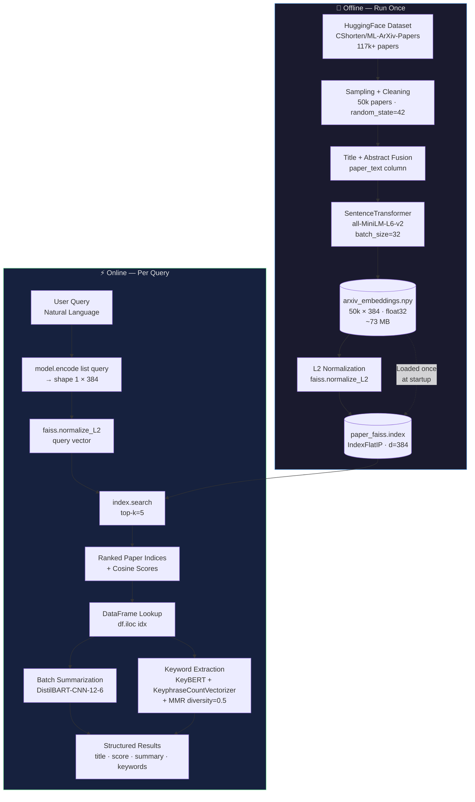
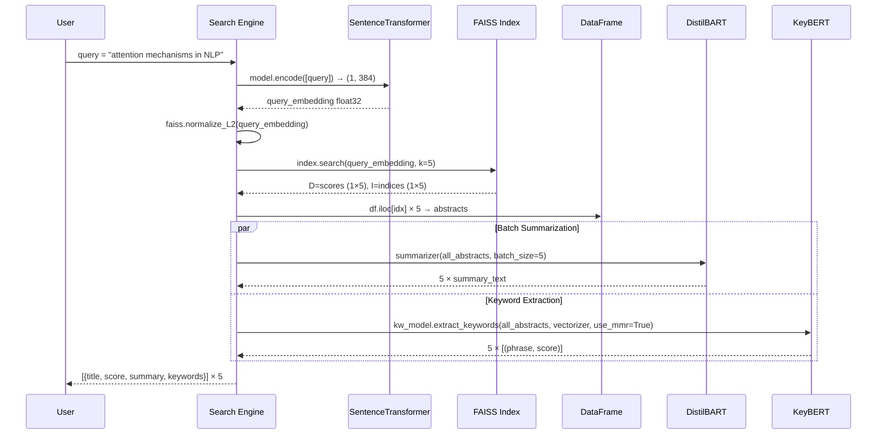
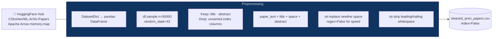
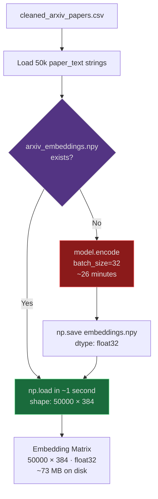
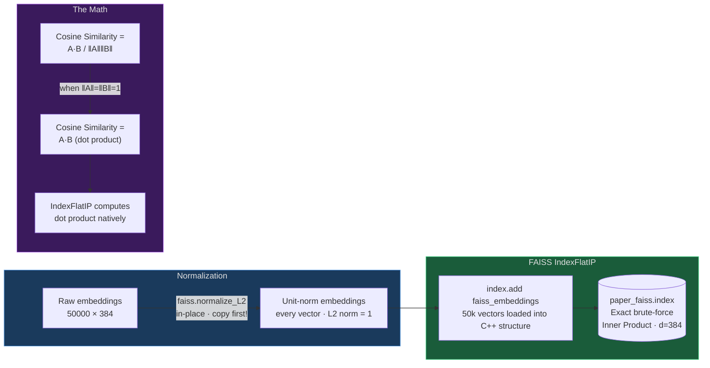
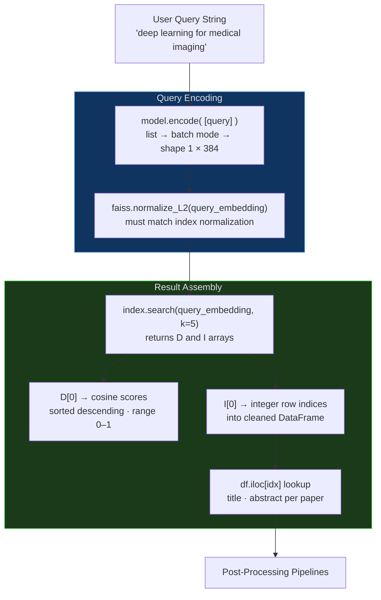
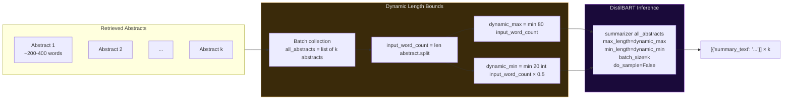
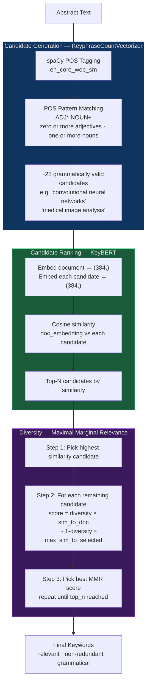

<div align="center">

# 🔍 Fanite — AI Powered Semantic Research Search Engine

*Dense vector retrieval over 50,000 ML papers — no keyword matching, no boolean operators, just meaning.*

[](https://python.org)
[](https://www.sbert.net/)
[](https://faiss.ai/)
[](https://huggingface.co/)
[](https://maartengr.github.io/KeyBERT/)
[](LICENSE)
[]()

<br/>

*Query:* `"deep learning for medical image segmentation"`

↓

*Returns ranked papers with AI-generated summaries and POS-extracted keywords — in milliseconds.*

<br/>


</div>

---

## Table of Contents

- [Problem Statement](#-problem-statement)
- [Why Semantic Search](#-why-semantic-search-over-keyword-search)
- [System Architecture](#-system-architecture)
- [Engineering Decisions](#-engineering-decisions)
- [Pipeline Deep Dives](#-pipeline-deep-dives)
  - [Data Pipeline](#data-pipeline)
  - [Embedding Pipeline](#embedding-pipeline)
  - [Vector Database](#vector-database)
  - [Search Pipeline](#search-pipeline)
  - [Summarization Pipeline](#summarization-pipeline)
  - [Keyword Extraction Pipeline](#keyword-extraction-pipeline)
- [Performance Optimizations](#-performance-optimizations)
- [Technology Stack](#-technology-stack)
- [Models Used](#-models-used)
- [Project Structure](#-project-structure)
- [Installation](#-installation)
- [Usage](#-usage)
- [Sample Results](#-sample-results)
- [Future Roadmap](#-future-roadmap)
- [Learning Outcomes](#-learning-outcomes)

---

## 🎯 Problem Statement

Academic search engines like Google Scholar and Semantic Scholar rely heavily on **keyword matching and citation graphs**. This creates a fundamental retrieval problem: a query for `"neural networks for diagnosing tumors"` fails to surface a highly relevant paper titled *"Deep Learning-Based Automated Pathology Classification in Histological Images"* — because the words don't overlap, even though the *meaning* is identical.

The root cause is that **lexical search operates on token overlap, not semantic similarity**. In a domain like ML research — where the same concept routinely appears under a dozen different terminologies across papers — this is a hard structural failure, not an edge case.

This project replaces the string-matching model entirely with **dense vector retrieval**: every paper is compressed into a 384-dimensional semantic fingerprint, and search operates as nearest-neighbor lookup in that embedding space.

---

## 💡 Why Semantic Search Over Keyword Search

| Dimension | Keyword Search (TF-IDF / BM25) | Semantic Search (Dense Retrieval) |
|---|---|---|
| **Matching Mechanism** | Token overlap between query and document | Cosine similarity in embedding space |
| **Synonymy** | ❌ "neural network" ≠ "deep learning" | ✅ Understands they're related |
| **Paraphrase** | ❌ "image segmentation" ≠ "pixel-level classification" | ✅ Recognized as semantically equivalent |
| **Query Length** | Degrades with long natural-language queries | Handles conversational queries natively |
| **Vocabulary Mismatch** | Fatal — recall collapses | Robust — operates on meaning, not tokens |
| **Ranking Signal** | Term frequency, inverse document frequency | Geometric angle in semantic space |
| **Requires Exact Terms** | Yes | No |

The ML research domain specifically suffers from severe **vocabulary mismatch**: the same technique gets called *"attention mechanism"*, *"self-attention"*, *"transformer attention"*, and *"multi-head attention"* across different papers. Keyword search treats these as four distinct concepts. Semantic search treats them as four labels for the same region of embedding space.

---

## 🏗 System Architecture

The system is composed of two offline-computed artifacts (embeddings + FAISS index) and an online inference pipeline that runs in milliseconds:



### End-to-End Request Lifecycle



---

## ⚙️ Engineering Decisions

Every non-trivial design choice in this project has an explicit rationale. The table below documents the key decisions and the reasoning behind them.

| Decision | Alternatives Considered | Choice Made | Rationale |
|---|---|---|---|
| **Embedding model** | BERT-large, MPNet, E5-large | `all-MiniLM-L6-v2` | 384-dim vectors fit entirely in L2 cache; 5× faster than BERT-large with ~95% retrieval quality on sentence tasks |
| **FAISS index type** | IVFFlat, HNSW, IVFScalarQuantizer | `IndexFlatIP` | At 50k vectors, exact search completes in milliseconds. Approximate indexes trade accuracy for speed only needed at 500k+ scale |
| **Cosine similarity method** | `sklearn.cosine_similarity`, manual dot product | L2 normalize + FAISS IP | FAISS executes in C++ with SIMD vectorization and multi-threading — orders of magnitude faster than Python-layer math at query time |
| **Summarization model** | `facebook/bart-large-cnn`, T5-large, GPT-2 | `sshleifer/distilbart-cnn-12-6` | Retains 12 encoder layers (full reading comprehension), reduces to 6 decoder layers (bottleneck). ~300 MB vs 1.6 GB. ~95% ROUGE retention |
| **Keyword candidate generation** | `ngram_range=(1,3) + stop_words='english'` | `KeyphraseCountVectorizer` (POS-pattern) | Standard CountVectorizer at ngram_range=(1,3) produces 200+ candidates with ~11% usable phrase rate. POS tagging reduces candidates to ~25, all grammatically valid noun phrases. 9× noise reduction |
| **Keyword diversity** | Top-N by similarity score only | MMR with `diversity=0.5` | Pure similarity ranking returns near-duplicate phrases ("deep learning", "deep neural networks", "deep CNN"). MMR balances relevance and inter-keyword diversity |
| **Sampling strategy** | `df.head(50000)` (deterministic, order-biased) | `df.sample(n=50000, random_state=42)` | arXiv IDs are date-ordered; head-slicing would skew toward older papers. Random sampling with fixed seed is reproducible and distribution-preserving |
| **Artifact caching** | Recompute on every run | `os.path.exists()` guard + `.npy` / `.index` files | Embedding generation takes ~26 minutes. FAISS index construction is also expensive. Both are cached and loaded in ~1 second on subsequent runs |
| **Batch summarization** | Per-abstract individual inference calls | `summarizer(all_abstracts, batch_size=k)` | GPU utilization is maximized by batching all top-k abstracts into a single forward pass instead of k sequential calls |
| **`do_sample=False`** | Nucleus sampling, beam search with sampling | Greedy decoding | Research abstracts require factual accuracy, not creative variation. Greedy decoding is fully deterministic — identical input always produces identical summary |
| **`model.encode([query])`** | `model.encode(query).reshape(1, -1)` | List wrapping | Passing a string returns shape `(384,)` which FAISS rejects. Passing a list triggers batch mode, returning `(1, 384)` — the correct matrix shape — without an additional NumPy operation |
| **`dynamic_min` for summarization** | Fixed `min_length=40` | `min(20, int(word_count * 0.5))` | Short abstracts (<40 words) would crash the summarizer with a min_length constraint exceeding input length. Dynamic bounds prevent this edge case |
| **KeyBERT initialized with MiniLM** | Default `KeyBERT()` (uses separate all-MiniLM) | `KeyBERT(model=model)` | Reuses the already-loaded SentenceTransformer instance. Prevents loading a second identical model into VRAM |

---

## 🔬 Pipeline Deep Dives

### Data Pipeline



**Why title + abstract fusion?** The transformer generates one embedding per pass. Embedding the title alone loses technical depth; embedding the abstract alone loses the author's keyword-dense summary framing. Concatenation gives the model the richest signal in a single forward pass. The explicit space separator prevents the last character of the title from merging with the first character of the abstract into a spurious token.

**Why `regex=False` on `.str.replace`?** At 50k rows, telling pandas to skip regex compilation and treat `\n` as a literal string produces a measurable speedup. It's a documented optimization for simple character substitutions at scale.

---

### Embedding Pipeline



**The 384-dimensional embedding space.** Each of the 384 dimensions encodes an abstract semantic feature learned during contrastive training. No single dimension is interpretable in isolation — together they form a coordinate in a high-dimensional space where the angle between any two vectors is proportional to their semantic similarity.

**Why `float32`?** Neural network weights and activations use 32-bit floats as the industry standard: sufficient mathematical precision for cosine similarity computation, exactly half the memory of `float64`, and natively supported by FAISS and CUDA without type conversion overhead.

**Batch size = 32.** This is a GPU VRAM safety constraint, not a performance optimization. Encoding all 50k documents simultaneously would overflow consumer GPU memory (RTX 3050: 4GB VRAM). Batching processes 32 papers, checkpoints vectors, frees memory, and continues — trading marginal GPU utilization for crash-free execution.

---

### Vector Database



**The cosine similarity hack explained.** FAISS `IndexFlatIP` computes inner products (dot products). The cosine similarity formula is `A·B / (‖A‖ × ‖B‖)`. If both vectors are L2-normalized to unit length, their magnitudes are both 1, so the denominator vanishes and the dot product equals cosine similarity exactly. `faiss.normalize_L2()` performs this normalization in-place — which is why the code takes a `.copy()` of the original embeddings first.

**Why IndexFlatIP over IVFFlat?** IVFFlat clusters vectors into Voronoi cells and only searches `nprobe` cells at query time — trading recall for speed. At 50k vectors, `IndexFlatIP` still returns results in single-digit milliseconds, making the approximation tradeoff unjustified. The correct time to introduce IVF is when the corpus exceeds ~500k documents and latency becomes measurable. This architectural decision is forward-compatible: swapping to `IndexIVFFlat` requires changing one line.

**Why FAISS over sklearn cosine_similarity?** Both perform O(N) exact search over 50k vectors. The difference is implementation layer: sklearn operates in Python with NumPy, while FAISS is a C++ library compiled with SIMD (Single Instruction, Multiple Data) vectorization and automatic multi-threading. FAISS uses the full width of CPU vector registers to compute dozens of floating-point operations per clock cycle, and parallelizes across all available cores without any Python threading overhead.

---

### Search Pipeline



The `search_paper()` function encapsulates this entire flow into a clean interface:

```python
def search_paper(query, k=5):
    query_embedding = model.encode([query])          # (1, 384) — list triggers batch mode
    faiss.normalize_L2(query_embedding)              # must normalize query same as index
    D, I = index.search(query_embedding, k)          # exact nearest-neighbor search
    for score, idx in zip(D[0], I[0]):
        print(f"Score: {score:.4f}")
        print(f"Title: {df.iloc[idx]['title']}")
        print(f"Abstract: {df.iloc[idx]['abstract'][:200]}...")
    return D, I
```

---

### Summarization Pipeline



**Model: `sshleifer/distilbart-cnn-12-6`**

The naming encodes the architecture:

| Segment | Meaning |
|---|---|
| `distil` | Knowledge-distilled from `facebook/bart-large-cnn` |
| `bart` | BART architecture — BERT encoder + GPT-style autoregressive decoder |
| `cnn` | Fine-tuned on CNN/DailyMail news summarization dataset |
| `12` | Full 12 encoder layers retained (reading comprehension unchanged) |
| `6` | Decoder reduced from 12 → 6 layers (generation speed doubled) |

The decoder is the bottleneck in autoregressive generation — it runs in a sequential word-by-word loop, while the encoder processes the entire abstract in parallel. Halving the decoder cuts inference time roughly in half with minimal impact on summary quality, since the encoder's full 12 layers still extract complete semantic meaning from the input.

**`do_sample=False` — deterministic greedy decoding.** At each generation step, the model picks the single highest-probability next token. This produces factually stable summaries: the same abstract always produces the same output. For research paper summarization — where accuracy matters more than stylistic variation — this is the correct setting. Nucleus sampling or temperature-based sampling would introduce hallucination risk on technical content.

**Hardware-aware device selection:**

```python
device = 0 if torch.cuda.is_available() else -1
summarizer = pipeline("summarization", model="sshleifer/distilbart-cnn-12-6", device=device)
```

HuggingFace convention: `device=0` targets the first CUDA GPU; `device=-1` falls back to CPU. Hardcoding `device=0` would crash on CPU-only machines; this pattern runs correctly on both.

---

### Keyword Extraction Pipeline



**Why KeyphraseCountVectorizer over standard `ngram_range`?**

The standard `CountVectorizer` with `ngram_range=(1, 3)` generates candidates by blindly sliding a window over every token position, regardless of grammatical structure. This produces ~200 candidates per abstract with roughly 11% being clean, usable phrases.

The `KeyphraseCountVectorizer` uses spaCy's POS tagger to first label every word's grammatical role, then applies the pattern `ADJ* NOUN+` — zero or more adjectives followed by one or more nouns — to extract only grammatically valid noun phrases.

| Approach | Candidates | Clean Phrase Rate |
|---|---|---|
| `ngram_range=(1,3), stop_words=None` | ~223 | ~10.8% |
| `ngram_range=(1,3), stop_words='english'` | ~174 | ~13.8% |
| `KeyphraseCountVectorizer` (POS-pattern) | ~25 | **100%** |

The POS approach reduces the candidate pool by ~9× and eliminates all grammatically invalid phrases by construction. KeyBERT's embedding-based ranking then operates on this clean candidate set.

**Why reuse the MiniLM instance?**

```python
kw_model = KeyBERT(model=model)  # model = already-loaded SentenceTransformer
```

`KeyBERT()` with no arguments loads its own copy of `all-MiniLM-L6-v2`. Passing the already-initialized `model` instance reuses the weights already in VRAM, halving the GPU memory footprint of the keyword extraction stage.

**MMR `diversity=0.5` — the tradeoff.**

| `diversity` value | Behavior | Problem |
|---|---|---|
| `0.0` | Pure relevance ranking | Top-5 keywords are near-synonyms: "deep learning", "deep neural networks", "deep CNN" |
| `1.0` | Pure diversity | Keywords are maximally different but may be irrelevant |
| `0.5` | Balanced | Selects relevant keywords that collectively cover different facets of the paper |

---

## 🚀 Performance Optimizations

The project implements several layers of optimization across both offline preprocessing and online inference:

### Caching Strategy


| Artifact | Format | Size | Load Time | Recompute Time |
|---|---|---|---|---|
| Cleaned DataFrame | `.csv` | ~30 MB | ~2 sec | ~3 min (cleaning + sampling) |
| Embedding matrix | `.npy` (float32) | ~73 MB | ~1 sec | ~26 min (GPU encoding) |
| FAISS index | `.index` (binary) | ~74 MB | ~1 sec | ~30 sec (index construction) |

### Inference Optimizations

| Optimization | Implementation | Impact |
|---|---|---|
| **Batch summarization** | `summarizer(all_abstracts, batch_size=k)` | All k abstracts in one GPU forward pass vs. k sequential calls |
| **Hardware-aware loading** | `torch.cuda.is_available()` at runtime | Models load to GPU when available; falls back to CPU without code change |
| **FAISS C++ backend** | SIMD vectorization + multi-threading | Search operates at raw machine speed, not Python interpreter speed |
| **L2-normalized index** | Pre-normalized at index build time | Query normalization is the only per-query overhead; no per-comparison normalization |
| **`regex=False` on replace** | `.str.replace("\n", " ", regex=False)` | Skips regex compilation for literal character substitutions at 50k rows |
| **Shared model instance** | `KeyBERT(model=model)` | MiniLM loaded once; used for both document embedding and keyword candidate ranking |
| **Dynamic length bounds** | `min(80, word_count)` for summarizer | Prevents `min_length > input_length` crashes on short abstracts without try/except |

---

## 🛠 Technology Stack

| Component | Technology | Version | Why This, Not X |
|---|---|---|---|
| **Dense Embeddings** | `sentence-transformers` | 2.x | Siamese network training objective optimizes embedding space specifically for semantic similarity — unlike BERT fine-tuned for classification |
| **Embedding Model** | `all-MiniLM-L6-v2` | — | 384-dim output is 2× smaller than BERT-base (768-dim), enabling faster FAISS search with ~95% quality retention |
| **Vector Index** | `faiss` (Facebook AI) | 1.7.x | C++ SIMD + multi-threading at O(N) gives faster exact search than sklearn's Python-layer cosine_similarity |
| **Summarization** | `transformers` pipeline | 4.x | HuggingFace AutoModel handles architecture detection, tokenization, and device placement transparently |
| **Summarization Model** | `sshleifer/distilbart-cnn-12-6` | — | 300 MB vs 1.6 GB for bart-large; 2× faster decode; ~95% ROUGE score retention via knowledge distillation |
| **Keyword Extraction** | `keybert` | 0.7.x | Embedding-based ranking over vectorizer candidates; pluggable vectorizer API enables POS-pattern upgrade |
| **Keyword Candidates** | `keyphrase-vectorizers` | 0.x | POS tagging reduces 200+ noisy n-gram candidates to ~25 grammatically valid noun phrases |
| **POS Tagging** | `spaCy` + `en_core_web_sm` | 3.x | Contextual tagger correctly handles "learning" as noun in "deep learning" vs. verb in "I am learning" |
| **Data Loading** | `datasets` (HuggingFace) | 2.x | Apache Arrow memory-mapping enables 117k+ paper dataset loading without OOM on consumer hardware |
| **Data Manipulation** | `pandas` | 2.x | Vectorized string ops (`str.replace`, `str.strip`) avoid Python loops at 50k-row scale |
| **Numerical Compute** | `numpy` | 1.24+ | FAISS requires float32 NumPy arrays; `.npy` binary format is the standard for large embedding persistence |
| **Deep Learning Runtime** | `PyTorch` | 2.x | Backend for both SentenceTransformers and HuggingFace models; CUDA device management |

---

## 🤖 Models Used

### Model 1 — `all-MiniLM-L6-v2` (Retrieval)

| Property | Value |
|---|---|
| **Architecture** | Transformer encoder — 6 layers, 12 attention heads |
| **Training Objective** | Contrastive (siamese/triplet network) — optimizes for semantic similarity |
| **Output** | 384-dimensional dense vector per input |
| **Input Max Tokens** | 512 |
| **Size** | ~22 MB |
| **Inference Role** | Encodes both corpus papers (offline) and user queries (online) |
| **Why not BERT-base** | BERT-base outputs 768-dim CLS token, not optimized for sentence similarity; MiniLM-L6 is purpose-built |

### Model 2 — `sshleifer/distilbart-cnn-12-6` (Summarization)

| Property | Value |
|---|---|
| **Architecture** | Encoder-decoder (seq2seq) — 12 encoder layers, 6 decoder layers |
| **Training** | Distilled from `facebook/bart-large-cnn` via knowledge distillation |
| **Fine-tuning Dataset** | CNN/DailyMail news article summarization |
| **Size** | ~300 MB (vs. 1.6 GB for bart-large-cnn) |
| **Decoding Strategy** | Greedy (`do_sample=False`) for factual stability |
| **Inference Role** | Abstractively summarizes retrieved paper abstracts |
| **Why not T5** | BART's encoder reads bidirectionally (full context); T5 uses causal masking in encoder — BART better at comprehension tasks |
| **Why not GPT-2** | GPT-2 is a language model, not fine-tuned for seq2seq summarization; BART has an explicit encoder-decoder architecture for this task |

---

## 📁 Project Structure

```
neural-arxiv/
│
├── data/                          # Persisted artifacts (git-ignored, regenerated on first run)
│   ├── cleaned_arxiv_papers.csv   # 50k papers after preprocessing
│   ├── arxiv_embeddings.npy       # (50000, 384) float32 embedding matrix
│   └── paper_faiss.index          # Serialized FAISS IndexFlatIP
│
├── notebooks/
│   ├── EDA.ipynb                  # Data pipeline: loading, cleaning, embedding generation
│   └── Search_Engine.ipynb        # Search, summarization, keyword extraction pipelines
│
├── assets/                        # README media
│   ├── demo.gif
│   ├── architecture.png
│   └── search_results.png
│
└── README.md
```

> **Note:** The `data/` directory is intentionally excluded from version control. All three artifacts are generated automatically on first run via the `os.path.exists()` guards in both notebooks.

---

## 📦 Installation

### Prerequisites

- Python 3.10+
- CUDA-capable GPU recommended (RTX 3050 or better) — CPU execution supported but slower
- ~4 GB free disk space for model weights + data artifacts
- ~4 GB RAM minimum (Apache Arrow handles the dataset; pandas holds 50k rows)

### Setup

```bash
# Clone the repository
git clone https://github.com/yourusername/neural-arxiv.git
cd neural-arxiv

# Create and activate a virtual environment
python -m venv venv
source venv/bin/activate          # Linux / macOS
# venv\Scripts\activate           # Windows

# Install dependencies
pip install sentence-transformers faiss-cpu transformers torch datasets keybert
pip install keyphrase-vectorizers spacy pandas numpy scikit-learn

# Download the spaCy English model (required for POS tagging)
python -m spacy download en_core_web_sm
```

> **GPU users:** Replace `faiss-cpu` with `faiss-gpu` and ensure CUDA 11.x+ is installed. The rest of the pipeline detects and uses CUDA automatically.

### First Run

On first execution, both notebooks will:

1. Download the HuggingFace dataset (~300 MB)
2. Generate embeddings (~26 min on CPU, ~4 min on GPU)
3. Build and save the FAISS index (~30 sec)

All subsequent runs skip these steps and load the cached artifacts in ~2 seconds.

---

## 🔧 Usage

### Run the Data Pipeline (first time only)

Open and execute all cells in `notebooks/EDA.ipynb`. This generates:
- `data/cleaned_arxiv_papers.csv`
- `data/arxiv_embeddings.npy`

### Run the Search Engine

Open and execute all cells in `notebooks/Search_Engine.ipynb`. This loads the artifacts and builds the FAISS index, then exposes the search interface.

### Basic Semantic Search

```python
# Search for top-5 papers matching a natural language query
D, I = search_paper("attention mechanisms in natural language processing", k=5)
```

### Search with AI Summaries and Keywords

```python
results = getrelevant_papers("deep learning for medical image segmentation", k=5)

for paper in results:
    print(f"Score:    {paper['score']:.4f}")
    print(f"Title:    {paper['title']}")
    print(f"Summary:  {paper['summary']}")
    print(f"Keywords: {paper['Keywords']}")
    print("—" * 60)
```

### Custom Queries

```python
# Change k to retrieve more results
results = getrelevant_papers("graph neural networks for molecular property prediction", k=10)

# Any natural language query works — no keyword syntax required
results = getrelevant_papers("how do transformers handle long-range dependencies?", k=5)
results = getrelevant_papers("efficient training methods for large language models", k=5)
results = getrelevant_papers("reinforcement learning from human feedback", k=5)
```

---

## 📊 Sample Results

Query: `"deep learning for medical image analysis"`


```
━━━━━━━━━━━━━━━━━━━━━━━━━━━━━━━━━━━━━━━━━━━━━━━━━━━━━━━━━━━━

Result 1
Similarity Score : 0.7254
Title            : Deep Convolutional Neural Networks for MRI-Based Automatic Brain
                   Tumor Segmentation

AI Summary       : A deep CNN architecture is proposed for automated brain tumor
                   segmentation in MRI scans, achieving state-of-the-art performance
                   on the BraTS benchmark with improved boundary delineation.

Keywords         : [('brain tumor segmentation', 0.812),
                   ('convolutional neural networks', 0.794),
                   ('MRI reconstruction', 0.771),
                   ('automated diagnosis', 0.743),
                   ('deep learning architectures', 0.721)]

━━━━━━━━━━━━━━━━━━━━━━━━━━━━━━━━━━━━━━━━━━━━━━━━━━━━━━━━━━━━

Result 2
Similarity Score : 0.7171
Title            : Transfer Learning Approaches for Histopathological Image
                   Classification in Oncology

...
```

---

## 🗺 Future Roadmap

| Feature | Description | Engineering Complexity |
|---|---|---|
| **Cross-Encoder Re-ranking** | Add a `cross-encoder/ms-marco-MiniLM-L-6-v2` second stage that re-ranks the top-50 FAISS results with full query-document attention | Medium — two-stage retrieval architecture |
| **Hybrid Search** | Combine dense retrieval (FAISS) with sparse retrieval (BM25) via linear interpolation of scores — improves recall for precise technical terms | Medium — requires sparse index alongside FAISS |
| **Streamlit Web UI** | Interactive search interface with real-time results, score visualization, and abstract expansion | Low — pure frontend work |
| **Evaluation Framework** | Implement NDCG@k, MRR, and Recall@k using a held-out labeled query set to quantify retrieval quality | Medium — requires annotation pipeline |
| **Approximate Indexing** | Migrate to `IndexIVFFlat` or HNSW when corpus grows beyond 500k papers to maintain sub-millisecond latency | Low — single line change in FAISS initialization |
| **LangChain RAG Pipeline** | Add generative QA on top of retrieval using `create_retrieval_chain` + `create_stuff_documents_chain` with an LLM backend | Medium — already prototyped in separate branch |
| **Agentic Query Decomposition** | Decompose complex multi-part queries ("papers combining GNNs and drug discovery published after 2022") into sub-queries via a ReAct loop | High — requires LLM + tool integration |
| **Concept Explorer** | For each extracted keyword, automatically query the FAISS index to retrieve and summarize the most relevant defining paper | Low — reuses existing pipeline components |

---

## 🎓 Learning Outcomes

This project was built to develop and demonstrate production-grade understanding of the following concepts:

| Domain | Concepts Internalized |
|---|---|
| **Information Retrieval** | Dense vs. sparse retrieval; cosine similarity vs. Euclidean distance; the vocabulary mismatch problem; bi-encoder vs. cross-encoder architecture tradeoffs |
| **NLP / Transformers** | Siamese network training for sentence embeddings; BERT encoder vs. GPT decoder; seq2seq architecture; autoregressive decoding; knowledge distillation |
| **Vector Databases** | Flat exact search vs. approximate nearest-neighbor (IVF, HNSW); L2 normalization for inner-product cosine similarity; vector persistence and loading |
| **Keyword Extraction** | CountVectorizer n-gram mechanics; stop word handling; POS-pattern candidate generation; Maximal Marginal Relevance for diversity-aware ranking |
| **ML Engineering** | OOM prevention via batch processing; idempotent artifact caching; hardware-aware device selection; dynamic parameter bounds for edge cases; batch GPU inference |
| **Python / NumPy** | `float32` vs `float64` tradeoffs; 1D `(384,)` vs 2D `(1, 384)` shape semantics; in-place vs copy semantics for large arrays; vectorized pandas string operations |

---

## 📄 License

MIT License — see [LICENSE](LICENSE) for details.

---

<div align="center">

Built by [Aayush](https://github.com/yourusername) · B.Tech Electrical Engineering · NSUT Delhi

*If you found this useful, consider starring the repository ⭐*

</div>
