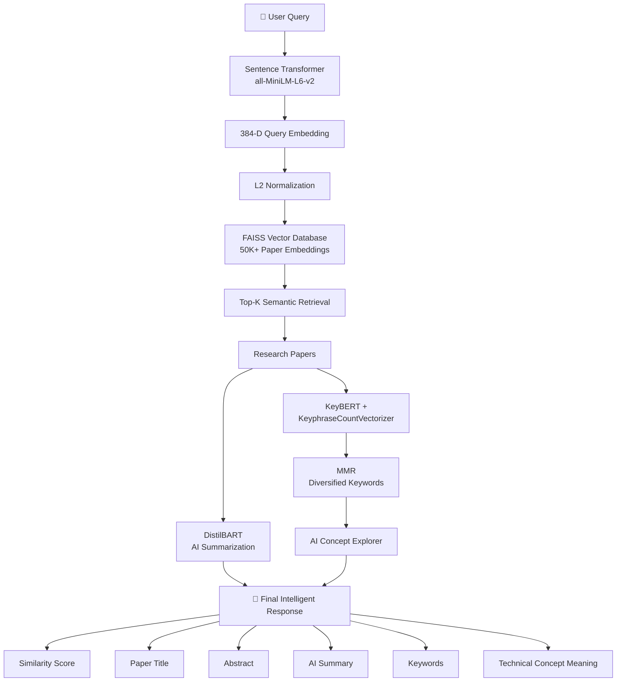

<div align="center">

# 🚀 Fanite
### AI-Powered Semantic Research Assistant

### *Search Research Papers by Meaning, Not Keywords.*

<p align="center">
An end-to-end AI-powered semantic search engine capable of retrieving, summarizing, and explaining Machine Learning research papers using Transformer-based embeddings, FAISS Vector Search, Generative AI, and Technical Concept Exploration.
</p>

---


---

🎥 **Demo**

> *(Insert GIF here showing the complete search workflow)*


</div>

---

# 📖 Overview

Finding relevant research papers has become increasingly difficult as the volume of scientific literature continues to grow.

Traditional search engines primarily rely on **keyword matching**, meaning they often fail whenever the user's wording differs from the author's wording.

For example,

```
User Query

"AI for detecting cancer from scans"
```

may completely miss a paper titled

```
"Deep Learning for Medical Image Analysis"
```

despite both discussing the same concept.

---

## 💡 Fanite solves this problem using Semantic Search.

Instead of matching **words**, Fanite matches **meaning**.

Using Transformer-based embeddings, every research paper is converted into a dense numerical representation inside a high-dimensional semantic space.

When a user submits a query, Fanite retrieves papers whose **semantic meaning** is closest to the query, even if they share very few common keywords.

The retrieved papers are then enhanced using Generative AI to provide:

- 📄 AI-generated summaries
- 🔑 Keyphrase extraction
- 📚 Contextual explanation of technical concepts
- 📈 Similarity scores
- ⚡ Millisecond semantic retrieval

---

# ✨ Features

## 🧠 Semantic Search

Searches papers based on **meaning** rather than exact keywords using Sentence Transformers and dense vector embeddings.

---

## ⚡ High-Speed Vector Retrieval

Uses **Meta's FAISS Vector Database** to perform efficient nearest-neighbor search over 50,000+ research paper embeddings.

---

## 🤖 AI-Powered Summarization

Generates concise research paper summaries using **DistilBART**, allowing users to quickly understand a paper without reading the complete abstract.

---

## 🔑 Intelligent Keyphrase Extraction

Extracts meaningful research concepts using **KeyBERT** together with **KeyphraseCountVectorizer** and **MMR (Maximal Marginal Relevance)** to avoid redundant keywords.

---

## 📚 AI Concept Explorer

Automatically provides contextual explanations for extracted technical concepts, enabling users to understand unfamiliar Machine Learning terminology without leaving the application.

Examples:

```
Transformer
↓

Attention-based neural architecture introduced in
"Attention Is All You Need"

----------------------------

FAISS
↓

Facebook AI Similarity Search —
A highly optimized vector similarity library
developed by Meta.

----------------------------

PyTorch
↓

Open-source Deep Learning framework
developed by Meta.
```

---

## 🚀 Production-Oriented Optimizations

- Cached embeddings using `.npy`
- Cleaned dataset stored separately to avoid repeated preprocessing
- Batch Transformer inference for efficient summarization
- L2 Normalization for exact cosine similarity search
- Modular offline and online pipelines
- Memory-efficient float32 embeddings

---

# 🎯 Key Highlights

| Feature | Implementation |
|----------|----------------|
| Dataset | 50,000+ Machine Learning Research Papers |
| Search Type | Semantic Search |
| Embedding Model | all-MiniLM-L6-v2 |
| Embedding Size | 384 Dimensions |
| Vector Database | FAISS IndexFlatIP |
| Similarity Metric | Cosine Similarity |
| Summarization | DistilBART |
| Keyword Extraction | KeyBERT + KeyphraseCountVectorizer |
| Keyword Diversification | MMR |
| Concept Explanation | AI Concept Explorer |
| Embedding Storage | NumPy (.npy) |
| Language | Python |

---

# 🏗️ System Architecture



---

# 🔄 End-to-End Workflow

```
Offline Pipeline (Runs Once)

Download Dataset
        │
        ▼
Data Cleaning & Preprocessing
        │
        ▼
Generate Embeddings
        │
        ▼
Store Embeddings (.npy)
        │
        ▼
Build FAISS Index
        │
        ▼
Ready for Search

═══════════════════════════════════════════

Online Pipeline (Runs Per Query)

User Query
        │
        ▼
Sentence Transformer
        │
        ▼
Query Embedding
        │
        ▼
FAISS Search
        │
        ▼
Top-K Research Papers
        │
        ├──────────────┐
        ▼              ▼

 AI Summary      Keyword Extraction
        │              │
        └──────┬───────┘
               ▼

     AI Concept Explorer

               ▼

     Rich Search Results
```

---

# 📊 Why Semantic Search?

| Traditional Keyword Search | Fanite Semantic Search |
|----------------------------|------------------------|
| Exact word matching | Understands meaning |
| Misses synonyms | Retrieves semantically related papers |
| No contextual understanding | Learns contextual representations |
| Low recall | High semantic recall |
| Lexical similarity | Vector similarity |
| Text matching | Meaning matching |

---

> **"Search by meaning, not by keywords."**

This philosophy forms the core of Fanite.
