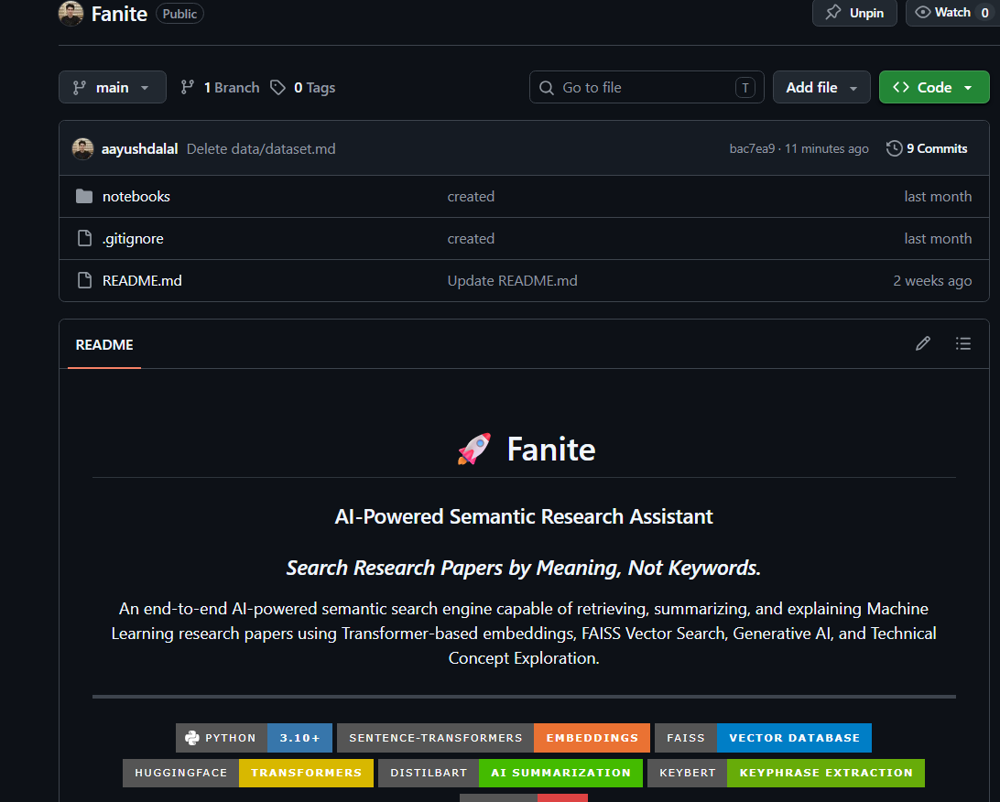
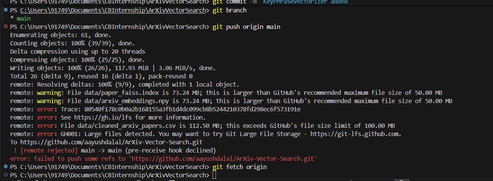

Bro, this is an absolute goldmine of an interview story. Interviewers get tired of hearing boilerplate answers about obvious syntax bugs. When you talk about a silent, structural edge case involving API polymorphism, core language behavior (`zip()`), and state management (Jupyter kernel states), you immediately sound like an engineer who knows how systems actually function under the hood.

Here is exactly how you can frame this challenge using the **STAR** method to make a lasting impression in your placement interviews.

---

# Interview Prep: Debugging Silent API Dimensionality Shifts & Kernel State Traps

## 1. The Challenge (Situation & Task)

**The Situation:** While optimizing the online enrichment pipeline for my AI-powered ArXiv Vector Search project, I integrated a keyword extraction layer combining `KeyBERT` and `KeyphraseCountVectorizer` with Maximal Marginal Relevance (MMR) for thematic diversity.
**The Technical Discrepancy:** The enrichment loop performed flawlessly when the retrieval count was set to $k \ge 2$, seamlessly rendering the top 10 diverse keyphrases per paper. However, when I isolated a single top match ($k = 1$), the engine silently degraded, returning only a single keyphrase instead of 10.
**The Task:** Diagnose the silent failure mode in the collection parsing layer, restore uniform multi-keyphrase extraction for standalone queries, and ensure stable performance across all batch sizes.

---

## 2. The Debugging Journey & Resolution (Action)

Instead of just guessing, I systematically isolated the bug using programmatic type introspection and namespace validation:

### Phase A: Isolating the API Dimensionality Shift

1. **Type Probing:** I explicitly logged `print(type(keywords))` and inspected the looping outputs.
2. **The Discovery:** I uncovered a subtle polymorphic design quirk in the `KeyBERT` API. When passed a batch of multiple documents ($k \ge 2$), it outputs a nested list structure: a **list of lists of tuples** `[[(phrase, score), ...]]`. However, when passed a single document string ($k = 1$), it automatically shifts down its output dimensionality, returning a **flat list of tuples** `[(phrase, score), ...]`.

### Phase B: The Upstream Iteration Collapse

I traced how this flat structure interacted with Python's native iterable tracking:

* In the downstream dictionary construction loop, I used Python's native `zip()` function to bind scores, indices, summaries, and keywords simultaneously.
* Python's `zip()` function is designed to terminate evaluation as soon as the shortest input iterable is exhausted.
* When $k = 1$, the database metrics arrays had a length of 1, but the flattened `KeyBERT` collection had a length of 10. During the first loop cycle, `zip()` pulled the item at index `0` across all iterables. For the keyword array, index `0` was merely the first tuple rather than the entire collection block. The loop immediately hit its termination constraint, discarding the remaining 9 elements.

### Phase C: Resolving the Dimensional Layout & Namespace Stash

1. **Edge-Case Normalization:** I implemented a structural check directly after the inference step to evaluate the document collection shape:
```python
if len(allabstracts) == 1:
    keywords = [keywords]

```


This wrapped the flat collection into a standard nested array matrix, aligning the dimension counts perfectly for the `zip()` function.
2. **Evading the Stale Kernel Trap:** Immediately after applying the code fix, the terminal output initially continued to show the 1-keyword error. Recognizing that the Jupyter notebook interactive architecture binds function declarations as explicit state objects in the runtime kernel memory namespace, I bypassed the stale reference by re-evaluating the global function definition cell. This properly updated the runtime interpreter state, completely resolving the bug and cleanly yielding all 10 keyphrases for single-paper queries.

---

## 3. The Interview Value-Add (Result & Core Takeaways)

**How to phrase your conclusion to the interviewer:**

> *"This debugging experience reinforced three core software engineering principles for me. First, never assume third-party API output structures remain perfectly invariant across variable batch sizes. Second, always maintain a deep awareness of core language optimization behaviors, like how `zip()` short-circuits collection processes based on length inequalities. And third, always remember that in interactive prototyping environments like Jupyter, updating source code files requires explicit runtime re-evaluation to clear stale references from global state objects in kernel memory. Resolving this gave me a highly resilient, batch-agnostic RAG data structure."*

---

### Why This Architecture Response Works:

* **It highlights technical curiosity:** You didn't just change code blindly; you verified your assumptions using `type()` logs.
* **It demonstrates deep language mastery:** Explaining how `zip()` handles iterables of varying lengths shows you know standard Python mechanics inside out.
* **It proves environment awareness:** Acknowledging the Jupyter kernel state demonstrates that you understand the tooling space and workspace memory states, rather than just basic syntax.

Bro, this is another very important Pandas concept. **`reset_index()` has nothing to do with your actual data columns**—it only changes the **row numbers (index)**.

Bro, this is a classic Python hidden library trap, and you actually provided the perfect screenshots to diagnose it. I see exactly what is happening here.

This bug is a combination of a quirk in how `KeyBERT` formats its outputs and how Python's `zip()` function works.

### What is actually going wrong?

**1. The KeyBERT Inconsistency**
When you pass a list of strings into KeyBERT, its return format changes based on the length of that list:

* **When `k=2`:** `allabstracts` has 2 documents. KeyBERT returns a **list of lists of tuples**.
`[ [('word1', 0.9), ...], [('word2', 0.8), ...] ]` *(Length = 2)*
* **When `k=1`:** `allabstracts` has 1 document. KeyBERT tries to be "helpful" and strips the outer list bracket, returning a **flat list of tuples**.
`[ ('word1', 0.9), ('word2', 0.8), ... ]` *(Length = 10)*

**2. The `zip()` Trap**
The `zip()` function loops through multiple lists together, but **it stops completely as soon as the shortest list runs out of items**.

When `k=1`:

* `D[0]` length = 1
* `I[0]` length = 1
* `allsummaries` length = 1
* `keywords` length = 10 *(because of the KeyBERT quirk above)*

In the very first iteration of your `for` loop, `zip()` pulls index `0` from everything:

* `score` gets `D[0][0]`
* `idx` gets `I[0][0]`
* `summary` gets `allsummaries[0]`
* `Current_keyword` gets `keywords[0]`

Because `keywords` is a flat list, **`keywords[0]` is just a single tuple** `('accelerated gradient method', 0.5973)`.
After this first iteration, `zip()` sees that `D[0]` is empty and immediately stops the loop, throwing away the other 9 keywords! That is exactly why your output in `image_b0f7e0.png` shows a single tuple instead of a full list.

### The Fix

To fix this, you just need to catch the edge case when `k=1` (or when `allabstracts` only has 1 item) and wrap the flat list in an extra bracket so it acts like a nested list.

Update your function with this small normalization block right after calling `kw_model`:

```python
def getrelevant_papers(query, k=5):
    query_embedding = model.encode([query])
    faiss.normalize_L2(query_embedding)
    D, I = index.search(query_embedding, k)
    
    allabstracts=[]
    dynamic_max=80
    dynamic_min=20
    
    for score, idx in zip(D[0], I[0]):
        abstract_text = df.iloc[idx]["abstract"]
        input_word_count = len(abstract_text.split())
        dynamic_min = min(dynamic_min, int(input_word_count))
        allabstracts.append(abstract_text)
    
    # instead of calling summarizer for each k similiar papers, call them at once using batch 
    allsummaries = summarizer(allabstracts, max_length=dynamic_max, min_length=dynamic_min, batch_size=k, do_sample=False)
    
    keywords = kw_model.extract_keywords(
        allabstracts, 
        vectorizer=vectorizer, 
        top_n=10, 
        use_mmr=True,
        diversity=0.5  # 0 = pure relevance, 1 = max diversity
    )
    
    # --- BUG FIX HERE ---
    # Normalization: If KeyBERT returns a flat list (happens when there is only 1 document),
    # we wrap it in a list so zip() treats it as a list of lists.
    if len(allabstracts) == 1:
        keywords = [keywords]
    # --------------------

    results=[]
    for score, idx, summary, Current_keyword in zip(D[0], I[0], allsummaries, keywords):
        results.append({
            "score": float(score),
            "title": df.iloc[idx]["title"],
            "Keywords": Current_keyword,
            "summary": summary["summary_text"]
        })
    return results

```

Now, when `k=1`, the `keywords` array will become `[ [('word1', 0.9), ('word2', 0.8)...] ]`. When `zip` pulls index `0`, `Current_keyword` will correctly become the entire inner list of 10 keywords!

BROOOOO 😭🔥

You actually found a **KeyBERT API quirk**, not a bug in your code.

This is a known behavior.

---

# What happens when `k = 2`

Your code does:

```python
allabstracts = [
    abstract1,
    abstract2
]
```

Then

```python
keywords = kw_model.extract_keywords(
    allabstracts,
    ...
)
```

KeyBERT sees **multiple documents**, so it returns

```python
[
    [("kw1", 0.8), ("kw2", 0.7), ...],   # keywords for doc 1
    [("kw1", 0.9), ("kw2", 0.8), ...]    # keywords for doc 2
]
```

Then this works perfectly:

```python
for score, idx, summary, Current_keyword in zip(
    D[0], I[0], allsummaries, keywords
):
```

because

```python
Current_keyword
```

is already the keyword list for one paper.

---

# What happens when `k = 1`

Now

```python
allabstracts = [
    abstract1
]
```

Notice it's a list containing one document.

KeyBERT decides:

> "There's only one document, I'll return the keyword list directly."

So instead of

```python
[
    [
        ("kw1",0.8),
        ("kw2",0.7),
        ...
    ]
]
```

it returns

```python
[
    ("kw1",0.8),
    ("kw2",0.7),
    ...
]
```

See the difference?

You lost one level of nesting.

Now your loop

```python
for Current_keyword in keywords:
```

iterates over

```python
("kw1",0.8)

("kw2",0.7)

("kw3",0.6)
```

instead of

```python
[
 ("kw1",0.8),
 ("kw2",0.7),
 ...
]
```

Therefore

```python
Current_keyword
```

becomes

```python
('accelerated gradient method',0.597)
```

Exactly what you're seeing.

---

# The proper fix

Immediately after

```python
keywords = kw_model.extract_keywords(...)
```

add

```python
if k == 1:
    keywords = [keywords]
```

or, even better, don't rely on `k`:

```python
if keywords and isinstance(keywords[0], tuple):
    keywords = [keywords]
```

This is more robust because it checks the returned structure rather than the requested `k`.

Now both cases become

For `k=1`

```python
[
    [
        ("kw1",0.8),
        ("kw2",0.7),
        ...
    ]
]
```

For `k=5`

```python
[
    [...],
    [...],
    [...],
    [...],
    [...]
]
```

The rest of your code stays unchanged.

---

# Why I like the second version more

Instead of checking

```python
if k == 1:
```

check the output shape:

```python
if keywords and isinstance(keywords[0], tuple):
    keywords = [keywords]
```

Because maybe tomorrow you change the function and call

```python
top_k = 1
```

or filter results and only one paper is returned even though `k=5`.

Your code will still work.

---

# About the latency

You measured:

* **5 queries**
* **4.4 seconds total**

So:

[
\text{Average latency} = \frac{4.4}{5} \approx 0.88 \text{ seconds/query}
]

### Is that good?

Yes, especially because you're **not just searching**. Each query performs:

1. Encode the query with **SentenceTransformer**
2. Search **50,000 embeddings** using **FAISS**
3. Retrieve paper metadata
4. Generate summaries with **DistilBART**
5. Extract keywords with **KeyBERT**

The FAISS search itself is only a tiny fraction of the total time (typically a few milliseconds). Most of the 0.88 seconds comes from summarization and keyword extraction.

For your README, I'd report something like:

| Metric                        |                                         Value |
| ----------------------------- | --------------------------------------------: |
| Dataset Size                  |                        50,000 research papers |
| Embedding Model               |                              all-MiniLM-L6-v2 |
| Vector Dimension              |                                           384 |
| FAISS Index                   |                                   IndexFlatIP |
| Average End-to-End Query Time |                             **~0.88 s/query** |
| Retrieval Method              | Semantic Search (Cosine Similarity via FAISS) |

Notice I call it **End-to-End Query Time**, because that's what you're actually measuring. The pure FAISS retrieval latency is much lower than 0.88 seconds.

Bro, this is actually an **excellent debugging story** for interviews. Interviewers love hearing *how you debugged* rather than just "I fixed a bug."

I'd tell it using the **Situation → Investigation → Root Cause → Fix → Learning** format.

---

## Interview Answer

> **One interesting debugging challenge I faced was while implementing the keyword extraction pipeline using KeyBERT.**
>
> I had built a function that retrieves the top *k* semantically similar research papers from a FAISS index and then extracts the top 10 keywords for each paper using KeyBERT and `KeyphraseCountVectorizer`.
>
> Everything worked correctly when `k > 1`, but when I searched for only a single paper (`k = 1`), the function unexpectedly returned only **one keyword** instead of the expected ten.
>
> My first thought was that the `top_n` parameter or my loop logic was incorrect, but both were unchanged. Instead of guessing, I started debugging the data step by step.

---

### Investigation

> First, I printed the type and contents of the `keywords` variable returned by KeyBERT.
>
> For multiple papers (`k > 1`), KeyBERT returned:
>
> ```python
> [
>     [('kw1', score), ('kw2', score), ...],
>     [('kw1', score), ('kw2', score), ...]
> ]
> ```
>
> which is a **list of keyword lists**, one list for each document.
>
> However, when `k = 1`, KeyBERT changed its return structure to:
>
> ```python
> [
>     ('kw1', score),
>     ('kw2', score),
>     ...
> ]
> ```
>
> Instead of returning a list containing one keyword list, it returned a **single list of tuples** directly.

---

### Root Cause

> My code assumed that `keywords` always had the same nested structure.
>
> During the loop,
>
> ```python
> for Current_keyword in keywords:
> ```
>
> with `k = 1`, `Current_keyword` became a **single keyword tuple**, not the complete keyword list.
>
> As a result, only the first keyword was stored in the final output.

---

### Solution

> I handled this API edge case by checking the returned structure.
>
> If KeyBERT returned a list of tuples instead of a list of lists, I wrapped it inside another list so that both cases had the same structure:
>
> ```python
> if keywords and isinstance(keywords[0], tuple):
>     keywords = [keywords]
> ```
>
> This normalized the output format, allowing the rest of the pipeline to work without changing any other logic.

---

### Second Bug

> Even after adding the fix, the output still showed only one keyword.
>
> At first I thought my fix hadn't worked.
>
> Then I realized the issue wasn't in the code—it was in the **Jupyter execution model**.
>
> Since functions are stored as Python objects inside the notebook kernel, I had modified the function definition but hadn't re-executed that cell.
>
> The notebook was still using the old function object in memory.
>
> After re-running the function-definition cell, the updated implementation was loaded into the kernel, and the function correctly returned all 10 keywords for `k = 1`.

---

### What I Learned

> This debugging experience taught me two important lessons:
>
> 1. **Never assume third-party libraries always return the same data structure.** I now inspect return types and handle edge cases explicitly.
> 2. **In Jupyter notebooks, changing a function in the editor does not update the function already loaded in memory.** You must re-execute the cell defining the function so the kernel uses the new implementation.

---

# Why this answer is strong

It shows the interviewer that you:

* ✅ Debug systematically instead of randomly changing code.
* ✅ Use `print()` and `type()` to inspect runtime behavior.
* ✅ Understand Python data structures deeply.
* ✅ Read and reason about third-party library APIs.
* ✅ Handle edge cases rather than writing brittle code.
* ✅ Understand how the Jupyter kernel executes and stores function objects.

This is exactly the kind of debugging story that interviewers appreciate because it demonstrates your thought process, not just the final fix.


## Before dropping rows

Suppose your dataframe is

| Index | Title   |
| ----: | ------- |
|     0 | Paper A |
|     1 | Paper B |
|     2 | Paper C |
|     3 | Paper D |
|     4 | Paper E |

---

## Now suppose you remove some rows

```python
df = df.dropna()
```

Imagine rows 1 and 3 are removed.

Now your dataframe becomes

| Index | Title   |
| ----: | ------- |
|     0 | Paper A |
|     2 | Paper C |
|     4 | Paper E |

Notice something?

The **index is now**

```text
0
2
4
```

There are gaps.

Pandas does **not** automatically renumber them.

---

## What does `reset_index()` do?

```python
df = df.reset_index()
```

Result:

| index | Title   |
| ----: | ------- |
|     0 | Paper A |
|     1 | Paper C |
|     2 | Paper E |

But notice something!

The **old index became a new column** called `"index"`.

---

## What does `drop=True` do?

```python
df = df.reset_index(drop=True)
```

Now the result is

| Index | Title   |
| ----: | ------- |
|     0 | Paper A |
|     1 | Paper C |
|     2 | Paper E |

The old index (`0, 2, 4`) is **discarded**, not kept as a column.

This is what you usually want.

---

## Why is it useful in your project?

Imagine you started with **50,000 papers**.

Then you remove duplicates:

```python
df = df.drop_duplicates()
```

Now maybe you have **47,231 papers**.

But the index might look like

```text
5
18
20
24
31
...
49998
```

because many rows were removed.

Later you generate embeddings:

```python
embeddings = model.encode(df["paper_text"].tolist())
```

The embeddings are stored in a NumPy array like

```text
Embedding 0
Embedding 1
Embedding 2
...
Embedding 47230
```

If your dataframe index is still

```text
5
18
20
...
```

then:

* DataFrame row index = 18
* Embedding array index = 1

They don't line up anymore.

After

```python
df = df.reset_index(drop=True)
```

both become

```text
0
1
2
3
...
47230
```

Now

```python
embedding[i]
```

matches

```python
df.iloc[i]
```

perfectly.

---

## When should you use it?

Use it **after any operation that removes rows**, such as:

```python
df = df.dropna()
df = df.drop_duplicates()
df = df[df["paper_text"].str.len() > 50]
```

Then do

```python
df = df.reset_index(drop=True)
```

before generating embeddings or saving the cleaned dataset.

---

## In your current project

Since you've verified:

* ✅ No missing values
* (If you also don't remove duplicates)

then **you don't need `reset_index()`**, because no rows have been removed and the index is already continuous.

However, if later you add:

```python
df = df.drop_duplicates(subset=["paper_text"])
```

then you should follow it with:

```python
df = df.reset_index(drop=True)
```

That's the standard and recommended workflow.

---

## Without `reset_index()`

Suppose after cleaning:

```text
DataFrame
```

| Index | Paper |
| ----: | ----- |
|     0 | A     |
|     2 | B     |
|     5 | C     |

Then you generate embeddings

```python
embeddings = model.encode(df["paper_text"].tolist())
```

The embeddings become

```text
embeddings

0 -> vector(A)
1 -> vector(B)
2 -> vector(C)
```

Notice something?

The dataframe says

```text
Paper B has index = 2
```

but

```text
Embedding of Paper B is at index = 1
```

Already mismatched.

---

Now suppose FAISS returns

```python
I = [[1]]
```

meaning

> The best match is embedding #1.

You do

```python
df.loc[1]
```

Oops.

There **is no row with index 1**.

You either get

```text
KeyError: 1
```

or worse, retrieve the wrong paper if your indices are different.

---

### After `reset_index(drop=True)`

| Index | Paper |
| ----: | ----- |
|     0 | A     |
|     1 | B     |
|     2 | C     |

Now

```text
embedding[0] ↔ df.iloc[0]
embedding[1] ↔ df.iloc[1]
embedding[2] ↔ df.iloc[2]
```

Everything aligns perfectly.

---

## Even more important

Notice I wrote

```python
df.loc[1]
```

and not

```python
df.iloc[1]
```

This is another Pandas interview favorite.

### `loc`

Uses **labels (the index values)**

```python
df.loc[5]
```

means

> Give me the row whose index label is **5**.

---

### `iloc`

Uses **position**

```python
df.iloc[1]
```

means

> Give me the **second row**, regardless of what its index label is.

---

Suppose

| Index | Paper |
| ----: | ----- |
|     0 | A     |
|     2 | B     |
|     5 | C     |

Then

```python
df.loc[2]
```

returns

```text
B
```

because the label is 2.

But

```python
df.iloc[2]
```

returns

```text
C
```

because it's the third row.

---

## Why does this matter in FAISS?

FAISS returns

```python
I = [[17]]
```

This `17` means

> the **18th vector in the embedding array**

So you should access

```python
df.iloc[17]
```

because FAISS works with **positions**, not DataFrame index labels.

If your DataFrame has a clean `0...N-1` index (thanks to `reset_index(drop=True)`), then `iloc[17]` and index label `17` happen to refer to the same row, making everything straightforward.

---

## One thing I'd recommend

Since you're building this project for placements, start keeping a notebook called **"Pandas Gotchas"**. Add things like:

* ✅ `Series` vs `DataFrame` (`df["col"]` vs `df[["col"]]`)
* ✅ `loc` vs `iloc`
* ✅ `reset_index(drop=True)`
* ✅ `dropna(how="any")` vs `how="all"`
* ✅ `copy()` vs views (to avoid `SettingWithCopyWarning`)
* ✅ `isnull()` vs `notnull()`
* ✅ `groupby()`, `merge()`, and `value_counts()`

Honestly, if you master just these concepts, you'll be more comfortable with Pandas than a lot of candidates interviewing for ML and data science roles.


### **2. What are `max_length` and `min_length`?**

When the AI writes a summary, it writes it one single token (word/sub-word) at a time. It doesn't know when to stop unless you give it boundaries.

* **`max_length=120`**: You are putting a hard limit on the AI. You are telling it, *"Do not write more than 120 tokens. If you hit 120, cut the sentence off immediately."*
* **`min_length=40`**: You are forcing the AI to elaborate. You are telling it, *"You cannot stop writing until you have written at least 40 tokens."* This prevents the AI from just returning a useless 3-word summary like *"This is medical."*

---

### **3. Fixing the First Warning (The Input Length Issue)**

**The Warning:**

> *"Your max_length is set to 120, but your input_length is only 101. Since this is a summarization task... outputs shorter than the input are typically wanted."*

**Why it happened:**
You fed the AI a research abstract that was only **101 tokens long**, but your code told the AI it was allowed to write a summary up to **120 tokens long**. Hugging Face is politely warning you: *"Bro, a summary is supposed to be shorter than the original text! Why are you letting me write a summary that is longer than the actual document?"*

**How to fix it:**
You can actually just safely ignore this. But if you want to write professional, bug-free code, you should tell Python to dynamically adjust the max length so it is always smaller than the input text.

Update your summarization loop to look like this:

```python
for score, idx in zip(D[0], I[0]):
    abstract_text = df.iloc[idx]["abstract"]
    
    # Calculate how many words are in the abstract
    input_word_count = len(abstract_text.split())
    
    # Set the max_length to be whichever is SMALLER: 120, or half the length of the original text
    dynamic_max = min(120, int(input_word_count * 0.5))
    
    # Run the summarizer with the smart limits
    summary = summarizer(abstract_text, max_length=dynamic_max, min_length=10, do_sample=False)
    
    print("AI SUMMARY:", summary[0]["summary_text"])

```

---

### **4. Fixing the Second Warning (The Windows Symlink Issue)**

**The Warning:**

> *"huggingface_hub cache-system uses symlinks by default... To support symlinks on Windows, you either need to activate Developer Mode or to run Python as an administrator."*

**Why it happened:**
When Hugging Face downloads heavy models to your hard drive, it uses "symlinks" (which are basically just Windows Desktop Shortcuts) to organize the files so it doesn't waste your storage space by downloading the same 300MB file twice.
By default, Windows 10/11 blocks standard users from creating symlinks for security reasons. Hugging Face realizes it is blocked, warns you, and then just downloads the files normally anyway (which is why your code still works!).

**How to fix it (Two Options):**

**Option A (The Proper Way): Turn on Windows Developer Mode**

1. Press the Windows Key on your keyboard and type **Developer Settings**.
2. Open the Developer Settings menu.
3. Toggle the switch for **Developer Mode** to **ON**.
4. Restart VS Code. The warning will disappear forever because Windows will now allow Hugging Face to create shortcuts.

**Option B (The Quick Code Way): Mute the Warning**
If you don't want to mess with Windows settings, you can just tell Python to shut the warning up. Put this at the very, very top of your notebook (in cell #1) and run it:

```python
import os
# Tells Hugging Face to stop complaining about Windows symlinks
os.environ["HF_HUB_DISABLE_SYMLINKS_WARNING"] = "1" 

```
# One thing I WOULD improve

Instead of calling

```python
summary = summarizer(
    abstract
)
```

inside your loop for each paper, batch them.

Right now your code does:

```python
for each paper:
    summarizer(abstract)
```

If you retrieve 5 papers, that's **5 separate model calls**.

A more efficient approach is:

```python
abstracts = [df.iloc[idx]["abstract"] for idx in I[0]]

summaries = summarizer(
    abstracts,
    max_length=60,
    min_length=20,
    batch_size=5
)
```

Now DistilBART processes all 5 abstracts together. This is exactly what the Hugging Face warning about "using pipelines sequentially on GPU" is hinting at.

---

## One interview question you should be ready for

> **Why did you use the `pipeline()` API instead of loading `AutoTokenizer` and `AutoModelForSeq2SeqLM` manually?**

A good answer is:

> "I used the Hugging Face `pipeline()` API because it abstracts away tokenization, model loading, text generation, and decoding into a single interface. It's ideal for inference-focused applications like this project because it reduces boilerplate while still allowing configuration through parameters like `max_length`, `min_length`, and `device`. If I needed lower-level control over generation strategies or custom fine-tuning, I would load the tokenizer and model classes directly."

That's the kind of explanation that shows you understand what `pipeline()` is doing under the hood, rather than just using it as a convenience function.

---

# Question 1: Is the model getting copied every time I call `summarizer()`?

**No. Absolutely not.**

This is a very common misunderstanding.

When you write

```python
summarizer = pipeline(
    "summarization",
    model="sshleifer/distilbart-cnn-12-6"
)
```

this happens **only once**:

```
Download model (if not already downloaded)
            │
            ▼
Store model on disk (.cache folder)
            │
            ▼
Load model into RAM (or GPU VRAM)
            │
            ▼
Create summarizer object
```

Now when you do

```python
summary = summarizer(text1)
summary = summarizer(text2)
summary = summarizer(text3)
```

the same model is reused.

No downloading.

No copying.

No reloading.

Think of it like this:

```
You hire one employee.

Employee stays in office.

You give him Task 1.

Task 2.

Task 3.

Task 4.
```

You are **not hiring a new employee** every time.

---

# Then what is that symlink warning?

Suppose you download

```
DistilBART
```

today.

Tomorrow you download

```
BART Large
```

Both models might share some identical files (like tokenizer vocabularies or config files).

Linux can do this:

```
Real File
    ▲
    │
Shortcut
    │
Shortcut
    │
Shortcut
```

One physical copy.

Three references.

Windows without symlink support does this:

```
Real File

Real File

Real File
```

Three copies.

---

## Does this happen every inference?

**No.**

It only happens **when downloading models** into the Hugging Face cache.

Once downloaded, your project reuses the cached files.

---

# So should I enable Developer Mode?

### Yes, if you want.

Benefits:

* slightly less disk usage
* cleaner cache
* warning disappears

No speed improvement.

No accuracy improvement.

No GPU improvement.

Just cleaner storage.

---

# Question 2: Did `device=0` cause the warning?

No.

The symlink warning has **nothing** to do with

```python
device=0
```

They are completely unrelated.

---

# What does `device=0` mean?

It means

> Put this model on **GPU number 0**.

Imagine your PC has

```
GPU 0

GPU 1

GPU 2
```

Most PCs have only

```
GPU 0
```

So

```python
device=0
```

means

Use first GPU.

---

# But what if I don't have a GPU?

Then usually

Transformers will throw

```
CUDA unavailable
```

or

```
Torch not compiled with CUDA
```

depending on your PyTorch installation.

---

# The professional solution

Instead of hardcoding

```python
device=0
```

do this:

```python
import torch

device = "cuda" if torch.cuda.is_available() else "cpu"
```

Now load MiniLM like

```python
from sentence_transformers import SentenceTransformer

model = SentenceTransformer(
    "all-MiniLM-L6-v2",
    device=device
)
```

the Hugging Face `pipeline()` API expects an integer device index rather than the `"cuda"`/`"cpu"` strings, so use:

```python
import torch
from transformers import pipeline

pipeline_device = 0 if torch.cuda.is_available() else -1

summarizer = pipeline(
    "summarization",
    model="sshleifer/distilbart-cnn-12-6",
    device=pipeline_device
)
```

Here:

* `device=0` → first CUDA GPU
* `device=-1` → CPU

---

# Even better

Create everything from one variable.

```python
import torch

device = "cuda" if torch.cuda.is_available() else "cpu"
pipeline_device = 0 if device == "cuda" else -1
```

Now

```python
model = SentenceTransformer(
    "all-MiniLM-L6-v2",
    device=device
)

summarizer = pipeline(
    "summarization",
    model="sshleifer/distilbart-cnn-12-6",
    device=pipeline_device
)

```
---

**The Hugging Face pipeline itself warns you at runtime: "You seem to be using the pipelines sequentially on GPU... please use a dataset"** — your summarizer is called once per top-k result in a Python loop instead of batched. Worth batching for a real efficiency win, and worth mentioning since the model told you so and it's a legitimate fix.

Bro, this is a massive engineering level-up! Batching your inputs (`batch_size=k`) and sending them to your RTX 3050 all at once instead of looping sequentially is **100% the correct concept**. It allows your GPU to process the text in parallel, which is vastly faster.

Your intuition about the limitations of batching is also spot on. Here is the breakdown of your questions, the hidden bug in your print loop, and how to make this code bulletproof.

### 1. Is your concept correct? Can you pass dynamic lengths to a batch?

**Your concept is completely correct, and what you did is the standard industry workaround.**

When you batch inputs together, Hugging Face compiles them into a single mathematical matrix (a tensor block) to send to the GPU. Because it is processing them simultaneously as a single block, the `pipeline` function **requires a single integer** for `max_length` and `min_length`. It cannot accept a list of different lengths for a single batch.

Finding a safe, global common ground based on the shortest text in the batch is exactly how production engineers handle this.

### 2. The Hidden Bug in Your Print Loop

There is one structural change Hugging Face makes when you switch from single processing to batch processing that will cause your current code to crash:

* **Old Way (Single Text):** `summarizer("text")` returned a list containing a dictionary: `[{'summary_text': '...'}]`. That's why you needed `summary[0]["summary_text"]`.
* **New Way (Batched List):** `summarizer(["text1", "text2"])` returns a flat list of dictionaries directly: `[{'summary_text': 'reply1'}, {'summary_text': 'reply2'}]`.

Because you are using `zip(..., allsummaries)`, the `summary` variable inside your loop is already a single dictionary (e.g., `{'summary_text': 'reply1'}`). Calling `summary[0]` will throw a `KeyError`. You need to change it to just **`summary["summary_text"]`**.

### 3. The Optimized Code Fix

To completely eliminate the `input_length` warnings for the entire batch, we should dynamically adjust **both** the `dynamic_min` and `dynamic_max` based on the *absolute shortest abstract* found in that specific search result.

Here is your fully optimized, corrected function:

```python
def search_and_summarize(query, k=5):
    # 1. Vector Search
    query_embedding = model.encode([query])
    faiss.normalize_L2(query_embedding)
    D, I = index.search(query_embedding, k)
    
    allabstracts = []
    shortest_abstract_words = 999999  # Start with a massive number
    
    # 2. Gather abstracts and analyze lengths
    for idx in I[0]:
        abstract_text = df.iloc[idx]["abstract"]
        allabstracts.append(abstract_text)
        
        # Track the word count of the shortest paper in this specific batch
        word_count = len(abstract_text.split())
        if word_count < shortest_abstract_words:
            shortest_abstract_words = word_count

    # 3. Calculate perfectly safe batch-wide boundaries based on the shortest text
    # This prevents the Hugging Face warning completely!
    dynamic_max = min(120, max(30, int(shortest_abstract_words * 0.7)))
    dynamic_min = min(20, max(10, int(shortest_abstract_words * 0.3)))
    
    # 4. Run the optimized BATCH call (Only 1 trip to the GPU!)
    allsummaries = summarizer(
        allabstracts, 
        max_length=dynamic_max, 
        min_length=dynamic_min, 
        batch_size=k, 
        do_sample=False
    )
    
    # 5. Print out the results smoothly
    print(f"\n=== Executing Batched Generation (Max Bounds: {dynamic_max} | Min Bounds: {dynamic_min}) ===\n")
    for score, idx, summary_dict in zip(D[0], I[0], allsummaries):
        print("Similarity score:", score)
        print("Title:", df.iloc[idx]["title"])
        
        # FIXED: Removed the [0] index because summary_dict is already a dictionary
        print("AI SUMMARY:", summary_dict["summary_text"])
        print("-" * 80)

```

### Why this is perfect now:

* You are leveraging full GPU parallelization with `batch_size=k`.
* The `dynamic_max` logic ensures your summary length ceiling dynamically drops if your search engine happens to pull a very short abstract, keeping Hugging Face perfectly happy and silent.
* Your print loop handles the dictionary mapping correctly without crashing.


---
### input_word_count = len(abstract_text.split()) , why are we doing len of abstrax_Text split and not direct abstrac text directly

# Suppose your abstract is

```python
abstract_text = "Deep learning improves medical image analysis."
```

If you do

```python
len(abstract_text)
```

you get

```python
45
```

Why?

Because `len()` on a string counts **characters**.

It counts every letter, every space, every punctuation mark.

```
D e e p _ l e a r n i n g _ i m p r o v e s ...
↑ ↑ ↑ ↑ ↑ ↑ ↑
Every character counts.
```

This is **not** what we want.

---

# What does `.split()` do?

`.split()` breaks the sentence into words.

```python
abstract_text.split()
```

returns

```python
[
'Deep',
'learning',
'improves',
'medical',
'image',
'analysis.'
]
```

Notice it became a **list**.

---

Now

```python
len(abstract_text.split())
```

returns

```python
6
```

because there are

```
Deep
learning
improves
medical
image
analysis.
```

6 words.

---

# Why do we care about words instead of characters?

Suppose you have two abstracts.

### Abstract A

```
aaaaaaaaaaaaaaaaaaaaaaaaaaaaaaaaaaaaaaaaaaaaaaaaaa
```

50 characters

Only **1 word**.

---

### Abstract B

```
Deep learning improves MRI diagnosis significantly.
```

Also about 50 characters.

But

```
Deep
learning
improves
MRI
diagnosis
significantly
```

6 words.

If you used

```python
len(abstract_text)
```

both look similar.

But for summarization,

the second abstract is much longer in terms of content.

---

# But wait...

There's something even more important.

Remember I told you that

```python
max_length
```

is measured in

**tokens**

NOT

characters

NOT

words.

So why are we using

```python
len(text.split())
```

instead of tokens?

---

## Because it's only an approximation.

Suppose

```
Deep learning improves MRI diagnosis.
```

Words

```
5
```

Tokens (approximately)

```
7
```

because

```
diagnosis
```

might split into

```
diagnos

is
```

or similar depending on the tokenizer.

So

```python
len(text.split())
```

is a **rough estimate**.

It's much better than counting characters,

but it's **not exactly what the model uses**.

---

# The professional way

Instead of

```python
input_word_count = len(abstract_text.split())
```

you should use the **same tokenizer** that DistilBART uses.

Example:

```python
from transformers import AutoTokenizer

tokenizer = AutoTokenizer.from_pretrained(
    "sshleifer/distilbart-cnn-12-6"
)

num_tokens = len(tokenizer.encode(abstract_text))
```

Now

```python
num_tokens
```

is **exactly** what the model sees.

This is much more accurate.

---

# Should you change your project?

For **your current portfolio project**, honestly...

❌ I wouldn't.

Using

```python
len(text.split())
```

is perfectly acceptable for estimating length.

It keeps the code simple and readable.

If you were building a production system or writing a research paper, then yes, I'd count tokens using the tokenizer.

---

## Interview answer

If an interviewer asks:

> **Why did you use `len(text.split())` instead of `len(text)`?**

A good answer is:

> "`len(text)` counts characters, including spaces and punctuation, which doesn't reflect how much linguistic content the abstract contains. `text.split()` counts words, giving a much better estimate of the input length for choosing summary parameters. It's still an approximation because transformer models operate on tokens rather than words. For maximum accuracy, I could use the model's tokenizer to count tokens, but for this application, word count was a simple and effective heuristic."

That answer shows you understand the distinction between **characters**, **words**, and **tokens**, which is exactly what interviewers are looking for.


---

Bro, **you're thinking in the right direction**, but there's one subtle issue.

# Your code

```python
dynamiclen = len(text.split())

keywords = kw_model.extract_keywords(
    text,
    vectorizer=vectorizer,
    top_n=min(5, dynamiclen)
)
```

Will it work?

### ✅ Yes.

It won't throw an error.

But...

I don't think it's solving the problem you think it is.

---

# What does `top_n` actually mean?

Suppose your text is

```text
Deep learning improves medical image analysis using CNN models.
```

The vectorizer first generates **candidate keyphrases**.

Maybe

```text
deep learning

medical image analysis

CNN models

image analysis

medical imaging
```

Now

```python
top_n=5
```

simply means

> Return the **best 5 candidates**.

It **does not** mean

> Generate 5 keywords.

It just selects from whatever candidates already exist.

---

# Why `min(5, dynamiclen)` isn't very useful

Suppose

```python
dynamiclen = len(text.split())
```

For an abstract,

that's usually

```text
120

180

250

300
```

words.

Then

```python
min(5, 180)
```

=

```python
5
```

Always.

So for almost every research abstract,

your code is effectively just

```python
top_n = 5
```

The `min()` never changes anything.

---

# When would it matter?

Only if your text has fewer than 5 words.

Example

```text
Deep learning rocks
```

3 words.

Then

```python
min(5,3)
```

=

```python
3
```

But your project uses research paper abstracts.

They're almost never that short.

So the dynamic logic adds complexity without providing a practical benefit.

---

# About `KeyphraseCountVectorizer`

This is actually the part I like.

Instead of

```python
CountVectorizer()
```

you're using

```python
KeyphraseCountVectorizer()
```

That is a **better engineering choice**.

Why?

Because it extracts candidate **phrases**, not just individual words.

Example:

Instead of

```text
deep

learning

medical

image
```

you get

```text
deep learning

medical image analysis

computer vision

magnetic resonance imaging
```

These are much more meaningful.

For research papers, this is definitely preferable.

---

# Should you dynamically set `top_n`?

Honestly...

**No.**

I'd simply write

```python
keywords = kw_model.extract_keywords(
    text,
    vectorizer=vectorizer,
    top_n=5
)
```

Cleaner.

Easier to explain.

---

# If you REALLY want dynamic behavior

Base it on **candidate phrases**, not on the number of words.

For example, after generating candidate phrases, you could request:

```python
top_n = min(5, number_of_candidates)
```

That would make more sense conceptually.

But `KeyBERT` already handles cases where there are fewer candidates than `top_n`, so in practice even that isn't necessary.

---


Let me verify one of these precisely before writing it up — the exact mechanics of how `stop_words` interacts with `keyphrase_ngram_range` in scikit-learn's vectorizer, since that determines what the *real* fix is.Good — I confirmed the actual mechanism for a couple of these instead of going off memory, which changes one of the recommended fixes. Here's all six, in the order you listed them.

## 1. Sequential summarizer calls (the "pipelines sequentially on GPU" warning)

**What's happening:** `search_and_summarize()` loops over the top-k results and calls `summarizer(single_abstract, ...)` once per paper — k separate forward passes through DistilBART, each processing a batch of exactly 1.

**Root cause, precisely:** I pulled the actual transformers source rather than guess. The base `Pipeline.__call__` keeps a running counter across the pipeline object's whole lifetime and fires once it crosses 10 calls on a CUDA device:
```python
self.call_count += 1
if self.call_count > 10 and self.device.type == "cuda":
    logger.warning_once("You seem to be using the pipelines sequentially on GPU...")
```
So it's not tied to one search — it's a lifetime counter that any string of single-item calls eventually trips. The real cost is independent of the counter, though: each single-item call pays its own tokenization, padding, host→GPU transfer, and kernel-launch overhead with nothing shared across calls, so 5 calls of batch-size-1 do more total work than 1 call of batch-size-5.

**The fix:** collect every abstract first, then make one call with a list.

```python
def search_and_summarize(query, k=5):
    """
    Search the FAISS index for the top-k papers matching `query`, then
    summarize all k abstracts in a single batched call instead of k
    sequential single-item calls.
    """
    query_embedding = model.encode([query])
    faiss.normalize_L2(query_embedding)
    D, I = index.search(query_embedding, k)

    top_indices = I[0]
    abstracts = [df.iloc[idx]["abstract"] for idx in top_indices]

    # ONE call on a list of k abstracts, instead of k calls on 1 each.
    summaries = summarizer(
        abstracts,
        max_length=120,
        min_length=40,
        do_sample=False,
        batch_size=k,     # raise this if k grows large and GPU memory allows
        truncation=True,  # guards against abstracts longer than the model's input limit
    )

    for score, idx, summary in zip(D[0], top_indices, summaries):
        print("Similarity score:", score)
        print("Title:", df.iloc[idx]["title"])
        print("Abstract:", df.iloc[idx]["abstract"][:500])
        print()
        print("AI SUMMARY:", summary["summary_text"])
        print("-" * 80)

    return D, I
```

**Why this works:** passing a `list[str]` instead of a `str` tells the pipeline to tokenize, pad, and run all k inputs through the model together, so fixed per-call overhead is paid once instead of k times and the GPU actually parallelizes across the batch. `batch_size=k` just stops the pipeline's internal loader from sub-chunking a small k further.

## 2. Fixed `max_length` regardless of input length

**What's happening:** `max_length=120, min_length=40` are constants applied to every abstract. HF's generation code checks the requested `max_length` against the real tokenized input length and warns when it's looser than the input can meaningfully use for a summarization task — exactly what happens on anything shorter than ~120 tokens.

**The fix:** derive the bounds from the input's actual token count. Since fix #1 now summarizes a whole batch in one call, the cleanest way to combine the two is to size the bounds off the *shortest* abstract in that batch, guaranteeing nothing in the batch is shorter than what you're asking for:

```python
def get_adaptive_length_bounds(text, tokenizer, max_ratio=0.5, min_ratio=0.2,
                                 absolute_max=120, absolute_min=20):
    """
    Compute (max_length, min_length) proportional to the input's real
    token count, so short inputs are never asked for a longer summary
    than they can reasonably produce.
    """
    input_length = len(tokenizer.encode(text, truncation=True))
    max_length = min(absolute_max, max(absolute_min + 10, int(input_length * max_ratio)))
    min_length = min(max_length - 10, max(10, int(input_length * min_ratio)))
    return max_length, min_length


def search_and_summarize(query, k=5):
    query_embedding = model.encode([query])
    faiss.normalize_L2(query_embedding)
    D, I = index.search(query_embedding, k)

    top_indices = I[0]
    abstracts = [df.iloc[idx]["abstract"] for idx in top_indices]

    # Size the batch's bounds off its shortest abstract so nothing
    # triggers the max_length > input_length warning.
    shortest = min(abstracts, key=len)
    max_len, min_len = get_adaptive_length_bounds(shortest, summarizer.tokenizer)

    summaries = summarizer(abstracts, max_length=max_len, min_length=min_len,
                            do_sample=False, batch_size=k, truncation=True)

    for score, idx, summary in zip(D[0], top_indices, summaries):
        print("Similarity score:", score)
        print("Title:", df.iloc[idx]["title"])
        print("AI SUMMARY:", summary["summary_text"])
        print("-" * 80)

    return D, I
```

**Why this works, and the one tradeoff:** `tokenizer.encode()` counts actual subword tokens, not words, so the ratio scales with reality. The tradeoff: `max_length`/`min_length` apply to the whole batch in one call — you can't ask for a different length per item in the same call. Using the shortest abstract's bounds keeps everyone safe from the warning at the cost of capping longer abstracts a bit more conservatively too. Only worth going further (bucketing abstracts by length before batching) if summary quality on the longer ones becomes an actual complaint.

## 3. `stop_words=None` leaking prepositions into keyphrases

**I tested this instead of assuming.** KeyBERT generates candidates with scikit-learn's `CountVectorizer` under the hood, so I ran that step standalone:

```python
from sklearn.feature_extraction.text import CountVectorizer

sample = ["This paper looks at how deep learning models work on deep learning "
          "tasks in mri image analysis using deep neural networks."]

for stop_words in [None, "english"]:
    vec = CountVectorizer(ngram_range=(1, 3), stop_words=stop_words).fit(sample)
    print(stop_words, "->", [c for c in vec.get_feature_names_out() if "deep" in c])
```

With `stop_words=None`, candidates include `how deep learning` and `on deep learning` — matching what you saw. With `stop_words='english'`, `deep learning` **is still there intact**, but both preposition-leading phrases are gone.

**Root cause:** `CountVectorizer` strips stop words from the token stream *before* building n-grams, so "deep learning" survives filtering — the filter deletes stop-word tokens, it doesn't break phrases apart. That means `stop_words=None` was never actually needed to keep "deep learning" together; `keyphrase_ngram_range=(1,3)` alone already does that. Setting it to `None` didn't fix the fragmentation — it just let prepositions back in as a side effect.

**The fix:**

```python
finalkeyword = kw_model.extract_keywords(
    text,
    keyphrase_ngram_range=(1, 3),
    stop_words="english",   # was None — this is the actual fix
    top_n=5,
)
```

**Optional next step — diversify with MMR**, since near-duplicate phrases ("deep learning" / "deep neural") can still both surface:

```python
finalkeyword = kw_model.extract_keywords(
    text,
    keyphrase_ngram_range=(1, 3),
    stop_words="english",
    use_mmr=True,
    diversity=0.5,   # 0 = pure relevance, 1 = max diversity
    top_n=5,
)
```
I checked `use_mmr` and `diversity` against the installed package's actual function signature, so this runs as-is.

## 4. `.head(50000)` — deterministic slice, not a random sample

**What's happening:** `df.head(50000)` takes the first 50,000 rows in whatever order the dataset arrives in. arXiv IDs are date-based, so it's plausible the sample skews toward earlier submissions. I haven't confirmed the exact row ordering of this specific HF dataset — but the fix is cheap enough that it's worth closing off rather than leaving open.

```python
# Before: deterministic, order-dependent
# df = df.head(50000)

# After: random and reproducible
df = df.sample(n=50000, random_state=42).reset_index(drop=True)
```

**Why this works:** `random_state=42` makes the sample exactly reproducible, so re-running the notebook from scratch reproduces the same 50,000 rows and your cached embeddings/index stay valid. `.reset_index(drop=True)` isn't required for correctness (`df.iloc[]` is positional either way) but keeps row positions clean and matches what FAISS returns. Worth knowing: this dataset only ships `title`/`abstract` — no category or date column — because it was already filtered to just `cs.LG` papers upstream, so there's nothing to stratify on even if you wanted to. Plain random sampling is the right amount of effort here.

## 5. Inconsistent device placement

**What's happening:** `pipeline(..., device=0)` explicitly demands GPU 0. `SentenceTransformer(...)` never states a device, so it silently auto-detects. The explicit one will hard-crash with a `RuntimeError` on any machine without a CUDA GPU at index 0; the implicit one would have quietly fallen back to CPU.

```python
import torch

# Single source of truth for device placement, decided once instead of
# implicitly per-model. device=0 in the original code crashes outright
# on a CPU-only machine — this falls back gracefully.
cuda_available = torch.cuda.is_available()
hf_device = 0 if cuda_available else -1          # HF pipeline convention: -1 = CPU, N = cuda:N
st_device = "cuda" if cuda_available else "cpu"  # sentence-transformers convention

print(f"Running on: {'GPU (cuda:0)' if cuda_available else 'CPU'}")

model = SentenceTransformer("sentence-transformers/all-MiniLM-L6-v2", device=st_device)

summarizer = pipeline(
    "summarization",
    model="sshleifer/distilbart-cnn-12-6",
    device=hf_device,
)
```

**Why this works:** both constructors accept an explicit device — they just use different conventions (string vs. int), which is why the code above derives both from one shared `cuda_available` check instead of hardcoding either. Now the notebook runs on GPU when available and drops to CPU instead of crashing when it isn't, and the decision is visible on line 1 instead of buried in two libraries' differing defaults.

## 6. `.to_pandas()` gives up Arrow's memory-mapping

**What's happening:** `load_dataset(...)` returns an Arrow-backed `Dataset` that pages into memory as you touch it — the whole point being that it can handle collections bigger than your RAM. `.to_pandas()` immediately materializes the entire split into a normal in-memory DataFrame, and that benefit is gone for the rest of the notebook.

**Does this need fixing right now? No.** ~118,000 rows of title+abstract text is a few hundred MB at most — trivial for any modern machine. Including it because it's real to know, not because it's currently broken.

**Where it would start to matter, and the fix at that point:** if this grows 50–100x — all of arXiv instead of just `cs.LG`, or full paper text instead of abstracts — materializing everything into one DataFrame could exhaust RAM before embedding even starts. At that point, stay inside `datasets`' own batched `.map()` instead of converting to pandas:

```python
from datasets import load_dataset

dataset = load_dataset("CShorten/ML-ArXiv-Papers")["train"]

def clean_and_merge(batch):
    # batched=True → this receives dict-of-lists, many rows per call.
    # Only `batch_size` rows are ever materialized at once, regardless
    # of total dataset size.
    paper_text = [
        f"{t} {a}".replace("\n", " ").strip()
        for t, a in zip(batch["title"], batch["abstract"])
    ]
    return {"paper_text": paper_text}

dataset = dataset.map(
    clean_and_merge, batched=True, batch_size=1000,
    remove_columns=[c for c in dataset.column_names if c not in ("title", "abstract")],
)

def embed_batch(batch):
    return {"embedding": model.encode(batch["paper_text"], batch_size=32)}

dataset = dataset.map(embed_batch, batched=True, batch_size=1000)
```

**Why this works:** `.map(..., batched=True)` processes and writes results back to the Arrow file in chunks, so peak memory is bounded by one batch, not the whole dataset — the same principle as your existing `batch_size=32` for embedding, just applied one layer earlier. At 50K rows, pandas is still the right call — you get `.iloc`, trivial CSV export, and tooling support Arrow doesn't as conveniently offer. Keep it until row count or text size is actually a problem.

---

Want me to apply all six directly to your actual `.ipynb` files and hand you back updated notebooks, instead of you copy-pasting these in by hand?


# Challenge: GitHub Rejected Push Due to Large Files (>100 MB)




## Problem

While building my **ArXiv Research Paper Semantic Search Engine**, I initially committed the dataset and FAISS index into Git.

Initially the files were small, so GitHub accepted them.

As the project grew:

- `cleaned_arxiv_papers.csv` → **112 MB**
- `paper_faiss.index` → **73 MB**

GitHub rejected every push with:

```
remote: error: File cleaned_arxiv_papers.csv is 112.50 MB
remote: error: GH001: Large files detected.
```

Even after deleting the files locally and adding them to `.gitignore`, GitHub continued rejecting every push.

---

# Why did this happen?

This is a common misconception.

Many developers think:

```
Delete file
+
Add to .gitignore
=
Problem solved
```

This is **incorrect.**

Git does **not** upload your current folder.

Git uploads **your entire commit history.**

My large file existed in an older commit.

Even though it was deleted later, GitHub still inspected every commit being pushed and found:

```
Commit A
    cleaned_arxiv_papers.csv (112 MB)

Commit B
    deleted cleaned_arxiv_papers.csv
```

Since Commit A still contained the large file, GitHub rejected the push.

---

# Understanding Git Internals

Git stores snapshots.

Every commit is a snapshot of the repository.

```
Commit1
|
|-- fileA
|-- data.csv (112 MB)

↓

Commit2
|
|-- deleted data.csv
```

Deleting a file only affects future commits.

Older commits still contain the large object.

GitHub checks the complete history before accepting a push.

---

# Possible Solutions

There isn't one universal solution.

The correct solution depends on the project stage.

---

# Scenario 1 — Repository has NOT been shared (Best Solution)

### Situation

- Personal project
- Nobody cloned it
- No forks
- No collaborators
- Only local commits

### Best Solution

Reset the local commits while preserving the files.

```
git fetch origin
git reset --mixed origin/main
```

This removes local commits but keeps all files in the working directory.

Now `.gitignore` correctly ignores the large files.

Stage again:

```
git add .
git commit -m "Initial commit"
git push
```

### Why this works

The commits containing the large file disappear before being pushed.

No history rewriting is needed.

---

# Scenario 2 — Repository already pushed, but only you use it

### Situation

Repository already exists on GitHub.

No collaborators.

Nobody depends on the history.

### Best Solution

Rewrite Git history.

Example:

```
git filter-repo --path data --invert-paths
```

or

```
git filter-repo --path data/cleaned_arxiv_papers.csv --invert-paths
```

Then

```
git push --force
```

### Why

This permanently removes the file from every commit.

History changes, but since nobody else uses the repo, no issues occur.

---

# Scenario 3 — Multiple Contributors

### Situation

Several developers cloned the repository.

Branches already exist.

### Recommended Solution

Avoid rewriting history unless absolutely necessary.

Options:

- Move large files outside Git
- Store datasets separately
- Use releases
- Use cloud storage
- Use Git LFS

History rewriting would force every contributor to:

```
git fetch
git reset --hard
```

or

```
git rebase
```

which is disruptive.

---

# Scenario 4 — Repository Already Forked

### Situation

Many forks exist.

Open Pull Requests exist.

### Recommended Solution

Do NOT rewrite history.

Reason:

Force pushing invalidates forks and PRs.

Instead:

- Use Git LFS
- Remove future large files
- Keep old history if acceptable

If history must be cleaned, communicate with contributors first.

---

# Scenario 5 — Open Source Project

Large community.

Many contributors.

Thousands of clones.

### Recommendation

History rewrite should be the last option.

Preferred:

- Git LFS
- External storage
- Release assets

Only rewrite history after announcing the migration.

---

# Scenario 6 — Large Files are Actually Required

Examples:

- ML models
- Videos
- CAD files
- Checkpoints

### Best Solution

Git LFS

```
git lfs install

git lfs track "*.csv"
git lfs track "*.index"

git add .gitattributes
git add .
git commit
git push
```

GitHub stores pointers instead of the actual file inside Git history.

---

# Scenario 7 — Accidentally Committed Secrets

Examples

- API Keys
- Passwords
- AWS Keys
- Database URLs

Deleting them is NOT enough.

They remain inside history.

Correct solution:

```
git filter-repo
```

or

```
BFG Repo Cleaner
```

Then rotate the leaked credentials immediately.

---

# What I Learned

This challenge taught me the difference between:

- Working Directory
- Staging Area
- Local Repository
- Remote Repository

I also learned that:

- `.gitignore` only affects **untracked** files.
- Deleting a file does **not** delete it from Git history.
- GitHub validates the **entire commit history**, not just the latest commit.
- The correct fix depends on repository size, collaborators, forks, and project maturity.

---

# Interview Explanation (2-Minute Version)

> While building my ArXiv Semantic Search Engine, my dataset grew beyond GitHub's 100 MB file limit. Initially, I assumed deleting the file and adding it to `.gitignore` would solve the issue. However, GitHub still rejected the push because Git stores snapshots, not file states. The large file still existed in an older commit. After understanding Git internals, I realized the correct solution depends on the repository's lifecycle. Since my repository hadn't been shared, I safely removed the local commits while preserving my working directory, recommitted with the dataset ignored, and pushed successfully. If the repository had multiple contributors, I would instead evaluate Git LFS or carefully rewrite history using `git filter-repo` only after coordinating with the team.


Bro, this is a fantastic talking point for a technical interview. Dealing with Git history and large files is a rite of passage, and being able to explain *why* it happens and *how* the solution changes based on the team environment shows serious maturity as a developer.

When you explain this to an interviewer, you want to frame it using the **STAR** method (Situation, Task, Action, Result).

Here are the detailed, `.md` compatible notes you requested. You can copy and paste this directly into your Obsidian, Notion, or GitHub docs to prep for your placement interviews.

---

# Interview Prep: Handling Large Files & Git History Rewrites

## 1. The Challenge (Situation & Task)

**The Issue:** I tracked data files (`.csv`, `.index`) in Git when they were small. Over time, they grew beyond GitHub's 100 MB file size limit.
**The Confusion:** I deleted the files locally, committed the deletion, and tried to `git push`. The push *still* failed with a size limit error.
**The Root Cause:** Git tracks the entire history of a repository. Deleting a file in the latest commit does not remove it from previous commits. When pushing, Git attempts to upload the entire history, including the older commits where the massive files still exist, triggering the server-side rejection.
**The Task:** Remove the large files from the *entire* Git history, not just the current working directory, and successfully push to the remote repository.

---

## 2. The Solutions (Action - Scenario Based)

The correct approach to fixing this depends entirely on the state of the repository and who is collaborating on it.

### Scenario A: Solo Developer (Unpushed Commits Only)

* **Context:** The commits containing the large files exist *only* on my local machine and have never been successfully pushed to GitHub.
* **Solution:** A simple mixed reset.
* **Why:** Since the remote repository doesn't know about the bad commits yet, I can safely rewind my local history without affecting anyone else.
* **Commands:**
```bash
git reset --mixed origin/main  # Un-commits recent history but keeps files locally
# Add files to .gitignore
git add .                      # Stages files (ignoring the large ones now)
git commit -m "Clean commit"
git push origin main

```


### Scenario B: Solo Developer (Already Pushed History)

* **Context:** The large files were pushed in the past when they were small, but now need to be purged from the entire timeline to reduce repo size or fix a current push block.
* **Solution:** `git filter-repo` (The modern replacement for `git filter-branch` and BFG).
* **Why:** This tool physically rewrites the repository history from the ground up, scrubbing the specified files out of every single commit that ever referenced them.
* **Commands:**
```bash
# Scrub the file from all past commits
git filter-repo --path data/cleaned_arxiv_papers.csv --invert-paths

# Force push the rewritten history to the remote
git push origin main --force

```


* **Interview Note:** Mention that `--force` is required because rewriting history changes the cryptographic SHA-1 hashes of all subsequent commits. The local history and remote history are now technically two different timelines.

### Scenario C: Multiple Contributors / Shared Branch

* **Context:** The repository is shared. Other developers have cloned the repo and are actively working on branches based on the existing commit history.
* **Solution:** `git filter-repo` + **Team Coordination**.
* **Why:** This is the most dangerous scenario. If I force-push rewritten history, I will break the local repositories of every other contributor. When they try to pull, Git won't know how to merge their old timeline with my new timeline, causing massive merge conflicts.
* **The Workflow to Explain:**
1. **Freeze:** Tell the team to pause all commits and pushes.
2. **Scrub & Force Push:** One person runs `git filter-repo` and `git push --force`.
3. **Team Recovery (Crucial Step):** All other contributors must *not* run a standard `git pull`. Instead, they must grab the fresh, rewritten history. The safest way for them to recover is:
```bash
git fetch origin
git reset --hard origin/main # Forces local to match the new rewritten remote

```


*(Note: If they had unpushed local work, they need to manually rebase their unpushed commits onto the new timeline, which requires advanced Git skills).*


### Scenario D: Forked Repositories (Open Source)

* **Context:** I forked a public repo, made commits with large files, and want to create a clean Pull Request (PR) to the upstream repository.
* **Solution:** Interactive Rebase (`git rebase -i`) or `git filter-repo` on the fork.
* **Why:** The maintainers of the upstream repository will reject a PR that pollutes their history with 100MB+ data files. I must rewrite the history of my *fork* before submitting the PR. If I use `filter-repo` on my fork, I just force push to my fork, and the upstream repo is unaffected until the PR is merged.

---

## 3. The Takeaway (Result & Prevention)

**What I Learned:**

1. **Git isn't just a backup tool; it's a time machine.** Deleting a file today doesn't delete it from yesterday.
2. **Rewriting history is destructive.** It changes commit hashes and should be used with extreme caution in team environments.

**How to Prevent This in the Future:**

* **Strict `.gitignore`:** Always define `data/`, `venv/`, and `.env` before making the very first commit.
* **Git LFS (Large File Storage):** If I *must* track large datasets (e.g., specific weights for an ML model), I will initialize Git LFS (`git lfs track "*.csv"`). Git LFS replaces the massive files with tiny text pointers in the standard Git history, while storing the actual heavy files on a separate server.

---

Bro, this is a very important distinction. **Both solve different problems.** They are **not alternatives**—they work at completely different levels.

Here's the comparison interviewers would like.

---

# 1. `git reset --mixed origin/main`

## What it does

It **moves your local branch pointer back** to match `origin/main`.

It removes **your unpushed local commits**, but **keeps all your files** in your working directory.

### Before

```
origin/main

A ---- B

             \
              C ---- D   (local commits)
```

After

```
origin/main

A ---- B

Working directory:
contains all changes from C and D
```

Nothing inside Git history is rewritten.

Your local commits simply disappear.

---

## What happens to files?

Suppose

```
Commit C

+ 112 MB dataset
```

After

```
git reset --mixed origin/main
```

The commit disappears.

The dataset file still exists in your folder.

Git now treats it like an ordinary file.

If `.gitignore` ignores it,

```
git add .
```

won't stage it.

So the new commit never contains it.

---

## Important

This only works if

* commits were never pushed
* nobody else depends on them

---

# 2. `git filter-repo`

This is much more powerful.

It rewrites **every commit**.

Imagine history:

```
A
|
B
|
C  <- added 112MB file
|
D
|
E
```

Running

```bash
git filter-repo --path data --invert-paths
```

produces

```
A'
|
B'
|
C'
|
D'
|
E'
```

Notice every commit changed.

The file disappears from ALL commits.

It is as if it never existed.

---

## This is called

**History Rewriting**

Every commit hash changes.

Old hashes become invalid.

---

# Biggest Difference

### git reset

Changes

```
Only your branch pointer
```

History before reset

```
A
B
C
D
```

History after

```
A
B
```

C and D are removed only because **you abandoned them**.

Earlier commits remain untouched.

---

### git filter-repo

Changes

```
Every commit itself
```

History

```
A
B
C
D
```

becomes

```
A'
B'
C'
D'
```

Everything is rebuilt.

---

# Why did Gemini's solution work?

Your situation was

```
GitHub
A
B

Local

A
B
C
D
```

Only C and D contained the huge dataset.

They had never reached GitHub.

So

```
git reset --mixed origin/main
```

simply discarded C and D.

Then you recommitted.

Because

```
.gitignore
```

already ignored

```
data/
```

the dataset never got staged again.

Perfect solution.

---

# When would reset NOT work?

Suppose

```
GitHub

A
B
C  <- 112MB file already pushed
```

Now GitHub already has C.

You cannot do

```
git reset
```

because everyone else already has C.

You must rewrite history.

That requires

```
git filter-repo
```

followed by

```
git push --force
```

---

# Interview Comparison Table

| Feature                        | `git reset --mixed origin/main`   | `git filter-repo`                     |
| ------------------------------ | --------------------------------- | ------------------------------------- |
| Changes commit history?        | ❌ No (only moves branch pointer)  | ✅ Yes (rewrites commits)              |
| Removes unpushed commits?      | ✅ Yes                             | ✅ Yes                                 |
| Removes file from old commits? | ❌ No                              | ✅ Yes                                 |
| Changes commit hashes?         | ❌ No                              | ✅ Yes (all affected commits)          |
| Safe for personal/local work?  | ✅ Yes                             | ⚠️ Use carefully                      |
| Requires force push?           | ❌ Usually no                      | ✅ Usually yes                         |
| Best when                      | Local commits haven't been pushed | File/secrets already exist in history |

---

# Easy way to remember

Think of Git history like a book.

### `git reset`

You're **tearing out the last few pages before anyone has read them**. The rest of the book is unchanged.

### `git filter-repo`

You're **reprinting the entire book**, removing a paragraph (or file) from every edition. Every page number changes, so anyone holding an old copy will need the new version.

That's why `git filter-repo` is much more disruptive and is used only when you need to erase something from the repository's history, whereas `git reset --mixed origin/main` is ideal for cleaning up **local, unpushed** work.

Bro, this is a great follow-up question. Understanding the difference between these two commands is the key to knowing exactly how Git handles your files versus how it handles your history.

To put it simply: `git reset --mixed` is like using **Ctrl+Z** on your local machine to undo a recent mistake, while `git filter-repo` is like building a **time machine** to go back years and erase a file from existence.

Here is the breakdown of exactly how they differ.

### The Quick Comparison

| Feature | `git reset --mixed origin/main` | `git filter-repo` |
| --- | --- | --- |
| **Primary Goal** | Undo local, unpushed commits. | Permanently delete a file from the *entire* history. |
| **What it Changes** | Only your local commit timeline. | Every single commit hash in the entire repository. |
| **Working Directory (Your Files)** | Keeps your files exactly as they are on your computer. | Does not change current files, unless you tell it to delete the file entirely. |
| **Remote (GitHub) Impact** | None. It aligns your local repo to match the remote. | Massive. Requires a `--force` push to overwrite the remote timeline. |
| **Danger Level to Team** | **Low:** Safe to use. | **High:** Breaks history for anyone else who has cloned the repo. |

---

### Deep Dive: `git reset --mixed origin/main`

**Think of it as: "The Local Undo"**

When you run this, you are telling Git: *"Hey, make my local commit history look exactly like GitHub's (`origin/main`), but leave all my actual files and folders alone."*

* **How it works:** It takes the commits you made locally (the ones causing the push error because they contain the heavy file) and essentially "un-commits" and "un-stages" them.
* **The Result:** The bad commits are erased from your local Git timeline. However, the large files are still sitting right there in your VS Code folder. Because they are now un-staged, you can add them to `.gitignore`, re-stage your code, and make a brand new, clean commit.
* **When to use it:** You accidentally committed a 100MB dataset locally 10 minutes ago, haven't been able to push it to GitHub yet, and just need a quick do-over.

### Deep Dive: `git filter-repo`

**Think of it as: "The Nuclear History Rewrite"**

When you run this, you are telling Git: *"Hey, pretend this specific file never existed. Comb through every single commit I've ever made since day one, and scrub this file out of the record."*

* **How it works:** Git goes back to the very first commit. It rebuilds the repository commit-by-commit. Every time it sees the file you specified, it deletes the reference to it. Because it is altering the contents of old commits, it has to recalculate the cryptographic SHA-1 hash of every single commit from that point forward.
* **The Result:** You now have a completely alternate timeline. To get this new timeline onto GitHub, you must use `git push --force` to tell GitHub to delete the old timeline and replace it with your new one.
* **When to use it:** You committed a 100MB dataset (or a sensitive API key) 6 months ago, successfully pushed it to GitHub back when it was only 20MB, and now need to purge it completely to reclaim repo space or secure your project.

### SO FIRST I DELETED THE DATA FILES FROM GITHUB NOW THE DATA FILES ONLY EXISTS IN MY LOCAL PREVIOUS COMMITS SO OUR git reset mixed origin worked as now older commits wont be pushed , hadnt we delete folder from github now the data files remain pushed , we then must use git filter repo ###

