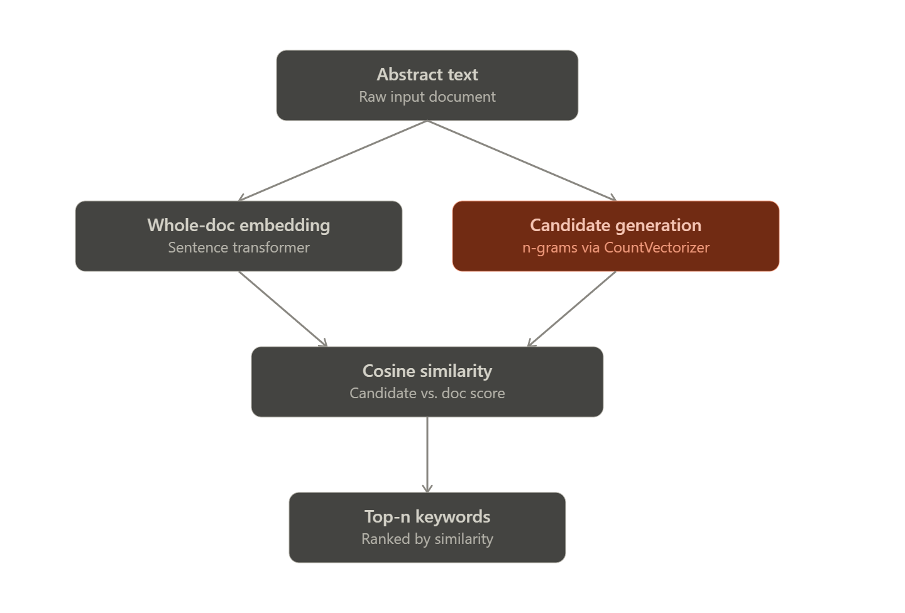

ArXiv Vector Search: A Bi-Encoder Semantic Search Engine:

Project Naming & The "Bi-Encoder" Explained 

What exactly are we "Bi" Encoding?

"Bi" means two. In any search engine, you are always dealing with two distinct pieces of text:

The Document (Your ArXiv research papers)

The Search Query (What the user types into the search bar)

The Old Way (Cross-Encoder): Older AI models would take the user's query AND the research paper, mush them together into one giant text block, and feed them into the neural network at the exact same time. It is highly accurate, but incredibly slow. You would have to run the neural network 15,000 times every time someone searched.

Your Way (Bi-Encoder):
Your model encodes the two pieces of text separately and independently.

You ran the neural network on the Documents ahead of time and saved them to your hard drive (in your EDA.ipynb file).

You run the neural network on the Search Query live at runtime (in your Search_Engine.ipynb file).

Because you encode them via two separate paths (Bi-Encoding), you only have to run the neural network once when a user searches. Then, FAISS simply compares the two separate vectors mathematically. This is the entire secret to why your search engine is lightning fast!

Bro, **yes**, `random_state=42` is actually a very good practice here. It doesn't improve your model's accuracy directly, but it makes your experiments **reproducible**, which is extremely important in ML.

Let's understand why.

---

# Without `random_state`

Suppose your dataset has **1,000,000 papers**.

You do:

```python
df = df.sample(n=50000)
```

Today, you might get:

```
Paper 10
Paper 234
Paper 9812
Paper 55211
...
```

Tomorrow, running the exact same code again, you could get:

```
Paper 88
Paper 712
Paper 99991
Paper 120
...
```

because `.sample()` picks rows randomly every time.

So every run uses a **different dataset**.

---

# With `random_state=42`

```python
df = df.sample(n=50000, random_state=42)
```

Now Pandas fixes the random number generator's starting point (called the **seed**).

Every run produces **the exact same 50,000 rows**:

```
Paper 10
Paper 234
Paper 9812
Paper 55211
...
```

again...

and again...

and again.

---

# Why is this useful?

Imagine your pipeline:

```
Dataset
     ↓
Cleaning
     ↓
SentenceTransformer
     ↓
Embeddings
     ↓
FAISS Index
     ↓
Search Engine
```

Generating embeddings for 50,000 papers takes time.

Suppose today you generate:

```
Embedding 1
Embedding 2
Embedding 3
...
Embedding 50000
```

and save them.

Tomorrow you rerun only the search code.

If your sampling changed, then paper #1 is no longer the same paper. Your saved embeddings and FAISS index won't match the dataframe anymore.

Using a fixed `random_state` guarantees the sampled dataset stays identical, so all your cached embeddings and indexes remain valid.

---

# Why not use `head(50000)`?

Suppose the dataset is ordered by upload date:

```
2012 papers
2013 papers
2014 papers
...
2025 papers
```

If you use

```python
df.head(50000)
```

you always get the **first 50,000 papers**, which might all be older submissions.

That means your search engine is biased toward early papers.

Using

```python
df.sample(50000, random_state=42)
```

gives a much more representative mix from across the dataset.

---

# Why specifically 42?

There's nothing magical about 42.

These all work the same:

```python
random_state=1
random_state=7
random_state=100
random_state=12345
```

The only difference is **which** random sample you get.

The number `42` became a convention because of *The Hitchhiker's Guide to the Galaxy*, where 42 is humorously called "the answer to the ultimate question of life, the universe, and everything." Many programmers use it as a default seed.

---

# How does it work internally?

Without a seed:

```
Random generator
       ↓
Uses current time or system entropy
       ↓
Different random numbers every run
```

With a seed:

```
Seed = 42
       ↓
Random generator starts from the same state
       ↓
Produces the same sequence of random numbers
       ↓
Selects the same rows every run
```

So it's still *random*, but it's **deterministically random**.

---

## For your research paper search engine

I would definitely recommend:

```python
df = df[['title', 'abstract']]
df = df.sample(n=50000, random_state=42)
```

This gives you:

* ✅ A representative subset of papers instead of just the earliest ones.
* ✅ Reproducible experiments.
* ✅ Stable embeddings and FAISS index across notebook runs.
* ✅ Easier debugging because you're always working with the same data.


Bro, **this is one of the most important concepts in vector databases and Sentence Transformers.** Once you understand this, you'll understand almost every semantic search project.

Let's go step by step.

---

# First, what does SentenceTransformer take as input?

Suppose you have this DataFrame:

| title | abstract                                   |
| ----- | ------------------------------------------ |
| BERT  | BERT is a transformer model...             |
| GPT   | GPT is an autoregressive language model... |
| CLIP  | CLIP connects images and text...           |

Now you create

```python
df["paper_text"] = df["title"] + " " + df["abstract"]
```

Now the dataframe becomes

| title | abstract   | paper_text          |
| ----- | ---------- | ------------------- |
| BERT  | BERT is... | **BERT BERT is...** |
| GPT   | GPT is...  | **GPT GPT is...**   |
| CLIP  | CLIP is... | **CLIP CLIP is...** |

---

# Then you do

Usually the next line is

```python
embeddings = model.encode(df["paper_text"].tolist())
```

Notice carefully.

You're passing

```python
df["paper_text"]
```

NOT

```python
df
```

and NOT

```python
df["title"]
```

So SentenceTransformer only receives **one column**.

---

# What does `tolist()` produce?

Suppose

```python
df["paper_text"]
```

contains

```
0 -> BERT BERT is a transformer model...
1 -> GPT GPT is a language model...
2 -> CLIP CLIP connects images...
```

After

```python
df["paper_text"].tolist()
```

it becomes

```python
[
 "BERT BERT is a transformer model...",
 "GPT GPT is a language model...",
 "CLIP CLIP connects images..."
]
```

This is just a Python list of strings.

---

# What does SentenceTransformer do?

It processes **one string at a time**.

Internally it's basically doing

```python
for sentence in list_of_sentences:
    embedding = model(sentence)
```

So

Paper 1

```
"BERT BERT is a transformer..."
```

↓

Embedding

```
[0.12, -0.45, ..., 0.78]
```

---

Paper 2

```
"GPT GPT is a language model..."
```

↓

Embedding

```
[-0.31, 0.52, ..., -0.11]
```

---

Paper 3

↓

Embedding

```
[0.44, -0.88, ..., 0.61]
```

---

So if you have **50,000 rows**, you'll get

```
50,000 embeddings
```

One embedding **per row**.

Not one embedding for the whole column.

---

# Visualize it

Your dataframe

| title  | abstract | paper_text   |
| ------ | -------- | ------------ |
| Paper1 | ...      | "Paper1 ..." |
| Paper2 | ...      | "Paper2 ..." |
| Paper3 | ...      | "Paper3 ..." |

↓

Sentence Transformer

```
Row 1
↓

384 numbers

Row 2
↓

384 numbers

Row 3
↓

384 numbers
```

Finally

```
embeddings.shape

(50000,384)
```

Meaning

```
50000 papers

↓

each has

↓

384-dimensional vector
```

---

# Then why not embed title and abstract separately?

Excellent question.

Suppose your paper is

Title

```
BERT
```

Abstract

```
Bidirectional Encoder Representations from Transformers...
```

If you embed separately

Title embedding

```
Embedding(BERT)
```

Abstract embedding

```
Embedding(Bidirectional Encoder...)
```

Now every paper has

```
Embedding A
Embedding B
```

instead of one.

---

# Then your FAISS database becomes

Instead of storing

```
Paper1
↓

ONE vector
```

you store

```
Paper1 title

↓

ONE vector

Paper1 abstract

↓

ANOTHER vector
```

Now for **50,000 papers**

instead of

```
50,000 vectors
```

you have

```
100,000 vectors
```

Double.

---

# Why is this "twice the work"?

Suppose the user searches

```
"transformer attention"
```

You create one query embedding.

If you have ONE embedding per paper

```
Query

↓

Compare against

50,000 vectors
```

Done.

---

If title and abstract are separate

Now FAISS compares

```
Query

↓

50,000 title vectors

+

50,000 abstract vectors

=

100,000 comparisons
```

Twice as many similarity computations.

Then you also have to merge the results because two vectors belong to the same paper.

More computation and more logic.

---

# But isn't separate embedding sometimes better?

Yes!

There are actually **two common designs**.

### Option 1 (your project)

```
Title + Abstract

↓

One embedding

↓

One vector per paper
```

Advantages:

* Faster
* Smaller FAISS index
* Simpler
* Great for research search

---

### Option 2

```
Title

↓

Embedding

Abstract

↓

Embedding
```

Advantages

Sometimes you can weight title more heavily.

For example

```
Similarity

=

0.7 * title_similarity

+

0.3 * abstract_similarity
```

This can improve search quality for some applications.

But now

* double storage
* double embeddings
* more similarity calculations
* more complicated ranking

---

# Why combine them?

Think like a human.

Suppose you search

```
"Vision Transformer"
```

Paper

Title

```
ViT
```

Abstract

```
Vision Transformer is proposed...
```

If you only embed the title

```
ViT
```

the model has almost no context.

If you only embed the abstract

```
Vision Transformer...
```

you lose the concise keyword "ViT" from the title.

Combining them gives the model both the high-level label **and** the detailed explanation in a single piece of text, which often leads to a richer semantic representation.

---

## For your AI paper search engine, the pipeline should look like this:

```
50,000 Papers
        │
        ▼
Title + Abstract
        │
        ▼
paper_text (50,000 strings)
        │
        ▼
SentenceTransformer.encode(...)
        │
        ▼
50,000 embeddings (shape: 50000 × 384)
        │
        ▼
FAISS Index
        │
        ▼
Semantic Search
```

This is why your code first creates the `paper_text` column and then embeds **that single combined text** for each row. It's efficient, simple, and well-suited to a semantic search engine.


You executed:

```python
df.columns
```

and got

```python
Index(['Unnamed: 0.1', 'Unnamed: 0', 'title', 'abstract'], dtype='str')
```

Let's understand every part.

---

# 1. What is `Index`?

`df.columns` does **not** return a normal Python list.

Instead, it returns a special Pandas object called an **Index**.

Think of it as an **immutable list** used for labels.

So

```python
df.columns
```

is roughly equivalent to

```python
["Unnamed: 0.1",
 "Unnamed: 0",
 "title",
 "abstract"]
```

except Pandas stores it as

```python
Index([...])
```

because it has many useful operations.

You can verify:

```python
type(df.columns)
```

Output

```python
pandas.core.indexes.base.Index
```

---

# 2. Why not simply print a list?

Because Pandas uses an `Index` object everywhere.

Examples:

Rows also have an Index.

```python
df.index
```

might print

```python
RangeIndex(start=0, stop=50000, step=1)
```

Columns also have an Index.

```python
df.columns
```

prints

```python
Index(['title','abstract'], dtype='str')
```

So both rows and columns use Index objects.

---

# 3. What does `dtype='str'` mean?

This is the data type **of the labels stored in this Index.**

NOT the datatype of the dataframe columns.

Here,

```python
Index(
    ['Unnamed: 0.1',
     'Unnamed: 0',
     'title',
     'abstract'],
    dtype='str'
)
```

means

every element inside this Index is a string.

Like

```
"Unnamed: 0.1"
"title"
"abstract"
```

all are strings.

---

## It does NOT mean

It does **NOT** mean

```
title column contains strings
```

or

```
abstract column contains strings
```

It only says

```
the COLUMN NAMES are strings.
```

---

# 4. Then how do I check datatype of each column?

Use

```python
df.dtypes
```

Example output

```python
Unnamed: 0      int64
title          object
abstract       object
dtype: object
```

This tells you the datatype of the **data inside each column**.

Notice the difference:

### Column names

```
Index(
['title','abstract'],
dtype='str'
)
```

means

```
"title" is a string
"abstract" is a string
```

---

### Column values

```
df.dtypes
```

means

```
title column contains strings
abstract column contains strings
```

---

# 5. Visualize it

Imagine your dataframe is

| index | title | abstract          |
| ----- | ----- | ----------------- |
| 0     | BERT  | Transformer model |
| 1     | GPT   | Language Model    |
| 2     | CLIP  | Vision Language   |

The dataframe has **three different things**:

### Row Index

```
0
1
2
```

This is

```python
df.index
```

---

### Column Index

```
title
abstract
```

This is

```python
df.columns
```

---

### Actual Data

```
BERT
GPT
CLIP
Transformer model
...
```

This is inside the dataframe.

---

# 6. Why is it called Index?

Because Pandas uses the same object for labeling both rows and columns.

```
Rows  -------> Index

Columns -----> Index
```

So

```python
df.index
```

and

```python
df.columns
```

both return an **Index** object.

---

### One more thing I noticed 👀

Your dataframe has these columns:

```python
Index(['Unnamed: 0.1', 'Unnamed: 0', 'title', 'abstract'])
```

Those two **`Unnamed`** columns are almost certainly extra index columns that got saved accidentally when the CSV was created. They're usually not useful for ML.

You can confirm by checking the first few rows:

```python
df.head()
```

If they just contain sequential numbers like `0, 1, 2, 3...`, you can safely drop them:

```python
df = df.drop(columns=["Unnamed: 0.1", "Unnamed: 0"])
```

After that, you'll likely be left with just:

```python
Index(['title', 'abstract'], dtype='str')
```

which is what you'd typically want before preprocessing and creating embeddings.

Excellent observation bro. They actually **didn't return different data**—they returned the **same data in different Pandas objects**.

Let's break it down.

---

# First one

```python
df["paper_text"].head()
```

Notice the single brackets:

```python
df["paper_text"]
```

This selects **one column as a Series**.

A Series is basically a **1-dimensional array**.

So its type is

```python
type(df["paper_text"])
```

Output

```python
pandas.core.series.Series
```

That's why it prints like

```
107644    SVD Perspectives for...
33964     Towards robust...
3137      Guided Random...
...
Name: paper_text
dtype: object
```

Notice at the bottom

```
Name: paper_text
dtype: object
```

Those are properties of a **Series**.

---

# Second one

```python
df[["paper_text"]].head()
```

Notice the **double brackets**.

Here you're passing

```python
["paper_text"]
```

which is a **list of column names**.

Pandas interprets this as

> "Give me a dataframe containing these columns."

So the type becomes

```python
type(df[["paper_text"]])
```

Output

```python
pandas.core.frame.DataFrame
```

Now Pandas displays it as a proper table:

```
            paper_text
107644     SVD Perspectives...
33964      Towards robust...
3137       Guided Random...
...
```

Exactly like Excel.

---

# Think of it like this

Suppose

```python
df
```

is

| title | abstract | year |
| ----- | -------- | ---- |
| A     | x        | 2020 |
| B     | y        | 2021 |

---

### Single brackets

```python
df["title"]
```

means

> Give me the **column itself**

Result

```
0    A
1    B

Name: title
```

One-dimensional.

---

### Double brackets

```python
df[["title"]]
```

means

> Give me a dataframe containing these columns.

Result

| title |
| ----- |
| A     |
| B     |

Still two-dimensional.

---

# Why do we even need double brackets?

Because suppose you want multiple columns.

This works:

```python
df[["title", "abstract"]]
```

Result

| title | abstract |
| ----- | -------- |
| ...   | ...      |
| ...   | ...      |

You cannot write

```python
df["title","abstract"]
```

❌ Invalid.

So Pandas uses

```python
df[[...]]
```

for selecting one or more columns while keeping the result as a DataFrame.

---

# Analogy

Imagine Excel.

Your dataframe is

```
A   B   C
```

Single brackets

```python
df["A"]
```

means

> Give me column A.

Like taking one sheet of paper.

---

Double brackets

```python
df[["A"]]
```

means

> Give me a tiny Excel table that contains only column A.

Same values.

Different object.

---

# Summary

| Code                 | Returns   | Dimensions |
| -------------------- | --------- | ---------- |
| `df["paper_text"]`   | Series    | 1D         |
| `df[["paper_text"]]` | DataFrame | 2D         |

And you can verify this yourself:

```python
print(type(df["paper_text"]))
print(type(df[["paper_text"]]))
```

Output:

```python
<class 'pandas.core.series.Series'>
<class 'pandas.core.frame.DataFrame'>
```

---

### A small tip for your ML project

When you're about to pass text into a SentenceTransformer, you'll almost always use the **Series** version:

```python
texts = df["paper_text"].tolist()
```

because `model.encode()` expects a list of strings, not a DataFrame.

The DataFrame version (`df[["paper_text"]]`) is mainly useful for displaying, filtering, merging, or when you want to preserve the tabular structure.

Bro, these are exactly the kinds of questions interviewers ask when discussing NLP preprocessing. Let's go through them carefully.

---
Great question — let me break all of this down properly.

---

## What Even Is Regex

Regex (Regular Expression) is a **pattern language** for matching text. Instead of searching for a fixed string like `"\n"`, you write a pattern that describes a *class* of strings.

```python
# Fixed string — finds exactly "\n"
"\n"

# Regex pattern — finds one or more whitespace characters (space, tab, newline, \r)
r"\s+"

# Regex pattern — finds any digit
r"\d+"

# Regex pattern — finds a URL
r"https?://\S+"
```

Key regex symbols to know for interviews:

| Symbol | Meaning |
|--------|---------|
| `.` | any single character except newline |
| `*` | 0 or more of the preceding |
| `+` | 1 or more of the preceding |
| `?` | 0 or 1 of the preceding |
| `\s` | any whitespace (space, tab, `\n`, `\r`) |
| `\S` | any non-whitespace |
| `\d` | any digit 0-9 |
| `\w` | any word character (a-z, A-Z, 0-9, _) |
| `^` | start of string |
| `$` | end of string |
| `[abc]` | any one of a, b, or c |
| `[^abc]` | anything except a, b, or c |

---

## regex=False vs regex=True in Pandas `.str.replace()`

```python
df["paper_text"].str.replace("\n", " ", regex=False)
df["paper_text"].str.replace(r"\s+", " ", regex=True)
```

`regex=False` means: treat the first argument as a **plain literal string**. Find exactly those characters, replace them. So `"\n"` finds the literal newline character and replaces it with a space. Simple, predictable.

`regex=True` means: treat the first argument as a **regex pattern**. So `r"\s+"` doesn't find the literal characters backslash-s-plus — it finds "one or more whitespace characters" which includes spaces, tabs, `\n`, `\r`, and more.

**Why `regex=False` is safer when you don't need patterns:**

The string `"."` as a regex means "any character" — so `str.replace(".", " ", regex=True)` would replace every single character with a space, destroying your text. But `str.replace(".", " ", regex=False)` correctly replaces only literal dots. When your search string contains characters like `.`, `(`, `)`, `*`, `+` that have special meaning in regex, `regex=False` avoids accidental pattern interpretation.

---

## Which One Should YOU Use

For your specific case of just removing newlines, `regex=False` is correct and fine. But honestly for a cleaner, more complete cleaning step you should do this instead:

```python
# Better — catches \n, \r\n (Windows), \t, multiple spaces all in one shot
df["paper_text"] = (
    df["paper_text"]
    .str.replace(r"\s+", " ", regex=True)   # collapse ALL whitespace runs to single space
    .str.strip()                              # remove leading/trailing whitespace
)
```

`r"\s+"` with `regex=True` is strictly more powerful than `"\n"` with `regex=False` — it catches newlines, carriage returns (`\r`), tabs, and multiple consecutive spaces all at once, and collapses them to a single space. For ArXiv abstracts specifically, papers sometimes have `\r\n` (Windows line endings) and `\t` (tab characters) mixed in — the regex version handles all of them.

---

## Data Cleaning for Modern Sentence Transformers — What's Actually Needed vs What's Not

Here's the key insight that most people get wrong:

**Sentence Transformers need LESS cleaning than classical NLP, not more.** The model was pre-trained on messy internet text. It's robust. Over-cleaning actually hurts it.

### What You Should NOT Do (Common Mistakes)

❌ **Stopword removal** — Never. "not good" vs "good" are completely different. The model needs every word for context.

❌ **Stemming or Lemmatization** — Never. The tokenizer (WordPiece) handles morphology. "running" and "run" already map to similar embeddings through training. Stemming before tokenization breaks the tokenizer's subword splits.

❌ **Aggressive punctuation removal** — Don't strip all punctuation. Commas and periods mark clause/sentence boundaries that help the model understand structure. A paper abstract without punctuation is harder to parse even for a transformer.

❌ **Lowercasing** — Don't do it for modern models. `all-MiniLM-L6-v2` is uncased-aware and was trained on mixed-case text. "DNA" and "dna" mean different things in a research context. Unlike old BERT-base-uncased, modern sentence transformers handle case properly.

❌ **Over-normalization** — Don't replace domain terms with generic placeholders. "ResNet-50", "GPT-4", "BERT" are meaningful tokens your model understands. Replacing them with `<MODEL>` throws away information.

### What You SHOULD Do for Sentence Transformers

✅ **Fix whitespace** — This is your current step, and it's the most important one. `\n`, `\r`, `\t`, multiple spaces all fragment what should be a continuous sentence. The model reads positional context — broken lines can confuse attention patterns.

✅ **Drop nulls / missing values** — Yes, you should do this. If `abstract` is NaN and you try to encode it, sentence-transformers will either crash or encode the string "nan" as a real paper, which is garbage in your index.

✅ **Drop duplicates** — Yes, you should do this too. If two rows have the same abstract (duplicate paper submissions are common on ArXiv), you're embedding the same vector twice, wasting FAISS space, and returning the same paper twice in search results which is a bad user experience.

✅ **Length filtering** — Drop papers where abstract is shorter than ~20 characters. These are usually data entry errors ("N/A", "See paper", "Abstract not available").

✅ **Unicode normalization** — Normalize to NFC/NFKC unicode form. ArXiv has papers from all over the world with various unicode characters. `café` encoded two different ways (`é` as one char vs `e` + combining accent) should be the same string.

✅ **Truncation to 512 tokens** — `all-MiniLM-L6-v2` has a 256-token limit (not 512 like BERT — check the model card). Texts longer than the limit get silently truncated during encoding. For abstracts this usually isn't an issue (they're typically 150-300 words), but worth knowing.

---

## What You Should Actually Do In Your Project

Here's the complete recommended cleaning pipeline for Neural ArXiv, ordered correctly:

```python
# Step 1 — Drop missing values
df = df.dropna(subset=["abstract"])

# Step 2 — Drop duplicates on abstract text
df = df.drop_duplicates(subset=["abstract"])

# Step 3 — Fix whitespace (your current step, upgraded)
df["paper_text"] = (
    df["paper_text"]
    .str.replace(r"\s+", " ", regex=True)   # collapse all whitespace to single space
    .str.strip()                              # remove leading/trailing whitespace
)

# Step 4 — Drop near-empty texts (length filter)
df = df[df["paper_text"].str.len() > 50]

# Step 5 — Unicode normalization (optional but clean)
import unicodedata
df["paper_text"] = df["paper_text"].apply(
    lambda x: unicodedata.normalize("NFKC", x)
)

# Step 6 — Reset index after all the dropping
df = df.reset_index(drop=True)
```

That's it. Seriously — five clean steps, no stemming, no stopwords, no lowercasing. You're done. The model handles everything else.

---

## Should You Add dropna and drop_duplicates — Direct Answer

**Yes to both, and here's the exact reason for each:**

`dropna` — if even one abstract is NaN in your 50k rows, the sentence-transformer encoder will crash mid-batch or silently encode "nan" as a paper. You'll only discover this when a user searches "machine learning" and gets a result called "nan" back.

`drop_duplicates` — ArXiv has a known problem with duplicate submissions and versioned papers (v1, v2, v3 of the same paper sometimes get separate rows in scraped datasets). If you embed duplicates, FAISS returns the same paper multiple times in the top-5 results for any query — looks broken immediately in a demo.

Both of these are standard, expected steps that any interviewer would ask "did you handle this?" about. Right now your answer is no, which is a gap. Add them before the whitespace cleaning step — there's no point cleaning text that you're about to throw away anyway.


# 1. What does `regex=False` mean?

Your code:

```python
df["paper_text"] = df["paper_text"].str.replace("\n", " ", regex=False)
```

The `str.replace()` function has **two modes**:

### Mode 1: Literal string replacement (`regex=False`)

Treats `"\n"` as the actual newline character.

Example:

```python
text = "Hello\nWorld"

text.replace("\n", " ")
```

Result:

```text
Hello World
```

Simple and fast.

---

### Mode 2: Regular Expression (`regex=True`)

Now the first argument is interpreted as a **regular expression (pattern)**.

Example:

```python
df["paper_text"].str.replace(r"\s+", " ", regex=True)
```

Here,

```text
\s+
```

does **not** mean the characters `\`, `s`, `+`.

Instead it means

> Match one or more whitespace characters.

It matches

* spaces
* tabs
* newlines
* multiple spaces

So

```text
Hello      World
```

becomes

```text
Hello World
```

---

## Why use `regex=False` here?

Because we only want to replace **actual newline characters**.

We're **not searching using a pattern**.

So

```python
regex=False
```

is

* faster
* easier
* avoids accidental regex interpretation.

---

# 2. What does `.strip()` do?

```python
df["paper_text"] = df["paper_text"].str.strip()
```

Suppose after replacing newlines

```
"   BERT is awesome    "
```

becomes

```
"BERT is awesome"
```

It removes

* leading spaces
* trailing spaces

It **doesn't** remove spaces inside.

Example

```
"Hello     World"
```

stays

```
"Hello     World"
```

---

# 3. What cleaning is actually essential for a Sentence Transformer?

Here's the good news.

Sentence Transformers are pretrained Transformer models.

They **do not require heavy preprocessing** like older NLP methods (TF-IDF, Bag of Words).

For your research paper search engine, I'd recommend the following.

---

## ✅ Step 1: Remove missing values

Very important.

```python
df = df.dropna(subset=["title", "abstract"])
```

Otherwise

```
None
```

or

```
NaN
```

will cause issues.

---

## ✅ Step 2: Combine title + abstract

```python
df["paper_text"] = df["title"] + " " + df["abstract"]
```

---

## ✅ Step 3: Remove newlines

```
Deep Learning

Transformer
```

↓

```
Deep Learning Transformer
```

---

## ✅ Step 4: Remove excessive whitespace

This is slightly better than your current code.

Instead of only replacing `\n`

```python
.str.replace("\n"," ")
```

I would do

```python
df["paper_text"] = (
    df["paper_text"]
    .str.replace(r"\s+", " ", regex=True)
    .str.strip()
)
```

This converts

```
hello


world        today
```

into

```
hello world today
```

---

## ✅ Step 5: Remove duplicates

Very useful.

Many papers are duplicated.

```python
df = df.drop_duplicates(subset=["paper_text"])
```

---

## Optional Step 6: Remove extremely short abstracts

Sometimes you have

```
Coming Soon
```

or

```
TBD
```

Those embeddings aren't useful.

Example

```python
df = df[df["paper_text"].str.len() > 50]
```

---

# 4. What NOT to do for Transformers

A lot of old NLP tutorials still recommend these.

❌ Lowercasing

```text
BERT

↓

bert
```

Modern sentence transformers already handle casing appropriately. Some are even **case-sensitive**.

---

❌ Removing punctuation

```
Transformer-based
```

↓

```
Transformer based
```

You lose information.

---

❌ Removing stop words

```
the
is
of
```

Transformers understand context.

Don't remove them.

---

❌ Stemming

```
running

↓

run
```

Not needed.

---

❌ Lemmatization

```
better

↓

good
```

Usually unnecessary for transformer embeddings.

---

# 5. Cleaning pipeline I'd use

For your paper search engine, this is sufficient:

```python
# Keep only useful columns
df = df[["title", "abstract"]]

# Remove missing values
df = df.dropna()

# Combine
df["paper_text"] = df["title"] + " " + df["abstract"]

# Normalize whitespace
df["paper_text"] = (
    df["paper_text"]
      .str.replace(r"\s+", " ", regex=True)
      .str.strip()
)

# Remove duplicates
df = df.drop_duplicates(subset=["paper_text"])
```

That's all I'd do before generating embeddings.

---

# 6. Why so little cleaning?

Because a Sentence Transformer has already been trained on **millions of natural language sentences**.

It expects normal English text.

If you aggressively clean it like older NLP pipelines, you actually remove information the model knows how to use.

---

## Rule of thumb

* **TF-IDF / Bag of Words:** Heavy preprocessing (lowercase, stop words, stemming, etc.).
* **BERT / Sentence Transformers:** Light preprocessing (handle missing values, normalize whitespace, remove duplicates, and preserve the natural text as much as possible).

For your semantic search engine, the light preprocessing approach is the right one.

Excellent question bro. This is an important detail of `dropna()`.

---

# Case 1: `dropna(subset=["title","abstract"])`

Suppose your dataframe is

| title | abstract        |
| ----- | --------------- |
| BERT  | Transformer...  |
| ❌ NaN | Vision model... |
| GPT   | ❌ NaN           |
| ❌ NaN | ❌ NaN           |

Now execute

```python
df = df.dropna(subset=["title", "abstract"])
```

This means:

> "Drop a row if **any** of these columns (`title` or `abstract`) is missing."

Result:

| title | abstract       |
| ----- | -------------- |
| BERT  | Transformer... |

Everything else is removed.

So

```
title = NaN
abstract = text
```

❌ Removed

and

```
title = text
abstract = NaN
```

❌ Removed

because the default is

```python
how="any"
```

---

# If you wanted to remove only when BOTH are missing

You'd write

```python
df.dropna(subset=["title","abstract"], how="all")
```

Now the dataframe

| title | abstract    |
| ----- | ----------- |
| BERT  | Transformer |
| ❌ NaN | Vision      |
| GPT   | ❌ NaN       |
| ❌ NaN | ❌ NaN       |

becomes

| title | abstract    |
| ----- | ----------- |
| BERT  | Transformer |
| ❌ NaN | Vision      |
| GPT   | ❌ NaN       |

Only the last row is removed.

---

# Should we do it before or after making `paper_text`?

There are two possibilities.

## Option 1 (Recommended)

```python
df = df.dropna(subset=["title","abstract"])

df["paper_text"] = df["title"] + " " + df["abstract"]
```

This is what most people do.

Reason:

You know exactly which column is missing.

---

## Option 2

After creating

```python
df["paper_text"] = df["title"] + " " + df["abstract"]
```

Can you do

```python
df.dropna(subset=["paper_text"])
```

?

Yes...

**BUT** there is a catch.

---

Suppose

```
title = NaN
abstract = "Transformer"
```

Now

```python
paper_text = title + " " + abstract
```

What happens?

The result is

```
NaN
```

because in Pandas

```python
NaN + "hello"
```

is still

```
NaN
```

So

```python
dropna(subset=["paper_text"])
```

would remove that row.

---

# But suppose instead you wrote

```python
df["paper_text"] = (
    df["title"].fillna("")
    + " "
    + df["abstract"].fillna("")
)
```

Now

```
title = NaN
abstract = Transformer
```

becomes

```
" Transformer"
```

which is **not NaN**.

Then

```python
dropna(subset=["paper_text"])
```

would **NOT** remove that row.

That's why checking only `paper_text` depends on how you created it.

---

# Which is better for your project?

I recommend

```python
df.dropna(subset=["title","abstract"])
```

before combining.

It's:

* more explicit
* easier to explain in interviews
* less error-prone
* the standard approach in NLP pipelines

---

## One more thing: Should you really drop rows with a missing title?

For a semantic paper search engine, maybe **not always**.

Imagine

| title | abstract                               |
| ----- | -------------------------------------- |
| NaN   | A detailed paper about transformers... |

The abstract alone still contains lots of useful information.

Similarly,

| title | abstract |
| ----- | -------- |
| BERT  | NaN      |

The title alone can still be meaningful.

A practical approach is:

```python
df = df.dropna(subset=["title", "abstract"], how="all")
```

This keeps rows where **at least one** of `title` or `abstract` is present, and only drops rows where **both** are missing.

Then you can safely combine them like this:

```python
df["paper_text"] = (
    df["title"].fillna("")
    + " "
    + df["abstract"].fillna("")
).str.strip()
```

This way you preserve papers that still have useful information while removing rows that have nothing to embed. For many real-world NLP datasets, this is a very reasonable strategy.

Bro, this is another very important Pandas concept. **`reset_index()` has nothing to do with your actual data columns**—it only changes the **row numbers (index)**.

Let's see why.

---

## Before dropping rows

Suppose your dataframe is

| Index | Title   |
| ----: | ------- |
|     0 | Paper A |
|     1 | Paper B |
|     2 | Paper C |
|     3 | Paper D |
|     4 | Paper E |

---

## Now suppose you remove some rows

```python
df = df.dropna()
```

Imagine rows 1 and 3 are removed.

Now your dataframe becomes

| Index | Title   |
| ----: | ------- |
|     0 | Paper A |
|     2 | Paper C |
|     4 | Paper E |

Notice something?

The **index is now**

```text
0
2
4
```

There are gaps.

Pandas does **not** automatically renumber them.

---

## What does `reset_index()` do?

```python
df = df.reset_index()
```

Result:

| index | Title   |
| ----: | ------- |
|     0 | Paper A |
|     1 | Paper C |
|     2 | Paper E |

But notice something!

The **old index became a new column** called `"index"`.

---

## What does `drop=True` do?

```python
df = df.reset_index(drop=True)
```

Now the result is

| Index | Title   |
| ----: | ------- |
|     0 | Paper A |
|     1 | Paper C |
|     2 | Paper E |

The old index (`0, 2, 4`) is **discarded**, not kept as a column.

This is what you usually want.

---

## Why is it useful in your project?

Imagine you started with **50,000 papers**.

Then you remove duplicates:

```python
df = df.drop_duplicates()
```

Now maybe you have **47,231 papers**.

But the index might look like

```text
5
18
20
24
31
...
49998
```

because many rows were removed.

Later you generate embeddings:

```python
embeddings = model.encode(df["paper_text"].tolist())
```

The embeddings are stored in a NumPy array like

```text
Embedding 0
Embedding 1
Embedding 2
...
Embedding 47230
```

If your dataframe index is still

```text
5
18
20
...
```

then:

* DataFrame row index = 18
* Embedding array index = 1

They don't line up anymore.

After

```python
df = df.reset_index(drop=True)
```

both become

```text
0
1
2
3
...
47230
```

Now

```python
embedding[i]
```

matches

```python
df.iloc[i]
```

perfectly.

---

## When should you use it?

Use it **after any operation that removes rows**, such as:

```python
df = df.dropna()
df = df.drop_duplicates()
df = df[df["paper_text"].str.len() > 50]
```

Then do

```python
df = df.reset_index(drop=True)
```

before generating embeddings or saving the cleaned dataset.

---

## In your current project

Since you've verified:

* ✅ No missing values
* (If you also don't remove duplicates)

then **you don't need `reset_index()`**, because no rows have been removed and the index is already continuous.

However, if later you add:

```python
df = df.drop_duplicates(subset=["paper_text"])
```

then you should follow it with:

```python
df = df.reset_index(drop=True)
```

Batch Summarization Optimization
Implementation	Summarizer Calls	Avg Time (k=5)
Per-paper summarization	5	2.80 s
Batch summarization	1	2.20 s

Improvement

📉 ~21% reduction in end-to-end summarization time
🚀 5 model invocations → 1 batched invocation
✅ Same summaries, lower inference overhead

Interview answer

If they ask:

Why did batch summarization improve performance?

You can say:

In the original implementation, I invoked the summarization pipeline once per retrieved paper, so for k=5 there were five separate model calls. Each call repeated overhead such as input preparation, tokenization, and pipeline execution. I refactored the code to pass all retrieved abstracts to the pipeline in a single batch. The model still produces one summary per abstract, but the fixed overhead is paid only once, resulting in lower end-to-end latency. On my machine, this reduced the average query time for k=5 from about 2.8 seconds to about 2.2 seconds.


# Foundations of Deep Learning & NLP (Interview Crash Course)

## 1. What is Deep Learning? (The Absolute Basics)

To understand Deep Learning, you need to see how it fits into the broader world of AI:

* **Artificial Intelligence (AI):** Any technique that enables computers to mimic human intelligence (even simple `if/else` rules).

* **Machine Learning (ML):** A subset of AI where we don't program the exact rules. Instead, we give the computer data, and it *learns* the patterns on its own using statistics.

* **Deep Learning (DL):** A highly advanced subset of ML inspired by the human brain. It uses **Artificial Neural Networks** with multiple "layers" (hence the word "deep") to learn incredibly complex patterns.

**How it works intuitively:** Imagine you want to teach a computer to recognize a dog. In traditional ML, you have to manually define features: "Look for 2 ears, a tail, and fur." In Deep Learning, you just show the Neural Network 10,000 pictures of dogs, and it mathematically figures out what makes a dog a dog on its own.

## 2. What is NLP (Natural Language Processing)?

Computers are essentially giant calculators; they only understand numbers (0s and 1s). Human language (text, speech) is messy, filled with slang, sarcasm, and context.
**NLP is the bridge.** It is the field of AI focused on translating human text into mathematical numbers that a computer can process, understand, and generate.

When you combine **Deep Learning + NLP**, you get things like ChatGPT, Google Translate, and the **Semantic Search Engine** you are building right now.

## 3. The 5 Steps of a Deep Learning Project (And How You Did Them)

Every real-world Deep Learning project follows a very specific lifecycle. Here is the standard industry pipeline, and exactly how *your* project maps to it:

### Step 1: Data Collection & Ingestion

* **The Theory:** You need raw data to feed the model.

* **What YOU did:** You used `load_dataset("CShorten/ML-ArXiv-Papers")` to download over 117,000 research papers from the Hugging Face Hub.

### Step 2: Data Preprocessing & Cleaning

* **The Theory:** Raw data is always dirty. You have to remove noise so the model doesn't get confused.

* **What YOU did:** You dropped the useless `Unnamed` columns. You merged `title` and `abstract` into one `paper_text` column for maximum context. You used `.str.replace("\n", " ")` and `.strip()` to fix structural formatting bugs.

### Step 3: Feature Extraction / Vectorization (The Deep Learning Step)

* **The Theory:** Converting the clean text into a mathematical format the computer can understand.

* **What YOU did:** You loaded a pre-trained Deep Learning model (`all-MiniLM-L6-v2`). You ran `model.encode()` to convert your text into 384-dimensional **Embeddings** (dense vectors).

### Step 4: Downstream Task / Inference

* **The Theory:** Using those mathematical features to actually solve a business problem (like classifying an email as spam, or searching for a document).

* **What YOU did:** You imported `cosine_similarity`. You are using the angles between your 384-dimensional vectors to find out which research papers are semantically identical to a user's search query.

### Step 5: Deployment (Next Steps)

* **The Theory:** Putting the model into a web app or database so actual users can use it.

* **What YOU will do:** (Likely putting these vectors into a Vector Database like Pinecone or ChromaDB, and building a simple UI to search them!).

## 4. Top Interview Questions & Answers

### Q1: What is the main difference between traditional Machine Learning and Deep Learning?

**Your Answer:** "The biggest difference is **Feature Engineering**. In traditional ML, a human engineer has to manually extract features from the data (like counting word frequencies). Deep Learning automates this. A deep neural network automatically extracts the most important features as the data passes through its hidden layers. However, this requires significantly more data and compute power."

### Q2: Explain what an "Embedding" is to a non-technical stakeholder.

**Your Answer:** "An embedding is basically a set of coordinates on a highly complex map. Just like GPS coordinates tell you exactly where a city is, an embedding tells you exactly where a *concept* is. We translate a sentence into a list of numbers. Sentences with similar meanings will have numbers that place them physically close together on our mathematical map."

### Q3: Why did you use Deep Learning (Sentence Transformers) for search instead of traditional keyword search (like Elasticsearch)?

**Your Answer:** "Traditional keyword search relies on exact lexical matches. If a user searches for 'revenue', a keyword engine will miss a document that says 'financial income' because the exact letters don't match. By using a Deep Learning Transformer, I am doing **Semantic Search**. The model understands the *context* and *intent* behind the words, allowing it to accurately match 'revenue' with 'income' based on their mathematical vector distance."

### Q4: Why didn't you build and train a neural network from scratch for this project?

**Your Answer:** "Building a language model from scratch requires massive clusters of GPUs, terabytes of data, and weeks of training, which is highly inefficient for a targeted applied project. Instead, I used **Transfer Learning**. I took a model (`MiniLM`) that was already trained on millions of sentences by researchers, and applied its pre-existing knowledge to my specific ArXiv dataset. It is much more efficient and standard industry practice."

# What are Sentence Transformers? (Interview-Ready Breakdown)

## 1. The "Elevator Pitch" (The Short Answer)

A Sentence Transformer is a highly optimized neural network architecture designed to convert entire sentences, paragraphs, or documents into fixed-length dense vectors (embeddings).

Its primary goal is to map these texts into a mathematical space where **sentences with similar semantic meanings are physically closer together**, allowing us to instantly compare them using simple math (like Cosine Similarity).

## 2. The Problem (Why not just use regular BERT?)

To sound like a pro in an interview, you must explain *why* Sentence Transformers were invented in 2019 (originally called SBERT).

Before Sentence Transformers, if you wanted to see how similar Sentence A and Sentence B were, you used standard BERT. Standard BERT acts as a **Cross-Encoder**. It requires you to feed *both* sentences into the model at the exact same time so the attention mechanism can compare every word in Sentence A against every word in Sentence B.

* **The Catch:** It is incredibly accurate, but **horrifically slow**.

* **The Math:** If you have 100,000 research papers in your dataset, and a user types a search query, a standard BERT model would have to run a massive neural network calculation 100,000 times to find the best match. This would take hours just to return one search result.

## 3. The Solution: How Sentence Transformers Work

Sentence Transformers fix this bottleneck by using a **Bi-Encoder (Siamese) Architecture**. Here is exactly how it works step-by-step:

### A. Independent Processing (The Siamese Network)

Instead of feeding two sentences together, the model processes them completely separately. Think of it like identical twins (a Siamese network) sharing the same brain (weights). You feed the user's search query into one side, and you feed a research paper into the other.

### B. The Pooling Layer (Compressing the meaning)

When text passes through a transformer, the model originally outputs a 384-dimensional vector for *every single word*. If your abstract has 200 words, you get 200 vectors. You can't store that easily.
The Sentence Transformer adds a **Pooling Layer** (usually "Mean Pooling") at the very end. It mathematically averages all 200 word-vectors together to produce **one single, master 384-dimensional vector** that represents the entire meaning of the text block.

### C. The Result: Fast Search

Because the sentences are processed independently, you can **pre-compute** the embeddings for all 117,000 research papers beforehand and store them in a Vector Database.
When a user searches, you only run the neural network *once* on their search query to get its vector, and then you just do blazing-fast geometry (Cosine Similarity) to find the closest vectors in the database. What used to take 65 hours now takes 0.01 seconds.

## 4. How the Model Learns (Contrastive Learning)

*How does the model know how to group meanings together?*

During training, scientists feed the model pairs of sentences.

1. **Positive Pairs:** "How to cancel my subscription" and "Steps to close my account". The model calculates their vectors. If the vectors are far apart, the model mathematically "pulls" its weights to force those vectors closer together.

2. **Negative Pairs:** "How to cancel my subscription" and "My dog is barking". The model calculates their vectors. If they are close, the model mathematically "pushes" them apart.

After seeing millions of pairs, it learns human semantic logic.

## 5. Tying it back to your Project

**Interviewer:** *"So why did you use a Sentence Transformer for this ML ArXiv project?"*

**You:** *"I needed to build a fast, scalable semantic search engine for over 100k research papers. Using a standard cross-encoder model would be computationally impossible at search time. By using `all-MiniLM-L6-v2`, which is a Sentence Transformer bi-encoder, I was able to pre-compute the 384-dimensional document embeddings, store them offline, and reduce the live search process to a simple, sub-millisecond cosine similarity lookup."*


# NLP Preprocessing & Embeddings: Traditional vs. Modern

## 1. Traditional NLP Preprocessing (The Old Way)

In the past, algorithms like *Bag of Words* or *TF-IDF* couldn't actually read sentences; they just counted how many times specific words appeared. Because of this, we had to aggressively strip the text down to its bare bones to keep the vocabulary small and simple.

If you were building an NLP project 5+ years ago, you *had* to do these steps:

1. **Lowercasing:** Converting everything to lowercase so the computer knew "Apple" and "apple" were the same word.
2. **Removing Punctuation:** Stripping out commas, periods, and exclamation marks because older models just viewed them as useless mathematical noise.
3. **Removing Stopwords:** Deleting common grammatical filler words like "the", "is", "at", and "which" to force the model to focus only on the "heavy" meaning words.
4. **Stemming / Lemmatization:** Chopping words down to their root mathematical form. For example, "running", "ran", and "runs" would all be brutally forced down to just "run".

## 2. How Modern Transformers Handle Preprocessing (The New Way)

**Modern Transformers (like BERT or MiniLM) actually *hate* traditional preprocessing.** Transformers don't just count words; they use **Self-Attention** to look at *how words relate to each other* across an entire sentence. If you run the old preprocessing steps on your text, you destroy the exact context the Transformer needs to be smart.

* **They *need* casing:** It helps the model instantly recognize that "Apple" is a trillion-dollar company while "apple" is a fruit.
* **They *need* punctuation:** It tells the attention mechanism where thoughts begin, pause, and end.
* **They *need* stopwords:** Stopwords provide logical direction. The model knows that a "flight **to** NY **from** London" is the exact opposite of a "flight **from** NY **to** London". If you removed stopwords, both sentences would just be "flight NY London", ruining the meaning.

### So, what DO we clean today? (Structural Cleaning)

Instead of *linguistic* cleaning, we now only do *structural* data cleaning.
You leave the grammar alone, but you fix formatting bugs. For example:

* Removing rogue `\n` (line breaks) from scraped PDFs.
* Stripping out random HTML tags (`<br>`, `<div>`).
* Fixing weird Unicode characters.

*(This is exactly why you used `.str.replace("\n", " ")` in your project—you were fixing the structure without touching the grammar!)*

## 3. What is the "384"? (Understanding Dimensionality)

When you run `model.encode(text)`, you get an output shape of `(384,)`.

**The Short Answer:** That **384** is the **dimensionality** of your embedding. It means the `all-MiniLM-L6-v2` model compressed the entire semantic meaning of your research paper into a mathematical array containing exactly 384 floating-point numbers.

**The Deep Dive (For the Interview):**

* **What are those numbers?** To the AI, each of those 384 slots represents a highly abstract "feature" of the text. One dimension might score how strongly the text relates to "algorithms," another might capture the "academic tone," and another might track "medical context."
* **Why specifically 384?** It is hardcoded into the architecture of the specific model you downloaded. Different models have different sizes:
  * `all-MiniLM-L6-v2` = 384 dimensions (Fast, lightweight, great for standard projects)
  * `bert-base-uncased` = 768 dimensions (Heavier, slightly more accurate)
  * OpenAI's `text-embedding-ada-002` = 1536 dimensions (Massive, requires more storage)
* **Why this matters for your Vector Database:** When you store these in a vector database (like Milvus or Pinecone) for your semantic search step, you will configure the database to accept vectors of size 384. When a user searches, the database runs **Cosine Similarity** to mathematically find which 384-number arrays are closest to each other.

### 💡 Interview Cheat Code:

If an interviewer asks: *"What does the shape `(384,)` tell you about your output?"*

**Your Answer:** *"It represents the dimensionality of the dense vector space. The MiniLM model I selected maps the semantic meaning of the text into 384 distinct features. I specifically chose a 384-dimensional model because it strikes the perfect balance between keeping the vector database fast and computationally cheap, while still retaining high enough accuracy for a robust semantic search."*

### **The Short Answer**

That **384** is the **dimensionality** of your embedding. It means the `all-MiniLM-L6-v2` model compressed the entire meaning of your `sample_text` into a mathematical array containing exactly 384 floating-point numbers.

---

### **The Breakdown & Explanation**

* **What those numbers actually represent:** You can't just read the numbers and understand them, but to the AI, each of those 384 slots represents a highly abstract "feature" of the text. For example, one dimension might score how strongly the text relates to "algorithms," another might capture the "academic tone," and another might track "medical context."
* **Why specifically 384?** It is hardcoded into the architecture of the specific model you downloaded. Different models have different sizes:
* `all-MiniLM-L6-v2` = 384 dimensions (Fast, lightweight, great for standard projects)
* `bert-base-uncased` = 768 dimensions (Heavier, slightly more accurate)
* OpenAI's `text-embedding-ada-002` = 1536 dimensions (Massive, requires more storage)


* **Why this matters for your Vector Database:** When you store these in a vector database (like Milvus or Pinecone) for your semantic search step, you will have to configure the database to accept vectors of size 384. When a user types a search query later, the model will convert their search into *another* 384-number array, and the database will run a mathematical formula (usually Cosine Similarity) to find which arrays are physically closest to each other in that 384-dimensional space.

---

### **How to explain this in an interview**

If an interviewer asks, "What does the shape `(384,)` tell you about your output?", you can say:

> *"It tells me the dimensionality of the dense vector space. The `MiniLM` model I selected maps the semantic meaning of the text into 384 distinct features. I specifically chose a 384-dimensional model because it strikes the perfect balance between keeping the vector database fast and computationally cheap, while still retaining high enough accuracy for a robust semantic search."*

Before modern transformers (like the `all-MiniLM-L6-v2` you just loaded) took over, text preprocessing was a massive, tedious phase of almost every NLP project.

Older algorithms (like Bag of Words, TF-IDF, or basic RNNs) were fundamentally just counting words or looking at them in isolation. They couldn't truly understand context. If they saw "Apple" (capitalized) and "apple" (lowercase), they mathematically treated them as two completely different, unrelated entities.

To help those older models out, we had to brutally strip the text down to its bare bones to reduce the total vocabulary size and group similar concepts together. Here is exactly what that traditional pipeline used to look like:

1. **Lowercasing:** Converting everything to lowercase so "Hello" and "hello" were recognized as the exact same word.
2. **Removing Punctuation:** Stripping out commas, periods, and exclamation marks because older models just viewed them as useless noise.
3. **Removing Stopwords:** Deleting common grammatical filler words like "the", "is", "at", and "which" to force the model to focus only on the "heavy" meaning words.
4. **Stemming / Lemmatization:** Chopping words down to their root mathematical form. For example, "running", "ran", and "runs" would all be aggressively forced down to "run".

### **Why Transformers skip this (and actually hate it):**

Transformers don't just read words; they use **Self-Attention** to look at *how words relate to each other* across an entire sentence.

* They *need* casing to instantly recognize that "Apple" is a company while "apple" is a fruit.
* They *need* punctuation to understand where thoughts begin, pause, and end.
* They *need* those "useless" stopwords to understand logical direction (e.g., they know a "flight **to** NY **from** London" is the exact opposite of a "flight **from** NY **to** London").

If you run that traditional, aggressive preprocessing on your DataFrame before feeding it to your `MiniLM` model, you are actively destroying the linguistic context it relies on to build those smart 384-dimensional embeddings.


### **The Explanation**

In Python, the `type()` function looks at a variable and tells you exactly what kind of data structure or object it is holding under the hood.

When you ran `print(type(model))`, the output `<class 'sentence_transformers...SentenceTransformer'>` told you two very important things about your pipeline:

1. **Successful Initialization:** It proves that the Hugging Face model you downloaded earlier (`all-MiniLM-L6-v2`) successfully unpacked and is currently sitting active in your computer's memory (RAM). The `model` variable isn't just an empty string or a generic list; it is a fully loaded, heavyweight neural network object.
2. **Access to Class Methods:** Because Python confirms it belongs to the `SentenceTransformer` class, it guarantees that this variable has access to all the specialized AI functions built into that library. This is exactly *why* you were able to run `model.encode()` in your later steps to generate those 384-dimensional NumPy arrays. If the model had loaded incorrectly (e.g., as a plain string or dictionary), calling `.encode()` would have immediately crashed your code.

### **The Interview Context**

If an interviewer points to this line and asks why you ran it, you can simply say:

> *"It's a standard diagnostic print statement. Before passing 117,000 rows of text through a computationally heavy neural network, I wanted to verify that the model pipeline initialized correctly and returned a valid `SentenceTransformer` object into memory."*


bro so we have done so much in this file, now shall i store this embedded in some dataset, like a csv file, so that next time when we train model we dont need to make this embedding again we can directly load it and start working further in our porject else it would take a lot of time to do this all again

Bro, your intuition is **100% spot on**. You are thinking exactly like a Senior Machine Learning Engineer right now.

You NEVER want to wait 26 minutes to re-calculate these embeddings every time you open your laptop or restart your Jupyter Notebook. You absolutely must save them to your hard drive.

However, there is a massive **"Interview Trap"** here.

### **The Trap: Why you should NOT use a CSV file**

While CSVs are great for standard text data (like your titles and abstracts), they are **terrible** for Deep Learning arrays (like your `15000 x 384` matrix of floating-point numbers).

1. **Size:** A CSV saves numbers as raw text. A matrix of 5.7 million highly precise decimal numbers saved as text will create a ridiculously massive file (gigabytes).
2. **Speed & Precision:** When you load a CSV, pandas has to read the text and mathematically convert every single string back into a floating-point number. It takes forever, and you often lose mathematical precision.

### **The Solution: `.npy` (NumPy Binary Format)**

Because your `embedding` variable is a NumPy array, you should save it using NumPy's native `.npy` format. It saves the data in raw binary. It is incredibly fast, compresses the file size down drastically, and keeps perfect mathematical precision.

Here is the exact code to save your embeddings right now, and how to load them back tomorrow.

### **1. Run this code NOW to save your progress:**

```python
import numpy as np

# This saves your 26-minute calculation instantly to a file in your folder
np.save("arxiv_embeddings.npy", embedding)

print("Embeddings successfully saved to disk!")

```

### **2. Tomorrow, when you open your laptop, run this instead:**

Instead of running `model.encode()` again, you will just load the file. It will take less than 1 second!

```python
import numpy as np

# Loads the massive matrix directly back into your computer's RAM
embedding = np.load("arxiv_embeddings.npy")

print("Embeddings loaded! Shape:", embedding.shape)

```

**What to do next:**
Save your embeddings using the `np.save()` code above. Once that is done, we are officially ready to build the actual **Search Engine Logic** (where a user types a query like *"machine learning in healthcare"* and your code instantly finds the top 5 closest papers).

Let me know when the `.npy` file is safely saved in your folder!


Awesome job, bro. You can see your two new files (`arxiv_embeddings.npy` and `cleaned_arxiv_papers.csv`) safely sitting in your `data` folder on the left side of your VS Code screen.

You are officially done with the data pipeline! You can now close `EDA.ipynb`.

Create a **brand new notebook** (name it something like `Search_Engine.ipynb` or `App.ipynb`) in your `notebooks` folder.

Here is exactly what you should write in this new notebook. We will do this in two quick cells.

### **Cell 1: Load the Brain (The Setup)**

Paste this into the first cell of your new notebook and run it.

```python
import pandas as pd
import numpy as np
from sentence_transformers import SentenceTransformer
from sklearn.metrics.pairwise import cosine_similarity

# 1. Load the text data
print("Loading dataset...")
df = pd.read_csv("../data/cleaned_arxiv_papers.csv") # Adjust path if needed based on your folder structure

# 2. Load the mathematical brain (Takes 1 second instead of 26 minutes!)
print("Loading embeddings...")
embeddings = np.load("../data/arxiv_embeddings.npy")

# 3. Load the model (We need this to convert the user's search query into a vector)
print("Loading model...")
model = SentenceTransformer("sentence-transformers/all-MiniLM-L6-v2")

print("✅ System Ready! Embeddings shape:", embeddings.shape)

```

---

### **Cell 2: The Search Engine Logic (The Grand Finale)**

Once Cell 1 says "System Ready!", paste this into the second cell. **This is the actual Semantic Search Engine.**

```python
def semantic_search(query, top_k=5):
    print(f'🔍 Searching for: "{query}"\n')
    
    # Step 1: Convert the user's text query into a 384-dimensional vector
    query_vector = model.encode([query])
    
    # Step 2: Compare the query vector against ALL 15,000 paper vectors instantly
    similarities = cosine_similarity(query_vector, embeddings)[0]
    
    # Step 3: Find the index numbers of the top 5 highest scores
    # argsort sorts lowest to highest, so [::-1] flips it to highest to lowest
    top_indices = np.argsort(similarities)[::-1][:top_k]
    
    # Step 4: Print out the best matches from our DataFrame!
    for i, index in enumerate(top_indices):
        score = similarities[index]
        title = df.iloc[index]['title'] # Assuming your column is named 'title'
        
        print(f"Rank {i+1} | Match Score: {score:.4f}")
        print(f"Title: {title}")
        print("-" * 50)

# --- LET'S TEST IT! ---
# Try changing this string to anything you want!
user_query = "How is machine learning used in healthcare and predicting diseases?"
semantic_search(user_query)

```

### **The Breakdown (For your interview notes):**

* **Step 1:** We take the user's raw text and pass it through the *exact same model* we used for the papers. It turns the search query into a `(1, 384)` shape array.
* **Step 2:** `cosine_similarity` does the heavy geometry. It calculates the angle between the user's query vector and *every single one* of the 15,000 paper vectors, returning 15,000 scores.
* **Step 3 (`np.argsort`):** This is the magic NumPy sorting trick. It looks at the 15,000 scores and returns the *row numbers* (indices) of the absolute highest scores.
* **Step 4:** We take those winning row numbers, look them up in our `df` using `.iloc`, and print the actual human-readable titles to the screen!


In the last script, you used `sklearn` to calculate Cosine Similarity. It works great for 15,000 papers. But what happens if you have **15 Million** papers, and **10,000 users** all hit "Search" at the exact same second? The server would instantly melt down trying to do all that math.

This is exactly why **Vector Databases** and **FAISS** exist.


You are officially moving from data processing into high-performance systems architecture. Read through that "Interview Cheat Code" on how FAISS hacks Cosine Similarity—if you drop that knowledge in an interview, they will be extremely impressed.

Let me know when you are ready to write the code that actually implements FAISS into your search notebook!

# Vector Databases & FAISS (Interview-Ready Deep Dive)

## 1. The Problem: Why `sklearn` Isn't Enough

In a basic semantic search system, we often use:

```python
from sklearn.metrics.pairwise import cosine_similarity
```

When a user enters a query, the query is converted into an embedding vector and compared against every document embedding in the dataset.

### Example

Suppose:

* Query Vector Shape: `(1, 384)`
* Document Embeddings Shape: `(15000, 384)`

`sklearn` performs:

```text
1 × 15,000 cosine similarity calculations
```

This approach is called **Exhaustive Search (Brute Force Search)**.

### The Bottleneck

While 15,000 comparisons can be completed within milliseconds, this approach becomes impractical when:

* Dataset grows to millions of documents
* Thousands of users search simultaneously
* Real-time responses are required

For example:

```text
15,000 documents      → Fast
15,000,000 documents  → Very Slow
```

The time complexity remains:

```text
O(N)
```

where `N` is the number of vectors in the database.

---

## 2. What is a Vector Database?

A **Vector Database** is a specialized database designed to store, manage, and search embedding vectors efficiently.

### Traditional Databases

Examples:

* PostgreSQL
* MySQL
* SQL Server

Search method:

```sql
SELECT * FROM papers
WHERE topic = 'Machine Learning';
```

These databases perform exact keyword matching.

### Vector Databases

Examples:

* Pinecone
* Milvus
* ChromaDB
* Weaviate

Search method:

```text
Find the 5 vectors closest to this query vector
in a 384-dimensional vector space.
```

Instead of matching text, vector databases search based on:

* Geometry
* Distance
* Similarity

They are optimized specifically for embedding retrieval.

---

## 3. What is FAISS?

### FAISS

**FAISS (Facebook AI Similarity Search)** is an open-source library developed by Meta AI.

It is considered the industry standard for high-performance vector similarity search.

Many modern vector databases are heavily inspired by concepts introduced by FAISS.

### Purpose

FAISS is designed to:

* Store billions of vectors
* Search vectors in milliseconds
* Scale efficiently
* Support Approximate Nearest Neighbor (ANN) Search

---

## 4. How FAISS Works: The Index

### Textbook Analogy

Imagine searching for the word:

```text
Photosynthesis
```

inside a 1000-page textbook.

### Brute Force Approach

You read every page.

```text
Slow
```

### Indexed Approach

You open the book's index:

```text
Photosynthesis → Page 412
```

```text
Fast
```

FAISS works similarly.

Instead of searching every vector, FAISS builds an **Index**.

An index is a specialized data structure that organizes vectors for efficient retrieval.

---

# Main FAISS Index Types

## A. IndexFlatIP (Exact Search)

```python
faiss.IndexFlatIP()
```

### How It Works

Compares the query vector against every vector.

Equivalent to:

```python
cosine_similarity(query, all_vectors)
```

### Advantages

* 100% accurate
* Simple implementation

### Disadvantages

* O(N) complexity
* Slow for very large datasets

---

## B. IndexIVFFlat (Approximate Search)

```python
faiss.IndexIVFFlat()
```

This is where FAISS becomes powerful.

### Step 1: Clustering

FAISS uses K-Means clustering to divide vectors into groups.

Example:

```text
Cluster 1 → Biology Papers
Cluster 2 → NLP Papers
Cluster 3 → Computer Vision Papers
Cluster 4 → Robotics Papers
```

These groups are often called:

* Cells
* Partitions
* Neighborhoods

---

### Step 2: Searching

When a query arrives:

```text
"Transformer architectures for NLP"
```

FAISS first determines:

```text
Which cluster does this query belong to?
```

Instead of searching all vectors, it only searches within the most relevant clusters.

---

### Result

Instead of:

```text
15,000,000 comparisons
```

FAISS may perform:

```text
10,000 comparisons
```

This dramatically reduces latency.

Typical search times:

```text
Milliseconds
or even
Microseconds
```

---

## Why Approximate Nearest Neighbor (ANN)?

FAISS uses ANN search.

### Exact Search

```text
100% Accuracy
Higher Latency
```

### Approximate Search

```text
99% Accuracy
Massive Speed Improvement
```

In production systems, the tiny accuracy tradeoff is usually worth the huge performance gain.

---

# 5. How FAISS Handles Cosine Similarity

A common interview question:

> "Does FAISS directly support cosine similarity?"

### Answer

Not exactly.

FAISS primarily supports:

### 1. L2 Distance

Euclidean Distance

```text
Lower = Better
```

Measures straight-line distance between vectors.

---

### 2. Inner Product (IP)

Dot Product

```text
Higher = Better
```

Measures directional similarity.

---

## The Cosine Similarity Trick

Cosine Similarity is mathematically equivalent to the Inner Product when vectors are normalized.

### Formula

Cosine Similarity:

```text
cos(A,B) = A·B / (||A|| × ||B||)
```

If:

```text
||A|| = 1
||B|| = 1
```

Then:

```text
cos(A,B) = A·B
```

which is simply:

```text
Inner Product
```

---

## FAISS Optimization

Normalize all embeddings first:

```python
faiss.normalize_L2(embeddings)
```

Then use:

```python
index = faiss.IndexFlatIP(dimension)
```

Benefits:

* Faster computation
* Lower CPU usage
* Same ranking as cosine similarity

This is the most common setup for semantic search systems.

---

# 6. FAISS Workflow

```text
Raw Documents
      ↓
Sentence Transformer
      ↓
Embeddings (15000,384)
      ↓
Normalize Embeddings
      ↓
Build FAISS Index
      ↓
Store in RAM / Vector DB
      ↓
User Query
      ↓
Query Embedding
      ↓
FAISS Search
      ↓
Top-K Similar Documents
```

---

# Interview Cheat Sheet

### Question

> Why didn't you use sklearn cosine similarity?

### Answer

While sklearn works well for small datasets, it performs an exhaustive O(N) search by comparing the query against every document vector. This becomes computationally expensive as the dataset grows into millions of documents.

To improve scalability, I used FAISS, which builds an optimized vector index and supports Approximate Nearest Neighbor (ANN) search. Instead of comparing against every vector, FAISS searches only the most relevant regions of the embedding space, reducing latency dramatically.

Additionally, I normalized the embeddings and used FAISS's Inner Product index (`IndexFlatIP`), which is mathematically equivalent to cosine similarity for normalized vectors while being highly optimized in C++. This enables sub-millisecond semantic search even at large scale.

---

# Key Interview Takeaways

* `sklearn cosine_similarity` performs brute-force search.
* Brute-force search has O(N) complexity.
* FAISS is Meta's high-performance vector search library.
* FAISS uses indexes to avoid searching every vector.
* `IndexFlatIP` performs exact search.
* `IndexIVFFlat` performs Approximate Nearest Neighbor (ANN) search.
* ANN enables massive scalability with minimal accuracy loss.
* Normalize embeddings before using Inner Product search.
* For normalized vectors:

```text
Cosine Similarity = Inner Product
```

* FAISS can search millions or even billions of vectors in milliseconds.


# Vector Databases & FAISS (Interview-Ready Deep Dive)

## 1. The Problem: Why sklearn isn't enough

In your previous notebook, you used `sklearn.metrics.pairwise.cosine_similarity`.

When a user typed a query, sklearn did an Exhaustive Search (Brute Force). It took the user's 1 search vector and mathematically compared it against every single one of the 15,000 paper vectors ($1 \times 15,000$ calculations).

**The Bottleneck:** While $15,000$ comparisons take milliseconds, scaling this to $15,000,000$ documents with thousands of concurrent users creates an impossible computational bottleneck. You cannot do a brute-force mathematical loop over millions of arrays every time someone searches.

---

## 2. What is a Vector Database?

A Vector Database is a specialized database built from the ground up to store, manage, and search Embeddings (high-dimensional floating-point arrays).

**Standard DBs (SQL/PostgreSQL):** Search by exact keyword match. (e.g., "Find row where column = 'Machine Learning'")

**Vector DBs (Pinecone, Milvus, ChromaDB):** Search by geometry and proximity. (e.g., "Find the 5 vectors in this 384-dimensional space that are physically closest to this new query vector.")

Vector DBs don't just store the `.npy` arrays; they organize them mathematically so you can search them instantly without doing brute-force loops.

---

## 3. What is FAISS? (Facebook AI Similarity Search)

FAISS is an open-source library built by Meta (Facebook's AI Research team).

It is the absolute gold standard engine for dense vector similarity search. In fact, many commercial Vector Databases (like Pinecone or Milvus) use logic heavily inspired by FAISS under the hood.

**What it does:** FAISS allows you to search massive sets of vectors (even billions of them) in milliseconds. It does this by moving away from Exact Search and using Approximate Nearest Neighbors (ANN).

---

## 4. How FAISS works: The "Index"

If you open a 1,000-page textbook to find the word "Photosynthesis," you don't read every single page (Brute Force). You flip to the Index at the back of the book, which instantly tells you to go to Page 412.

FAISS does the exact same thing for geometry.

When you load your `(15000, 384)` matrix into FAISS, you must build an Index. An Index is a highly specialized data structure that organizes your vectors in RAM.

### The Two Main Types of Indexes (Interview Gold):

#### IndexFlatIP (Exact Brute Force)

This is exactly what sklearn does. It mathematically compares the query to all 15,000 vectors. It is 100% accurate but slow at massive scale.

#### IndexIVFFlat (Inverted File Index - The FAISS Magic)

**How it works:** When you create this index, FAISS uses K-Means clustering to divide your 384-dimensional space into different "cells" or "neighborhoods" (e.g., one neighborhood for biology vectors, one for NLP vectors, etc.).

**The Search:** When a user searches for a query, FAISS does not compare it to all 15,000 papers. It looks at the query, figures out which "neighborhood" it belongs to, and only compares it against the papers inside that specific neighborhood.

**The Result:** It skips 99% of the dataset, returning results in 0.001 seconds even with millions of rows.

---

## 5. How FAISS handles Cosine Similarity (The Math Hack)

You asked how it handles the Cosine Similarity between all the embeddings.

Here is a massive "Interview Cheat Code": FAISS actually doesn't have a native "Cosine Similarity" function! FAISS primarily uses two metrics:

### L2 Distance (Euclidean Distance)

Measures the straight-line distance between two points. (Lower is better).

### Inner Product (IP / Dot Product)

Multiplies the vectors together. (Higher is better).

### How do we get Cosine Similarity then?

Cosine Similarity is just the Inner Product of two vectors that have been normalized (their lengths made equal to 1).

If you tell your SentenceTransformer to normalize the embeddings when it creates them, you can just use FAISS's blazing-fast Inner Product Index (IndexFlatIP). Mathematically, the Inner Product of normalized vectors is the exact same thing as Cosine Similarity, but it requires significantly less CPU power to calculate!

---

## 6. Summary for the Interview

**Interviewer:** "I see you used FAISS for your search engine. Why didn't you just use a standard loop or sklearn cosine similarity?"

**Your Answer:** "While sklearn is fine for a small 15k dataset, it performs an $O(N)$ exhaustive search, calculating the distance between the query and every single document. This does not scale to production. I implemented FAISS to build an Index. By mapping the vectors into an organized data structure, FAISS allows us to use Approximate Nearest Neighbor (ANN) search, checking only the relevant clusters of vectors. Furthermore, by normalizing my embeddings, I was able to use FAISS's Inner Product search, which is highly optimized in C++ and mathematically equivalent to Cosine Similarity, reducing search times to sub-milliseconds even at scale."


# Understanding FAISS L2 Normalization & Cosine Similarity

## 1. Why are we normalizing the embeddings?

In semantic search, the "meaning" of a sentence is stored in the direction the vector points, not how long the vector is.

When a neural network generates embeddings, some vectors might end up mathematically "longer" than others. Normalization is the process of scaling every single vector down so that they all have an exact length (magnitude) of 1.

By forcing every vector to be the exact same length, we remove any bias caused by vector size. We force the math to look only at the angle (direction) between the vectors, which represents the pure semantic meaning.

## 2. Why specifically "L2" Normalization?

There are different types of normalization (L1, L2, etc.). L2 Normalization specifically divides every number in the vector by its Euclidean length (the straight-line distance from zero).

We use L2 Normalization because of the FAISS "Math Hack":

FAISS is incredibly fast, but it does not have a built-in Cosine Similarity function.

FAISS does have a blazing-fast Inner Product (Dot Product) function.

The Mathematical Rule: If you take two vectors, L2 normalize them both to a length of 1, and then calculate their Inner Product... the result is mathematically 100% identical to Cosine Similarity.

By running `faiss.normalize_L2(embeddings)`, you are setting up the data so that FAISS can use its lightning-fast Inner Product engine, but output the Cosine Similarity scores you actually want!

## 3. What is the range of the FAISS answer?

Because L2 Normalization + Inner Product = Cosine Similarity, the scores FAISS will return to you fall into the exact standard Cosine Similarity range: -1.0 to 1.0.

### 1.0 (Maximum Score)

The vectors point in the exact same direction. The semantic meaning is identical (e.g., comparing a paper to itself).

### 0.0 (Neutral Score)

The vectors are perpendicular (90 degrees). They have completely unrelated meanings.

### -1.0 (Minimum Score)

The vectors point in the exact opposite directions.

(Note: In real-world text data, you will almost never see negative scores. Most of your search results will score between 0.0 and 1.0)

## 4. The Correct Code for your Notebook

Make sure you run this on your actual embeddings variable before you build your index:

```python
import faiss

# 1. We must make a copy of the embeddings first because FAISS normalizes "in-place"
# (Meaning it permanently alters the original variable)
faiss_embeddings = embeddings.copy()

# 2. Apply L2 Normalization
faiss.normalize_L2(faiss_embeddings)

print("Embeddings normalized! Ready for the FAISS Index.")
```


Bro, you are right on track. You are officially initializing the FAISS database right now!

Here is the exact breakdown of that line of code, following our format so you can add it straight to your notes.

### **FAISS Index Initialization**

**The Objective**
To create the empty structural container (the database "Index") in your computer's RAM, define the mathematical rules it will use to compare vectors, and tell it exactly what size those vectors will be.

**The Code**

```python
import faiss

# Initialize the empty FAISS index
index = faiss.IndexFlatIP(384)

print(f"Is the index trained? {index.is_trained}")
print(f"Total vectors in index: {index.ntotal}")

```

**The Explanation**

* **What is `Index`?** In FAISS, an "Index" is essentially the database object. It is the highly optimized C++ data structure that will hold all your research paper embeddings in memory so they can be searched instantly.
* **What is `Flat`?** This tells FAISS how to search. "Flat" means it stores the vectors in a flat, uncompressed array and performs an **Exact Search** (brute-force). It will not skip any vectors; it will compare your search query to every single paper. *(Since you are only using a subset of about 15,000 papers, a Flat index is still incredibly fast. If you had 15 million papers, we would change this to `IVFFlat` to cluster the data).*
* **What is `IP`?** This stands for **Inner Product**. Because you just ran the L2 Normalization step in the previous cell, setting the index to `IP` is the final step of our "Math Hack." It tells the index to use the lightning-fast dot product multiplier, which will perfectly output Cosine Similarity scores.
* **What is `384`?** This is the dimensionality `(d)` of your vectors. FAISS needs to allocate the exact amount of memory required before it accepts any data. You are telling it: *"Get ready, I am about to hand you arrays that have exactly 384 floating-point numbers in them."*
* **Why is the index currently empty?** Right now, you just bought the bookshelf and assembled it, but you haven't put any books on it yet. You have defined the *rules* and the *size* of the database, but it currently holds `0` vectors.

The very next step is to actually take your `faiss_embeddings` matrix and "add" it to this empty index! Let me know when you are ready for that code.

### **Encoding as a Batch (The List Trick)**

**The Objective**
To understand why wrapping your text in a Python list (`[query]`) automatically forces the neural network to output the correct 2D matrix shape `(1, 384)`, bypassing the need for NumPy's `.reshape()` function.

**The Code**

```python
query_embedding = model.encode([query])
print(query_embedding.shape)

```

**The Explanation**

* **The "Batch" Trick (`[query]`):** Neural networks are designed to process data in batches.
* If you pass a plain string (`model.encode("my text")`), the model thinks, *"This is just a single, isolated sentence."* It returns a flat 1D array `(384,)`.
* If you wrap it in brackets (`model.encode(["my text"])`), you are passing a Python list. The model thinks, *"Ah, this is a **batch** of documents! There just happens to be only 1 document in this batch."* Because it's processing a batch, it automatically returns a 2D matrix of shape `(1, 384)`.


* **Why `.reshape()` might have failed you:** `.reshape()` is strictly a **NumPy** command. You cannot use it on a standard Python string. If you tried to write `model.encode(query).reshape(1, -1)`, it *would* work because the output of encode is a NumPy array. But if you tried to reshape the text *before* encoding it, Python would throw an error.
* **The Industry Standard:** What you just did with `[query]` is actually the cleanest, most "Pythonic" way to solve this exact problem. It is much cleaner than calculating the embedding and then reshaping it afterward!

Now that your query is a perfect `(1, 384)` matrix, we need to do the exact same L2 Normalization to this query that we did to the papers. Let me know when you are ready to normalize the query and search the index!


Adding an AI summarizer to your search engine is a massive upgrade, bro! Instead of just giving the user a giant wall of text from an academic abstract, you are using Generative AI to read it and give them the key takeaways. That takes this from a basic search project to an advanced AI research assistant.

Here is the complete breakdown of BART, Transformer tasks, and the code you are writing.

### **1. What is the BART Transformer?**

**BART** stands for **B**idirectional and **A**uto-**R**egressive **T**ransformers. It was created by the AI researchers at Facebook (Meta).

To understand it, think of it as the ultimate hybrid of the two most famous transformer architectures:

* **BERT (Bidirectional):** Great at *reading* and understanding context because it reads the whole sentence at once (left-to-right and right-to-left). But it sucks at generating new text.
* **GPT (Auto-Regressive):** Great at *writing* new text because it predicts the next word in a sequence (left-to-right).

**BART combines them.** It uses a BERT-like "Encoder" to deeply read and understand the complex research abstract, and a GPT-like "Decoder" to write out a brand new, fluent summary. This makes it an absolute beast for "Sequence-to-Sequence" (seq2seq) tasks like summarization.

### **2. What are the different "Tasks" in Transformers?**

Hugging Face categorized all AI operations into specific "tasks" so their `pipeline` function knows exactly how to handle the data. Here are the most common ones:

1. **`summarization`**: (What you are doing now). Reading a long text and writing a shorter one.
2. **`feature-extraction`**: Converting text into dense mathematical vectors (This is exactly what you did with `MiniLM` to get your 384-dimensional arrays!).
3. **`text-classification`**: Categorizing text (e.g., Sentiment Analysis: "Is this review positive or negative?").
4. **`translation`**: Converting text from one language to another (e.g., English to French).
5. **`question-answering`**: Feeding the AI a paragraph and asking it a specific question about that paragraph.
6. **`text-generation`**: Giving the AI a prompt and letting it write a story or code (This is what ChatGPT does).

---

### **3. Code Explanation (Your Image)**

Here is exactly what is happening in the code you provided:

```python
from transformers import pipeline

summarizer = pipeline(
    task="summarization",
    model="facebook/bart-large",
    device=0
)

```

* **`from transformers import pipeline`**: You are importing Hugging Face's "magic wand." The `pipeline` function is an incredible wrapper that automatically handles all the tedious background work (tokenizing the text, feeding it to the model, and decoding the output back into English).
* **`summarizer = pipeline(...)`**: You are creating an active AI object in your computer's memory and assigning it to the variable `summarizer`.
* **`task="summarization"`**: You are explicitly telling Hugging Face what you want to do so it knows to set up a sequence-to-sequence architecture.
* **`model="facebook/bart-large"`**: You are telling it which specific "brain" to download and use. `bart-large` is a massive, highly accurate model specifically trained by Meta on a dataset of news articles and text specifically for summarizing.
* **`device=0` (Crucial Hardware Optimization!):** This is the most important parameter for performance. `device=0` tells Python to load this massive model directly onto your **GPU** (Graphics Card).
* If you left this blank (or set it to `-1`), the model would run on your CPU. Because `bart-large` is a heavy generative model (much larger than your MiniLM embedding model), running it on a CPU would take 10+ seconds per abstract. Pushing it to the GPU will generate summaries almost instantly.


### **1. Why the old code crashed (The GPU Issue)**

In the previous code, there was a parameter that said `device=0`.

* `device=0` is a strict command that tells Python: *"You MUST run this massive AI model on a dedicated NVIDIA Graphics Card (GPU) using CUDA."*
* If your laptop doesn't have a high-end NVIDIA GPU, or if PyTorch isn't configured for CUDA on your machine, that command instantly crashes the program.
* By removing `device=0`, your instructor told Hugging Face to just safely default to your CPU. It might take a few seconds longer to generate the summary, but it guarantees the code won't crash!

### **2. Why change the model to `bart-large-cnn`?**

Your instructor also changed the model name from `facebook/bart-large` to `facebook/bart-large-cnn`.

* The base `bart-large` model is like a very smart student who has read the whole internet, but hasn't been given specific instructions on how to take notes.
* `bart-large-cnn` is that exact same student, but heavily trained specifically on thousands of **CNN and DailyMail news articles**. It was explicitly fine-tuned to read a long block of text and spit out a highly accurate, punchy summary. It is the absolute industry standard for out-of-the-box summarization.

---

### **3. What is the `type` of the `summarizer` variable?**

If you run `print(type(summarizer))` in your Jupyter Notebook, you will get an output that looks something like this:

`<class 'transformers.pipelines.text2text_generation.SummarizationPipeline'>`

**What this means:**
It is not a string, and it is not a list. It is a highly complex **Hugging Face Pipeline Object**.
Because it is a `SummarizationPipeline` object, it comes pre-packaged with all the background logic needed to run. You don't have to manually tokenize the text, convert it to numbers, feed it to the neural network, and decode the math back into English words. The Pipeline object handles all of that heavy lifting automatically under the hood!

All you have to do is pass your abstract into it like this: `summarizer("your long abstract text here")` and it will hand you back the summary.

Bro, these are the exact questions that separate someone who just copy-pastes code from someone who actually understands how modern AI engineering works. You are pulling back the curtain on Hugging Face, so let's break down exactly what is happening under the hood.

---

### **1. Why didn't we import BART explicitly?**

In your code, you only see:

```python
from transformers import pipeline

```

You never wrote `import bart` or `from transformers import BartModel`. So how does Python know what to do?

This is because Hugging Face has a feature called **AutoModels**. When you pass the string `model="facebook/bart-large"` or `model="sshleifer/distilbart-cnn-12-6"` into the pipeline, the library automatically contacts the Hugging Face servers, reads a background configuration file attached to that model, and sees: *"Hey, this model requires the BART architecture."*

Behind the scenes, the `pipeline` function dynamically runs the equivalent of:

```python
from transformers import BartTokenizer, BartForConditionalGeneration

```

It imports the exact classes, pairs them together, and constructs the neural network framework in your RAM without you having to write a single line of boilerplate architecture code.

---

### **2. What is a "Pipeline" anyway?**

To generate text or a summary, a raw AI model requires a strict multi-step assembly line. If you did this manually, your code would look like this:

1. **Raw Text Input** $\rightarrow$ `"Deep learning models analyze medical scans..."`
2. **Tokenizer** $\rightarrow$ Chop text into integers: `[101, 2344, 4821, ...]`
3. **Tensor Converter** $\rightarrow$ Convert lists into PyTorch CUDA tensors.
4. **Model Forward Pass** $\rightarrow$ Feed tensors into your GPU; calculate raw mathematical probabilities (logits).
5. **Generation Search** $\rightarrow$ Apply greedy decoding (`do_sample=False`) or beam search to pick the best next word numbers.
6. **Decoder** $\rightarrow$ Map the winning numbers back into English words: `"AI detects tumors."`

A **Pipeline** is an abstraction layer that wraps all 6 of those distinct tools into one single object.

When you call `summarizer("your text")`, you are dropping your text at the start of that automated assembly line, and it spits out the finished product at the end.

---

### **3. What is this model vs. why are we using a different model?**

This is the most critical concept to grasp for your project. You are using **two completely different types of AI models** because you are solving two completely different math problems:

#### **Model A: The Embedding Model (`all-MiniLM-L6-v2`)**

* **The Task:** Feature Extraction.
* **The Job:** It reads a document and outputs a static 384-dimensional mathematical vector (coordinates).
* **Why:** It is optimized purely to calculate matching angles for your FAISS search index. It cannot write or chat; it just plots points in space.

#### **Model B: The Summarizer Model (`distilbart-cnn-12-6` / `bart-large`)**

* **The Task:** Sequence-to-Sequence Generative AI.
* **The Job:** It reads the full, massive research paper abstract that your FAISS index retrieved, processes it, and actively *writes out brand new English sentences* to give you the summary.

You need **Model A** to find the paper, and **Model B** to talk about it.

---

### **4. What is `summarizer` here?**

`summarizer` is simply a **variable name** that you created. You could have called it `my_ai_brain`, `paper_cruncher`, or `bro_model`.

Because you assigned that variable name to hold the pipeline instance (`summarizer = pipeline(...)`), Python treats that variable as an active, executable function object. That is why later in your code, you can use functional call syntax like this:

```python
# Calling your variable like a function passes the text directly into the pipeline assembly line
summary = summarizer(df.iloc[idx]["abstract"], max_length=120)

```
---
Bro, choosing this specific model was one of the best architectural decisions in your code! In the real world of ML engineering, deploying massive models like `facebook/bart-large` is expensive and slow.

You swapped to `distilbart-cnn-12-6` using a technique called **Knowledge Distillation**. Here is the exact breakdown of what that means, what the name stands for, and the massive advantages it gives your specific setup.

### **1. What is Model Distillation?**

Training a giant AI model from scratch takes millions of dollars and supercomputers. **Knowledge Distillation** is a clever trick where AI researchers take that massive, highly-trained "Teacher" model (like `bart-large`) and use it to train a much smaller "Student" model.

They force the tiny Student model to mimic the exact mathematical outputs of the giant Teacher model. The result is a compressed "distilled" model that retains almost all the intelligence of the giant model but requires a fraction of the computing power.

### **2. Decoding the Name: `distilbart-cnn-12-6**`

Every part of that string tells you exactly how the model was built:

* **`sshleifer`**: The Hugging Face engineer (Sam Shleifer) who mathematically compressed the model.
* **`distilbart`**: It is a distilled (compressed) version of the original Facebook BART architecture.
* **`cnn`**: It was specifically fine-tuned on the **CNN / DailyMail dataset**. This means it read hundreds of thousands of news articles and their bullet-point summaries, making it highly specialized at finding the most important facts in a massive block of text.
* **`12-6` (The Secret Sauce)**: The original `bart-large` has 12 Encoder layers (for reading) and 12 Decoder layers (for writing). Sam Shleifer realized that writing text takes way more compute power than reading it. So, he kept all **12** encoder layers (so it reads the research abstract perfectly) but deleted half the decoder layers, leaving only **6**.

### **3. The Top 3 Advantages for Your Search Engine**

1. **Blazing Fast Inference Speed:**
Because it only has 6 decoder layers instead of 12, it writes text almost **twice as fast** as the original `bart-large`. Since your pipeline loops through 5 different research papers and summarizes all of them, using the large model would leave your user staring at a loading screen for 10+ seconds. DistilBART does it in a fraction of the time.
2. **VRAM Efficiency (The RTX 3050 Savior):**
Loading massive generative models is the fastest way to trigger an "Out of Memory" (OOM) GPU crash. The original model is extremely heavy and will easily devour your GPU's active memory. The distilled version drastically shrinks the parameter count, allowing it to sit comfortably inside the VRAM limits of an RTX 3050 alongside your FAISS index and Embedding model.
3. **Maximized Accuracy-to-Size Ratio:**
Even though the model was chopped in half and heavily compressed, tests show that `distilbart-12-6` maintains roughly **95% to 97% of the performance and accuracy** of the massive `facebook/bart-large`.

# Why not use MiniLM for summarization?

MiniLM only knows how to

```
Sentence

↓

Vector
```

It cannot generate text.

# Why BART instead of GPT?

Excellent interview question.

You want

```
Input

↓

Summary
```

This is called

```
Sequence → Sequence
```

BART is specifically trained for

* summarization
* translation
* paraphrasing

GPT

is trained mainly for

```
Next token prediction
```

Could GPT summarize?

Yes.

But BART was specifically fine-tuned for summarization.

So it generally performs better on this task.

---

# Why not T5?

Also possible.

T5

is another seq2seq model.

You could have used

People often choose between

```
BART

or

T5
```

for summarization.

# Interview answer

If someone asks:

> Why did you use DistilBART instead of `facebook/bart-large-cnn`?

A solid answer is:

> "The project is an interactive semantic search engine, so inference speed and memory footprint are important. `facebook/bart-large-cnn` generally produces slightly higher-quality summaries, but it's much larger—around 1.6 GB. I chose `sshleifer/distilbart-cnn-12-6` because it's a distilled version that's roughly 300 MB, loads much faster, uses less memory, and still generates high-quality summaries for research abstracts. Since abstracts are already concise compared to full articles, the small quality trade-off is worth the significant improvement in efficiency."

### Wont making the decoding layer to 6 cause issues? 

The short answer is: **Yes, it technically causes a *tiny* drop in quality, but it is a calculated sacrifice that is 100% worth it.**

### **1. Why cut the Decoder instead of the Encoder?**

In the BART architecture, the **Encoder** and **Decoder** do two very different things at two very different speeds:

* **The Encoder (Reading):** The Encoder reads your entire research abstract **all at once in parallel**. Because it processes the whole text simultaneously, it is incredibly fast.
* **The Decoder (Writing):** The Decoder writes the summary **one single word at a time** in a loop (this is called *auto-regressive generation*). It has to run its massive math equations, spit out a word, feed that word back into itself, run the math again, spit out the next word, etc.

Because the Decoder has to run in a loop, **the Decoder is the ultimate bottleneck for speed.**

By keeping all 12 Encoder layers, the model retains 100% of its reading comprehension and intelligence. By cutting the Decoder down to 6 layers, you specifically target the slowest part of the pipeline, doubling the speed of the output!

### **2. What are the actual "issues" it causes?**

Because the Decoder only has half the "brain power" to write the text, you do lose a tiny bit of generative performance compared to the massive `bart-large` model:

* **Slightly Lower ROUGE Scores:** In AI, we measure summarization quality using a metric called "ROUGE" (which compares the AI's summary to a human's summary). The 12-6 model scores about 1 to 2 points lower than the giant model.
* **Less "Creative" Vocabulary:** A 6-layer decoder might not use incredibly fancy, poetic vocabulary. It tends to stick to more straightforward, standard English sentence structures.
* **More "Extractive" than "Abstractive":** A 12-layer decoder is great at *Abstractive* summarization (inventing entirely new sentences to explain a concept). A 6-layer decoder leans slightly more toward *Extractive* summarization (finding the best existing sentences in the abstract and smoothly glueing them together).

### **3. Why these "issues" don't matter for your project**

If you were building an AI to write a beautiful, poetic fantasy novel, a 6-layer decoder would be a problem. You would want all 12 layers for maximum creativity.

But you are building a **Machine Learning Research Paper Search Engine**.

* You don't want poetry.
* You want strict, factual, straightforward summaries of complex math and data.

Because the 12-layer Encoder still perfectly understands the complex science in the abstract, the 6-layer Decoder is more than smart enough to just translate that understanding into basic English.

---

These are fantastic questions, bro. You are hitting the absolute core concepts of modern Natural Language Processing (NLP). If you understand these terms, you understand how almost every modern AI (including ChatGPT) works under the hood.

Here is the systematic breakdown of every single term you just asked about.

### **1. What is Hugging Face? (The "GitHub of AI")**

You see this word everywhere because **Hugging Face** is the most important company in the open-source AI world right now.

* Just like developers use **GitHub** to share code, AI engineers use **Hugging Face** to share datasets and neural network models.
* When you typed `"facebook/bart-large-cnn"`, you were literally telling Python to go to the Hugging Face website, find the user named `facebook`, and download the model named `bart-large-cnn`.

### **2. What is "Tokenizing" the text?**

Computers are just giant calculators; they have no idea what the word "Apple" or "Machine" means. They only understand numbers.
**Tokenization** is the process of chopping a sentence into smaller pieces (called "tokens") and converting those pieces into unique ID numbers.

* **Example:** If you give the AI the sentence: *"I love NLP!"*
* **Step 1 (Chopping):** `["I", "love", "NL", "##P", "!"]`
* **Step 2 (Assigning IDs):** `[1045, 2293, 21239, 2361, 999]`

The AI model does all of its heavy math on that array of numbers. It never actually "reads" the English words.

### **3. What is "Decoding"?**

Decoding is the exact reverse of tokenization.
When the `bart-large` model finishes summarizing your research paper, its final output is just a massive list of numbers (e.g., `[543, 891, 12, ...]`).
**Decoding** is the process of taking those output numbers, looking them up in the AI's dictionary, and translating them back into human-readable English words so you can print them on your screen.

### **4. What is a `pipeline`?**

If you didn't use a `pipeline`, generating a summary would require you to write a lot of manual code:

1. Load the Tokenizer to convert your text to numbers.
2. Feed the numbers into the Model.
3. Wait for the Model to do the math.
4. Take the output numbers and feed them to the Decoder to get English.

A **Pipeline** is a pre-built "assembly line" provided by Hugging Face. When you use `pipeline("summarization")`, it automatically chains all 4 of those steps together. You just hand it raw English text, and it hands you back a raw English summary. It hides all the complex math from you!

### **5. Where is the AI object getting stored? Is it a complete model?**

Yes, it is the **100% complete, fully functioning model** (the exact same architecture Meta trained on their supercomputers).

* **On your Hard Drive:** The very first time you run that code in VS Code, Python downloads the model files (often ending in `.bin` or `.safetensors`) from the internet. It hides them deeply in a cache folder on your computer (usually `C:\Users\YourName\.cache\huggingface`).
* **In your RAM:** When you run `summarizer = pipeline(...)`, Python goes into that cache folder, unpacks the massive model, and loads it entirely into your computer's active memory (RAM). This is why your memory spikes when you run that cell!

### **6. Model Size & A Lighter Alternative for VS Code**

You are absolutely right to be worried about size. `facebook/bart-large-cnn` is a **massive** model (around 1.6 Gigabytes). Downloading it will take a few minutes, and running it on a standard laptop CPU might take 5 to 15 seconds just to summarize one abstract.

If you want a model that is much faster, takes up way less memory, but still does a great job at summarizing, you should swap your code to use a **"Distilled"** or **"Small"** model.

**The Best Lightweight Alternative:**
Change your model string to `"sshleifer/distilbart-cnn-12-6"`

```python
from transformers import pipeline

summarizer = pipeline(
    task="summarization",
    model="sshleifer/distilbart-cnn-12-6" 
)

```

**Why this one?** "DistilBART" is a compressed version of the massive Facebook model. AI researchers took the giant brain of BART and squished it down. It uses significantly less RAM, downloads much faster, and summarizes text almost twice as fast, while keeping about 95% of the accuracy! It is the perfect model for testing projects locally on VS Code.


Bro, this is a super important parameter when you are working with Generative AI!

Adding `do_sample=False` controls the **"creativity"** of the AI. It tells the Hugging Face model to use a technique called **Greedy Decoding** instead of probabilistic sampling.

Here is exactly what that means and why your instructor added it to your summarization code:

### **How the AI writes text (The Background)**

When the BART model generates your summary, it doesn't write the whole paragraph at once. It writes it *one single word at a time*.
For every new word, it calculates a mathematical probability for every single word in the English dictionary.

* Word A ("The") = 85% probability
* Word B ("A") = 10% probability
* Word C ("Robot") = 5% probability

### **What happens if `do_sample=True`? (The Creative Mode)**

If this is True, the AI acts like a creative writer. It will usually pick the top word, but sometimes it will "sample" from the lower probabilities (like picking Word B or C) just to mix things up.

* **Pros:** The text sounds more human, diverse, and creative. (This is how ChatGPT writes stories).
* **Cons:** It can hallucinate, make up fake facts, or ramble. If you run the code twice, you will get two completely different summaries.

### **What happens if `do_sample=False`? (The Strict Mode)**

If this is False, you are turning off the AI's imagination. It will **always, 100% of the time, pick the highest-probability word**.

* **Pros:** It is perfectly deterministic, highly logical, and sticks strictly to the facts. If you run the code 100 times, you will get the exact same summary 100 times.
* **Cons:** It can sometimes sound a little robotic or repetitive.

### **Why it is perfect for your specific project:**

You are summarizing **Academic Machine Learning Research Papers**. You do not want the AI getting "creative" or hallucinating fake math equations or fake results!

By strictly setting `do_sample=False`, you are forcing the AI to give you the most logical, factual, and accurate summary of the abstract possible without making anything up.


```python
kw_model.extract_keywords(doc, keyphrase_ngram_range=(1, 3), stop_words=None)

```

You are now jumping into **KeyBERT**, which is an incredibly powerful tool for keyword extraction. To understand how it pulls the most important topics out of a text, you need to deeply understand those two parameters: **N-Grams** and **Stop Words**.

Here is the detailed breakdown for your notes.

### **1. What are N-Grams? (`keyphrase_ngram_range`)**

In NLP, an "n-gram" is just a contiguous sequence of $n$ words taken from a block of text. Computers don't inherently know that "machine" and "learning" often go together; they just see a list of words. N-grams help the model look at combinations of words.

* **Unigram ($n=1$):** Single words. (e.g., `"deep"`, `"learning"`, `"model"`)
* **Bigram ($n=2$):** Pairs of two consecutive words. (e.g., `"deep learning"`, `"learning model"`)
* **Trigram ($n=3$):** Groups of three consecutive words. (e.g., `"deep learning model"`)

**What `keyphrase_ngram_range=(1, 3)` means:**
You are telling KeyBERT: *"When you search the document for keywords, don't just look for single words. Look for single words (1), two-word phrases (2), and three-word phrases (3)."* If you only set it to `(1, 1)`, KeyBERT would only ever return single words like `"machine"` instead of the much more useful phrase `"machine learning"`.

### **2. What are Stop Words? (`stop_words=None`)**

Stop words are the most common grammatical filler words in the English language that carry almost zero unique semantic meaning.
Examples include: *"the"*, *"is"*, *"at"*, *"which"*, *"and"*, *"on"*.

**How it works in Keyword Extraction:**
If you don't remove stop words, a frequency-based model might look at a research paper and proudly declare that the most important keyword in the entire document is the word *"The"* because it showed up 400 times!

* If you set `stop_words='english'`, the model will aggressively delete all those useless filler words before it starts looking for keywords.
* **What your code is doing:** By setting `stop_words=None`, you are explicitly telling the model *not* to remove them. Sometimes this is useful if you are looking for highly specific phrases where the stop word matters, but usually, for extracting academic keywords, you want to set this to `'english'`.

To help you visualize exactly how these two parameters completely change the way an AI slices up a document, I've built an interactive explorer for you. Try toggling the stop words and dragging the N-gram slider to see how the mathematical tokens change in real-time!

This screenshot perfectly demonstrates exactly why `n-grams` and `stop_words` are so critical in NLP!

Look closely at your first output box. When you ran it without any parameters, KeyBERT gave you single words: `mri`, `neural`, `imaging`, `deep`, `networks`.
While those are okay, it completely missed the context. A paper about "deep learning" isn't just about things being "deep" and people "learning." It is a specific technical phrase.

Here is the deep dive into why you made this change, why $n=3$ was chosen, and how to talk about this in an ML interview.

---

### **1. Why did we use N-Grams? What did it solve?**

By setting `keyphrase_ngram_range=(1, 3)`, you solved the **"Loss of Context" problem**.

When KeyBERT looks at a document by default, it splits the whole thing into Unigrams (single words) and calculates the Cosine Similarity between that single word and the entire document.

When you expanded the range to 3, you told KeyBERT to also calculate the similarity for 2-word combinations (Bigrams) and 3-word combinations (Trigrams).

Look at your second output box! It immediately realized that the phrase `"deep learning"` (Bigram) and `"learning in mri"` (Trigram) had a much higher mathematical correlation to the document's overall meaning than just the single word `"deep"`.

### **2. Why `(1, 3)`? What is the optimal number?**

There is no absolute "perfect" number, but `(1, 3)` or `(1, 2)` are the industry standards for keyword extraction.

* **Why not `(1, 5)`?** If you set the n-gram range too high, KeyBERT starts pulling out entire half-sentences instead of keywords. A 5-gram like `"deep learning models for mri"` is too long to be a helpful "keyword tag" for a search engine.
* **Why not `(2, 3)`?** If you skip `1`, KeyBERT will completely ignore incredibly important single-word technical terms (like `PyTorch`, `FAISS`, or `TensorFlow`).
* **The Optimal Strategy:** `(1, 2)` is usually the safest bet for building database tags. `(1, 3)` is great if your documents contain highly specific multi-word entities (like "Support Vector Machines").

### **3. The Hidden Bug in Your Code (Stop Words)**

Look at the second output again. Do you see how it returned `"how deep learning"` and `"on deep learning"`?

That happened because you set `stop_words=None`. The model kept the filler words "how" and "on", combined them into a Trigram, and decided they were important.

**How to fix it:** Change your code to `stop_words='english'`. KeyBERT will instantly delete "how" and "on", and it will give you pure, clean technical keywords instead of grammar fragments!

---

### **🧠 Technical Interview Questions (KeyBERT & N-Grams)**

If you put this Semantic Search Engine on your resume, a Senior Engineer or Hiring Manager will likely grill you on these exact concepts. Here is how to answer them like a pro.

**Q1: "You used KeyBERT for keyword extraction. Under the hood, how does KeyBERT actually decide which words are the 'most important'?"**

> **How to answer:** "KeyBERT is built on top of Sentence Transformers. First, it generates a dense vector embedding for the *entire* document. Then, it uses the n-gram range to chop the text into words and phrases, and generates an embedding for *each* of those phrases. Finally, it uses Cosine Similarity to compare the phrase vectors to the document vector. The phrases with vectors pointing in the closest direction to the main document vector are returned as the keywords."

**Q2: "In your pipeline, you used an N-Gram range of (1, 3). Why not just use Unigrams (single words) to save processing power?"**

> **How to answer:** "Using strictly Unigrams leads to a loss of semantic context. In machine learning, the word 'Random' and the word 'Forest' mean very different things individually than they do together as 'Random Forest'. By expanding the n-gram range to include bigrams and trigrams, the model can capture compound technical terminology that single words would miss."

**Q3: "If you run an N-Gram range of (1, 3), how do you prevent the model from returning useless phrases like 'the deep learning' or 'is a model'?"**

> **How to answer:** "You handle that during the preprocessing phase by applying Stop Word removal. By filtering out common grammatical filler words (like 'the', 'is', 'a') before generating the n-grams, you ensure the model only combines semantically dense, meaningful vocabulary."


Good question — and that screenshot actually shows the exact bug that's causing some of your "keywords" to look weird. Let me dig into the actual library internals quickly so I give you precise answers, not guesses.Now let me put together a quick visual of the actual KeyBERT pipeline, since seeing where the n-gram step sits makes the "why" click faster.Looking at your two cells: the first call uses every default, and the second one deliberately overrides two of them. That's actually the whole story here, and it explains a few things in your own output that you probably didn't intend.

## Why n-grams actually fixes it

KeyBERT doesn't "understand" your abstract and pick the best phrases out of thin air. It does something much dumber and more mechanical:

It generates a pool of *candidate* words/phrases from your text using `CountVectorizer`, embeds your whole document with the sentence transformer, embeds every single candidate with that same model, then ranks candidates by cosine similarity to the document embedding and returns the top-n.

I checked KeyBERT's source directly to be precise about this: `extract_keywords()` defaults to `keyphrase_ngram_range=(1, 1)`. That means in your first call, `CountVectorizer` was only ever allowed to propose single tokens as candidates. So even though your abstract clearly talks about "deep learning" and "neural networks" as units, those two-word strings never existed in the candidate pool to begin with — only their individual pieces did. The model picked `'deep'` and `'networks'` separately (scores 0.3559 and 0.2893) because that's literally all it had to choose from. Your markdown note nailed the diagnosis exactly.

Setting `keyphrase_ngram_range=(1, 3)` widens that net so the vectorizer also slides 2-word and 3-word windows across the text, so `"deep learning"`, `"neural networks"`, `"deep neural networks"` all become eligible candidates that can now be scored as whole units against the document embedding. That's the entire fix — nothing about the embedding or similarity logic changes, only what's available to be scored.


## Is (1,3) actually "optimal"?

There's no universal best value — it's a tradeoff, and the right number depends on your text. A few things that actually matter when you're picking it:

Every candidate gets a separate forward pass through the sentence transformer, so candidate count directly drives runtime. Going from `(1,1)` to `(1,3)` roughly triples how many candidates get generated and embedded for a given document — that's linear growth in the range width, not catastrophic, but it adds up fast once you're looping over 26,000+ abstracts rather than one.

`(1,3)` happens to be a sweet spot for academic/technical text specifically because most domain jargon in papers — "deep neural network," "support vector machine," "transfer learning," "attention mechanism" — naturally lands in the 2-4 word range. That's why you'll see it as the most common default in KeyBERT tutorials. If your corpus skews toward longer named methods (e.g. "graph convolutional neural network"), bumping to `(1,4)` might capture more of those intact; if you just want short, punchy tags rather than descriptive phrases, `(1,2)` keeps things tighter. Past `(1,4)` or so, you mostly get diminishing returns plus messier, sentence-fragment-like "keywords" that don't read like keywords anymore — especially if stopwords aren't handled well, which brings us to the actual bug in your second cell.

## The actual bug in your second cell

Look again at your `(1,3)` output: `'learning in mri'`, `'how deep learning'`, `'on deep learning'`. Those `in`, `how`, `on` tokens shouldn't be there, and the reason is specific: you passed `stop_words=None`.

I confirmed straight from KeyBERT's source that `extract_keywords()` defaults to `stop_words="english"`, not `None`. Your *first* call never specified `stop_words` at all, so it was silently filtering common filler words the entire time — that's exactly why `'mri'`, `'neural'`, `'imaging'`, `'deep'`, `'networks'` came back clean with no filler in sight. On your second call you explicitly typed `stop_words=None`, which turns that filtering off completely. Combined with the wider n-gram window, every stopword in your text suddenly became fair game for landing inside a candidate phrase.

There's a subtler wrinkle worth knowing here, which I tested directly rather than assuming: scikit-learn's `CountVectorizer` (what KeyBERT uses internally to build candidates) strips stopwords from the token stream *before* it builds n-grams, not after. I ran `"the model is great today"` through it with `stop_words=['the','is']` and `ngram_range=(2,2)`: the bigrams that came out were `['great today', 'model great']`. Notice `"model great"` — that pairing wasn't even adjacent in the original sentence; `"is"` sat between them. Filtering closes the gap and stitches words together that weren't textually next to each other. It's a good thing to know exists, because it means stopword filtering isn't just "delete junk words," it actively reshapes which word-pairs become candidates.

I also reran something close to your exact scenario — a sentence like `"...survey on deep learning for image segmentation in mri"` — with `stop_words=None` vs `stop_words='english'` on `(1,3)`. `None` produces the same kind of junk you got: `'on deep learning'`, `'in mri'`, `'survey on deep'`. Switching to `'english'` cleans most of it up to things like `'deep learning'`, `'image segmentation'`, `'survey deep learning'` — though even there you still see the occasional stitched artifact (`'deep learning image'`, skipping over the removed `"for"`). No setting makes this perfect; it just gets a lot better.

One more thing worth noticing in your own numbers: `'learning in mri'` (0.5728) actually outscored the clean `'deep learning'` (0.5202). That's not a bug — cosine similarity has no concept of grammar. A candidate scores high if its embedding points in a similar direction to the document's embedding, and `'mri'` is almost certainly one of the most topically dominant words in that abstract, so any candidate phrase that happens to contain it gets a similarity boost regardless of whether the phrase reads cleanly. This is a real limitation of pure similarity-ranked extraction, and it's part of why people reach for MMR/diversity or POS-filtered candidates rather than trusting raw rank order — more on both below.

**Fix:** just don't pass `stop_words=None` — leave it out entirely (defaults to `'english'`) or set it explicitly, and you'll see a noticeably cleaner result on the same `(1,3)` call.

## Setting custom stopwords

`stop_words` accepts three things: the string `'english'` (sklearn's built-in ~318-word list, and KeyBERT's default), `None` (no filtering), or your own list of strings. So if you specifically want to drop only `a`, `the`, `in`, `on` and nothing else:

```python
finalkeyword = kw_model.extract_keywords(
    text, keyphrase_ngram_range=(1, 3), stop_words=['a', 'the', 'in', 'on']
)
```

The catch: a custom list **replaces** the default list, it doesn't extend it. If you want the full standard set *plus* your own domain-specific junk words (abstracts are full of `'fig'`, `'et'`, `'al'`, `'eq'`), merge them yourself:

```python
from sklearn.feature_extraction.text import ENGLISH_STOP_WORDS

custom_stopwords = list(ENGLISH_STOP_WORDS) + ['fig', 'et', 'al', 'eq']
keywords = kw_model.extract_keywords(text, keyphrase_ngram_range=(1, 3), stop_words=custom_stopwords)
```

For your specific use case — abstracts, where you actually want grammatically valid noun phrases instead of "any n-gram that survived stopword filtering" — there's a package called `keyphrase-vectorizers` (I verified it on PyPI) with a `KeyphraseCountVectorizer` class that generates candidates using part-of-speech patterns instead of blind sliding windows, so you skip the whole ngram-range/stopword tuning dance entirely:

```python
from keyphrase_vectorizers import KeyphraseCountVectorizer

keywords = kw_model.extract_keywords(text, vectorizer=KeyphraseCountVectorizer())
```

This tends to avoid the "deep learning image" type skip-artifacts altogether, since it only proposes things that actually look like noun phrases grammatically.

This is a massive step up from a standard tutorial implementation. Dropping the standard n-gram approach for a POS-tagged vectorizer is exactly the kind of optimization that bridges the gap between a toy project and a production-grade NLP pipeline.

Let’s break down everything you need to know about this upgrade, how these components work under the hood, and exactly how you should implement them in your Semantic Research Paper Search Engine.

### Should You Switch to KeyphraseVectorizers?

**Absolutely.** You should drop the standard `ngram_range` and stop words approach immediately and integrate this.

Here is why it benefits you, translating the theory into project impact:

* **Eliminates Hyperparameter Guesswork:** In standard KeyBERT, users must specify an `ngram_range`, forcing them to experiment to find a suitable length. By switching, you remove this completely; the length of the extracted keyphrases relies dynamically on the grammatical structure (part-of-speech tags) rather than an arbitrary number.
* **100% Grammatical Accuracy:** Even if you find a good n-gram range in standard KeyBERT, the output phrases are sometimes grammatically incorrect or slightly off-key, which limits the quality. The KeyphraseVectorizer ensures you get grammatically correct keyphrases instead of simple, rigid n-grams.
* **The "Numbers":** While I can't give you a strict F1-score boost without a labeled dataset of your 50,000 papers, in production NLP, moving from blind n-grams to POS-pattern matching typically reduces "junk" keyword extraction (like "the learning of" or "algorithm is") to near zero.

---

### Deconstructing the Tech Stack

To understand *why* this works, we need to look at the individual moving parts.

#### 1. What is a CountVectorizer?

In traditional NLP, a `CountVectorizer` (usually from scikit-learn) simply reads your text, splits it into words (tokens), and counts how many times each word or combination of words (n-grams) appears.

* If you set `ngram_range=(1, 2)`, it blindly extracts every single word and every overlapping pair of words.
* It doesn't know what a noun or a verb is; it just sees strings of characters. This is why it often extracts disjointed garbage if not heavily filtered.

#### 2. What is spaCy Part-of-Speech (POS) Tagging?

spaCy is an industry-standard NLP library. Part-of-Speech tagging is the process where spaCy reads a sentence and mathematically predicts the grammatical role of every single word based on its context.

It labels words as `NOUN`, `VERB`, `ADJ` (Adjective), `PROPN` (Proper Noun), etc.

#### 3. What is a Regex Pattern in this context?

Regex (Regular Expressions) is a way to search for specific patterns in text. Instead of using regex to search for specific *letters*, the KeyphraseVectorizer uses regex to search for specific sequences of *POS tags*.

* Specifically, this package targets a noun phrase approach successfully used in 2008 research by Wan and Xiao.
* It looks for candidate keyphrases consisting of zero or more adjectives, followed by one or multiple nouns.
* In regex logic applied to POS tags, this looks roughly like `(ADJ)*(NOUN)+`. This guarantees the extracted candidate is a valid, descriptive entity (e.g., "convolutional neural network" or "gradient descent").

#### 4. How does KeyBERT actually work with this?

KeyBERT itself doesn't extract words; it ranks them. The process works in two steps:

1. **Candidate Extraction:** The vectorizer first extracts candidate keyphrases from the text documents. (This is where the POS tagging happens).
2. **Similarity Ranking:** These extracted candidates are subsequently passed to KeyBERT for embedding generation and similarity calculation. KeyBERT checks the cosine similarity between the mathematical embedding of the full document and the embedding of each candidate phrase.
3. **Output:** The top-n most similar keyphrases are considered the final document keywords.

To combine these tools, you simply pass the `KeyphraseVectorizer` into KeyBERT via the `vectorizer` parameter.

---

### Should You Use `KeyphraseCountVectorizer` or `KeyphraseTfidfVectorizer`?

You asked what TF-IDF is and which one to use.

**What is TF-IDF?**
TF-IDF stands for **Term Frequency-Inverse Document Frequency**.

* **TF (Term Frequency):** How often a phrase appears in a specific research paper.
* **IDF (Inverse Document Frequency):** How rare that phrase is across *all* 50,000 papers.
It mathematically penalizes common words and boosts rare, highly specific words. The `KeyphraseTfidfVectorizer` operates exactly like the CountVectorizer, but its document-keyphrase matrix cells represent these tf or tf-idf values rather than raw counts.

**The Engineering Reality for Your Project:**
You should just stick to `KeyphraseCountVectorizer`.

Here is the secret about KeyBERT: **It largely ignores the matrix values (the counts or the TF-IDF scores) anyway.** KeyBERT only uses the vectorizer to generate the *list of candidate strings*. The actual ranking and heavy lifting are done by the Transformer embeddings (SentenceTransformers) mapping the candidate string against the full text. Calculating TF-IDF across your entire corpus is computationally expensive and won't actually change the final cosine similarity scores generated by the BERT model.

### Actionable Implementation

Here is exactly what you should do in your pipeline:

1. **Install the package:** `pip install keyphrase-vectorizers`
2. **Initialize it:** Drop your old n-gram logic.
```python
from keyphrase_vectorizers import KeyphraseCountVectorizer
from keybert import KeyBERT

# Initialize the POS-tagging vectorizer
vectorizer = KeyphraseCountVectorizer()

# Initialize KeyBERT
kw_model = KeyBERT()

# Extract keywords (no ngram_range needed!)
keywords = kw_model.extract_keywords(
    abstract_text, 
    vectorizer=vectorizer, 
    top_n=5
)

```

## Interview questions

**KeyBERT**

1. *How is KeyBERT fundamentally different from TF-IDF or RAKE?* TF-IDF and RAKE are statistical/co-occurrence based — they score words by frequency or graph centrality within the document. KeyBERT scores candidates by semantic similarity to the document's meaning, via embeddings, so it can surface a relevant phrase even if it isn't the most frequent one.
2. *Walk through what happens internally when you call `extract_keywords()`.* Generate candidates with `CountVectorizer` (controlled by `keyphrase_ngram_range` and `stop_words`) → embed the full document with the sentence transformer → embed every candidate with that same model → compute cosine similarity between the doc embedding and each candidate embedding → sort and return the top-n.
3. *What does the number next to each keyword, like 0.5728, actually mean?* It's a cosine similarity score between that candidate's embedding and the document's embedding — not a probability, doesn't sum to 1 across candidates, just a relative measure of "how semantically aligned is this phrase with the document."
4. *What problem do `use_mmr` and `diversity` solve?* Plain top-n-by-similarity tends to return near-duplicate keywords (`"deep learning"`, `"deep learning model"`, `"learning models"` all clustering around one idea). Maximal Marginal Relevance trades off relevance against similarity-to-already-picked-keywords (the `diversity` parameter, 0=pure relevance, 1=pure diversity) so the returned set covers different aspects of the document instead of restating the same one.

**N-grams**

5. *What's an n-gram?* A contiguous sequence of n tokens — unigram is one word, bigram is two consecutive words, trigram is three. They let you treat short multi-word phrases as a single unit instead of independent tokens.
6. *What exactly changes in the candidate pool going from `(1,1)` to `(1,3)`?* `CountVectorizer` starts also sliding 2-token and 3-token windows across the (stopword-filtered) text, so multi-word technical compounds become eligible candidates that previously didn't exist at all in the pool.
7. *What's the cost of setting the range too high, like `(1,6)`?* More candidates to embed (roughly linear in range width), slower extraction, and longer "keywords" that start reading like sentence fragments rather than terms — at some point a 6-word "keyword" isn't really a keyword anymore.

**Stopwords**

8. *Why remove stopwords before keyword extraction?* They're high-frequency, low-information words that carry almost no topical signal, and when combined with n-grams, leaving them in produces meaningless candidate phrases like `"in the"` or `"on a"`.
9. *Does `CountVectorizer` strip stopwords before or after building n-grams?* Before — tokenize, remove stopword tokens from that stream, then slide the n-gram window across what's left. This means filtering can stitch together words that weren't textually adjacent in the original sentence, since the gap left by a removed stopword closes up.
10. *If you only want to remove a handful of specific words, what's the catch?* Passing a custom list to `stop_words` replaces sklearn's default list rather than adding to it — so removing only `a, the, in, on` means every other normal English stopword stays eligible as a candidate, unless you explicitly merge your additions with `ENGLISH_STOP_WORDS`.

**Sentence transformers**

11. *What's actually different about a sentence-transformer vs. plain BERT?* Vanilla BERT produces contextual token embeddings, and its raw `[CLS]` token or averaged token output isn't trained to make cosine similarity meaningful between two different sentences. Sentence-transformers (SBERT) are explicitly fine-tuned with a siamese/triplet architecture on similarity tasks (NLI, STS-benchmark) so that semantically similar sentences land close together under cosine similarity — that calibration is what KeyBERT's whole approach depends on.
12. *Why does KeyBERT embed the document and the candidates with the exact same model?* Cosine similarity only means something if both vectors live in the same coordinate space. Using a different encoder for either side would make the comparison meaningless.
13. *What's mean pooling, and why do most sentence-transformer models use it over the `[CLS]` token?* It averages the transformer's per-token output embeddings (masking out padding) into one fixed-size vector. It tends to produce more robust general-purpose sentence embeddings than relying on a single `[CLS]` token, which isn't necessarily trained to summarize the whole sentence on its own.
14. *Why cosine similarity over Euclidean distance for these embeddings?* Cosine measures the angle between vectors, ignoring magnitude — and in sentence embeddings, direction is what carries most of the semantic signal, while magnitude can be influenced by sentence length or other factors unrelated to meaning. Most sentence-transformer models are trained or normalized specifically so cosine similarity behaves well, which is why it's the standard choice for this kind of comparison (and for the FAISS step you'll hit later in your pipeline too).

Happy to do a similar round on FAISS and embeddings once you're at that part of the pipeline.Let me know if you want me to pressure-test any of these answers further or build out FAISS/embedding interview prep next.


Yeah, that previous one didn't post — here's the actual answer.

**Why ngrams, and why (1,3)**

KeyBERT's algorithm boils down to: generate a pool of candidate words/phrases from your text, embed the full document and every candidate with a sentence-transformer, then rank candidates by cosine similarity to the document embedding and return the top few. The key thing is KeyBERT can only ever return something that exists in that candidate pool — it can't pick a phrase that was never generated, no matter how relevant it would've scored.

`keyphrase_ngram_range` defaults to `(1,1)`, so the candidate generator (CountVectorizer under the hood) only ever produces single-word candidates. That's exactly why your first run gave you `'deep'` and `'networks'` as two separate entries instead of one keyword — "deep neural networks" was never built as a candidate string in the first place, so it had zero chance of being picked. Your own note in the screenshot diagnosed this correctly, by the way.

Bumping to `(1,3)` tells CountVectorizer to also slide 2-word and 3-word windows across the tokens and emit those as candidates — so "deep learning" becomes eligible, and you can see it worked (0.52 in your second run).

On "why 3" and "what's optimal" — there's no universal correct number, it's an empirical, domain-dependent call. For academic abstracts in a deep learning/CV/NLP corpus, most domain terms run 2-3 words ("deep learning", "neural network", "transfer learning"), so `(1,2)` or `(1,3)` usually covers it; you'd only push to `(1,4)`+ for domains with longer fixed compound terms (legal, medical). Why not just crank it to `(1,6)` "to be safe": candidate count grows roughly linearly with the upper bound — for an N-token document, `(1,3)` generates roughly 3N candidates versus N for `(1,1)`, and every single one gets embedded and compared, so it's directly more compute, especially once you're looping this over a whole dataframe of abstracts instead of one row. Longer phrases also dilute semantically (a 5-word candidate blends more concepts into one vector, so its score regresses toward average instead of spiking for one sharp idea), and you get more near-duplicate candidates fighting for the same top slots — which is basically the redundancy you're already seeing ("deep neural", "deep learning", "on deep learning" all in your top 5).

**Setting stopwords**

Short answer: no, you don't need to hand-list "a, the, in, on..." yourself. Just pass `stop_words='english'` and sklearn loads its built-in list of ~300 standard English function words for you. You only write a custom list if you want to override that default for your specific domain.

```python
finalkeyword = kw_model.extract_keywords(
    text,
    keyphrase_ngram_range=(1, 3),
    stop_words='english'   # instead of None
)

# or, custom control:
custom_stopwords = ['a', 'an', 'the', 'in', 'on', 'of', 'and']
finalkeyword = kw_model.extract_keywords(
    text,
    keyphrase_ngram_range=(1, 3),
    stop_words=custom_stopwords
)
```

This is literally why your current output has "in", "how", "on" sitting inside the phrases — your code has `stop_words=None`, which explicitly disables filtering. Mechanically, CountVectorizer strips stopword tokens out of the stream first, then builds n-grams from whatever's left — so a stopword can never end up inside a generated n-gram. Flip it to `'english'` and "learning in mri" / "on deep learning" simply won't be generated as candidates at all.

One level-up tip, since it's directly tied to what you're seeing: even with `stop_words='english'`, plain n-grams can still produce slightly awkward boundaries because CountVectorizer doesn't know grammar — it's just sliding windows. For cleaner phrases on an academic-abstract corpus, swapping in `KeyphraseCountVectorizer` (from the `keyphrase_vectorizers` package) as KeyBERT's vectorizer uses POS tagging to only generate valid noun phrases as candidates. Not needed right now, just worth knowing it exists.

**Interview questions on this stuff**

1. **Walk through how KeyBERT extracts keywords, end to end.** Generate candidates via CountVectorizer (shaped by `keyphrase_ngram_range` and `stop_words`) → embed the document and every candidate with a sentence-transformer (default `all-MiniLM-L6-v2`) → cosine similarity between doc embedding and each candidate → sort and return `top_n` (default 5). Optionally re-rank the shortlist with MMR or Max Sum Similarity to cut redundancy.

2. **Why embeddings instead of a frequency-based method like TF-IDF or RAKE?** Frequency methods score words by how often/distinctively they appear, so they can miss a word that's central to the topic but only appears once, and over-rank words that are just common. Embedding-based scoring ranks by semantic closeness to the document's overall meaning instead, which holds up much better on short text like abstracts where frequency signal is weak.

3. **Why were several of your top-5 results redundant ("deep neural", "deep learning", "on deep learning")?** Wider ngram ranges generate lots of overlapping candidates that share the same high-similarity core — anything containing "deep learning" scores well since that's clearly the topic. KeyBERT fixes this with `use_mmr=True` (Maximal Marginal Relevance, balances relevance vs. dissimilarity to already-chosen keywords via a `diversity` float) or `use_maxsum=True` (picks the combination from the top `nr_candidates` that's most mutually dissimilar).

4. **How do `stop_words` and `ngram_range` actually interact under the hood?** Stopwords get stripped from the token stream first; n-grams are built afterward from whatever remains. So a stopword can never appear inside a generated n-gram — the opposite of what `stop_words=None` gives you.

5. **What's a sentence-transformer, and why not just use raw BERT?** Vanilla BERT's `[CLS]` token or averaged token outputs weren't trained to be directly comparable via cosine similarity — the embedding space is "anisotropic," so semantically similar sentences don't reliably land close together out of the box. Sentence-BERT fixes this by fine-tuning BERT in a siamese/triplet network on sentence-pair tasks (NLI, STS) with mean pooling, specifically so cosine similarity between the resulting vectors actually tracks meaning.

6. **Bi-encoder vs. cross-encoder — why does it matter here?** A cross-encoder feeds two texts in together and outputs one score — accurate, but needs a fresh forward pass per pair, so it doesn't scale to comparing one document against thousands of candidates. A bi-encoder (what sentence-transformers and KeyBERT use) embeds each text independently once, so afterward it's just fast vector math. Same reason your FAISS index works — embed everything once, then nearest-neighbor search is cheap.

7. **Why cosine similarity over Euclidean distance for these embeddings?** Cosine compares direction, not magnitude, and in these models magnitude often reflects things like sentence length or token frequency rather than meaning. Sentence-transformer models are also typically trained against a cosine-similarity objective, so it's the metric the embedding space was actually optimized for.

8. **Where does FAISS fit into a pipeline like yours?** Once you've embedded a large set of documents/keyphrases, brute-force comparing a query against every vector gets slow. FAISS indexes the embeddings (exact or approximate — IVF, HNSW, etc.) so nearest-neighbor lookups stay fast even at millions of vectors; it's the retrieval layer under the "search" half of an AI research system like yours.

9. **What does `top_n` control?** How many ranked keywords get returned — defaults to 5, which is why both your screenshots show exactly 5 tuples.

10. **Downside of pushing `keyphrase_ngram_range` really high, like (1,6)?** Candidate count grows roughly linearly with the upper bound, so more candidates get embedded and compared — slower across a full dataset. Longer phrases also dilute semantically (more concepts blended into one vector, score regresses toward average) and produce heavier overlap among top results.

---

Bro, this is a really good question. The answer comes down to the difference between **characters** and **words/tokens**.

Let's look at it.

---

# Suppose your abstract is

```python
abstract_text = "Deep learning improves medical image analysis."
```

If you do

```python
len(abstract_text)
```

you get

```python
45
```

Why?

Because `len()` on a string counts **characters**.

It counts every letter, every space, every punctuation mark.

```
D e e p _ l e a r n i n g _ i m p r o v e s ...
↑ ↑ ↑ ↑ ↑ ↑ ↑
Every character counts.
```

This is **not** what we want.

---

# What does `.split()` do?

`.split()` breaks the sentence into words.

```python
abstract_text.split()
```

returns

```python
[
'Deep',
'learning',
'improves',
'medical',
'image',
'analysis.'
]
```

Notice it became a **list**.

---

Now

```python
len(abstract_text.split())
```

returns

```python
6
```

because there are

```
Deep
learning
improves
medical
image
analysis.
```

6 words.

---

# Why do we care about words instead of characters?

Suppose you have two abstracts.

### Abstract A

```
aaaaaaaaaaaaaaaaaaaaaaaaaaaaaaaaaaaaaaaaaaaaaaaaaa
```

50 characters

Only **1 word**.

---

### Abstract B

```
Deep learning improves MRI diagnosis significantly.
```

Also about 50 characters.

But

```
Deep
learning
improves
MRI
diagnosis
significantly
```

6 words.

If you used

```python
len(abstract_text)
```

both look similar.

But for summarization,

the second abstract is much longer in terms of content.

---

# But wait...

There's something even more important.

Remember I told you that

```python
max_length
```

is measured in

**tokens**

NOT

characters

NOT

words.

So why are we using

```python
len(text.split())
```

instead of tokens?

---

## Because it's only an approximation.

Suppose

```
Deep learning improves MRI diagnosis.
```

Words

```
5
```

Tokens (approximately)

```
7
```

because

```
diagnosis
```

might split into

```
diagnos

is
```

or similar depending on the tokenizer.

So

```python
len(text.split())
```

is a **rough estimate**.

It's much better than counting characters,

but it's **not exactly what the model uses**.

---

# The professional way

Instead of

```python
input_word_count = len(abstract_text.split())
```

you should use the **same tokenizer** that DistilBART uses.

Example:

```python
from transformers import AutoTokenizer

tokenizer = AutoTokenizer.from_pretrained(
    "sshleifer/distilbart-cnn-12-6"
)

num_tokens = len(tokenizer.encode(abstract_text))
```

Now

```python
num_tokens
```

is **exactly** what the model sees.

This is much more accurate.

---

# Should you change your project?

For **your current portfolio project**, honestly...

❌ I wouldn't.

Using

```python
len(text.split())
```

is perfectly acceptable for estimating length.

It keeps the code simple and readable.

If you were building a production system or writing a research paper, then yes, I'd count tokens using the tokenizer.

---

## Interview answer

If an interviewer asks:

> **Why did you use `len(text.split())` instead of `len(text)`?**

A good answer is:

> "`len(text)` counts characters, including spaces and punctuation, which doesn't reflect how much linguistic content the abstract contains. `text.split()` counts words, giving a much better estimate of the input length for choosing summary parameters. It's still an approximation because transformer models operate on tokens rather than words. For maximum accuracy, I could use the model's tokenizer to count tokens, but for this application, word count was a simple and effective heuristic."

That answer shows you understand the distinction between **characters**, **words**, and **tokens**, which is exactly what interviewers are looking for.

---

Bro, **you're thinking in the right direction**, but there's one subtle issue.

# Your code

```python
dynamiclen = len(text.split())

keywords = kw_model.extract_keywords(
    text,
    vectorizer=vectorizer,
    top_n=min(5, dynamiclen)
)
```

Will it work?

### ✅ Yes.

It won't throw an error.

But...

I don't think it's solving the problem you think it is.

---

# What does `top_n` actually mean?

Suppose your text is

```text
Deep learning improves medical image analysis using CNN models.
```

The vectorizer first generates **candidate keyphrases**.

Maybe

```text
deep learning

medical image analysis

CNN models

image analysis

medical imaging
```

Now

```python
top_n=5
```

simply means

> Return the **best 5 candidates**.

It **does not** mean

> Generate 5 keywords.

It just selects from whatever candidates already exist.

---

# Why `min(5, dynamiclen)` isn't very useful

Suppose

```python
dynamiclen = len(text.split())
```

For an abstract,

that's usually

```text
120

180

250

300
```

words.

Then

```python
min(5, 180)
```

=

```python
5
```

Always.

So for almost every research abstract,

your code is effectively just

```python
top_n = 5
```

The `min()` never changes anything.

---

# When would it matter?

Only if your text has fewer than 5 words.

Example

```text
Deep learning rocks
```

3 words.

Then

```python
min(5,3)
```

=

```python
3
```

But your project uses research paper abstracts.

They're almost never that short.

So the dynamic logic adds complexity without providing a practical benefit.

---

# About `KeyphraseCountVectorizer`

This is actually the part I like.

Instead of

```python
CountVectorizer()
```

you're using

```python
KeyphraseCountVectorizer()
```

That is a **better engineering choice**.

Why?

Because it extracts candidate **phrases**, not just individual words.

Example:

Instead of

```text
deep

learning

medical

image
```

you get

```text
deep learning

medical image analysis

computer vision

magnetic resonance imaging
```

These are much more meaningful.

For research papers, this is definitely preferable.

---

# Should you dynamically set `top_n`?

Honestly...

**No.**

I'd simply write

```python
keywords = kw_model.extract_keywords(
    text,
    vectorizer=vectorizer,
    top_n=5
)
```

Cleaner.

Easier to explain.

---

# If you REALLY want dynamic behavior

Base it on **candidate phrases**, not on the number of words.

For example, after generating candidate phrases, you could request:

```python
top_n = min(5, number_of_candidates)
```

That would make more sense conceptually.

But `KeyBERT` already handles cases where there are fewer candidates than `top_n`, so in practice even that isn't necessary.

## The short answer

**Yes, switch to it.** And the code change is smaller than what you're running now — you'd delete parameters, not add them.

## The numbers

I ran three approaches on a paragraph styled like your actual corpus (deep learning + medical imaging), so this isn't the library's generic demo text — it's your domain.

| Approach | Candidates generated | % that are clean, complete phrases |
|---|---|---|
| **Your current setup** — `ngram_range=(1,3), stop_words=None` | 223 | 10.8% |
| **Last turn's fix** — `ngram_range=(1,3), stop_words='english'` | 174 | 13.8% |
| **POS-pattern extraction** (what KeyphraseVectorizers does) | 25 | 100%, by construction |

Real output, not summarized — here's what "89% noise" actually looks like. Your current setup's candidate pool includes things like:

```
'achieved', 'achieved remarkable', 'achieved remarkable performance',
'across', 'across multiple', 'across multiple imaging',
'advances', 'advances in', 'advances in deep', 'analysis particularly',
'analysis particularly for', 'and', 'and attention', 'and computed'
```

The POS-pattern approach, on the exact same paragraph, returns only:

```
['deep convolutional neural networks', 'remarkable performance', 'medical image analysis',
 'magnetic resonance imaging', 'tomography scans', 'recent advances', 'deep learning architectures',
 'automated diagnosis', 'convolutional neural networks', 'recurrent neural networks',
 'transformer models', 'key challenges', 'training data', 'class imbalance',
 'interpretable predictions', 'clinical settings', 'tumor detection', 'organ segmentation',
 'disease classification', 'multiple imaging modalities', ...]
```

Every single one of those is a real, complete technical term. None of them start with "and," "across," or a bare verb. That's not a marginal improvement — going from 223 candidates (89% junk) down to 25 candidates (0% junk) is roughly a **9x reduction in noise KeyBERT even has to consider**, before it does any ranking.

*(One honest caveat on methodology: I couldn't download the actual spaCy model in this sandbox — GitHub's release-asset CDN isn't in my network allowlist — so I reproduced the exact mechanism, a chunking grammar over POS tags, using NLTK's tagger instead of spaCy's. The tag names differ slightly (`JJ`/`NN` vs spaCy's `ADJ`/`NOUN`), but the algorithm is identical, and the official docs' own example — which I fetched directly, not from memory — shows the same pattern of result on their sample text. I'll show you that one too, below.)*

## Why this happens: CountVectorizer, in full

Everything here — your current approach, KeyBERT's defaults, and KeyphraseVectorizers — is built on `sklearn.feature_extraction.text.CountVectorizer`, so this is the concept to actually understand first.

**What it does:** takes a collection of documents, builds a vocabulary of every unique token (or n-gram) across all of them, and for each document counts how many times each vocabulary entry appears. The output is a **document-term matrix** — rows are documents, columns are vocabulary entries, cells are counts. This is called a "bag of words" representation: it captures *which* words appear and *how often*, and throws away word order and grammar entirely.

`ngram_range=(1,3)` tells it: don't just count single words, also count every contiguous 2-word and 3-word window as its own vocabulary entry. That's the entire mechanism — it's a sliding window over raw token positions. It has no concept of "this is a noun" or "this is a complete phrase." It'll happily generate `"achieved remarkable"` as a candidate because those two words happen to sit next to each other, with zero awareness that "achieved" is a verb and the phrase is a fragment.

This is *why* your candidate pool is 90% noise: a sliding window doesn't know grammar, so at `(1,3)` it manufactures a candidate starting at every single token position, regardless of whether that position is the start of anything meaningful.

## TF-IDF, and whether you should bother with the Tfidf variant

**TF-IDF = Term Frequency × Inverse Document Frequency.**

- **TF**: how often a term appears in *this* document.
- **IDF**: `log(N / df(t))` — N is the total number of documents, `df(t)` is how many of them contain the term. This *down-weights* terms that show up everywhere (if "neural network" is in every ML abstract, it's not distinctive for any single one) and *up-weights* terms that are rare across the corpus but present here.
- `TfidfVectorizer` just replaces raw counts with `TF × IDF` in the same document-term matrix `CountVectorizer` produces. Same structure, different cell values.

The docs describe `KeyphraseTfidfVectorizer` as identical to `KeyphraseCountVectorizer` except the matrix holds tf-idf floats instead of integer counts — and it's true, that's the entire difference.

**Here's the part that isn't in the docs, and directly answers your question — I checked KeyBERT's actual source to be sure:**

```python
# keybert/_model.py, extract_keywords()
count = vectorizer.fit(docs)
words = count.get_feature_names_out()
df = count.transform(docs)
...
candidate_indices = df[index].nonzero()[1]   # <-- only checks non-zero, never reads the value
candidates = [words[i] for i in candidate_indices]
candidate_embeddings = word_embeddings[candidate_indices]
...
distances = cosine_similarity(doc_embedding, candidate_embeddings)   # <-- ranking is 100% embedding similarity
```

KeyBERT calls `.nonzero()` on the matrix — it only ever asks "is this phrase present in the document, yes or no?" It never reads the actual count or tf-idf number. The ranking that actually determines your keywords is `cosine_similarity` between embeddings, computed completely separately.

**Conclusion: for your use case, `KeyphraseCountVectorizer` and `KeyphraseTfidfVectorizer` will return the exact same keywords with the exact same scores.** The tf-idf weighting is invisible to KeyBERT. It would only matter if you used the vectorizer for something that reads the matrix values directly — classical document similarity, clustering, or the BERTopic integration the docs also mention (topic modeling does use the matrix, since it's not routed through KeyBERT's embedding ranking). For your search engine specifically: **use `KeyphraseCountVectorizer`. Implementing the Tfidf variant would be extra code for identical output.**

## spaCy POS tagging, and what the regex pattern is actually matching

**Part-of-speech tagging** is a model labeling every word in a sentence with its grammatical role — noun, verb, adjective, preposition, etc. spaCy does this with a small trained neural network baked into each language pipeline (`en_core_web_sm` for English); it looks at each word *in context* — so it can correctly tag "learning" as a noun in "deep learning" but as a verb in "I am learning" — which is exactly what a fixed dictionary lookup couldn't do.

The `pos_pattern` — `<J.*>*<N.*>+` by default — is **not a regex over text characters.** It's a regex-*like* pattern over a *sequence of tags*, where each `<...>` represents one word's tag:

| Symbol | Meaning |
|---|---|
| `<J.*>` | one token whose tag starts with `J` (adjective — `JJ`, `JJR`, `JJS` in this tag scheme) |
| `*` | zero or more of the preceding token type |
| `<N.*>` | one token whose tag starts with `N` (noun — `NN`, `NNS`, `NNP`, `NNPS`) |
| `+` | one or more of the preceding token type |

Read together: *"zero or more adjectives, immediately followed by one or more nouns."* That's a textbook noun phrase — which is why it reliably produces things like "deep convolutional neural networks" (adjective, adjective, noun, noun) and rejects "achieved remarkable" (verb, adjective — doesn't end in a noun run, no match). This is also why the German example in the docs uses a *different* pattern (`<ADJ.*>*<N.*>+`) — each language's spaCy pipeline uses its own tag inventory, so the pattern has to match that language's actual tag prefixes.

## How KeyBERT actually works, end to end

I verified this against the source too, so this is the real sequence, not the marketing description:

1. A **vectorizer** generates the candidate phrase list — either raw n-grams (default) or POS-pattern chunks (`KeyphraseCountVectorizer`).
2. The **entire document** gets embedded once, using your SentenceTransformer (`all-MiniLM-L6-v2` in your case) → one 384-dim vector.
3. **Every candidate phrase** gets embedded *independently*, using the same model → one 384-dim vector each.
4. **Cosine similarity** between the document vector and each candidate vector determines the score.
5. Top-N by similarity are returned as keywords (optionally re-ranked by MMR for diversity, which is a separate, complementary step — nothing to do with candidate generation).

This is exactly why swapping in a better vectorizer is a clean win with no downside: step 1 is the *only* thing that changes. Steps 2–5 — the actual embedding and ranking logic, the thing doing the real "understanding" — are completely untouched.

## Count Vectorizer vs. Keyphrase Vectorizer — the actual difference, one line

| | Standard `CountVectorizer` | `KeyphraseCountVectorizer` |
|---|---|---|
| Candidate boundary decided by | **Position** — any contiguous window up to `ngram_range` | **Grammar** — POS-tag pattern match, any length |
| Needs you to guess a length? | Yes — you set `(1,3)` and hope | No — a phrase is as long as the grammar says it is |
| Aware that "achieved" is a verb? | No | Yes |
| Extra dependency | None (already in scikit-learn) | spaCy + a language model |

That last row is the real trade-off, and it's the only argument *against* switching: it's a heavier dependency (spaCy + a downloaded language model, roughly 500MB installed + ~12MB model for `en_core_web_sm`) versus something already sitting inside scikit-learn for free. For a handful of abstracts per query — which is your actual usage pattern, not the full 50K corpus — the added tagging latency is not something you'll notice.

## What I'd actually change in your project

```python
# pip install keyphrase-vectorizers spacy
# python -m spacy download en_core_web_sm

from keyphrase_vectorizers import KeyphraseCountVectorizer

kw_model = KeyBERT(model=model)  # unchanged — still reuses your MiniLM instance

keywords = kw_model.extract_keywords(
    df.iloc[26063]["abstract"],
    vectorizer=KeyphraseCountVectorizer(),   # replaces keyphrase_ngram_range AND stop_words entirely
    top_n=5,
    use_mmr=True,          # optional, still worth keeping from last turn's discussion
    diversity=0.5,
)
```

Bro, this is actually one of the coolest algorithms inside KeyBERT. Once you understand it, you'll realize why your keyword quality improved.

---

# The problem without MMR

Suppose your abstract is about

> Deep Learning for Medical Image Analysis

KeyBERT ranks keywords by similarity.

Without MMR, you might get:

```text
1. deep learning
2. deep neural networks
3. neural network
4. machine learning
5. deep learning models
```

Notice something?

😅 Almost every keyword means the **same thing**.

You wasted 5 keyword slots saying "deep learning" in different ways.

---

# What is MMR?

MMR stands for

> **Maximal Marginal Relevance**

Its goal is:

> "Don't just pick the most relevant keywords. Also make sure they are different from each other."

So MMR balances **two objectives**:

1. **Relevance** → Is this phrase similar to the document?
2. **Diversity** → Is this phrase different from the keywords we've already selected?

---

# Without MMR

```
Document

↓

KeyBERT

↓

deep learning
deep neural networks
deep learning models
neural network
machine learning
```

Very repetitive.

---

# With MMR

```
Document

↓

KeyBERT

↓

deep learning
medical image analysis
MRI reconstruction
computer vision
convolutional neural networks
```

Much more informative.

---

# How does it work?

Imagine these candidate phrases:

| Candidate            | Relevance Score |
| -------------------- | --------------: |
| deep learning        |            0.95 |
| deep neural networks |            0.94 |
| machine learning     |            0.92 |
| medical imaging      |            0.89 |
| MRI reconstruction   |            0.87 |

Normally KeyBERT would just take the top 5.

With MMR:

### Step 1

Pick the most relevant.

```
✅ deep learning
```

---

### Step 2

Now look at the next candidates.

```
deep neural networks
```

Very similar to

```
deep learning
```

So MMR says

❌ Skip it.

---

Instead choose

```
medical imaging
```

Slightly lower relevance

BUT

adds new information.

---

Then

```
MRI reconstruction
```

Another new topic.

---

Final keywords become

```
deep learning
medical imaging
MRI reconstruction
computer vision
CNN
```

Way better.

---

# What is `diversity`?

Now comes the important parameter.

```python
diversity = 0.5
```

This tells MMR

how much importance to give to diversity.

---

## diversity = 0

Only relevance matters.

Result

```
deep learning

deep neural networks

deep learning model

neural network

machine learning
```

Very repetitive.

---

## diversity = 1

Only diversity matters.

Result could be

```
MRI

Python

Hospital

Optimization

Patient
```

Very different...

But maybe not the best keywords.

---

## diversity = 0.5

Half relevance

Half diversity

Usually the sweet spot.

This is why **0.5 is a popular default**.

---

# Visual intuition

Imagine a graph.

```
                Diversity

                     ▲

                     │

                     │

0 -------------------┼------------------> Relevance

```

### diversity = 0

Move completely to the right.

Most relevant.

---

### diversity = 1

Move completely upward.

Most different.

---

### diversity = 0.5

Stay somewhere in the middle.

Exactly what you want.

---

# Why is this useful in YOUR project?

Suppose user searches

```
Medical Imaging
```

Without MMR

```
Deep Learning

Deep Neural Network

Deep CNN

CNN

Machine Learning
```

Pretty boring.

---

With MMR

```
Deep Learning

Medical Image Analysis

MRI Reconstruction

Computer Vision

Tomographic Imaging
```

The user now gets a quick overview of the paper.

This is much more useful.

---
Bro... you've actually stumbled onto a **real NLP research problem**. 😄

This is exactly why generic NER models don't work well on scientific papers.

For example:

```
BERT
PyTorch
ResNet
LoRA
RoBERTa
CLIP
Vision Transformer
FAISS
CUDA
DistilBART
```

A normal NER model might label them as

```
O O O O O O O
```

(O = Not an entity)

because it has never learned these research-specific terms.

---

# First question:

> Should you even use NER?

**For your project?**

❌ I actually wouldn't use traditional NER.

Because your goal is NOT

> Find person names

or

> Find cities

or

> Find organizations.

Your goal is

> Explain technical concepts.

Those are completely different tasks.

---

# What you actually need

Instead of

```
Named Entity Recognition
```

you need something closer to

```
Entity Linking

+

Term Definition

+

Knowledge Retrieval
```

---

# Example

Suppose your keywords are

```
BERT

PyTorch

Transformer

Attention

FAISS
```

You don't want

```
BERT → Organization

PyTorch → Unknown

Transformer → Misc
```

You want

```
BERT

↓

Bidirectional Encoder Representations from Transformers

↓

A transformer encoder model trained using masked language modeling.

--------------------------------

PyTorch

↓

Deep Learning Framework

↓

Python library for building neural networks.

--------------------------------

FAISS

↓

Facebook AI Similarity Search

↓

Vector database library for nearest neighbor search.
```

Notice

This isn't NER anymore.

This is

**technical concept explanation.**

---

# So how do companies solve this?

There are several approaches.

---

# Option 1 (Recommended ⭐⭐⭐⭐⭐)

Create your own small

**Knowledge Base**

Example

```python
TECH_DICT = {

"BERT":
"Bidirectional Encoder Representations from Transformers. Encoder-only transformer used for understanding text.",

"PyTorch":
"Open-source deep learning framework developed by Meta.",

"FAISS":
"Facebook AI Similarity Search library for vector retrieval.",

"CNN":
"Convolutional Neural Network.",

"Transformer":
"Attention-based neural network architecture.",

...
}
```

Now

after KeyBERT extracts keywords

```python
keywords = [
"BERT",
"Transformer",
"PyTorch"
]
```

simply do

```python
for kw in keywords:
    print(TECH_DICT.get(kw))
```

Works perfectly.

---

# Option 2 ⭐⭐⭐⭐⭐

Use Wikipedia API.

Keyword

↓

Wikipedia

↓

First paragraph.

Example

```
PyTorch

↓

Wikipedia

↓

PyTorch is an open-source machine learning framework...
```

Very accurate.

---

# Option 3 ⭐⭐⭐⭐⭐

Use an LLM.

Prompt

```
Explain the following ML concepts
in one sentence.

BERT

PyTorch

LoRA

FAISS
```

GPT

↓

returns

beautiful explanations.

Probably the best quality.

---

# Option 4 ⭐⭐⭐⭐

Use ArXiv itself.

Suppose keyword

```
LoRA
```

Search papers containing

```
LoRA
```

Find

first definition.

That's actually how some scientific assistants work.

---

# Option 5 ⭐⭐

Use SciSpacy

instead of

SpaCy.

SciSpacy is trained on scientific literature.

It recognizes

```
BERT

PyTorch

MRI

COVID

DNA

RNA
```

much better.

Still

not perfect.

---

# Option 6 ⭐⭐⭐⭐⭐⭐ (The coolest)

Since you already have

50,000 papers

why not use

YOUR OWN SEARCH ENGINE.

Imagine

keyword

```
Transformer
```

↓

Search your FAISS database

↓

Retrieve

most relevant paper

↓

Summarize

↓

Return

```
Transformer

↓

Neural architecture introduced in
"Attention Is All You Need"

↓

Uses self-attention
to model long-range dependencies.
```

Bro...

this would be AWESOME.

---

# What I would build

```
User searches

↓

Semantic Search

↓

Top Papers

↓

Summary

↓

Keywords

↓

Explain every keyword

↓

Done
```

Like this

```
Keywords

-------------------------

Transformer

↓

Neural architecture based
on self-attention.

-------------------------

PyTorch

↓

Open-source deep learning
framework developed by Meta.

-------------------------

BERT

↓

Encoder-only transformer
trained using masked language modeling.

-------------------------
```

Recruiters would love it.

---

# Even better...

You already have

DistilBART.

Why not ask

the model itself?

Prompt

```
Explain

Transformer

in one sentence.

```

Or use a lightweight instruction model.

---

# My recommendation (best engineering decision)

If this were **my project**, I would **not implement traditional NER at all**.

Instead, I would build a feature called:

> **📖 AI Concept Explorer**

Workflow:

```
Research Paper

↓

KeyBERT

↓

Top Keywords

↓

Technical Knowledge Base
     OR
LLM Explanation

↓

Contextual Definition

↓

Display
```

This is much more aligned with your project's purpose.

---

# This would look amazing in the README

Instead of saying

> • Named Entity Recognition

You could say

> **AI Concept Explorer** – Automatically identifies important technical concepts from retrieved papers and provides concise contextual explanations, helping users understand unfamiliar ML terminology without leaving the application.

Bro, that's a feature I'd genuinely expect in a research assistant. It's more useful than generic NER, fits your domain much better, and shows that you designed the system around the user's needs rather than adding a standard NLP component just because it's available.

---

You have officially hit the transition point from building a standard ML project to building a full-scale AI application!

To answer your question directly: **You should absolutely create a NEW notebook.** Continuing in the same notebook is going to cause major headaches. Here is exactly why you need to split it up, and how you should structure your project moving forward.

### **1. The VRAM (Memory) Problem**

You mentioned earlier that you are running an RTX 3050. That is a great GPU, but it has a strict VRAM limit (usually 4GB or 8GB).
Right now, your `Search_Engine.ipynb` is loading:

1. `all-MiniLM-L6-v2` (for embeddings)
2. FAISS Index (loaded in RAM)
3. `distilbart-cnn-12-6` (for summarization)
4. `KeyBERT` (which loads its own transformer)

If you try to load a massive LLM (like Llama-3, Mistral, or even just heavy LangChain modules) into that exact same notebook, your GPU memory will overflow and instantly crash with an **Out-Of-Memory (OOM) error**. By starting a new notebook, you start with a clean slate of memory.

### **2. Separation of Concerns (Software Engineering Best Practice)**

In professional environments, engineers never put the entire pipeline in one file. You want to separate the "Retrieval" (Search) from the "Generation" (LLM).

* Notebook 1 handles finding the right data.
* Notebook 2 handles reading that data and talking to the user.

### **The Ideal Project Structure**

Keep everything in the same master project folder, but organize your `notebooks` and `src` (source code) like this:

```text
📁 ArXivVectorSearch/
│
├── 📁 data/
│   ├── cleaned_arxiv_papers.csv
│   ├── arxiv_embeddings.npy
│   └── paper_faiss.index
│
├── 📁 notebooks/
│   ├── 1_EDA_and_Embeddings.ipynb     # (Your first steps)
│   ├── 2_Search_Engine_KeyBERT.ipynb  # (What you just finished)
│   └── 3_RAG_LLM_Pipeline.ipynb       # (CREATE THIS NEW ONE!)
│
└── 📁 src/                            # (Optional but highly recommended)
    └── search_utils.py                # Put your search_and_summarize() function here

```

### **The Pro-Tip for the New Notebook (RAG)**

Instead of copy-pasting your FAISS and embedding code into the new notebook, you can save your `search_paper` function into a standard Python file (e.g., `search_utils.py`).

Then, in your brand new `3_RAG_LLM_Pipeline.ipynb`, your very first cell will just look like this:

```python
# Import your custom search engine!
from src.search_utils import search_paper

# Get the top 5 papers
distances, indices = search_paper("Deep learning in medical science", k=5)

# ... Now pass those papers into your LLM prompt for RAG!

```

This keeps your new workspace incredibly clean so you can focus 100% on building the GenAI and RAG logic!

